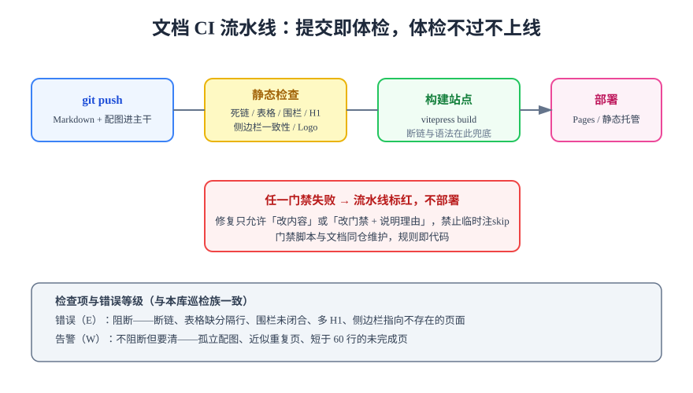

# 文档自动化

文档自动化（Docs Automation）把文档质量从「靠自觉」变成「靠机制」：提交即体检、体检不过不上线。本文讲文档 CI 流水线的组成、巡检门禁的设计原则（错误 / 告警分级），以及一条可复制的 GitHub Actions 配置。



## 文档 CI 流水线的组成

一条完整的文档流水线分四段（见上图）：

1. **静态检查**：不构建就能查的问题——死链、表格结构、代码围栏、标题层级、侧边栏一致性、图片引用。特点是**快**（秒级）、零依赖，应放在最先。
2. **构建**：`docs:build` 兜底，捕获静态检查覆盖不到的语法问题（如 Markdown 扩展语法错误、组件渲染失败）与死链（多数 SSG 构建期校验内链）。
3. **部署**：构建产物发布到 Pages / 静态托管。部署成功不是终点——再补一步**冒烟访问**（HTTP 200 + 关键页面存在）才算闭环。
4. **回滚能力**：静态站按次发布，保留最近 N 次产物，回滚 = 换目录指向。

## 巡检门禁设计：错误与告警分级

门禁的公信力来自**报得准**：误报多的门禁很快会被团队静默屏蔽。分级设计是关键：

| 级别 | 定位 | 示例 | 处置 |
| --- | --- | --- | --- |
| 错误（E） | 阻断合入 | 断链、表格缺分隔行、围栏未闭合、多 H1、侧边栏指向不存在的页面 | 修复后才能合入 |
| 告警（W） | 不阻断但要清 | 孤立配图、近似重复页、少于 60 行的空壳页、外链图片 | 每次巡检清零，不清要说明理由 |

:::tip 门禁设计的四条经验
1. **规则即代码**：检查脚本与文档同仓维护，脚本本身也走评审；
2. **先剥代码块再查内容**：Markdown 巡检的头号误报源是代码块里的「示例正文」——示例表格、示例链接都会触发误报，所有检查必须先剥离围栏代码块与行内代码；
3. **活性判据**：每个检查都要有「确实扫到了东西」的自证（如扫描文件数为 0 直接失败），否则脚本跑错目录也会「全绿」；
4. **变异测试验证门禁**：对真实文件构造一个确定的坏例子，确认门禁能报出来——「0 错误」只有在门禁被证明能报错时才有意义。
:::

## 最小可用配置：GitHub Actions

```yaml [.github/workflows/docs-ci.yml]
name: docs-ci
on:
  push:
    branches: [main]
  pull_request:

jobs:
  check-and-deploy:
    runs-on: ubuntu-latest
    steps:
      - uses: actions/checkout@v4

      - uses: pnpm/action-setup@v4
        with:
          version: 9

      - uses: actions/setup-node@v4
        with:
          node-version: 22
          cache: pnpm

      - name: 安装依赖
        run: pnpm install --frozen-lockfile

      - name: 静态巡检（死链 / 表格 / 围栏）
        run: |
          python3 scripts/linkcheck.py
          python3 scripts/tablecheck.py

      - name: 构建站点
        run: pnpm docs:build

      - name: 部署到 Pages
        # 仅主分支部署；PR 只做检查不发布
        if: github.ref == 'refs/heads/main'
        uses: actions/upload-pages-artifact@v3
        with:
          path: docs/.vitepress/dist
```

启用 Pages 服务还需在仓库设置里把 Source 指向 GitHub Actions，并在 workflow 中声明 `permissions: { pages: write, id-token: write }`。

```shell
# 本地验证流水线等价命令（CI 里跑的，本地必须能先跑通）
python3 scripts/linkcheck.py   # 期望：broken = 0
pnpm docs:build                # 期望：构建成功，无 dead link 告警
```

## 常见巡检项清单

起步阶段建议按投入产出比排序接入：

| 优先级 | 巡检项 | 拦截的典型事故 |
| --- | --- | --- |
| P0 | 内链死链检查 | 重构目录后链接大面积断裂 |
| P0 | 站点构建 | 语法错误、组件渲染失败 |
| P1 | 表格结构（分隔行 / 列数） | 缺分隔行静默退化为普通段落 |
| P1 | 标题层级（唯一 H1 / 不跳级） | 大纲与锚点错乱 |
| P2 | 代码围栏闭合 | 一个未闭合围栏吞掉后半篇文章 |
| P2 | 侧边栏与磁盘一致性 | 页面存在但站点导航里找不到 |
| P3 | 孤立配图 / 近似重复页 | 仓库膨胀与「双真相」分叉 |

## 易错点与最佳实践

:::danger 常见错误
1. **门禁红着绕过去**：「临时 skip、下次修」没有下次。允许的只有两种处置——修内容，或改规则并在评审里说明理由。
2. **CI 能过、本地不能跑**：巡检脚本若依赖 CI 独有环境，就失去「提交前自查」价值。等价命令必须在 README / AGENTS 里可复制。
3. **门禁只拦不修**：门禁暴露的问题要有归属（谁修、何时修），否则红灯常亮，团队学会无视红灯。
:::

:::tip 自动化的终点是「写作只管内容」
巡检覆盖结构、CI 覆盖构建与部署之后，作者的注意力可以完全放回内容本身——这正是文档体系存在的目的。规范与自动化的分工见[写作规范](../Standards/index.md)。
:::

## 验证方式

接入流水线后逐项验证：向 PR 提交一个含断链的改动，确认门禁**报红并阻断**；修复后确认流水线转绿并完成部署；访问线上站点一个深层页面 + 搜索一次，确认部署产物完整。最后做一次回滚演练：回退到上一个构建产物，确认旧版本可访问。

## 参考资料

- [GitHub Pages 官方文档](https://docs.github.com/actions/publishing-packages/publishing-with-a-custom-github-actions-workflow)
- [VitePress 部署指南](https://vitepress.dev/guide/deploy)
- [Write the Docs: Build Tools](https://www.writethedocs.org/guide/tools/)
