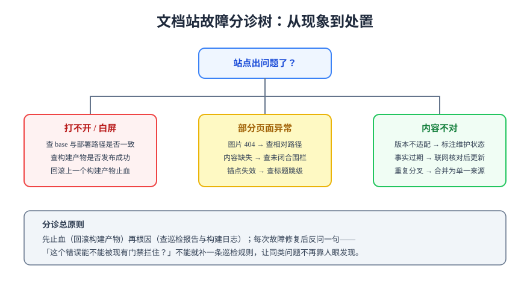

# 常见问题

本文汇总文档体系建设的高频问题，按「选型 → 搜索 → 版本 → 维护」分诊。先看分诊树定位现象类别，再到对应分节找答案。

## 分诊速查

| 现象 | 最可能原因 | 详见 |
| --- | --- | --- |
| 部署后白屏 / 样式全丢 | `base` 与部署子路径不一致 | [Ssg 易错点](../Ssg/index.md#易错点与最佳实践) |
| 搜索搜不到新页面 | 用 dev 模式验收 / 页面被排除索引 | [Search 验证方式](../Search/index.md#验证方式) |
| 中文搜索精度差 | 本地索引按字切分 | [Search 中文场景](../Search/index.md#中文场景的特殊问题) |
| 两份文档内容分叉 | 重复页面未收敛为单一来源 | 本页「维护」第 3 问 |
| 旧文档误导新读者 | 缺版本标注 | [Versioning](../Versioning/index.md) |

## 选型

**1. 团队两三个人，有必要上文档站吗？**
看内容量与增长趋势而不是人数：内容会持续增长、需要对外或跨团队查阅，就值得；几十篇以内且低频变更，`README` + 目录足够。判断依据见[概览：什么时候不该自建](../Overview/index.md#什么时候不该自建文档体系)。

**2. MkDocs Material 还能用吗？**
存量站点可以继续用（9.7.x 有关键修复承诺到 2026-11），但**新项目不要起**；存量站评估迁移到 Zensical 或换 VitePress / Starlight。迁移决策参考[选型版图](../Ssg/index.md)。

**3. VitePress 2.0 可以用于生产吗？**
不建议。2.0 自 2026 年以来一直处于 alpha 阶段（2026-09 发布 alpha.20），生产站锁定 1.6.x 稳定线，等正式发布后再评估迁移。

**4. 为什么生成器推荐的命令在本机跑不起来？**
多为 Node / pnpm 版本不匹配。SSG 对 Node 有最低版本要求，用版本管理器切换到官方要求的版本再执行；构建命令在 CI 与本地必须等价（见[自动化](../Automation/index.md)）。

## 搜索

**5. 本地搜索和 Algolia 怎么选？**
站点可公开、有精力申请维护 → Algolia 体验更好；内网 / 离线 / 数据敏感 / 零依赖诉求 → 本地搜索。多数内部知识库先用本地搜索起步，见[两条路线对比](../Search/index.md#两条实现路线)。

**6. 本地搜索下「中间件」搜出一堆单字结果怎么办？**
按字切分的固有行为。三个缓解手段：标题与正文的首句写清完整术语（标题权重高）、构建期预分词、或换 Pagefind（对 CJK 有优化）。预期折中范围见[中文场景](../Search/index.md#中文场景的特殊问题)。

**7. 过期的版本存档页总在搜索结果前排，怎么治？**
给存档页加 `search: false` frontmatter，或用版本目录隔离 + 侧边栏折叠（`collapsed: true`）。同时给存档页顶部加维护状态标注，让搜到的读者第一时间知道「这是旧文档」。

## 版本

**8. 大版本升级时旧文档怎么处理？**
不删除、不覆盖：按「官方名 + 大版本号」建目录保留（如 `Spring5/`、`Spring6/`），旧页顶部标注维护状态与支持截止时间，主题目录页提供差异与升级指南。完整规则见[版本目录策略](../Versioning/index.md#版本目录策略的落地规则)。

**9. 补丁版本（如 6.1.x）也要建目录吗？**
不建。目录只按大版本分；小版本差异在页内用 info 容器标注适用范围即可。

**10. 版本切换器值得自研吗？**
VitePress 生态自研成本高（路由、状态、URL 约定都要自己定），产品文档强依赖切换器就直接用 Docusaurus 的内置版本化；学习型知识库用版本目录 + 目录页引导，够用。

## 维护

**11. 文档越写越多，怎么防止腐化？**
三个机制配合：写作规范保证新增内容有下限（[评审清单](../Standards/index.md#评审清单)）、巡检门禁保证结构不烂（死链 / 表格 / 围栏）、定期抽查保证内容不过期——每两周抽查 5 篇旧文，过期内容当场更新或标注。

**12. 有人往文档里塞只有自己懂的内容怎么办？**
评审清单里加一条「新人可读性」：一句话定位是否清晰、术语首现是否给解释、示例是否可独立运行。评审标准是「没参与讨论的新人能照着跑通」，而不是「作者自己看得懂」。

**13. 链接总在重构后断掉，有没有根治办法？**
没有根治，只有兜底：目录重构前先跑死链巡检拿基线，重构后再跑对比修复；把巡检放进 CI 后，断链进不了主干。门禁接入方式见[文档自动化](../Automation/index.md)。

## 上线自查清单

新站点对外发布前过一遍：

- [ ] 首页与每个分类入口页面 200，`base` 与部署路径一致
- [ ] 搜索用真实中文词验收通过
- [ ] 每个主题有目录页，旧版本文档有维护状态标注
- [ ] 死链巡检为 0，CI 流水线全绿
- [ ] 站内有反馈入口（issue 模板或页面底部链接），读者报错有渠道
- [ ] 保留最近多次构建产物，回滚路径演练过一次

## 术语表

| 术语 | 英文 | 含义 |
| --- | --- | --- |
| 静态站点生成 | SSG | 构建期把 Markdown 编译为静态 HTML |
| 文档即代码 | Docs-as-Code | 文档走代码同款工程流程（评审 / CI / 版本化） |
| 死链 | Dead link | 指向不存在页面的链接 |
| 单一来源 | Single source of truth | 一个事实只在一处维护，其余位置引用 |
| 孤立配图 | Orphan image | 磁盘上存在但没有任何页面引用的图片 |
| 门禁 | Gate | 合入前必须通过的自动化检查 |
