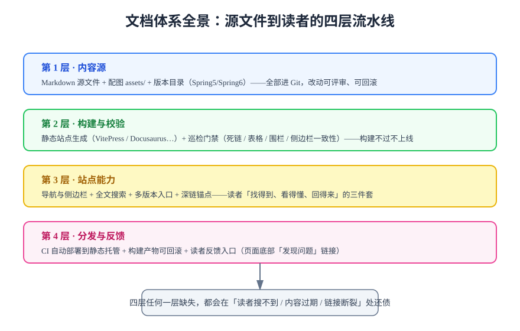

# 文档体系概览

文档体系（Documentation System）是把「写文档」从个人习惯升级为团队工程的过程：内容以 Markdown 源文件形式进版本库，经构建器生成静态站点，再通过搜索、导航与自动化巡检保证读者**找得到、看得懂、信得过**。本文建立整体认知：文档体系长什么样、为什么要工程化、以及什么情况下不该自建。

## 概念与原理

### Docs-as-Code（文档即代码）

**Docs-as-Code** 是文档工程化的核心思想：把文档当作代码对待，用同一套工具链与纪律来维护。

| 代码工程 | 文档工程 | 对应机制 |
| --- | --- | --- |
| 源码 | Markdown + 配图 | 同进 Git，改动可评审、可回滚 |
| 编译器 | 静态站点生成器（SSG） | 构建产出可部署的静态 HTML |
| 测试 | 巡检门禁（死链、表格、围栏、H1） | 构建前拦截结构性错误 |
| CI/CD | 文档流水线 | 提交即构建，构建过即上线 |
| Code Review | 文档评审 | PR 里逐行评审内容与结构 |

### 文档体系的四层结构

从源文件到读者，一条完整的文档体系分四层（见上图）：

1. **内容源**：Markdown 源文件、`assets/` 配图、版本目录（如 `Spring5/`、`Spring6/`）。唯一要求：**全部进 Git**，不存在「只在某个人的电脑上」的文档。
2. **构建与校验**：SSG 把 Markdown 编译为静态站点；巡检门禁在构建前后拦截断链、坏表格、未闭合围栏等结构性错误。
3. **站点能力**：导航与侧边栏、全文搜索、多版本入口、锚点深链——决定读者能否高效定位内容。
4. **分发与反馈**：CI 自动部署到静态托管，产物可回滚；页面提供反馈入口，让读者报错有渠道。

### 为什么「能写出来」不等于「有文档体系」

没有体系的文档通常死在三个地方：**找不到**（没有搜索与导航，靠翻目录）、**不信**（内容过期无标注，读者分不清适用版本）、**没人维护**（改一处不知道还有多少处要改，索性不改）。体系化的意义就是把这三件事交给机制而不是自觉。

## 三种文档形态的边界

| 形态 | 服务对象 | 生命周期 | 归属 |
| --- | --- | --- | --- |
| 教程 / 学习笔记 | 想系统学习的人 | 长期迭代，随版本演进 | 本专题主要服务对象 |
| 参考手册（API / 配置） | 边做边查的人 | 与代码同步更新 | API 参考可由 OpenAPI 等契约生成 |
| 决策记录（ADR / 方案） | 未来要理解「为什么」的人 | 写完即冻结，只追加不改写 | 与教程分开存放，避免互相污染 |

:::info 形态混放是最常见的结构病
同一篇文档既是教程又是参考手册，结果是初学者看不懂、熟手嫌啰嗦。建站之初就按形态分目录，比事后重构便宜得多。
:::

## 什么时候不该自建文档体系

1. **内容总量少于 20 篇且不再增长**：一个维护良好的 `README.md` + 仓库目录就是全部，引入 SSG 只增加构建环节。
2. **受众只有 2~3 人且实时沟通**：知识库工具（飞书、Notion）的协作体验远好于自建站。
3. **没有长期维护者**：文档体系的价值按年兑现，三个月就解散的团队先解决「谁写」再解决「怎么建」。
4. **内容强依赖实时数据**：监控大盘、动态报表这类「读数据库」的页面不该用静态站表达，静态文档只负责讲清口径。

:::danger 最常见的伪需求
「我们要一个文档站」往往实际需求是「我们要有人写文档」。工具解决的是**已存在内容的组织与分发**，不解决内容生产本身。先确认每周有人产出，再谈建站。
:::

## 最小起步路径

如果判断值得自建，推荐的顺序是「先跑通，再增强」，每一步都有可验证的收尾：

1. **第 1 步**：选定 SSG（见[静态站点生成选型](../Ssg/index.md)），初始化工程，`dev` 起本地预览确认能渲染一页 Markdown；
2. **第 2 步**：把存量文档批量迁移进 `docs/`，先保证**断链为零**（构建器会报），再谈美化；
3. **第 3 步**：接入[全文搜索](../Search/index.md)与[写作规范](../Standards/index.md)（一页骨架模板即可）；
4. **第 4 步**：接入[文档自动化](../Automation/index.md)——CI 构建部署 + 至少一条死链门禁，从此质量不靠自觉。

## 验证方式

读完本文后，用三个问题自检是否理解了文档体系：你的内容源在哪（能否一键回滚到三个月前）？读者靠什么找到一篇旧文（搜索还是记忆）？一篇文档过期后会发生什么（被标注、被更新，还是静默误导）？三问都有答案，再进入下一节。

## 参考资料

- [Write the Docs](https://www.writethedocs.org/)：文档工程社区，Docs-as-Code 理念的主要阵地
- [Diátaxis 框架](https://diataxis.fr/)：教程 / 操作指南 / 参考 / 解释四分法的经典框架
- [Google 开发者文档风格指南](https://developers.google.com/style)：大厂写作规范范例
