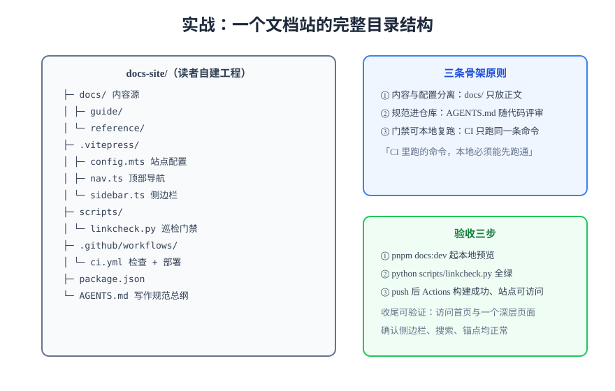

# 实战：从零搭一个文档站

本节把前几篇串成一条可复现的路径：以 VitePress 为例，从空目录开始，搭出一个**带搜索、有写作规范、有巡检门禁、能自动部署**的文档站。全程只给命令与判据，读者在自己机器上按顺序执行即可复现。



## 项目目标与验收条件

| 目标 | 验收判据 |
| --- | --- |
| 站点可构建可预览 | `pnpm docs:build` 退出码 0 |
| 内置全文搜索 | 搜索框能命中中文与英文关键词 |
| 写作规范落地 | 仓库根有 `AGENTS.md`，含页面骨架与评审清单 |
| 巡检门禁可用 | `python3 scripts/linkcheck.py` 报 `broken = 0` |
| CI 自动部署 | push 后 Actions 构建成功，Pages 可访问 |

## 第 1 步：初始化工程

```shell
mkdir docs-site && cd docs-site
pnpm init
pnpm add -D vitepress
mkdir -p docs/guide docs/.vitepress scripts
```

写入脚本与最小配置：

```json [package.json]
{
  "scripts": {
    "docs:dev": "vitepress dev docs",
    "docs:build": "vitepress build docs",
    "docs:preview": "vitepress preview docs"
  }
}
```

```typescript [docs/.vitepress/config.mts]
import { defineConfig } from "vitepress";

export default defineConfig({
  lang: "zh-CN",
  title: "团队文档站",
  base: "/docs-site/",
  themeConfig: {
    nav: [{ text: "指南", link: "/guide/quickstart" }],
    sidebar: [
      { text: "指南", items: [{ text: "快速开始", link: "/guide/quickstart" }] },
    ],
    search: { provider: "local" },
  },
});
```

```markdown [docs/guide/quickstart.md]
# 快速开始

这是第一篇文档，用于验证站点、搜索与巡检链路。

## 验证方式

访问 http://localhost:5173/guide/quickstart ，页面正常渲染即通过。
```

```shell
pnpm docs:dev
# 验证：访问 http://localhost:5173/ 与 /guide/quickstart，页面正常、搜索框可用
```

## 第 2 步：写作规范进仓库

在仓库根新建 `AGENTS.md`，把[写作规范](../Standards/index.md)的页面骨架、容器用法、评审清单落成文字。**规范必须进 Git**——它随代码评审而演进，放在 Wiki 或个人笔记里的规范约等于不存在。

关键条款（最小集）：

```markdown [AGENTS.md（节选）]
1. 每页只允许一个 H1，标题与侧边栏一致；H1 下必须有一句话定位。
2. 页面按「定位 → 原理 → 清单/表格 → 示例 → 易错点 → 验证 → 参考」组织。
3. 代码块必须标注语言；图片一律本地 assets/ 相对路径引用。
4. 结尾必须有可验证的收尾（命令 + 预期输出）。
```

## 第 3 步：接入死链巡检门禁

```python [scripts/linkcheck.py]
import re
import sys
from pathlib import Path

LINK_RE = re.compile(r"\[[^\]]*\]\((\./[^)]+|\.\./[^)]+)\)")
DOCS = Path("docs")
broken = []

for md in DOCS.rglob("*.md"):
    # 剥离围栏代码块与行内代码，避免把示例链接当真实链接
    text = md.read_text(encoding="utf-8")
    text = re.sub(r"```.*?```", "", text, flags=re.S)
    text = re.sub(r"`[^`]*`", "", text)
    for target in LINK_RE.findall(text):
        resolved = (md.parent / target.split("#")[0]).resolve()
        if not resolved.exists():
            broken.append(f"{md} -> {target}")

print(f"broken = {len(broken)}")
for line in broken:
    print(line)
sys.exit(1 if broken else 0)
```

```shell
python3 scripts/linkcheck.py   # 期望：broken = 0（有断链时退出码 1 并逐条列出）
```

:::danger 示例链接是巡检误报的头号来源
`[点击这里](../other/page.md)` 若出现在代码块里会被上面的正则误报——所以脚本先剥围栏与行内代码再匹配。这是所有 Markdown 巡检的通用前提，漏掉这一步的门禁会因误报过多而被弃用。**本节这条示例本身也遵循同一纪律：它写作行内代码，因此它既是示例、又不会被自己的判据当成真链接。**
:::

## 第 4 步：CI 构建与自动部署

把[文档自动化](../Automation/index.md)中的 workflow 落到 `.github/workflows/docs-ci.yml`（含 `permissions` 声明），仓库设置把 Pages Source 指向 GitHub Actions：

```shell
git init && git add -A && git commit -m "docs: 初始化文档站"
git remote add origin git@github.com:<you>/docs-site.git
git push -u origin main
```

```shell
# 验证：Actions 页面构建成功；浏览器访问
# https://<you>.github.io/docs-site/ 与 /docs-site/guide/quickstart 均 200
curl -s -o /dev/null -w '%{http_code}\n' https://<you>.github.io/docs-site/   # 期望 200
```

## 第 5 步：让体系开始滚动

1. **存量迁移**：把既有 Markdown 批量移入 `docs/`，先跑 `linkcheck.py` 清零断链，再挂侧边栏；
2. **搜索验收**：按[全文搜索](../Search/index.md)的验收方法，用真实中文词验证索引；
3. **演进**：每两周对照[写作规范](../Standards/index.md)的评审清单抽查 5 篇旧文，过期内容当场更新或标注。

## 常见问题排错

| 现象 | 原因 | 处置 |
| --- | --- | --- |
| 部署后样式全丢、页面白屏 | `base` 与部署子路径不一致 | config 里 `base` 改为实际路径后重新构建 |
| 图片本地正常、线上 404 | 图片用了 `/assets/...` 绝对路径 | 改相对路径 `./assets/...` |
| PR 构建绿但站点没更新 | 部署步骤只挂在主分支 | 确认 `if: github.ref == 'refs/heads/main'` 与 Pages 设置 |
| 搜索搜不到新页面 | 本地预览验收 | `build + preview` 后再验，dev 模式索引行为不同 |

## 验证方式

完整跑完五步后，最终验收四连：`pnpm docs:build` 无告警退出 0；`python3 scripts/linkcheck.py` 报 `broken = 0`；线上站点首页与深层页面均 200；在站内搜索一个只存在于新迁移文档中的中文词，能命中。四条全绿，本次实战收工。

## 参考资料

- [VitePress 官方文档](https://vitepress.dev/)
- [GitHub Pages via Actions](https://docs.github.com/actions/publishing-packages/publishing-with-a-custom-github-actions-workflow)
- 本库自身的实践：仓库根 `AGENTS.md` 与 `.vitepress/` 配置即为本文结构的真实样例
