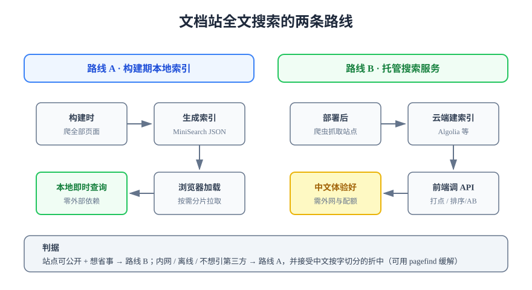

# 全文搜索

全文搜索（Full-text Search）是文档站使用频率最高的能力：读者通常不是「读」文档而是「查」文档，搜不到的内容约等于不存在。本文讲文档站搜索的两条实现路线、中文场景的特殊问题，以及索引构建的完整流程。



## 两条实现路线

### 路线 A：构建期本地索引

构建站点时把全部页面文本抽出来，生成一份（或分片的）索引 JSON，随静态文件一起部署；浏览器加载索引后在本地完成查询。

- **优点**：零外部依赖、零查询成本、离线可用（内网 / 本地预览也生效）、数据不出域。
- **缺点**：索引随内容量增长（大站点需分片按需加载）；**中文默认按字切分**，长词组匹配质量一般；搜索质量与排序能力弱于专业服务。

VitePress 内建搜索即此路线，底层是 [MiniSearch](https://lucaong.github.io/minisearch/)，一行配置开启：

```typescript [.vitepress/config.mts]
export default defineConfig({
  themeConfig: {
    search: {
      provider: "local",
      options: {
        // 搜索结果里显示每篇文档的所属分组，提升定位效率
        detailedView: true,
      },
    },
  },
});
```

### 路线 B：托管搜索服务

站点部署后由第三方爬虫抓取建索引（代表：Algolia DocSearch，开源文档站可免费申请），前端以 API 方式查询。

- **优点**：中文分词与相关性排序质量好、自带搜索打点与热词分析、站点越大优势越明显。
- **缺点**：依赖外部服务（配额、可用性、隐私边界）；内网与本地预览**搜不到**；申请与维护有流程成本。

| 对比维度 | 路线 A（本地索引） | 路线 B（托管服务） |
| --- | --- | --- |
| 外部依赖 | 无 | 第三方服务与配额 |
| 中文体验 | 按字切分，可接受的折中 | 分词质量好 |
| 内网 / 离线 | 可用 | 不可用 |
| 适用规模 | 数百到数千页 | 不限 |
| 成本 | 零 | 免费额度或订阅 |

:::tip 判据一句话
站点公开、追求体验 → 路线 B；内网、离线、数据敏感或想零依赖 → 路线 A。**先上路线 A 把搜索能力补齐，流量与诉求涨了再升级**，是成本最低的路径。
:::

## 中文场景的特殊问题

本地索引路线下，中文搜索的核心矛盾是**分词**：英文按空格自然切词，中文没有分隔符。

1. **按字切分（默认）**：查询 `中间件` 会命中含「中」「间」「件」任意单字的页面，召回广但精度一般。多数场景可接受。
2. **预分词增强**：构建期用分词库（如 `nodejieba`、`intl-segmenter`）把标题与正文切成词元再建索引，精度显著提升，代价是多一步构建依赖。
3. **Pagefind 折中方案**：构建后对静态 HTML 再建分片索引，对 CJK 有专门优化，可挂到任意 SSG 上（Starlight 默认集成）。

:::danger 验证中文搜索必须用真实中文词
只测英文关键词是无效验收。至少测三类：完整中文词（`中间件`）、词组片段（`间件`）、中英混合（`Spring 事务`）。第一类搜不到通常是索引没包含正文，第三类搜不到通常是分词把中英文割裂。
:::

## 索引构建流程与调优

本地索引的构建过程由 SSG 在 `build` 时自动完成，可调优的抓手有四个：

| 抓手 | 做什么 | 效果 |
| --- | --- | --- |
| `headings` 权重 | 标题命中加权（默认已如此） | 标题命中排前，最符合直觉 |
| 排除页面 | 前面加 `search: false` frontmatter 或配置排除目录 | 版本存档、草稿页不污染结果 |
| 分片加载 | 大站点开启索引分片（VitePress 默认按 chunk 懒加载） | 首屏不下载全量索引 |
| 索引内容裁剪 | 只索引正文文本，排除代码块或侧栏模板文字 | 索引体积与噪音双降 |

VitePress 还支持在页面 frontmatter 里用 `search: false` 把单页排除出索引：

```markdown
---
search: false
---
```

## 易错点与最佳实践

:::danger 常见错误
1. **索引包含过期版本存档页**：读者搜 `部署` 排第一的是三年前的旧流程。对存档页统一加 `search: false`，或靠[多版本目录](../Versioning/index.md)隔离。
2. **本地预览验证搜索**：`docs:dev` 与构建产物的索引行为可能不同，验收搜索**必须** `docs:build` + `docs:preview`。
3. **忽略 404 后的搜索断层**：被删除页面的旧 URL 会留在用户书签里，站点应配置 404 页并引导到搜索。
:::

:::tip 搜索是文档质量的放大器
搜索排前头的永远是标题写清楚的页面。与其调索引参数，不如先执行[写作规范](../Standards/index.md)里「标题即检索词」的要求——用户会搜 `怎么配 HTTPS`，而不是你起的标题 `传输层安全配置详解`。
:::

## 验证方式

以最小 VitePress 站点验证：`pnpm docs:build && pnpm docs:preview` 后，在搜索框依次输入一个完整中文词（预期命中标题与正文）、一个英文专有名词（预期命中对应页面）、一个被 `search: false` 排除页里的独有词（预期**不**命中）。三条都符合，搜索验收通过。

## 参考资料

- [VitePress Local Search 文档](https://vitepress.dev/zh/reference/default-theme-search)
- [MiniSearch](https://lucaong.github.io/minisearch/)
- [Algolia DocSearch](https://docsearch.algolia.com/)
- [Pagefind](https://pagefind.app/)
