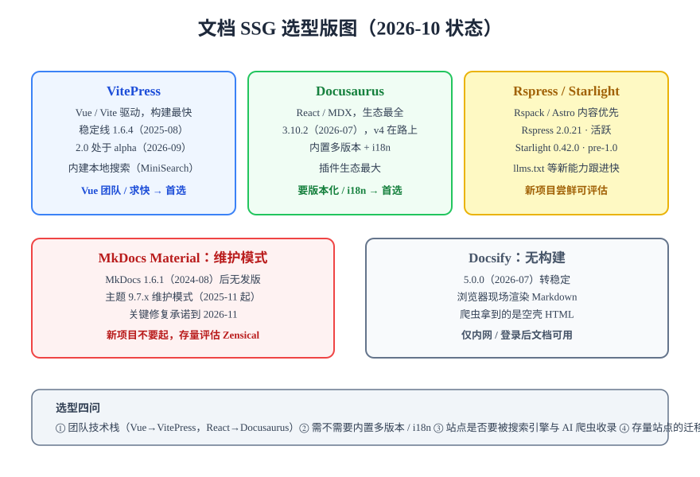

# 静态站点生成选型

静态站点生成器（SSG，Static Site Generator）把 Markdown 源文件编译成纯静态 HTML 站点：构建完成后只剩静态文件，无服务端、无数据库，托管成本几乎为零。本文给出 2026-10 时点主流文档 SSG 的状态与选型判据，并以 VitePress 为例给出最小起步代码。



## 主流工具对照（2026-10 状态，均已联网核对）

| 工具 | 技术栈 | 当前版本 | 多版本支持 | 搜索方案 | 适合谁 |
| --- | --- | --- | --- | --- | --- |
| VitePress | Vue 3 + Vite | 稳定 1.6.4；2.0.0-alpha.20 | 无内置，靠目录策略 | 内建本地搜索（MiniSearch） | Vue 团队、求构建速度 |
| Docusaurus | React + MDX | 3.10.2（v4 经 future flags 渐进） | **内置**（`docusaurus deploy versioning`） | 插件制（本地 / Algolia） | React 团队、要版本化与 i18n |
| Rspress | React + Rspack | 2.0.21，活跃 | 实验性 | 内建本地搜索 | 追求构建速度的新项目 |
| Starlight（Astro） | Astro 组件岛 | 0.42.0，pre-1.0 | 依赖社区方案 | Pagefind 集成 | 内容优先、零 JS 默认 |
| MkDocs Material | Python | MkDocs 1.6.1 停滞；主题 9.7.x 维护模式 | 社区工具 mike | 内建（lunr / 高级需 Insiders 9.7 起免费） | 仅存量项目 |
| Hugo | Go 单二进制 | 持续高频发版 | 无内置 | 需自建或托管 | 博客型站点、超大规模内容 |
| Docsify | 运行时渲染 | 5.0.0（2026-07 转稳定） | 无 | 内建 | 仅内网 / 登录后文档 |

:::danger 2026 年的选型红线
**MkDocs Material 已进入维护模式**（2025-11 官宣，关键修复承诺到 2026-11，团队转向新项目 Zensical）——新项目不要再起；**Docsify 无构建步骤**，爬虫拿到的是近空壳 HTML，公开站点的 SEO 与 AI 收录会基本归零，只适合内网场景。
:::

## 选型判据：四个问题定工具

1. **团队技术栈**：Vue/前端 → VitePress；React → Docusaurus。让维护者能用熟悉的组件体系定制主题，比工具本身的参数更重要。
2. **要不要内置多版本**：产品文档需要「v2 / v3 切换器」→ Docusaurus 内置版本化省大量自研；技术学习笔记按大版本分目录即可（见[多版本文档](../Versioning/index.md)）。
3. **站点是否要被搜索引擎与 AI 爬虫收录**：要 → 必须选**构建期产出完整 HTML** 的工具（排除 Docsify 类运行时渲染）。
4. **存量迁移成本**：已有 MkDocs 站点不必恐慌迁移（9.7.x 还有约一年安全窗口），新项目则直接排除。

## 最小起步：VitePress

### 初始化

```shell
mkdir my-docs && cd my-docs
pnpm init
pnpm add -D vitepress
mkdir docs && echo '# 我的文档站' > docs/index.md
```

### 站点配置

```typescript [.vitepress/config.mts]
import { defineConfig } from "vitepress";

export default defineConfig({
  lang: "zh-CN",
  title: "我的文档站",
  description: "基于 VitePress 的团队文档",
  // 站点部署在子路径时必须配置，否则静态资源 404
  base: "/my-docs/",
  themeConfig: {
    nav: [{ text: "指南", link: "/guide/" }],
    sidebar: [
      {
        text: "指南",
        items: [{ text: "快速开始", link: "/guide/quickstart" }],
      },
    ],
    // 一行开启内建本地搜索
    search: { provider: "local" },
  },
});
```

### 脚本与验证

```json [package.json]
{
  "scripts": {
    "docs:dev": "vitepress dev docs",
    "docs:build": "vitepress build docs",
    "docs:preview": "vitepress preview docs"
  }
}
```

```shell
pnpm docs:dev     # 启动后访问 http://localhost:5173/，确认页面正常
pnpm docs:build   # 构建成功且无断链告警，产物在 docs/.vitepress/dist
```

:::tip base 配置是子路径部署的第一坑
站点部署在 `https://example.com/my-docs/` 这类子路径时，`base` 必须与路径一致，且**站内图片一律用相对路径引用**（`./assets/x.png` 而非 `/assets/x.png`），否则构建能过、部署后图片全裂。
:::

## 易错点与最佳实践

:::danger 常见错误
1. **用稳定工具的 alpha 版本建生产站**。VitePress 2.0 尚在 alpha，生产站应锁定 1.x——alpha 到稳定之间会有破坏性变更。
2. **先堆内容后定结构**。目录层级、命名规范（英文目录 + `index.md`）应先于大规模写作确定，迁移目录的成本随页数线性增长。
3. **把 SSG 当 CMS 用**。SSG 没有草稿箱、权限与定时发布；需要这些能力应选托管型产品或 GitBook 类工具，而不是硬改造 SSG。
:::

:::tip 判断「构建过 = 内容对」吗？
不过。SSG 只校验语法与断链，**内容正确性要靠评审与巡检门禁**（见[文档自动化](../Automation/index.md)）。「构建成功」只是文档质量的下限。
:::

## 验证方式

完成最小起步后逐项确认：`pnpm docs:dev` 能访问首页；`pnpm docs:build` 退出码为 0 且无 `dead link` 告警；`pnpm docs:preview` 预览构建产物正常；右上角搜索框可搜到正文关键词。

## 参考资料

- [VitePress 官方文档](https://vitepress.dev/)（含 1.x → 2.0 迁移说明）
- [Docusaurus 官方文档](https://docusaurus.io/)（版本化：Versioning 一节）
- [Rspress 官方文档](https://rspress.dev/)、[Starlight 官方文档](https://starlight.astro.build/)
- [Material for MkDocs 维护模式公告](https://squidfunk.github.io/mkdocs-material/)（首页横幅与 release notes 9.7.x）
