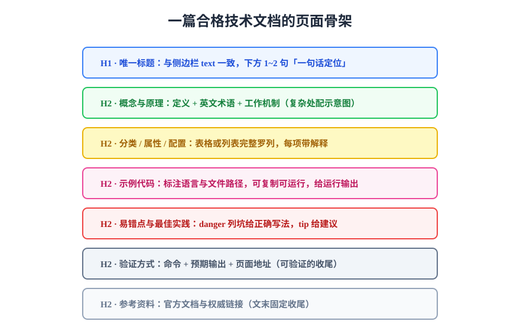

# 写作规范

写作规范（Writing Standards）决定文档的可读性与可维护性：结构统一，读者才能形成阅读惯性；表达克制，内容才不会随时间腐烂。本文给出一套可直接落地的页面骨架、语言表达与格式规范，并附评审清单。



## 页面骨架

一篇合格的技术文档按固定顺序组织，每段承担明确职责：

| 顺序 | 模块 | 职责 | 硬要求 |
| --- | --- | --- | --- |
| 1 | 一句话定位 | H1 下方 1~2 句：这是什么、解决什么问题、给谁看 | 缺了它读者要读完全文才知道值不值得读 |
| 2 | 概念与原理 | 关键概念定义 + 英文术语 + 工作机制 | 复杂机制配示意图，文字讲不清就画图 |
| 3 | 分类 / 属性 / 配置 | 表格或列表完整罗列 | 每一项都要有解释，禁止只列名词 |
| 4 | 示例代码 | 可复制、可运行的完整示例 | 标注语言与文件路径，关键示例给运行输出 |
| 5 | 易错点与最佳实践 | 反例 + 正确写法 | 易错点用 danger 容器逐条列，配正解 |
| 6 | 验证方式 | 命令 + 预期输出 + 页面地址 | **可验证的收尾**，不允许「依个人环境而定」 |
| 7 | 参考资料 | 官方文档与权威链接 | 文末固定收尾，优先官方源 |

:::tip 「可验证的收尾」是规范的灵魂
每篇文档的最后一步必须能执行并判断对错，例如「启动后访问 `http://localhost:5173/`，确认页面正常、控制台无报错」。它是读者自查的依据，也是评审者判断「这篇是否真的跑通过」的锚点。
:::

## 语言与表达

1. **先结论后细节**：每节第一句给结论或定义，再展开解释——读者扫标题和首句即可建立全貌。
2. **术语首现给英文**：如「HTML（HyperText Markup Language，超文本标记语言）」，后文可用中文。
3. **重点用加粗**：一页加粗不超过十处，满屏加粗等于没有重点。
4. **口语化但精确**：讲人话不等于写口水话；「大概」「应该是」这类模糊表述换成确定的条件与判据。
5. **一页一主题**：内容超过一屏半就考虑拆页，用目录页串联；「大而全」的超长页是最难维护的形态。

## 格式规范

### 标题与结构

- 全文**仅一个 H1**，与侧边栏名称一致；正文用 H2 分节、H3 分小节，逐级递进不跳级。
- 普通页面不写 frontmatter（标题由 H1 承担），需要排除搜索或定制摘要时才加。

### 代码块

- 必须标注语言（`shell`、`ts`、`sql`……）；无语言的贴图式代码块在部分主题下渲染异常。
- 涉及具体文件时用路径标注：```` ```typescript [src/main.ts] ````。
- 示例必须**完整可复制**；超长配置用 `...` 省略并注释说明省略了什么。

### 提示容器

| 容器 | 用途 | 用量纪律 |
| --- | --- | --- |
| `tip` | 建议、技巧、一句话总结 | 每页 1~3 个 |
| `info` | 背景、版本、环境信息 | 需要时 |
| `warning` | 补充说明 | 少用，多数内容应进正文 |
| `danger` | 易错点、必踩的坑 | 每个坑必须配正确写法 |
| `details` | 可折叠的延伸细节 | 长清单、备选方案 |

### 表格与图片

- 表格用于**对照型信息**（参数、对比、清单），大段说明文字不用表格写；单元格过长用 `<br/>` 换行。
- 流程、架构、对比类内容必须配 SVG 示意图（放同主题 `assets/` 下、相对路径引用），文字代码块画图**不算配图**。
- 图片不外链——外链失效是文档腐化的头号来源，一律下载进本地 `assets/`。

## 评审清单

文档合入前按此清单过一遍，任何一条不过就打回：

- [ ] 只有一个 H1，标题与侧边栏一致
- [ ] H1 下有一句话定位
- [ ] 每个示例标注了语言与文件路径，且被跑通过
- [ ] 表格表头 / 分隔行齐全，列数一致
- [ ] 所有图片为本地相对路径引用，有替代文字
- [ ] 行内标记成对（`**加粗**` / `~~删除线~~`），**SVG 文本里没有 Markdown 记号**
- [ ] 易错点放在 danger 容器且配有正确写法
- [ ] 结尾有可执行的验证方式（命令 + 预期输出）
- [ ] 文末参考资料以官方链接为主
- [ ] 页内相对链接逐个可达（交给[自动化巡检](../Automation/index.md)兜底）

::: danger 规范的最大敌人是「例外」
「这篇比较特殊，就不按结构写了」出现第一次，规范就开始失效。例外可以有，但必须**显式登记**（在评审时说明并记录原因），不能静默绕过——这是文档与代码在治理上的同一逻辑。
:::

::: warning 两类「成对性」错误，构建一个字都不报
行内标记只有成对出现才会被解析；不成对时渲染器不会报错，而是**把记号本身照字面画出来**——读者看到一对裸露的星号。

| 错误 | 页面上的表现 | 为什么构建不报 |
| --- | --- | --- |
| `**重点` 缺闭合 | 段落里出现字面 `**` | 星号是合法文本，不是语法错误 |
| `` **「`错误码`」** `` 里反引号不配对 | 闭合的 `**` 被吞进代码片段，加粗失效 | 行内代码跨了不该跨的范围 |
| SVG `<text>` 里写 `**加粗**` | SVG 把星号**画出来** | SVG 不认识 Markdown |
| SVG `<text>` 里写 `[文字](链接)` | 方括号与圆括号**原样显示**，不可点 | 它既不是 HTML 链接也不是图片，链接类巡检看不见 |

最后两行是 `.svg` 特有的：**SVG 没有「行内标记」这个概念**，所以任何 Markdown 记号在 `<text>` 里都只是普通字符。把链接写进 SVG 图里是常见误用——图里要指向别的页面，应当写在**图外的正文**里。
:::

## 验证方式

把本文清单应用到一个真实页面：挑一篇存量文档，对照评审清单逐条打分，记录不合格项并修复；修完后用构建验证——`pnpm docs:build` 无新增告警，右侧大纲（H2 级目录）与分节结构一致。

## 参考资料

- [Google 开发者文档风格指南](https://developers.google.com/style)
- [Microsoft Writing Style Guide](https://learn.microsoft.com/en-us/style-guide/welcome/)
- [Diátaxis 框架](https://diataxis.fr/)
- [中文文案排版指北](https://github.com/sparanoid/chinese-copywriting-guidelines)
