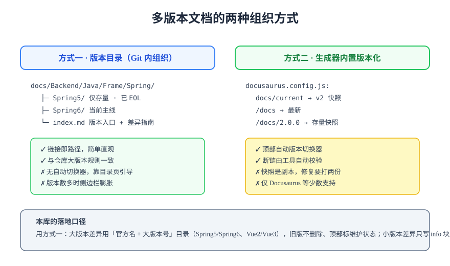

# 多版本文档

多版本文档（Documentation Versioning）解决「同一个主题在多个大版本下并存」的问题：旧版本的读者要能查到旧文档，新版本的读者不能被旧内容误导。本文对比两种组织方式，并给出与 Git 仓库版本目录策略一致的落地做法。



## 两种组织方式

### 方式一：版本目录（Git 内组织）

按「官方名 + 大版本号」建目录，版本差异在**目录结构**里显式表达：

```text
docs/Backend/Java/Frame/Spring/
├─ Spring5/index.md     旧版本：保留 + 标注维护状态
├─ Spring6/index.md     当前主线
└─ index.md             主题入口：列各版本 + 差异/升级指南
```

- **优点**：链接即路径、直观；与 Git 历史天然一致；任何 SSG 都能用。
- **缺点**：没有自动版本切换器，靠目录页与侧边栏引导；版本多了侧边栏会膨胀（可用 `collapsed: true` 折叠旧版本）。

### 方式二：生成器内置版本化

Docusaurus 等工具内置版本快照机制：`docs/` 始终是「下一版」，发版时工具把当前内容**复制一份**冻结为版本快照，站点自动出现版本切换器。

```shell
# Docusaurus：把当前 docs 内容冻结为 2.0.0 版本快照
npx docusaurus docs:version 2.0.0
# 之后站点同时提供 /docs（最新）与 /docs/2.0.0（快照）
```

- **优点**：自动切换器、工具校验版本内断链、旧版 URL 稳定。
- **缺点**：**快照是完整副本**——一个 bug 修复要同时改最新版与所有快照；版本膨胀后仓库体积快速增长。

### 怎么选

| 场景 | 推荐方式 | 理由 |
| --- | --- | --- |
| 技术学习库、知识库 | 方式一（版本目录） | 大版本数量有限，目录直观，无副本维护成本 |
| 产品 / 组件的 API 文档 | 方式二（内置版本化） | 读者强依赖「固定版本 URL」与切换器 |
| 小版本、补丁差异 | 都不用 | 页内 `:::info` 标注适用版本即可 |

## 版本目录策略的落地规则

把方式一制度化，核心是六条规则（与本库实践一致）：

1. **新内容一律面向最新稳定大版本**撰写，并在文首说明适用版本；
2. **旧版本目录不删除、不覆盖**，在页面顶部用 info 块标注版本与维护状态（如「仅存量项目使用」「已停止维护」）；
3. **小版本、补丁版本不建目录**，在页内标注适用范围（如 Spring 6.1.x）；
4. **主题目录页列各版本入口**，并提供版本差异 / 升级指南；
5. **侧边栏旧版本折叠**（`collapsed: true`）但保留入口；
6. **升级指南单独成文**，写清破坏性变更与迁移步骤，旧版本页只链接过去、不复述内容。

旧版本页顶部的标准标注写法：

```markdown
:::info 版本与维护状态
本页面向 Spring Framework 5.3。5.3 的开源支持已于 2024-08-31 结束（企业支持至 2029-06），
仅建议存量项目查阅。新项目请阅读 [Spring6](../Spring6/index.md)。
:::
```

## 与生成器能力的配合

VitePress 无内置版本化，但可以用 **rewrites** 做出「最新版短 URL」的体验：把 `docs/vue3/` 重写对外暴露为 `/vue/`，旧版本保持完整路径。这是方式一在 VitePress 下的常用增强：

```typescript [.vitepress/config.mts]
export default defineConfig({
  rewrites: {
    // 对外呈现 /vue/guide/，源文件在 docs/vue3/guide/
    "vue3/guide/:path*": "vue/guide/:path*",
  },
});
```

:::info 为什么本库选择方式一
版本目录的副本成本为零——旧版本内容**本来就该冻结**，Git 历史即版本历史；而快照式版本化每发一版复制全量页面，对以学习内容为主、大版本更替不频繁的库是纯负担。分工见 [Overview](../Overview/index.md)。
:::

## 易错点与最佳实践

:::danger 常见错误
1. **改写旧版本来「保持新鲜」**：旧版本页的价值就在于冻结。要修正过期事实（如下载地址失效）可以改，但不得用新版本内容覆盖旧页面。
2. **只有版本目录没有差异说明**：读者面对 `Spring5/`、`Spring6/` 两个入口不知道该进哪个。主题目录页必须回答「我该看哪版」。
3. **URL 里混用两套版本表达**：既有 `/vue3/` 又有 `/docs/2.0.0/`，读者与搜索引擎都会混乱。一个站只允许一种版本化机制。
4. **升级指南只写「有哪些新东西」不写「怎么迁移」**：迁移指南的验收标准是老用户能照着完成升级，不是新特性罗列。
:::

:::tip 版本标注要写「支持到什么时候」
「已停止维护」不如「开源支持已于 2024-08-31 结束」有用——后者给了读者判断要不要升级的依据。版本状态必须联网核对官方支持日历，不要凭印象写。
:::

## 验证方式

以本策略改造一个主题后逐项验证：主题目录页列出全部版本入口且链接可达；旧版本页顶部有状态标注；侧边栏旧版本分组默认折叠；在站点内任选一个旧版本页面，确认其**没有**被新版本内容覆盖（内容与 Git 历史中的冻结版本一致）；新版本页有「从旧版本升级」的指引链接。

## 参考资料

- [Docusaurus Versioning](https://docusaurus.io/docs/versioning)
- [VitePress Rewrites](https://vitepress.dev/guide/routing#route-rewrites)
- [Diátaxis：文档的版本策略讨论](https://diataxis.fr/)
