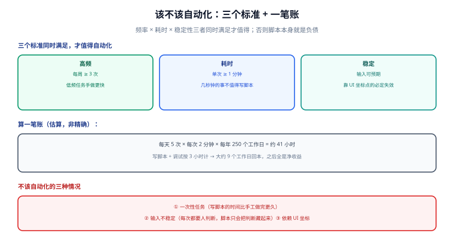

# 桌面与任务自动化

自动化是效率工具的**最后一层**，也是最容易被误用的一层：写脚本本身有成本，**写错一个脚本的代价可能比手工做一年还高**（比如脚本静默跑错、误删文件、在错误的时间发邮件）。

这一页讲三件事：**该不该自动化**（三个标准 + 一笔账）、**三层自动化**分别用什么、以及**什么时候应该停手**。

## 1. 一句话定位

**频率 × 耗时 × 稳定性，三者同时满足，才值得自动化。** 否则脚本本身就是一笔负债——你要维护它、排查它、记得它的存在。



## 2. 该不该自动化：三个标准

| 标准 | 门槛 | 不满足时 |
| --- | --- | --- |
| **高频** | 每周 ≥ 3 次 | 低频任务手做更快，写脚本反而占时间 |
| **耗时** | 单次 ≥ 1 分钟 | 几秒钟的操作，脚本的启动开销可能比手工还大 |
| **稳定** | 输入可预期、步骤固定 | 每次都要人判断的任务，脚本只会把判断藏起来，出错更难发现 |

### 2.1 算一笔账

以一个"每天 5 次、每次 2 分钟"的操作为例：

```text
每年节省 ≈ 5 次/天 × 2 分钟 × 250 工作日 ≈ 2500 分钟 ≈ 41 小时
写脚本 + 调试 + 维护 ≈ 3 小时（乐观估计）
→ 回本周期 ≈ 3 小时 ÷ (41 小时/年) ≈ 约 9 个工作日
```

结论：**回本周期在两周以内的，立刻做；三个月以上的，先记在待办里。**

::: tip 一句话理解
**判断"高频"要诚实。** 很多人把"我觉得这件事经常做"当成高频，实际一周只做一次。最简单的办法：**先手工做两周，用笔记记下次数**（`00-Inbox` 里写正字），再决定。
:::

## 3. 不该自动化的三种情况

::: danger 注意：这三种情况写了脚本就是负债
1. **一次性任务**。写脚本 + 调试的时间比手工做完更久。典型场景：一次性数据迁移、一次性的格式转换。
2. **输入不稳定**。每次都要人判断的任务（如"看情况决定要不要重试"），脚本会把判断藏在条件分支里，出错时你既不知道它判断了什么，也不知道为什么。
3. **依赖 UI 坐标 / 依赖模拟点击**。分辨率一变、窗口位置一变、应用一升级，脚本立刻失效，而且失效时**可能点错地方**（比不自动化危险得多）。
:::

第 3 条要展开说：**模拟点击（MouseClick / SendInput 到具体坐标）是最脆弱的自动化形式**。优先级顺序应该是：

```text
命令行接口（CLI） > API > 配置文件 > 模拟键盘 > 模拟鼠标点击坐标
```

能用 CLI 解决的，不要用模拟点击。例如"打开浏览器并登录某个后台导出报表"，正确做法是找它的 API 或用 `curl`，而不是 `SendInput` 一串 Tab 键。

## 4. 三层自动化

| 层 | 触发方式 | 工具 | 适合 |
| --- | --- | --- | --- |
| **系统级** | 时间 / 开机 / 事件 | 任务计划程序（Windows）、`launchd`（macOS）、`systemd timer`（Linux）、`cron` | 定时同步、备份、清理、拉取数据 |
| **应用级** | 应用内快捷键、保存时、提交时 | PowerToys、编辑器的 task/保存钩子、Git 钩子 | 格式化、重命名、批量替换、提交前检查 |
| **脚本级** | 手动触发、被上层调用 | AutoHotkey v2、PowerShell / Bash 脚本、`just` / `make` | 把多步操作固化成一键 |

三者关系：**系统级负责"什么时候跑"，脚本级负责"跑什么"，应用级负责"在正确的时机插进去"。**

## 5. 系统级：任务计划程序

Windows 的任务计划程序是最常被忽略的系统级能力。用 PowerShell 注册（可脚本化、可进版本控制）：

```powershell
# 例：每个工作日 09:30 拉取一次数据到本地
$action = New-ScheduledTaskAction -Execute "pwsh.exe" `
    -Argument "-NoProfile -File D:\scripts\fetch-daily.ps1" `
    -WorkingDirectory "D:\scripts"

$trigger = New-ScheduledTaskTrigger -Weekly -DaysOfWeek Monday,Tuesday,Wednesday,Thursday,Friday -At 9:30am

$settings = New-ScheduledTaskSettingsSet `
    -StartWhenAvailable `                     # 错过了就在下次可用时补跑
    -DontStopOnIdleEnd `
    -ExecutionTimeLimit (New-TimeSpan -Minutes 30)

Register-ScheduledTask -TaskName "fetch-daily" `
    -Action $action -Trigger $trigger -Settings $settings `
    -Description "每个工作日拉取数据" -Force
```

四件必做的事：

| 事项 | 原因 | 做法 |
| --- | --- | --- |
| **显式写 `-NoProfile`** | 任务环境的 profile 与交互式不同 | `pwsh -NoProfile -File ...` |
| **显式设工作目录** | 任务默认工作目录是 `C:\Windows\System32` | `-WorkingDirectory` 或脚本内先 `Set-Location` |
| **加 `-StartWhenAvailable`** | 机器休眠/关机时错过触发点 | 见上 |
| **日志落地** | 任务失败不会有任何弹窗 | 脚本内把输出重定向到文件；退出码非 0 时写错误日志 |

验证与排查：

```powershell
# 查看任务状态与上次运行结果
Get-ScheduledTask -TaskName "fetch-daily" | Get-ScheduledTaskInfo

# 手动触发一次（不等时间）
Start-ScheduledTask -TaskName "fetch-daily"

# 看历史（事件查看器里更详细）
Get-WinEvent -LogName "Microsoft-Windows-TaskScheduler/Operational" -MaxEvents 20 |
    Where-Object Message -like "*fetch-daily*"

# 删除
Unregister-ScheduledTask -TaskName "fetch-daily" -Confirm:$false
```

macOS / Linux 对应能力：

```shell
# Linux：cron 最快（crontab -e）
30 9 * * 1-5 /home/me/scripts/fetch-daily.sh >> /home/me/logs/fetch.log 2>&1

# macOS：launchd 更可靠（休眠唤醒后会补跑），用 LaunchAgent plist
# ~/Library/LaunchAgents/com.me.fetchdaily.plist
launchctl load ~/Library/LaunchAgents/com.me.fetchdaily.plist
```

::: warning 说明
**`cron` 在笔记本上不可靠**：机器休眠期间错过的任务不会补跑。笔记本场景用 `systemd timer`（`Persistent=true`）或 macOS 的 `launchd`。Windows 侧对应 `-StartWhenAvailable`。
:::

## 6. 应用级：PowerToys

PowerToys 0.101（2026-08-25）提供了一组"应用级自动化"，不用写代码：

| 功能 | 作用 | 典型用法 |
| --- | --- | --- |
| **Command Palette** | 统一命令入口，聚合其他 PowerToys 模块与已装应用 | `Alt + Space` 唤起，替代找菜单位置 |
| **Window Hopper** | `Alt` + 反引号，在当前应用的窗口间循环 | 开了十个终端窗口时快速找到那个 |
| **Keyboard Manager** | 重映射按键与快捷键 | 把 CapsLock 映射成 Esc（或 Ctrl） |
| **PowerRename** | 批量重命名，支持正则与预览 | 一批截图统一改名 |
| **FancyZones** | 自定义窗口布局 | 三栏布局：编辑器 / 终端 / 文档 |
| **Advanced Paste** | 粘贴时转换格式 | 见[剪贴板与输入效率](../Clipboard/index.md) |

::: tip 一句话理解
**CapsLock 改成 Esc 是投入产出比最高的一次重映射**：一次设置，终身受益。但**公司统一镜像的机器上慎改**——键盘映射会进用户配置，别人用你的机器会不适应。
:::

PowerRename 的批量重命名（与[截图与标注](../Screenshot/index.md)的命名规则配套）：

```text
搜索：^QQ图片(\d+)(\w+)\.png$          （勾选「使用正则表达式」）
替换：2026-09-15-bug-${1}.png
预览确认无误后再执行 → 一次改几十张图
```

## 7. 脚本级：AutoHotkey v2

AutoHotkey（AHK）是 Windows 上最灵活的桌面自动化工具。**2026 年的关键事实：用 v2 语法**（最新 2.0.28 / 2026-09-12），**v1 已不再维护**——网上大量老教程是 v1 代码，照抄会直接报错。

### 7.1 v1 与 v2 的核心差异

| 维度 | v1（已停止维护） | v2（当前） |
| --- | --- | --- |
| 语法 | 命令式（`Send, text`） | 函数式（`SendInput "text"`） |
| 变量引用 | `%var%` | `var` 或 `%var%`（仅在字符串插值时） |
| 字符串 | 双引号 | 双引号；单引号也是字符串 |
| 对象 | `Obj := {}` | `Map()` / `Array()` |
| 错误处理 | 静默失败居多 | 抛异常，可 `try` / `catch` |

### 7.2 最小可用脚本

```autohotkey
#Requires AutoHotkey v2.0        ; 显式声明版本，避免用错解释器
#SingleInstance Force            ; 重复运行时替换旧实例，不弹窗

; ── 文本扩展（见「剪贴板与输入效率」）
::@@::me@example.com
::]date::
    SendInput FormatTime(, "yyyy-MM-dd")
return

; ── 快捷键：打开项目目录
#!d:: {                          ; Win + Alt + D
    Run "wt.exe -d D:\docs-website"
}

; ── 快捷键：把当前窗口贴到屏幕左半（如果不想用 FancyZones）
#!Left:: {
    WinMove 0, 0, A_ScreenWidth // 2, A_ScreenHeight, "A"
}

; ── 带错误处理的脚本：调命令行并处理失败
#!g:: {                          ; Win + Alt + G：一键提交当前仓库
    try {
        RunWait "git.exe add -A", "D:\docs-website", "Hide"
        RunWait "git.exe commit -m `"chore: 自动提交`"", "D:\docs-website", "Hide"
        TrayTip "已提交", "git commit 完成"
    } catch as e {
        MsgBox "提交失败：`n" e.Message, "出错了", 16
    }
}
```

::: danger 注意：AHK 的四个坑
1. **`Run` 与 `RunWait` 区别很大**。`Run` 立即返回（不等待），`RunWait` 阻塞直到结束。要拿退出码或做顺序操作，必须用 `RunWait`。
2. **路径含空格/中文必须加引号**。`Run "C:\My Tools\a.exe"` 会被拆成两段。**永远给路径加引号**。
3. **`#Requires AutoHotkey v2.0` 不是可选项**。少了它，v1 解释器会尝试执行并在奇怪的地方报错。
4. **`SendInput` 在提权窗口里失效**。目标程序以管理员运行时，普通权限的 AHK 脚本按键发不进去（UIPI 限制）。需要自动化管理员窗口时，脚本本身也要以管理员运行。
:::

### 7.3 AHK 脚本的版本化

`.ahk` 脚本必须进 Git（这是本专题[三条底线](../index.md)之一）。推荐结构：

```text
dotfiles/
├── ahk/
│   ├── main.ahk              # 入口，用 #Include 引入其他
│   ├── hotkeys.ahk           # 快捷键
│   ├── text-expand.ahk       # 文本扩展
│   └── README.md             # 每个快捷键干什么（给未来的自己看）
└── powershell/
    └── Microsoft.PowerShell_profile.ps1
```

## 8. 什么时候应该停手

自动化到一定程度后，**新增自动化的边际收益会变成负数**。出现以下信号就该停：

| 信号 | 说明 |
| --- | --- |
| 你要为脚本写"使用说明" | 说明它已经复杂到你自己都记不住 |
| 脚本每周都要修一次 | 说明它依赖的外部环境不稳定，收益被维护成本吃掉了 |
| 出问题时的排查时间超过了手工做的时间 | 自动化把一次 5 分钟的手工活变成了一个 2 小时的谜题 |
| 你在自动化"自动化本身" | 明显过度，停 |

::: tip 一句话理解
**自动化的目标是"少做重复劳动"，不是"证明我能写脚本"。** 一个健康的个人自动化集合通常是 **3~8 个脚本**，每个不超过 100 行，每个都能一眼看懂它在做什么。
:::

## 9. 验证清单

| 检查项 | 命令 / 操作 | 期望 |
| --- | --- | --- |
| 任务已注册 | `Get-ScheduledTask -TaskName "fetch-daily" \| Get-ScheduledTaskInfo` | 有 `LastRunTime` 与 `LastTaskResult` |
| 任务能手动跑通 | `Start-ScheduledTask -TaskName "fetch-daily"` | 日志文件有新内容，结果码为 0 |
| AHK 版本正确 | 脚本首行 `#Requires AutoHotkey v2.0`，运行无报错 | 托盘出现绿色 H 图标 |
| 文本扩展生效 | 在记事本里输入 `]date` | 变成当天日期 |
| 脚本可恢复 | 脚本在 Git 仓库里，`git log` 有记录 | 换机器 `git clone` 后可用 |

## 10. 常见坑

| 现象 | 原因 | 解决 |
| --- | --- | --- |
| 任务显示"已运行"但没效果 | 工作目录是 `System32`，相对路径失效 | 显式设 `-WorkingDirectory` 或脚本内 `Set-Location` |
| 任务在交互式能跑、计划里报错 | profile / 执行策略差异 | 用 `pwsh -NoProfile -File`；脚本内不依赖 profile 别名 |
| 笔记本休眠后任务没跑 | 未启用补跑 | Windows 加 `-StartWhenAvailable`；Linux 用 systemd timer `Persistent=true` |
| AHK 脚本语法报错 | 抄了 v1 教程 | 改用 v2 语法；加 `#Requires AutoHotkey v2.0` |
| AHK 在管理员窗口里按键无效 | UIPI 限制 | 脚本也以管理员运行 |
| 路径含空格时 `Run` 失败 | 未加引号 | `Run "`"C:\My Tools\a.exe`""` |
| 脚本改了系统文件难以撤销 | 未做备份 | 批量操作前先 `Copy-Item` 备份；先`-WhatIf`（PowerShell 支持时）或先小批量试跑 |
| 自动化静默失败无人知道 | 没有日志、没有通知 | 脚本内落地日志；失败时 `TrayTip` / 写事件日志 |

## 11. 参考与延伸

- [命令行提效](../ShellProductivity/index.md)：脚本里要用的 CLI 工具
- [剪贴板与输入效率](../Clipboard/index.md)：文本扩展的完整方案
- [实战：搭一套个人效率工具链](../Practice/index.md)：自动化在整条链路里的位置
- [版本控制工具](../../VersionControl/index.md)：把脚本与 dotfiles 版本化
- [运维 · CICD](../../CICD/index.md)：仓库级自动化的对照（把"本机定时"升级为"服务端流水线"）

官方文档：

- Windows 任务计划程序（PowerShell）：[learn.microsoft.com/powershell/module/scheduledtasks](https://learn.microsoft.com/zh-cn/powershell/module/scheduledtasks/)
- AutoHotkey v2 官方文档：[autohotkey.com/docs/v2](https://www.autohotkey.com/docs/v2/)
- AutoHotkey v2 从 v1 迁移：[autohotkey.com/docs/v2/v1-changes](https://www.autohotkey.com/docs/v2/v1-changes.htm)
- PowerToys Keyboard Manager / PowerRename：[learn.microsoft.com/windows/powertoys](https://learn.microsoft.com/zh-cn/windows/powertoys/)
- systemd timer：[freedesktop.org/software/systemd/man/systemd.timer.html](https://www.freedesktop.org/software/systemd/man/latest/systemd.timer.html)
