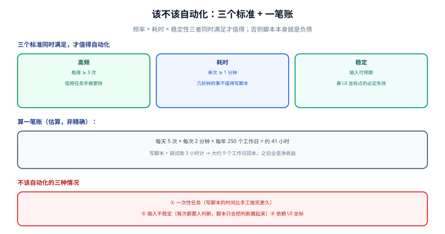
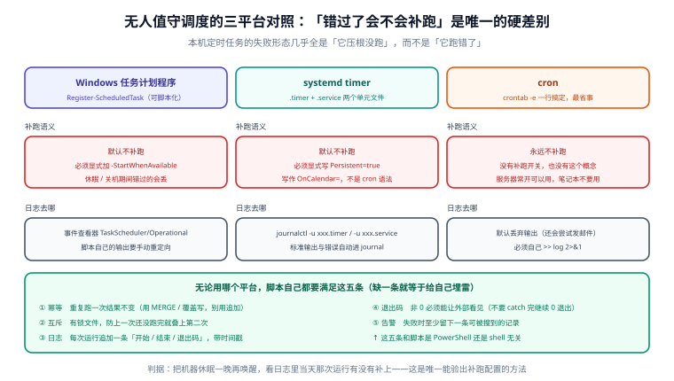

# 自动化：桌面、调度与脚本

自动化是效率工具的**最后一层**，也是最容易被误用的一层：写脚本本身有成本，**写错一个脚本的代价可能比手工做一年还高**（比如脚本静默跑错、误删文件、在错误的时间发邮件）。

这一页讲四件事：**该不该自动化**（三个标准 + 一笔账）、**三层自动化**分别用什么、**无人值守的调度怎么写才可靠**（第 8~9 节），以及**什么时候应该停手**。

## 1. 一句话定位

**频率 × 耗时 × 稳定性，三者同时满足，才值得自动化。** 否则脚本本身就是一笔负债——你要维护它、排查它、记得它的存在。



## 2. 该不该自动化：三个标准

| 标准 | 门槛 | 不满足时 |
| --- | --- | --- |
| **高频** | 每周 ≥ 3 次 | 低频任务手做更快，写脚本反而占时间 |
| **耗时** | 单次 ≥ 1 分钟 | 几秒钟的操作，脚本的启动开销可能比手工还大 |
| **稳定** | 输入可预期、步骤固定 | 每次都要人判断的任务，脚本只会把判断藏起来，出错更难发现 |

### 2.1 算一笔账

以一个"每天 5 次、每次 2 分钟"的操作为例：

```text
每年节省 ≈ 5 次/天 × 2 分钟 × 250 工作日 ≈ 2500 分钟 ≈ 41 小时
写脚本 + 调试 + 维护 ≈ 3 小时（乐观估计）
→ 回本周期 ≈ 3 小时 ÷ (41 小时/年) ≈ 约 9 个工作日
```

结论：**回本周期在两周以内的，立刻做；三个月以上的，先记在待办里。**

::: tip 一句话理解
**判断"高频"要诚实。** 很多人把"我觉得这件事经常做"当成高频，实际一周只做一次。最简单的办法：**先手工做两周，用笔记记下次数**（`00-Inbox` 里写正字），再决定。
:::

## 3. 不该自动化的三种情况

::: danger 注意：这三种情况写了脚本就是负债
1. **一次性任务**。写脚本 + 调试的时间比手工做完更久。典型场景：一次性数据迁移、一次性的格式转换。
2. **输入不稳定**。每次都要人判断的任务（如"看情况决定要不要重试"），脚本会把判断藏在条件分支里，出错时你既不知道它判断了什么，也不知道为什么。
3. **依赖 UI 坐标 / 依赖模拟点击**。分辨率一变、窗口位置一变、应用一升级，脚本立刻失效，而且失效时**可能点错地方**（比不自动化危险得多）。
:::

第 3 条要展开说：**模拟点击（MouseClick / SendInput 到具体坐标）是最脆弱的自动化形式**。优先级顺序应该是：

```text
命令行接口（CLI） > API > 配置文件 > 模拟键盘 > 模拟鼠标点击坐标
```

能用 CLI 解决的，不要用模拟点击。例如"打开浏览器并登录某个后台导出报表"，正确做法是找它的 API 或用 `curl`，而不是 `SendInput` 一串 Tab 键。

## 4. 三层自动化

| 层 | 触发方式 | 工具 | 适合 |
| --- | --- | --- | --- |
| **系统级** | 时间 / 开机 / 事件 | 任务计划程序（Windows）、`launchd`（macOS）、`systemd timer`（Linux）、`cron` | 定时同步、备份、清理、拉取数据 |
| **应用级** | 应用内快捷键、保存时、提交时 | PowerToys、编辑器的 task/保存钩子、Git 钩子 | 格式化、重命名、批量替换、提交前检查 |
| **脚本级** | 手动触发、被上层调用 | AutoHotkey v2、PowerShell / Bash 脚本、`just` / `make` | 把多步操作固化成一键 |

三者关系：**系统级负责"什么时候跑"，脚本级负责"跑什么"，应用级负责"在正确的时机插进去"。**

## 5. 系统级：任务计划程序

Windows 的任务计划程序是最常被忽略的系统级能力。用 PowerShell 注册（可脚本化、可进版本控制）：

```powershell
# 例：每个工作日 09:30 拉取一次数据到本地
$action = New-ScheduledTaskAction -Execute "pwsh.exe" `
    -Argument "-NoProfile -File D:\scripts\fetch-daily.ps1" `
    -WorkingDirectory "D:\scripts"

$trigger = New-ScheduledTaskTrigger -Weekly -DaysOfWeek Monday,Tuesday,Wednesday,Thursday,Friday -At 9:30am

$settings = New-ScheduledTaskSettingsSet `
    -StartWhenAvailable `                     # 错过了就在下次可用时补跑
    -DontStopOnIdleEnd `
    -ExecutionTimeLimit (New-TimeSpan -Minutes 30)

Register-ScheduledTask -TaskName "fetch-daily" `
    -Action $action -Trigger $trigger -Settings $settings `
    -Description "每个工作日拉取数据" -Force
```

四件必做的事：

| 事项 | 原因 | 做法 |
| --- | --- | --- |
| **显式写 `-NoProfile`** | 任务环境的 profile 与交互式不同 | `pwsh -NoProfile -File ...` |
| **显式设工作目录** | 任务默认工作目录是 `C:\Windows\System32` | `-WorkingDirectory` 或脚本内先 `Set-Location` |
| **加 `-StartWhenAvailable`** | 机器休眠/关机时错过触发点 | 见上 |
| **日志落地** | 任务失败不会有任何弹窗 | 脚本内把输出重定向到文件；退出码非 0 时写错误日志 |

验证与排查：

```powershell
# 查看任务状态与上次运行结果
Get-ScheduledTask -TaskName "fetch-daily" | Get-ScheduledTaskInfo

# 手动触发一次（不等时间）
Start-ScheduledTask -TaskName "fetch-daily"

# 看历史（事件查看器里更详细）
Get-WinEvent -LogName "Microsoft-Windows-TaskScheduler/Operational" -MaxEvents 20 |
    Where-Object Message -like "*fetch-daily*"

# 删除
Unregister-ScheduledTask -TaskName "fetch-daily" -Confirm:$false
```

macOS / Linux 对应能力：

```shell
# Linux：cron 最快（crontab -e）
30 9 * * 1-5 /home/me/scripts/fetch-daily.sh >> /home/me/logs/fetch.log 2>&1

# macOS：launchd 更可靠（休眠唤醒后会补跑），用 LaunchAgent plist
# ~/Library/LaunchAgents/com.me.fetchdaily.plist
launchctl load ~/Library/LaunchAgents/com.me.fetchdaily.plist
```

::: warning 说明
**`cron` 在笔记本上不可靠**：机器休眠期间错过的任务不会补跑。笔记本场景用 `systemd timer`（`Persistent=true`）或 macOS 的 `launchd`。Windows 侧对应 `-StartWhenAvailable`。
:::

## 6. 应用级：PowerToys

PowerToys 0.101（2026-08-25）提供了一组"应用级自动化"，不用写代码：

| 功能 | 作用 | 典型用法 |
| --- | --- | --- |
| **Command Palette** | 统一命令入口，聚合其他 PowerToys 模块与已装应用 | `Alt + Space` 唤起，替代找菜单位置 |
| **Window Hopper** | `Alt` + 反引号，在当前应用的窗口间循环 | 开了十个终端窗口时快速找到那个 |
| **Keyboard Manager** | 重映射按键与快捷键 | 把 CapsLock 映射成 Esc（或 Ctrl） |
| **PowerRename** | 批量重命名，支持正则与预览 | 一批截图统一改名 |
| **FancyZones** | 自定义窗口布局 | 三栏布局：编辑器 / 终端 / 文档 |
| **Advanced Paste** | 粘贴时转换格式 | 见[剪贴板与输入效率](../Clipboard/index.md) |

::: tip 一句话理解
**CapsLock 改成 Esc 是投入产出比最高的一次重映射**：一次设置，终身受益。但**公司统一镜像的机器上慎改**——键盘映射会进用户配置，别人用你的机器会不适应。
:::

PowerRename 的批量重命名（与[截图与标注](../Screenshot/index.md)的命名规则配套）：

```text
搜索：^QQ图片(\d+)(\w+)\.png$          （勾选「使用正则表达式」）
替换：2026-09-15-bug-${1}.png
预览确认无误后再执行 → 一次改几十张图
```

## 7. 脚本级：AutoHotkey v2

AutoHotkey（AHK）是 Windows 上最灵活的桌面自动化工具。**2026 年的关键事实：用 v2 语法**（最新 2.0.28 / 2026-09-12），**v1 已不再维护**——网上大量老教程是 v1 代码，照抄会直接报错。

### 7.1 v1 与 v2 的核心差异

| 维度 | v1（已停止维护） | v2（当前） |
| --- | --- | --- |
| 语法 | 命令式（`Send, text`） | 函数式（`SendInput "text"`） |
| 变量引用 | `%var%` | `var` 或 `%var%`（仅在字符串插值时） |
| 字符串 | 双引号 | 双引号；单引号也是字符串 |
| 对象 | `Obj := {}` | `Map()` / `Array()` |
| 错误处理 | 静默失败居多 | 抛异常，可 `try` / `catch` |

### 7.2 最小可用脚本

``` text
#Requires AutoHotkey v2.0        ; 显式声明版本，避免用错解释器
#SingleInstance Force            ; 重复运行时替换旧实例，不弹窗

; ── 文本扩展（见「剪贴板与输入效率」）
::@@::me@example.com
::]date::
    SendInput FormatTime(, "yyyy-MM-dd")
return

; ── 快捷键：打开项目目录
#!d:: {                          ; Win + Alt + D
    Run "wt.exe -d D:\docs-website"
}

; ── 快捷键：把当前窗口贴到屏幕左半（如果不想用 FancyZones）
#!Left:: {
    WinMove 0, 0, A_ScreenWidth // 2, A_ScreenHeight, "A"
}

; ── 带错误处理的脚本：调命令行并处理失败
#!g:: {                          ; Win + Alt + G：一键提交当前仓库
    try {
        RunWait "git.exe add -A", "D:\docs-website", "Hide"
        RunWait "git.exe commit -m `"chore: 自动提交`"", "D:\docs-website", "Hide"
        TrayTip "已提交", "git commit 完成"
    } catch as e {
        MsgBox "提交失败：`n" e.Message, "出错了", 16
    }
}
```

::: danger 注意：AHK 的四个坑
1. **`Run` 与 `RunWait` 区别很大**。`Run` 立即返回（不等待），`RunWait` 阻塞直到结束。要拿退出码或做顺序操作，必须用 `RunWait`。
2. **路径含空格/中文必须加引号**。`Run "C:\My Tools\a.exe"` 会被拆成两段。**永远给路径加引号**。
3. **`#Requires AutoHotkey v2.0` 不是可选项**。少了它，v1 解释器会尝试执行并在奇怪的地方报错。
4. **`SendInput` 在提权窗口里失效**。目标程序以管理员运行时，普通权限的 AHK 脚本按键发不进去（UIPI 限制）。需要自动化管理员窗口时，脚本本身也要以管理员运行。
:::

### 7.3 AHK 脚本的版本化

`.ahk` 脚本必须进 Git（这是本专题[三条底线](../index.md)之一）。推荐结构：

```text
dotfiles/
├── ahk/
│   ├── main.ahk              # 入口，用 #Include 引入其他
│   ├── hotkeys.ahk           # 快捷键
│   ├── text-expand.ahk       # 文本扩展
│   └── README.md             # 每个快捷键干什么（给未来的自己看）
└── powershell/
    └── Microsoft.PowerShell_profile.ps1
```

## 8. 三平台调度对照：补跑语义才是硬差别

第 5 节给了 Windows 侧的一份可用配置。这一节把三个平台的**语义差异**摊开——因为本机定时任务的失败形态里，**"它压根没跑"远多于"它跑错了"**，而"没跑"几乎总是补跑配置的问题。



### 8.1 定式对照表

| 维度 | Windows 任务计划程序 | systemd timer | cron |
| --- | --- | --- | --- |
| 定义方式 | `Register-ScheduledTask`（可脚本化、可入版本控制） | `.timer` + `.service` 两个单元文件 | `crontab -e` 一行 |
| 时间表达式 | `New-ScheduledTaskTrigger`（结构化参数） | `OnCalendar=`（不是 cron 语法） | `分 时 日 月 周` 五段 |
| **补跑** | `-StartWhenAvailable`（**必须显式加**） | `Persistent=true`（**必须显式写**） | **没有这个概念** |
| 输出去哪 | 事件查看器 `TaskScheduler/Operational`；脚本自己的输出要重定向 | 自动进 journal（`journalctl -u`） | 默认丢弃（还会尝试发本地邮件） |
| 运行身份 | `-User` / `-RunLevel`，可指定是否提权 | `User=` / `Group=`，或用户级 `systemctl --user` | 跟随 `crontab` 的所有者 |
| 适合 | Windows 本机、需要提权或与桌面交互的任务 | Linux 服务器与常开机器 | 服务器上"常开且一次两次没跑也没关系"的任务 |

::: danger 注意：三个平台各有一条"默认就会坑你"的设置
1. **Windows**：不加 `-StartWhenAvailable`，**机器休眠/关机期间错过的任务不会补跑**，而且任务状态仍显示"上次运行成功"（上一次，不是这一次）。
2. **systemd**：`OnCalendar=` 写成 cron 的 `30 9 * * 1-5` 会直接报错（要用 `Mon..Fri 09:30`）；另外**只有 `.timer` 被 enable 才有效**，只 enable `.service` 不会定时执行。
3. **cron**：**笔记本上不要用**。合盖期间的时间点没有任何机制补跑，而你大概率不会发现——直到某天发现数据缺了一大段。
:::

### 8.2 systemd timer 最小可用示例

```ini [/etc/systemd/system/fetch-daily.service]
[Unit]
Description=Daily fetch

[Service]
Type=oneshot
WorkingDirectory=/opt/scripts
ExecStart=/usr/bin/bash /opt/scripts/fetch-daily.sh
# 显式指定环境，别指望登录时的 PATH
Environment=PATH=/usr/local/sbin:/usr/local/bin:/usr/sbin:/usr/bin:/sbin:/bin
```

```ini [/etc/systemd/system/fetch-daily.timer]
[Unit]
Description=Run fetch-daily every weekday at 09:30

[Timer]
OnCalendar=Mon..Fri 09:30
Persistent=true                 # ← 错过了补跑，笔记本场景必写
AccuracySec=1min                # 允许合并唤醒，省电
Unit=fetch-daily.service

[Install]
WantedBy=timers.target
```

```shell
sudo systemctl daemon-reload
sudo systemctl enable --now fetch-daily.timer

# 验证三连（缺一不可）
systemctl list-timers --all | grep fetch-daily     # NEXT 列有下一次触发时间
sudo systemctl start fetch-daily.service           # 手动跑一次，立刻看到结果
journalctl -u fetch-daily.service -n 50 --no-pager # 看输出与退出码
```

::: tip 一句话理解
**"怎么定义时间"和"错了怎么办"是两件事。** 上表里 6 行维度，真正决定"任务可不可靠"的只有 `补跑` 一行——另外五行只影响你写起来顺不顺手。
:::

### 8.3 验证补跑：唯一有效的方法

补跑配置**无法靠读配置确认**，只能实测：

```text
① 把触发时间设成 2 分钟后
② 让机器进入休眠（合盖 / 挂起），等到触发时间过去
③ 唤醒机器，等 1~2 分钟
④ 看日志里有没有那次运行：时间戳是「唤醒后不久」，不是「设定时间」
   - Windows：Get-ScheduledTaskInfo -TaskName xxx 看 LastRunTime
   - systemd：journalctl -u xxx.service 看最新一条
   - cron：默认没有日志，先自己 >> log 2>&1 才有得看
```

| 结果 | 结论 |
| --- | --- |
| 日志里有那次运行，时间是唤醒之后 | 补跑生效 |
| 日志里完全没有 | 补跑没配，或配置没生效（重载/重启对应服务） |
| 有运行但时间是"设定时间"（早于唤醒） | 说明有 `anacron` 类机制在补，注意排查链路 |

## 9. 无人值守脚本的健壮性：五件套

调度只是"什么时候跑"。**跑起来之后能不能靠得住，取决于脚本自己。** 下面五条与脚本用 PowerShell 还是 shell 无关。

### 9.1 幂等

| 反例（不幂等） | 后果 | 正确做法 |
| --- | --- | --- |
| `echo "$data" >> out.csv` | 补跑一次就多一份重复数据 | 先写临时文件，再原子替换：`mv tmp out.csv` |
| `INSERT INTO t VALUES (...)` | 补跑直接主键冲突或脏数据 | 用 `INSERT ... ON DUPLICATE KEY UPDATE` / `MERGE` |
| `mkdir out` | 第二次报错退出 | `mkdir -p` / `New-Item -Force` |
| `git clone` | 第二次失败 | `if [ ! -d repo ]; then git clone …; fi`，或 `git -C repo pull --ff-only` |

```shell [月报生成：唯一能接受"追加"的场景要显式去重]
#!/usr/bin/env bash
set -euo pipefail
OUT=~/reports/$(date +%Y-%m).csv
TMP=$(mktemp)
grep -v '^#' "$OUT" 2>/dev/null | grep -v '^timestamp,' > "$TMP" || true   # 保留既有数据
printf 'timestamp,value\n' >> "$TMP"
date '+%F %T,123' >> "$TMP"
mv "$TMP" "$OUT"        # 原子替换：中途失败也不会留下半个文件
```

### 9.2 互斥（防重入）

上一次还没跑完，下一次就叠上来了——这是定时任务最典型的"雪崩起点"。

```shell [锁文件：简单、跨平台、够用]
#!/usr/bin/env bash
set -euo pipefail
LOCK=/tmp/fetch-daily.lock

# mkdir 是原子的：创建成功才算拿到锁（比 [ -f ] && exit 更可靠）
if ! mkdir "$LOCK" 2>/dev/null; then
  echo "$(date '+%F %T') SKIP 上一次仍在运行" >> ~/logs/fetch-daily.log
  exit 0
fi
trap 'rmdir "$LOCK"' EXIT        # 无论正常结束还是报错都释放

# …真正的任务…
```

```powershell
# PowerShell 侧的等价做法（用命名 Mutex）
$mtx = [System.Threading.Mutex]::new($false, 'Local\fetch-daily')
if (-not $mtx.WaitOne(0)) { Write-Warning '上一次仍在运行，本次跳过'; exit 0 }
try { <# 任务主体 #> } finally { $mtx.ReleaseMutex(); $mtx.Dispose() }
```

::: danger 注意：锁文件的两个死角
1. **`trap` 只处理"脚本自己被终止"**。如果机器直接断电，锁目录会留在磁盘上，**下一次运行会永远跳过**。所以锁要有"过期"机制：记录启动时间，超过阈值就视为陈旧锁并清理。
2. **`rmdir` 在 EXIT 时可能因路径已不存在而报错**，在 `set -e` 下会改变退出码。写 `trap 'rmdir "$LOCK" 2>/dev/null || true' EXIT`。
:::

### 9.3 日志

```text
每条记录一行，字段固定，便于 rg 和后续统计：
2026-10-04 09:30:01 START  pid=22118
2026-10-04 09:30:17 SKIP   上一次仍在运行
2026-10-04 09:30:44 END    rc=0  耗时=43s  输出=12 行
```

| 原则 | 原因 |
| --- | --- |
| **结构化 + 定长字段** | `rg '^END.*rc=[^0]'` 一条命令就能筛出所有失败运行 |
| **开始和结束都记** | 只有 END 的话，脚本崩溃时就什么都看不到 |
| **同时留 stdout/stderr** | 但**分开重定向**，否则不清楚某行是正常输出还是错误 |
| **日志要轮转** | 每天一条可能全年都没人看，用 `logrotate` 或按月切文件 |

```shell
# cron 侧：三个流分开，便于排查
30 9 * * 1-5 /opt/scripts/fetch-daily.sh >> /var/log/fetch-daily.log 2>> /var/log/fetch-daily.err
```

### 9.4 退出码

::: danger 注意：三种"看起来成功"的写法
1. **`cmd | tee log` 之后 `exit 0`**：`tee` 永远成功，失败被吞掉。用 `set -o pipefail`，或取 `${PIPESTATUS[0]}`。
2. **`try { … } catch { Write-Warning $_.Exception.Message }` 后照常结束**：PowerShell 脚本的退出码仍是 0。要么 `exit 1`，要么用 `$ErrorActionPreference = 'Stop'` 让错误直接终止。
3. **`cmd || true`**：把真实失败一起吞掉。只在"这条失败确实是预期内的"时用，并写注释说明原因。
:::

### 9.5 告警：静默失败才是真的失败

无人值守的核心风险不是"跑错"，而是**"没跑，而且没人知道"**。最小的告警方案按成本从低到高：

| 级别 | 做法 | 成本 |
| --- | --- | --- |
| 最低 | 失败时写一条 `FAIL` 日志（至少可被 `rg` 搜到） | 零 |
| 低 | 失败时 `curl` 一个 Webhook（企业微信/钉钉/飞书机器人） | 一个 URL |
| 中 | 收集日志到 Loki/ES，配一条"24 小时没有 END 记录"的告警规则 | 一套日志栈 |
| 高 | 接入正式告警通道（值班、分级、抑制） | 组织级成本 |

```shell
# 最小可用的失败告警（Webhook 用环境变量传，不要硬编码在脚本里）
if ! "$TASK"; then
  rc=$?
  echo "$(date '+%F %T') FAIL rc=$rc" >> "$LOG"
  if [ -n "${ALERT_WEBHOOK:-}" ]; then
    curl -s -m 5 -X POST "$ALERT_WEBHOOK" \
      -H 'Content-Type: application/json' \
      -d "{\"msgtype\":\"text\",\"text\":{\"content\":\"fetch-daily 失败 rc=$rc\"}}" > /dev/null || true
  fi
  exit "$rc"
fi
```

::: tip 一句话理解
**"没有告警的定时任务"等于"没有定时任务"**——它只在你恰好想起来去看日志的那天才存在。**先加一条 FAIL 日志，再加一个 Webhook**，这两步加起来不到 10 行。
:::

### 9.6 五件套的组合骨架

```shell [无人值守脚本的标准开头]
#!/usr/bin/env bash
set -euo pipefail                       # ④ 退出码：失败要能被看见
LOG=~/logs/task.log
LOCK=/tmp/task.lock

log() { printf '%s %-5s %s\n' "$(date '+%F %T')" "$1" "$2" | tee -a "$LOG"; }

mkdir -p "$(dirname "$LOG")"             # ① 幂等
if ! mkdir "$LOCK" 2>/dev/null; then log SKIP '上一次仍在运行'; exit 0; fi   # ② 互斥
trap 'rmdir "$LOCK" 2>/dev/null || true' EXIT

log START "pid=$$"                        # ③ 日志：开始
# …任务主体（幂等）…
log END "rc=0"                            # ③ 日志：结束
```

## 10. 什么时候应该停手

自动化到一定程度后，**新增自动化的边际收益会变成负数**。出现以下信号就该停：

| 信号 | 说明 |
| --- | --- |
| 你要为脚本写"使用说明" | 说明它已经复杂到你自己都记不住 |
| 脚本每周都要修一次 | 说明它依赖的外部环境不稳定，收益被维护成本吃掉了 |
| 出问题时的排查时间超过了手工做的时间 | 自动化把一次 5 分钟的手工活变成了一个 2 小时的谜题 |
| 你在自动化"自动化本身" | 明显过度，停 |

::: tip 一句话理解
**自动化的目标是"少做重复劳动"，不是"证明我能写脚本"。** 一个健康的个人自动化集合通常是 **3~8 个脚本**，每个不超过 100 行，每个都能一眼看懂它在做什么。
:::

## 11. 验证清单

| 检查项 | 命令 / 操作 | 期望 |
| --- | --- | --- |
| 任务已注册 | `Get-ScheduledTask -TaskName "fetch-daily" \| Get-ScheduledTaskInfo` | 有 `LastRunTime` 与 `LastTaskResult` |
| 任务能手动跑通 | `Start-ScheduledTask -TaskName "fetch-daily"` | 日志文件有新内容，结果码为 0 |
| AHK 版本正确 | 脚本首行 `#Requires AutoHotkey v2.0`，运行无报错 | 托盘出现绿色 H 图标 |
| 文本扩展生效 | 在记事本里输入 `]date` | 变成当天日期 |
| 脚本可恢复 | 脚本在 Git 仓库里，`git log` 有记录 | 换机器 `git clone` 后可用 |

## 12. 常见坑

| 现象 | 原因 | 解决 |
| --- | --- | --- |
| 任务显示"已运行"但没效果 | 工作目录是 `System32`，相对路径失效 | 显式设 `-WorkingDirectory` 或脚本内 `Set-Location` |
| 任务在交互式能跑、计划里报错 | profile / 执行策略差异 | 用 `pwsh -NoProfile -File`；脚本内不依赖 profile 别名 |
| 笔记本休眠后任务没跑 | 未启用补跑 | Windows 加 `-StartWhenAvailable`；Linux 用 systemd timer `Persistent=true` |
| AHK 脚本语法报错 | 抄了 v1 教程 | 改用 v2 语法；加 `#Requires AutoHotkey v2.0` |
| AHK 在管理员窗口里按键无效 | UIPI 限制 | 脚本也以管理员运行 |
| 路径含空格时 `Run` 失败 | 未加引号 | `Run "`"C:\My Tools\a.exe`""` |
| 脚本改了系统文件难以撤销 | 未做备份 | 批量操作前先 `Copy-Item` 备份；先`-WhatIf`（PowerShell 支持时）或先小批量试跑 |
| 自动化静默失败无人知道 | 没有日志、没有通知 | 脚本内落地日志；失败时 `TrayTip` / 写事件日志 / 调 Webhook（第 9.5 节） |
| 定时任务重复跑、数据多了一份 | 不幂等（用了追加写） | 写临时文件后原子替换；SQL 用 upsert（第 9.1 节） |
| 上一次没跑完就叠上了第二次 | 没有互斥 | 用锁目录 / 命名 Mutex（第 9.2 节） |
| 机器断电后任务再也不跑了 | 锁文件残留，没人清理 | 锁要带过期时间，或启动时清理陈旧锁 |
| systemd timer enable 了但不触发 | 只 enable 了 `.service` | `systemctl enable --now xxx.timer`，用 `list-timers` 核对 |
| `OnCalendar` 照抄 cron 表达式报错 | 两者语法不同 | `Mon..Fri 09:30` 形式（第 8.2 节） |
| cron 任务没有日志 | cron 默认丢弃输出 | `>> log 2>> err` 显式重定向 |

## 13. 参考与延伸

- [命令行提效与现代 CLI](../ShellProductivity/index.md)：脚本里要用的 CLI 工具（以及"脚本里不要用新工具"的判据）
- [终端、Shell 与会话复用](../Terminal/index.md)：长任务在现场怎么跑（tmux），与本节"无人值守"的区别见该页 7.8
- [剪贴板与输入效率](../Clipboard/index.md)：文本扩展的完整方案
- [实战：搭一套个人效率工具链](../Practice/index.md)：自动化在整条链路里的位置
- [版本控制工具](../../VersionControl/index.md)：把脚本与 dotfiles 版本化
- [CI/CD](../../CICD/index.md)：仓库级自动化的对照（把"本机定时"升级为"服务端流水线"）
- [运维 · Linux · 定时任务](../../../Ops/Linux/Advanced/CronTasks/index.md)：服务器侧的 cron / systemd timer 完整用法
- [运维 · Linux · Shell 脚本编程](../../../Ops/Linux/Advanced/ShellScripting/index.md)：第 9 节五件套在真实脚本里的工程写法

官方文档：

- Windows 任务计划程序（PowerShell）：[learn.microsoft.com/powershell/module/scheduledtasks](https://learn.microsoft.com/zh-cn/powershell/module/scheduledtasks/)
- AutoHotkey v2 官方文档：[autohotkey.com/docs/v2](https://www.autohotkey.com/docs/v2/)
- AutoHotkey v2 从 v1 迁移：[autohotkey.com/docs/v2/v1-changes](https://www.autohotkey.com/docs/v2/v1-changes.htm)
- PowerToys Keyboard Manager / PowerRename：[learn.microsoft.com/windows/powertoys](https://learn.microsoft.com/zh-cn/windows/powertoys/)
- systemd timer：[freedesktop.org/software/systemd/man/systemd.timer.html](https://www.freedesktop.org/software/systemd/man/latest/systemd.timer.html)
- systemd `OnCalendar` 时间格式：[freedesktop.org/software/systemd/man/systemd.time.html](https://www.freedesktop.org/software/systemd/man/latest/systemd.time.html)
