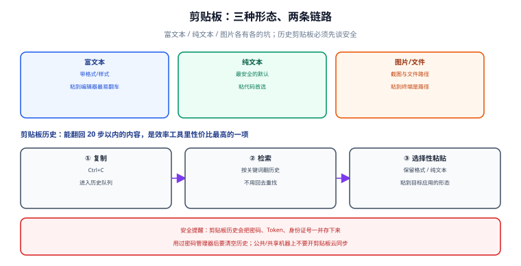

# 剪贴板与输入效率

剪贴板是效率工具里**最被低估的一环**。它没有界面、没有菜单、没有配置文件，但它每天被调用几百次。一次"复制 → 切换窗口 → 粘贴 → 再切回来 → 再复制"的往返，平均 3~5 秒；一天 100 次，就是 5~8 分钟纯浪费。

这一页讲清剪贴板的三层结构、历史剪贴板的正确用法、文本扩展的边界，以及**在哪些场景下不该用剪贴板**。

## 1. 一句话定位

**剪贴板不是"一个格子"，而是"一段流水线"**：复制 → 加工 → 粘贴，每一步都可以自动化。多数人只用了中间那一步的手工版本。

## 2. 三层结构



| 层 | 做什么 | 代表工具 | 关键约束 |
| --- | --- | --- | --- |
| **捕获层** | 把内容放进来：复制、截图、OCR、命令输出 | `Ctrl+C`、截图工具、`pbcopy`/`clip.exe` | 格式（纯文本 vs 富文本）在这里决定 |
| **加工层** | 转换内容：去格式、改大小写、JSON 格式化、URL 清理 | PowerToys Advanced Paste、AutoHotkey、脚本 | **加工层是收益最高的一层**，也是最常被跳过的一层 |
| **粘贴层** | 把内容放出去：单条、多条、按历史选择 | `Ctrl+V`、剪贴板历史（`Win+V`）、粘贴管理器 | 安全边界：敏感内容不该进历史 |

## 3. 捕获层：三种剪贴板形态

不同操作系统的剪贴板模型不一样，混用会出问题：

| 形态 | Windows | macOS | Linux（X11） | 说明 |
| --- | --- | --- | --- | --- |
| **普通剪贴板** | `Ctrl+C` / `Ctrl+V` | `Cmd+C` / `Cmd+V` | `Ctrl+C` / `Ctrl+V` | 全局唯一，新内容覆盖旧内容 |
| **选择即复制** | 无 | 选中即进剪贴板 | 中键粘贴（PRIMARY selection） | Linux 特有：**与普通剪贴板是两个独立缓冲**，常导致"我明明复制了但粘出来是旧的" |
| **历史剪贴板** | `Win+V`（需开启） | 无内置（用第三方） | 视桌面环境 | 保存最近 N 条，可跨重启（Windows 可选择同步） |

::: warning 说明
Linux 的 PRIMARY selection（选中即复制 + 中键粘贴）与 CLIPBOARD 是两个**不同**的缓冲。终端里 `Ctrl+Shift+C` 复制到 CLIPBOARD，鼠标选中进 PRIMARY；如果你在终端里用中键粘贴，得到的可能不是你以为的内容。这是跨平台脚本最容易忽略的差异。
:::

### 3.1 命令行里的复制与粘贴

脚本化场景下，"把命令输出放进剪贴板"比鼠标操作可靠得多：

```powershell
# Windows：把命令输出送进剪贴板
Get-ChildItem | Select-Object Name, Length | ConvertTo-Json | Set-Clipboard
git diff --stat | Set-Clipboard
(Get-Location).Path | Set-Clipboard          # 把当前目录路径复制走

# 从剪贴板读回来
Get-Clipboard
```

```shell
# macOS：pbcopy / pbpaste 是两个极其好用的命令
pwd | pbcopy                                  # 复制当前路径
rg --files | pbcopy                           # 复制所有文件名
pbpaste | jq . > formatted.json               # 读剪贴板、格式化、写文件

# Linux（X11，需 xclip；Wayland 用 wl-copy）
pwd | xclip -selection clipboard
wl-copy < file.txt
```

::: tip 一句话理解
`Set-Clipboard` / `pbcopy` 的真正价值是**消除"选中文本"这个鼠标动作**。你要复制的如果是"某个命令的输出"，手工选中永远比管道慢且更容易漏字符。
:::

## 4. 加工层：收益最高、最常被跳过

复制过来的内容往往**不能直接用**：从网页抄的代码带一堆富文本格式，从日志里抠出来的 JSON 是压缩成一行的，从聊天记录里复制的 SQL 带着 `\u00a0` 不换行空格。

### 4.1 PowerToys Advanced Paste

Microsoft PowerToys 0.101 的 **Advanced Paste** 是目前 Windows 上最好用的加工层工具，默认快捷键 `Win + Shift + V`：

| 模式 | 作用 | 典型场景 |
| --- | --- | --- |
| 纯文本 | 去掉所有格式 | 从 Word/网页粘到代码编辑器 |
| 转 Markdown | 把富文本转成 Markdown | 从网页抄内容进笔记库 |
| 转 JSON | 把文本整理成 JSON | 快速构造测试数据 |
| **端侧 AI 转换** | 用本地小模型（Phi Silica）做改写/翻译/摘要 | **敏感内容不出本机**（需 Copilot+ PC） |

::: danger 注意：端侧 AI 转换有硬件门槛
PowerToys 的 AI 辅助粘贴依赖 **Copilot+ PC 的 NPU 与 Phi Silica 模型**。普通机器上该选项会置灰。不要因为"文档写了"就以为所有机器都能用——**能力矩阵以自己机器的实际菜单为准**。
:::

### 4.2 用脚本做定制加工

Advanced Paste 覆盖不了的需求，用一个几十行的脚本解决。例：把 Markdown 表格转成 CSV。

```powershell
# 添加到 $PROFILE：把剪贴板里的 Markdown 表格转成 CSV
function mdtable2csv {
    $lines = Get-Clipboard | Where-Object { $_ -match '^\s*\|' }
    $lines |
        ForEach-Object { ($_ -replace '^\s*\|', '' -replace '\|\s*$', '') -split '\s*\|\s*' -join ',' } |
        Where-Object { $_ -notmatch '^[-\s,]+$' } |   # 丢掉分隔行 |---|---|
        Set-Clipboard
    Write-Host "已转换 $(($lines | Measure-Object).Count) 行 → 剪贴板"
}
Set-Alias mdc mdtable2csv
```

```shell
# macOS / Linux：把剪贴板里的 JSON 格式化后回填
pbpaste | jq . | pbcopy
# Linux
xclip -selection clipboard -o | jq . | xclip -selection clipboard
```

::: tip 一句话理解
判断"要不要写脚本"的标准：**这个加工动作一周内你会做超过 5 次吗？** 会，就写；不会，就手工做，不要为了可能的未来需求提前写脚本。
:::

## 5. 粘贴层：历史剪贴板

### 5.1 Windows `Win + V`

Windows 内置剪贴板历史，默认**关闭**，需要在 `设置 → 系统 → 剪贴板` 打开。

| 能力 | 说明 | 建议 |
| --- | --- | --- |
| 历史条数 | 默认 25 条 | 保持默认即可 |
| 固定（Pin） | 把常用条目钉住，不被覆盖 | 钉住邮箱、工号、常用路径这类**非敏感**内容 |
| 云同步 | 跨设备同步剪贴板 | **公司机器建议关闭**：剪贴板里可能有密钥、Token、客户数据 |
| 清空 | `Win+V → 全部清除` | 处理完敏感内容后立即清空 |

### 5.2 安全边界

剪贴板历史会**长期保存**你复制过的内容，包括密码、私钥、Token。三条硬规则：

1. **密码管理器不靠剪贴板**。若必须复制密码，用完立即清空历史。
2. **`.env`、私钥、Token 复制后清空**。可以做一个收尾函数：

```powershell
# 添加到 $PROFILE：清空剪贴板与历史
function cclear {
    Set-Clipboard -Value $null
    # 清历史需要调用系统接口；最简单的方式是 Win+V 后点"全部清除"
    Write-Host "剪贴板已清空。历史记录请按 Win+V 后点『全部清除』。"
}
```

3. **公司机器关闭跨设备同步**。剪贴板同步会把本机复制的内容上传到微软账户。

::: warning 说明
macOS 没有内置历史剪贴板，但第三方工具（如 Maccy、Paste）很多。注意这类工具通常会**缓存你复制的一切**，选用时先确认它是否本地存储、是否加密。
:::

## 6. 输入效率：文本扩展与输入法

复制粘贴是"减少一次输入"，文本扩展（text expansion）是"减少一次从头输入"。

| 方案 | 平台 | 触发方式 | 适合 |
| --- | --- | --- | --- |
| 输入法自定义短语 | 全平台 | 输入缩写后上屏 | 邮箱、地址、常用话术 |
| AutoHotkey v2 | Windows | 关键词替换（hotstring） | 更强的逻辑、可带函数 |
| Espanso | 跨平台 | 关键词替换 | 需要跨平台一致 |
| 系统"文本替换" | macOS / iOS | 关键词替换 | 最轻量，无外部依赖 |

AutoHotkey v2 的最小示例（详见[桌面与任务自动化](../Automation/index.md)）：

``` text
; 输入 @@ 变成邮箱
::@@::me@example.com

; 输入 ]date 变成今天日期
::]date::
    SendInput FormatTime(, "yyyy-MM-dd")
return

; 输入 ]time 变成当前时间
::]time::
    SendInput FormatTime(, "yyyy-MM-dd HH:mm:ss")
return
```

::: danger 注意：文本扩展的三个坑
1. **触发词要"不可能自然出现"**。用 `@@`、`]x` 这类组合，不要用 `thx`——正常打字会误触发。
2. **不要在密码框里全局替换**。多数工具会检测输入框类型，但不是所有都可靠；涉及密码的场景先关掉扩展。
3. **IDE 里的 snippet 与系统扩展会打架**。同一个触发词在编辑器里被 snippet 吃掉、在别处被系统替换，行为不一致。**在两处用不同前缀**。
:::

## 7. 完整工作流示例

场景：从浏览器复制一段带样式的技术文档片段，加工成纯 Markdown，粘进笔记库。

```text
① 浏览器里 Ctrl+C
② Win + Shift + V → 选「Markdown」或「纯文本」
   （PowerToys Advanced Paste 直接完成加工，无需中间程序）
③ 切到笔记库 Ctrl+V
④ 收尾：确认没有残留的 &nbsp; / 全角空格
```

对应的命令行版本（无 PowerToys 时）：

```powershell
# 把剪贴板里的富文本降级为纯文本的替代做法：
# 先粘贴到「记事本」（记事本只接受纯文本），再全选复制
notepad
# 粘贴 → Ctrl+A → Ctrl+C → 关闭（不保存）
```

::: tip 一句话理解
**"记事本洗格式"这个土办法永远不会失效**，因为记事本只接受纯文本。在不方便装工具的机器上，它是最可靠的降级方案。
:::

## 8. 验证清单

| 检查项 | 命令 / 操作 | 期望 |
| --- | --- | --- |
| 剪贴板历史已开启 | 按 `Win + V` | 弹出历史面板（而非提示"需要启用"） |
| 命令行写剪贴板 | `(Get-Location).Path \| Set-Clipboard` | 到任意输入框粘贴，得到当前路径 |
| 命令行读剪贴板 | `Get-Clipboard` | 输出当前剪贴板内容 |
| 富文本降级 | `Win + Shift + V → 纯文本` | 粘贴后**不带**颜色与字体 |
| 敏感内容清理 | `cclear` 后 `Win + V` | 历史中不再出现刚复制的内容 |

## 9. 常见坑

| 现象 | 原因 | 解决 |
| --- | --- | --- |
| `Win + V` 没反应 | 剪贴板历史未启用 | `设置 → 系统 → 剪贴板 → 剪贴板历史记录` 打开 |
| 粘贴出来带着背景色 | 复制的是富文本 | 用 Advanced Paste 选纯文本，或经过记事本 |
| Linux 终端里中键粘贴内容不对 | PRIMARY 与 CLIPBOARD 是两个缓冲 | 用 `Ctrl+Shift+V`，或 `xclip -selection clipboard -o` |
| 粘到终端后命令直接执行了 | 多行文本被当作多条命令 | 用括号粘贴模式；先粘到编辑器确认 |
| 复制的路径带引号 | 资源管理器"复制为路径"会加引号 | 用 `Set-Clipboard`，或复制后去掉首尾引号 |
| 文本扩展在密码框里触发 | 全局钩子不区分输入框 | 涉及密码的场景临时关闭扩展 |
| 剪贴板同步把内容传到了别的机器 | 开启了云同步 | 关闭同步；敏感内容用专门工具 |

## 10. 参考与延伸

- [终端与 Shell 环境](../Terminal/index.md)：`Set-Clipboard` / `pbcopy` 所在的运行环境
- [桌面与任务自动化](../Automation/index.md)：文本扩展与快捷键自动化的完整方案
- [截图与标注](../Screenshot/index.md)：截图也是"进剪贴板"的一种捕获方式
- [常见问题与最佳实践](../FAQ/index.md)：跨工具的排障总表

官方文档：

- Windows 剪贴板：[support.microsoft.com/windows/using-the-clipboard](https://support.microsoft.com/zh-cn/windows/%E4%BD%BF%E7%94%A8%E5%89%AA%E8%B4%B4%E6%9D%BF-9e4dc74a-d6a7-4c5d-a5a7-9d4b8f19c8d8)
- PowerToys Advanced Paste：[learn.microsoft.com/windows/powertoys/advanced-paste](https://learn.microsoft.com/zh-cn/windows/powertoys/advanced-paste)
- AutoHotkey v2 热字符串：[autohotkey.com/docs/v2/Hotstrings.htm](https://www.autohotkey.com/docs/v2/Hotstrings.htm)
- Espanso 官方文档：[espanso.org/docs](https://espanso.org/docs/)
