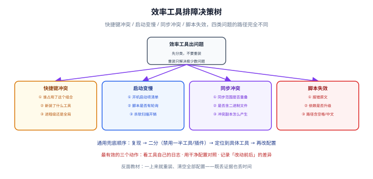

# 常见问题与最佳实践

这一页是本专题的排障总表与总结。工具不同，但**问题的类型高度重复**——快捷键冲突、启动变慢、同步冲突、脚本失效，四类问题占了九成以上。

## 1. 排障决策树

先分类，不要重装。**重装只解决极少数问题，却会丢掉全部证据。**

| 症状 | 先怀疑 | 第一步动作 |
| --- | --- | --- |
| **快捷键冲突** | 谁占用了这个组合 | 列出所有会注册全局快捷键的工具，逐个禁用验证 |
| **启动变慢** | 开机启动项 / 脚本轮询 / 杀软扫描 | 看开机启动项清单与脚本是否有轮询逻辑 |
| **同步冲突** | 同步范围重叠 / 含二进制文件 | 检查是否两个同步服务覆盖了同一目录 |
| **脚本失效** | 依赖升级 / 路径含空格与中文 | 先看报错原文，再看依赖版本 |

::: tip 通用兜底顺序
**复现 → 二分（禁用一半工具或插件）→ 定位到具体工具 → 再改配置。**

最有效的三个动作：**看工具自己的日志 · 用干净配置对照 · 记录"改动前后"的差异**。
反面教材：一上来就重装、清空全部配置——既丢证据也丢时间。
:::

## 2. 高频问答

### 2.1 选型类

**Q：效率工具要装多少？**
A：目标不是"多"，是"天天用"。经验值：**终端 1 个 + Shell 1 个 + 提示符 1 个 + CLI 工具 5 个左右 + 自动化脚本 3~8 个**。装完一周没打开过的，删掉。

**Q：Windows 上到底用 PowerShell 还是 Git Bash？**
A：**两者都装，按场景选**。PowerShell 7.6 与系统交互好（服务、注册表、任务计划），Git Bash 的 Unix 命令更全（`sed`/`awk`/`find` 语义标准）。日常主力用 PowerShell，需要跑 Unix 脚本时开 Git Bash。不要试图用一个完全替代另一个。

**Q：vim 要不要学？**
A：**只学"生存模式"就够**：`i` 进入编辑、`Esc` 退出、`:wq` 保存退出、`/` 搜索、`dd` 删行。完整学 vim 是**另一个投入量级**（回本周期常在数月以上），除非你大量在服务器上改文件，否则不值得。IDE 里的 vim 插件同理。

**Q：Obsidian / Notion / 语雀选哪个？**
A：看你要"本地优先"还是"协作优先"。**个人知识库选本地优先**（Obsidian 类），因为笔记寿命比工具长；**团队协作文档选在线**（Notion / 语雀 / 腾讯文档类）。详见[笔记与知识管理](../Notes/index.md)的工具分工表。

### 2.2 终端类

**Q：`pwsh` 和 `powershell` 有什么区别？**
A：`powershell.exe` 是随 Windows 分发的 **Windows PowerShell 5.1**，`pwsh.exe` 是**独立安装的 PowerShell 7**。两者并存，profile 文件互相独立。

**Q：为什么我改的配置不生效？**
A：最常见原因是**改错了 profile**。5.1 的 profile 在 `Documents\WindowsPowerShell\`，7 的在 `Documents\PowerShell\`。执行 `$PROFILE` 看当前会话实际读的是哪个。

**Q：为什么复制到终端的代码执行了命令？**
A：多行文本被终端当作多条命令逐行执行。用**括号粘贴模式**（bracketed paste），或先粘到编辑器确认。

**Q：终端启动要等 2~3 秒，正常吗？**
A：**不正常**。终端启动应该是瞬间的。常见原因：profile 里有耗时命令（调 API、扫描、启动后台进程）、`starship` 的 `cmd_duration` 设成了 0、oh-my-zsh 装了大量插件。**profile 只做轻量配置。**

### 2.3 剪贴板与截图类

**Q：`Win + V` 没反应？**
A：剪贴板历史默认关闭。`设置 → 系统 → 剪贴板 → 剪贴板历史记录` 打开。

**Q：粘贴时带着背景色/字体？**
A：复制的是富文本。用 PowerToys Advanced Paste 选"纯文本"，或**经过记事本洗一遍格式**（记事本只接受纯文本，这个土办法永远有效）。

**Q：Linux 下中键粘贴内容不对？**
A：X11 的 PRIMARY（选中即复制）与 CLIPBOARD 是**两个独立缓冲**。用 `Ctrl+Shift+V` 或 `xclip -selection clipboard -o`。

**Q：截图后找不到文件？**
A：`Win + Shift + S` 截完进的是**剪贴板**，不是文件。要么及时粘贴，要么到 `设置 → 辅助功能 → 键盘` 把"使用 Print Screen 键打开截图"打开。

**Q：截图里的文字搜不到？**
A：图片没有文本层。用 `Win + Shift + T`（PowerToys Text Extractor）OCR 出文字，并且**截图必须与文本日志配对留档**。

### 2.4 自动化类

**Q：AutoHotkey 脚本报语法错误？**
A：多半是抄了 **v1 教程**。v1 已停止维护，新脚本一律用 v2 语法，并在首行加 `#Requires AutoHotkey v2.0`。

**Q：脚本在管理员窗口里按键无效？**
A：Windows 的 UIPI 限制——普通权限进程无法向提权窗口发送输入。**脚本也要以管理员权限运行**。

**Q：计划任务显示"已运行"但没效果？**
A：任务默认工作目录是 `C:\Windows\System32`，脚本里的相对路径全部失效。**显式设置工作目录**，或脚本内先 `Set-Location`。

**Q：笔记本休眠后定时任务没跑？**
A：`cron` 在休眠期间错过的任务不会补跑。Windows 加 `-StartWhenAvailable`，Linux 用 systemd timer 的 `Persistent=true`，macOS 用 `launchd`。

**Q：自动化到什么程度该停？**
A：出现这些信号就停：你要为脚本写使用说明、脚本每周都要修、排查时间超过手工做的时间、你在自动化"自动化本身"。**健康规模是 3~8 个脚本，每个不超过 100 行。**

### 2.5 团队与规范类

**Q：团队要不要统一效率工具？**
A：**统一规则，不统一工具**。代码风格、提交规范、目录结构必须统一；终端、编辑器、笔记工具各用各的。理由：工具是个性化的，规则是可验证的。

**Q：怎么把效率工具实践推给团队？**
A：从**规矩最清楚、收益最直观**的一件开始（通常是提交规范 + Git 钩子），先跑两周拿出数据，再推第二件。不要一次性发一份 50 页的规范。

## 3. 15 条踩坑清单

| # | 坑 | 后果 | 正确做法 |
| --- | --- | --- | --- |
| 1 | 配置不进 Git | 换机器从零再配一遍 | dotfiles 仓库 + profile 备份 |
| 2 | 覆盖 PowerShell 内置别名（`ls`/`cat`/`rm`） | 脚本行为"看起来一样但类型不同" | 给第三方工具起新名字（`ll`/`cc`） |
| 3 | `curl` 直接用 | 实际调的是 `Invoke-WebRequest` | 脚本里写 `curl.exe` |
| 4 | profile 里放耗时命令 | 每次开终端等几秒 | 重活交给定时任务 |
| 5 | `Set-Alias` 带参数 | 报错 | 用 `function` |
| 6 | 提示符 `min_time = 0` | 每条命令后面都跟耗时，视觉噪音 | 设为 2000ms 以上 |
| 7 | `copyFormatting` 未设为 `none` | 复制带一堆样式 | 设为 `"none"` |
| 8 | 剪贴板跨设备同步开着 | 敏感内容上传到账户 | 公司机器关闭同步 |
| 9 | 打码用纯色块 | 可能被还原 | 用模糊/马赛克 |
| 10 | 截图当唯一证据 | 三个月后搜不到、只能看图猜 | 截图 + 文本日志配对 |
| 11 | 截图/图片命名用工具默认名 | 无法检索 | `YYYY-MM-DD-主题-序号.png` |
| 12 | 笔记库用专有格式 | 换工具导出乱码、丢图 | 本地纯 Markdown + Git |
| 13 | AHK 用 v1 语法 | 直接报错 | v2 语法 + `#Requires` |
| 14 | AHK `Run` 未给含空格路径加引号 | 路径被拆成两段 | 路径一律加引号 |
| 15 | 任务计划未设工作目录与日志 | 静默失败，且找不到原因 | 设 `-WorkingDirectory` + 落地日志 |

## 4. 12 条最佳实践

1. **键盘优先**。鼠标往返平均 2 秒；能在键盘上做完的，不碰鼠标。
2. **配置进 Git**。dotfiles、`settings.json`、`.ahk` 脚本、笔记库，全部版本化。
3. **只留天天用的**。装完一周没打开过的，删掉。
4. **先接链路，再装工具**。找最高频的"手工搬运"断点，接上它。
5. **按回本周期排序学习**。超过 3 个月回本的，先记待办。
6. **一处定义快捷键**。PowerToys / AHK / 编辑器三处不要设同一个组合；建一张快捷键登记表。
7. **捕获物必须落进版本库内的固定目录**（如主题的 `assets/`），并遵守命名规则。
8. **截图 + 日志配对**。图给"长什么样"，日志给"报了什么"、可搜索。
9. **脚本显式声明环境**：`#Requires`（AHK）、`-NoProfile`（PowerShell 任务）、显式工作目录。
10. **脚本必须有日志与退出码**。静默失败的自动化比不自动化更危险。
11. **批量与删除操作先小批量试跑**。加 `-WhatIf`，或先只打印不执行。
12. **每季度做一次减法**。列出所有工具与脚本，标出"最近 30 天用过吗"，没用过的清掉。

::: danger 三条不可逆操作，做前先备份
1. **批量重命名**——先在小批量上确认预览。
2. **删除类脚本**——先跑只打印不删除的版本。
3. **改 `PATH` 环境变量**——先把当前 `$env:PATH` 存一份到文件。
:::

## 5. 术语表

| 术语 | 含义 |
| --- | --- |
| **终端模拟器（Terminal Emulator）** | 显示字符、处理按键的"窗口"，如 Windows Terminal |
| **Shell** | 命令解释器，如 PowerShell、zsh、bash、fish |
| **提示符（Prompt）** | 命令行前的那段文字，由 starship 这类工具渲染 |
| **dotfiles** | 以 `.` 开头的配置文件（`~/.zshrc`、`$PROFILE`）的统称，常作为仓库名 |
| **热字符串（Hotstring）** | AHK 里"输入一段文本自动替换成另一段"的机制 |
| **Inbox（收集箱）** | 笔记库里"只进不出、当天倒空"的暂存区 |
| **MOC（Map of Content）** | 手动维护的主题索引页，替代文件夹分类 |
| **本地优先（Local-first）** | 数据以本地纯文件为准，工具只是查看器 |
| **会话复用（Session Multiplexer）** | tmux / zellij，断开连接后会话仍继续运行 |
| **UIPI** | Windows 的用户界面权限隔离，导致普通进程无法向提权窗口发送输入 |
| **括号粘贴模式（Bracketed Paste）** | 终端识别"这是一次粘贴"而非逐行输入，避免多行命令被直接执行 |
| **回本周期** | 学习/配置成本 ÷ 每周节省的时间，用于决定"值不值得学" |

## 6. 快速自查表

出问题时按这张表走一遍，九成问题能定位：

| # | 检查 | 动作 |
| --- | --- | --- |
| 1 | 这个问题属于四类中哪一类？ | 快捷键冲突 / 启动慢 / 同步冲突 / 脚本失效 |
| 2 | 最近改了什么？ | 看 Git 记录或回想最近装的工具 |
| 3 | 报错原文是什么？ | **不要跳过这一步**，先读完报错 |
| 4 | 干净配置下能复现吗？ | 禁用一半工具（二分法） |
| 5 | 工具自己的日志说什么？ | 看工具日志，不看猜 |
| 6 | 是环境差异吗？ | 交互式能跑、计划任务失败 → 工作目录/profile/执行策略 |
| 7 | 能不能回滚？ | 有 dotfiles 仓库就能一次回滚 |

## 7. 参考与延伸

本专题九个页面：

- [效率工具 · 概述与选型](../Overview/index.md)
- [终端与 Shell 环境](../Terminal/index.md)
- [命令行提效](../ShellProductivity/index.md)
- [剪贴板与输入效率](../Clipboard/index.md)
- [截图与标注](../Screenshot/index.md)
- [笔记与知识管理](../Notes/index.md)
- [桌面与任务自动化](../Automation/index.md)
- [实战：搭一套个人效率工具链](../Practice/index.md)
- **常见问题与最佳实践（本页）**

相关专题：

- [IDE 配置](../../IDE/index.md)：编辑器侧的效率与排障
- [版本控制工具](../../VersionControl/index.md)：dotfiles 与配置的版本化
- [协作与项目管理](../../Collaboration/index.md)：把效率规则推广到团队
- [运维 · Linux](../../../Ops/Linux/index.md)：服务器侧的终端与 Shell 排障

官方文档：

- PowerShell 支持生命周期：[learn.microsoft.com/powershell/scripting/install/powershell-support-lifecycle](https://learn.microsoft.com/zh-cn/powershell/scripting/install/powershell-support-lifecycle)
- Windows Terminal Shell Integration：[learn.microsoft.com/windows/terminal/tutorials/shell-integration](https://learn.microsoft.com/zh-cn/windows/terminal/tutorials/shell-integration)
- PowerToys 文档：[learn.microsoft.com/windows/powertoys](https://learn.microsoft.com/zh-cn/windows/powertoys/)
- AutoHotkey v2：[autohotkey.com/docs/v2](https://www.autohotkey.com/docs/v2/)
- Obsidian 帮助：[help.obsidian.md](https://help.obsidian.md/)
