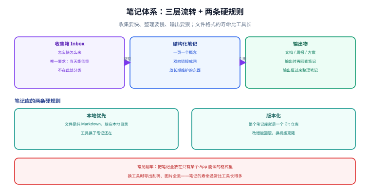

# 笔记与知识管理

笔记工具是效率工具里**最容易过度投入**的一环：很多人花了几个月比较 Notion / Obsidian / Logseq / 语雀，最后笔记总量不到 30 条。

这一页不谈"哪个 App 好"，只谈**结构**：三层流转、两条硬规则、以及笔记库与发布型文档库的分工。结构对了，工具随便换；结构错了，换十个工具也没用。

## 1. 一句话定位

**收集要快、整理要慢、输出要狠。** 三者顺序不能乱——先做输出驱动的收集，笔记库才会自己长起来。

## 2. 三层流转



| 层 | 唯一要求 | 存放时长 | 禁止做的事 |
| --- | --- | --- | --- |
| **收集箱 Inbox** | 当天能倒空 | 小时级 | 不要在这里分类、打标签、建目录 |
| **结构化笔记** | 一页一个概念，双向链接成网 | 月~年 | 不要做"知识库大而全"的幻想 |
| **输出物** | 文档、周报、方案、复盘 | 长期 | 不要直接从 Inbox 拼输出 |

::: tip 一句话理解
**"不在此处分类"是收集箱的核心规则。** 分类是慢动作，收集是快动作。在收集时分类，等于每次记东西都要做一次决策——决策成本会让你干脆不记。收集箱的存在就是为了把"决策"推迟到你有心情的时候。
:::

### 2.1 为什么"输出反过来整理笔记"

注意图中从「输出物」指回「结构化笔记」的箭头：**整理笔记最有效的时机不是"有空时"，而是"要写东西时"**。

- 要写方案 → 才发现某页笔记缺了关键结论 → 顺手补上。
- 要写周报 → 才发现收集箱里三周前的碎片还没归档 → 顺手归位。

这是唯一可持续的整理动力。指望"每周日花两小时整理笔记"，通常坚持不过三周。

## 3. 两条硬规则

### 3.1 本地优先：文件是纯 Markdown

**笔记库必须是本地目录下的一堆 `.md` 文件**，图片是本地文件，不是"存在某个 App 的数据库里"。

| 存法 | 换工具时 | 五年后 | 建议 |
| --- | --- | --- | --- |
| 纯 Markdown + 本地图片 | 直接拷贝目录 | 仍可读 | ✅ |
| 某个 App 的专有格式 | 导出可能乱码、丢图 | 依赖该 App 存续 | ❌ |
| 只有网页版 | 无法导出完整结构 | 依赖厂商 | ❌ |

::: danger 注意：笔记的寿命比工具长
笔记库通常要维护 **5~10 年**，而一个工具的生命周期常只有 **3~5 年**。把长期资产放在短期载体里，是知识管理最常见的翻车方式。

判断标准很简单：**关掉那个 App，你的笔记还能用普通编辑器打开、还能用 `rg` 搜到吗？** 不能，就不是本地优先。
:::

### 3.2 版本化：整个笔记库就是一个 Git 仓库

```shell
# 笔记库的初始化（一次性）
cd ~/notes
git init
printf '.obsidian/workspace*.json\n.trash/\n' > .gitignore   # 忽略工具产生的临时状态
git add . && git commit -m "chore: 初始化笔记库"

# 日常
git add -A && git commit -m "notes: 补充效率工具链路笔记"
```

带来的两个能力：

| 能力 | 没有版本化时 | 有版本化时 |
| --- | --- | --- |
| 改错了想回滚 | 靠工具自带的"文件恢复"，时限很短 | `git checkout -- <file>` 随时恢复 |
| 换机器 / 换工具 | 手动拷贝，容易漏附件 | `git clone` 一条命令 |

::: warning 说明
**笔记库不要直接推到公开仓库**。笔记里常有内网地址、客户名、临时凭据。用私有仓库，或只在本地版本化 + 定期加密备份。
:::

## 4. 工具分工：笔记库 vs 文档库

这是**最容易混淆**的一点。本站（`docs-website`）是**发布型文档库**（VitePress + 静态站点），笔记库是**草稿型知识库**。两者定位完全不同：

| 维度 | 笔记库（草稿库） | 文档库（本站） |
| --- | --- | --- |
| 受众 | 只有你 | 团队 / 公开 |
| 结构 | 网状，靠双向链接 | 树状，靠目录与侧边栏 |
| 粒度 | 一页一个念头/概念 | 一页一个完整主题 |
| 质量门槛 | 低，先记下来 | 高，要能给别人看 |
| 图片 | 随手放，命名可松散 | 必须在 `assets/`，命名有规则 |
| 构建 | 无 | `pnpm docs:build` 必须通过 |
| 版本化 | Git（私有） | Git（对团队/公开） |

正确的流转方向是**单向的**：

```text
碎片（Inbox）→ 概念笔记（双向链接）→ 成体系的专题 → 提炼进文档库
```

::: tip 一句话理解
**不要对着笔记库写文档，也不要拿文档库当草稿纸。** 前者会让文档变成流水账，后者会污染文档库的结构与构建（比如图片路径不规范、未转义的双花括号导致构建报错）。
:::

## 5. 双向链接：怎么用才不变成装饰

双向链接（`[[页面名]]` 或 Obsidian 的 backlinks）的价值在于**让"相关"这件事自动浮现**。三个实用用法：

| 用法 | 写法 | 效果 |
| --- | --- | --- |
| 概念索引页（MOC） | 建一页 `效率工具 MOC`，列出所有相关笔记 | 手动维护的目录，替代"文件夹分类" |
| 反向索引 | 在笔记里链到主题词，如 `[[终端]]` | 主题页自动汇总所有提到它的笔记 |
| 待办聚合 | 统一写 `#todo` 标签 | 一处看全部未完成项 |

::: danger 注意：双向链接的三个反模式
1. **链到不存在的页面**（空链接）越来越多。定期清理孤岛与空链接。
2. **用标签代替结构**。标签容易膨胀到几十个且互相重叠；结构性的东西用 MOC 页，临时性的用标签。
3. **为了链接而链接**。每页都加五六个链接，最后没人会点。**链接要有明确理由**：这一页解释的那一页的前提，或那一页是这一页的实例。
:::

## 6. Obsidian 的最小可用配置

Obsidian 是当前**本地优先**路线最成熟的选择（2026-09 稳定版 1.13.8；1.13 起设置界面重构为独立窗口并加入全局搜索）。

最小配置（不要一上来装 20 个插件）：

```text
① 新建库（Vault），位置选在本地目录，如 ~/notes
② 立刻 git init（见 3.2）
③ 目录结构只建三个：
     00-Inbox/        ← 收集箱
     10-Notes/        ← 结构化笔记
     90-Assets/       ← 图片附件（在设置里指定为默认附件目录）
④ 设置 → 编辑器 → 附件默认位置：指定文件夹 90-Assets
⑤ 只装一个插件：Git（自动提交）
```

::: warning 说明
**附件目录必须显式设置。** 默认情况下 Obsidian 把粘贴的图片放在库根目录，几十张图之后根目录就乱了。设成 `90-Assets` 后，粘贴的截图会自动落到固定位置——这与[截图与标注](../Screenshot/index.md)的归档规则一致。
:::

常用的两个内置能力：

| 能力 | 入口 | 用途 |
| --- | --- | --- |
| 快速切换 | `Ctrl/Cmd + O` | 按名字跳到任意笔记 |
| 全局搜索 | `Ctrl/Cmd + Shift + F` | 搜全文（1.13 起支持独立窗口里的全局搜索） |
| 命令面板 | `Ctrl/Cmd + P` | 执行任意命令，不用记菜单位置 |

## 7. 与命令行工具的配合

笔记库既然是本地 Markdown，就能用前面几页的命令行工具直接处理——这是本地优先最大的红利：

```powershell
# 找笔记：按内容搜（rg 是本专题推荐的内容搜索工具）
rg -n "回本周期" ~/notes

# 找笔记：按文件名搜（配合 fzf 模糊查找后直接用编辑器打开）
rg --files ~/notes | fzf | ForEach-Object { code $_ }

# 统计：收集箱还剩多少条没倒空
(Get-ChildItem ~/notes/00-Inbox -Filter *.md -Recurse).Count
```

```shell
# macOS / Linux 等价写法
rg -n "回本周期" ~/notes
rg --files ~/notes | fzf | xargs -o code
find ~/notes/00-Inbox -name '*.md' | wc -l
```

这些命令的完整说明见[命令行提效](../ShellProductivity/index.md)。

## 8. 实战：从零到可用（20 分钟）

```text
① 建库 + git init（3 分钟）：目录只建 00-Inbox / 10-Notes / 90-Assets
② 设附件目录（1 分钟）：设置 → 文件与链接 → 附件默认位置
③ 建一个 MOC 页（2 分钟）：10-Notes/效率工具 MOC.md，先列五个你知道要记的主题
④ 装 Git 插件（3 分钟）：开启自动提交，间隔设 10 分钟
⑤ 把现在手上的一件事记进 Inbox（1 分钟）：不要分类，不要打标签
⑥ 写一条笔记并链到 MOC（10 分钟）：体验"整理 → 成网"的过程
```

验收标准（一周后回看）：

| 检查项 | 期望 |
| --- | --- |
| `git log --oneline` | 有至少 3 条提交，说明在真实使用 |
| `00-Inbox` 文件数 | 保持在个位数（能倒空） |
| MOC 页链接数 | 从 5 涨到 10+，且**没有空链接** |
| 用 `rg` 能否搜到内容 | 能，说明确实是本地纯文本 |

## 9. 常见坑

| 现象 | 原因 | 解决 |
| --- | --- | --- |
| 装了工具但没记几条 | 在收集阶段做了分类决策 | 收集箱强制"不分类"，只求快 |
| 笔记越记越乱 | 没有输出驱动的整理 | 只在"要写东西"时整理笔记 |
| 换工具后图片全丢 | 图片存在专有位置 | 附件目录设为库内固定目录，随库一起 Git |
| 双向链接全是空链接 | 为链接而链接 | 定期清理；链接必须有明确理由 |
| 笔记库推到公开仓库泄露信息 | 没检查内容 | 用私有仓库；推送前 `git grep` 搜敏感词 |
| Obsidian 库根目录一堆图片 | 附件目录未设置 | 设置 → 附件默认位置 → 指定文件夹 |
| 笔记与文档库内容重复 | 定位没分清 | 严守单向流转：草稿 → 笔记 → 提炼 → 文档 |
| 搜索不到想要的内容 | 图片/截图无文本层 | 截图同时留文本日志（见[截图与标注](../Screenshot/index.md)） |

## 10. 参考与延伸

- [命令行提效](../ShellProductivity/index.md)：用 `rg` / `fzf` 检索本地笔记库
- [截图与标注](../Screenshot/index.md)：笔记里图片的归档与命名规则
- [版本控制工具](../../VersionControl/index.md)：笔记库的 Git 使用细节
- [存量整理 · 知识重构](../../../Others/AnnualReview/KnowledgeRefactor/index.md)：从笔记到体系化文档的整理方法
- [实战：搭一套个人效率工具链](../Practice/index.md)：笔记在整个链路里的位置

官方文档：

- Obsidian 帮助中心：[help.obsidian.md](https://help.obsidian.md/)
- Obsidian 附件与文件设置：[help.obsidian.md/Files+and+folders](https://help.obsidian.md/Files+and+folders)
- VitePress 文档（本站使用的文档库框架）：[vitepress.dev](https://vitepress.dev/zh/)
