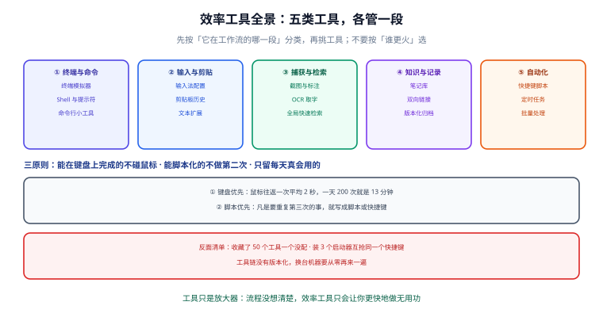

# 概述与选型

效率工具不是"装得越多越高效"。绝大多数人折腾效率工具的过程是：收藏一堆清单 → 装十几个 → 快捷键互相打架 → 两周后卸载 → 回到原样。

这一页解决的是**顺序问题**：先认清自己在哪一段浪费时间，再决定装什么。

## 1. 效率工具到底解决什么问题

把一天的工作拆开看，时间主要漏在三个地方：

| 瓶颈 | 具体表现 | 对应工具类别 |
| --- | --- | --- |
| **切换成本** | 在 IDE、终端、浏览器、聊天窗口之间来回点；每次切换平均 15~30 秒才回到状态 | 启动器、快捷键、终端集成 |
| **重复劳动** | 同样的命令敲第 100 遍；同样的信息手工复制粘贴搬运 | 别名/函数、脚本、自动化 |
| **找不到** | 上周的截图、三个月前的笔记、自己写过的那段配置 | 剪贴板历史、全局检索、命名规范 |

三类问题对应三类工具，**不要用同一类工具去解另一类的问题**。例如"找不到文件"该做的是命名规范 + 全局检索，而不是再装一个启动器。

## 2. 五类工具地图



上图按"在工作流的哪一段"分类，这是最不容易被营销话术带偏的分法：

| 类别 | 管什么 | 典型工具 | 不做这件事的后果 |
| --- | --- | --- | --- |
| ① 终端与命令 | 跑命令、看输出、切目录 | Windows Terminal、PowerShell 7、Windows Terminal + starship | 输出看不全、复制粘贴难、排查问题只能靠猜 |
| ② 输入与剪贴 | 打字、复制、粘贴 | 输入法、系统剪贴板历史、文本扩展 | 反复输重复内容；粘到编辑器里带一堆格式 |
| ③ 捕获与检索 | 截图、取字、快速找 | 系统截图、Snipaste、PowerToys Text Extractor、fzf | 截图没命名，三天后自己都认不出 |
| ④ 知识与记录 | 记下来、连起来、写出去 | Obsidian、本地 Markdown + Git | 知识只存在脑子里和聊天记录里 |
| ⑤ 自动化 | 把重复动作变成一次触发 | PowerToys、AutoHotkey v2、任务计划、PowerShell 脚本 | 每天花 20 分钟做机器该做的事 |

## 3. 选型三原则

### 原则一：键盘优先

同一个操作如果超过每天 5 次，就应该有一条键盘路径。

- 打开常用应用：启动器（PowerToys Run / Command Palette、macOS 的 Spotlight）
- 切换窗口：`Alt + Tab` 之外，用"同一应用窗口间切换"（PowerToys 0.101 新增的 **Window Hopper**，默认 `Alt + 反引号`）
- 运行命令：终端 + 别名，而不是"打开文件夹 → 找脚本 → 双击"

### 原则二：脚本优先

**凡是要重复第三次的事，就写成脚本或快捷键。** 判断公式：

```text
值得自动化 ⇔ 频率 × 单次耗时 × 稳定性 三者都够
```

- 频率：每周 ≥ 3 次
- 单次耗时：≥ 1 分钟
- 稳定性：输入可预期，不需要人临时判断

详细判断与算账见[桌面与任务自动化](../Automation/index.md)。

### 原则三：只留天天用的

每装一个工具，都要付出三种成本：

1. **学习成本**：了解它、配置它、记住它的快捷键
2. **运行成本**：开机启动、常驻内存、后台扫描
3. **冲突成本**：抢占快捷键、抢占文件关联、抢占默认程序

第三项最容易被忽略，也最烦人。**装三个启动器的人，最后三个都不好用。**


上图的算法很简单：**回本周期 = 学习与配置成本 ÷ 每周节省时间**。回本周期超过 3 个月的工具，先记在待办里，等真的被它卡住再学。

## 4. 2026 年的三个变化

选型判断要跟着趋势走，近两年有三件事值得注意：

### 变化一：终端从"能用"变成"好用"

Windows 侧的差距已经基本抹平：Windows Terminal 1.24 支持标签、分屏、GPU 渲染与 **Shell Integration**（command marks 自 1.21 起稳定，可以在滚动条上标记命令位置、快速跳转与选中命令输出）。PowerShell 7.6 是新的 LTS，跨平台、支持 `$PSVersionTable` 自检。

**结论**：Windows 上做开发，没有理由继续用 `cmd.exe` 或裸 `powershell.exe`。

### 变化二：本地优先回归

笔记类工具从"云端 SaaS"往"本地文件 + 版本控制"回摆。原因很实际：**工具的寿命通常比笔记短**。十年里换过三四个笔记软件的人，最后都会把内容迁到纯 Markdown。

**结论**：选择**用普通文件存数据**的工具。工具可以换，文件不会丢。

### 变化三：AI 能力下沉到系统级工具

不用打开浏览器就能用上模型能力。典型例子是 PowerToys 0.101 的 **Advanced Paste**：支持调用设备端模型（Phi Silica）做本地转换，无需配置云端凭据。

**结论**：这类能力适合放在"顺手就能用"的位置（粘贴、取字、总结），而不是把工作流搬进一个单独的大模型应用。

## 5. 各类主流选项横向对比

| 场景 | 选项 A | 选项 B | 选项 C | 建议 |
| --- | --- | --- | --- | --- |
| 终端模拟器 | Windows Terminal（Win） | iTerm2 / Ghostty（macOS） | WezTerm（跨平台） | 用系统最顺的那个即可，别为终端本身折腾 |
| 启动器 | PowerToys Run / Command Palette（Win） | Raycast / Spotlight（macOS） | uTools（跨平台） | 只留一个，快捷键设成自己最顺手的 |
| 剪贴板历史 | 系统内置（`Win + V` / macOS 通用剪贴板） | Ditto / CopyQ | PowerToys Advanced Paste | 先开系统内置的，不够再上第三方 |
| 截图 | 系统截图（`Win + Shift + S` / `Cmd + Shift + 4`） | Snipaste（贴图强） | ShareX（流水线强） | 需要"贴图"选 Snipaste，需要"自动归档"选 ShareX |
| 笔记 | Obsidian（本地 Markdown） | Logseq（大纲式） | 云端笔记（协作方便） | 个人知识库优先本地优先型 |
| 自动化 | PowerToys（零代码） | AutoHotkey v2（脚本） | 任务计划 + PowerShell | 从 PowerToys 起步，不够再写脚本 |

::: warning 说明
上表只列"最主流的一个代表 + 两个替代"，不是完整清单。选型时**优先看数据格式是否开放**（能不能导出成普通文件），其次才看功能。
:::

## 6. 个人场景与团队场景的差别

| 维度 | 个人 | 团队 |
| --- | --- | --- |
| 工具选择 | 自己顺手就行 | 需要统一，否则交接时互相看不懂 |
| 配置管理 | 存在自己机器的 dotfiles 仓库 | 配置进项目仓库，新同事 clone 就能用 |
| 快捷键 | 可以很个性化 | 冲突键位要统一（参考 [IDE 配置 · 配置同步](../../IDE/ConfigSync/index.md)） |
| 效率指标 | 自己感觉变快 | 要有可观察的信号：构建时间、PR 往返次数、交接成本 |

团队场景下真正要统一的其实是**规则**（代码风格、提交规范、目录结构），工具只是规则的消费者。这一点和 [IDE 配置 · 实战](../../IDE/Practice/index.md) 的结论一致。

## 7. 选型清单（照抄即可）

给自己做个"只装五个"的清单，其余一律先进待办：

1. **一个终端**：Windows Terminal（Win）/ iTerm2 或系统终端（macOS）
2. **一个启动器**：PowerToys Run 或 Command Palette（Win）/ Raycast（macOS）
3. **一个剪贴板历史**：`Win + V` 或系统等效功能
4. **一个截图工具**：系统自带
5. **一个笔记库**：本地 Markdown 目录 + Git

这五个配好，日常效率问题能解决 70%。剩下的 30%（自动化、文本扩展、模糊查找）等你**明确感到卡顿**时再补。

::: danger 注意：三个最常见的错误顺序
1. **先装工具，再想流程**。正确顺序是先记录一周"我在哪里卡住"，再去找对应工具。
2. **一次装十个**。同时装十个工具的后果是：不知道哪个在起作用，也不知道哪个在拖慢启动。正确做法：**一次加一个，用一周再决定去留**。
3. **配置不进 Git**。工具配置是资产，不是临时文件。dotfiles 进仓库，换机器 10 分钟恢复。正确做法见[实战：搭一套个人效率工具链](../Practice/index.md)。
:::

## 8. 验证方式

选型是否有效，用三个可观察信号验证（一周后自查）：

```text
1. 手工复制粘贴次数：是否下降？（下降 = 链路打通了）
2. 开机启动耗时：变化是否可察觉？（明显变慢 = 装多了）
3. 快捷键冲突次数：这周撞了几次？（> 2 次 = 启动器/快捷键重复了）
```

具体命令：

```powershell
# Windows：看开机启动项（PowerShell 7）
Get-CimInstance Win32_StartupCommand | Select-Object Name, Command, Location | Format-Table -AutoSize

# 看当前有几个常驻的效率类进程（示例：按名字过滤）
Get-Process | Where-Object { $_.ProcessName -match 'PowerToys|AutoHotkey|Ditto|Snipaste' } |
  Select-Object ProcessName, Id, @{n='MB';e={[math]::Round($_.WorkingSet64/1MB,1)}}
```

```shell
# macOS：看登录项与常驻进程
osascript -e 'tell application "System Events" to get the name of every login item'
ps -Ao %cpu,pmem,comm | sort -k2 -nr | head -10
```

预期：常驻的效率类工具 **不超过 3 个**；新增工具后开机时间没有可感知变化。

## 9. 参考资料

- Windows Terminal 官方文档：[learn.microsoft.com/windows/terminal](https://learn.microsoft.com/zh-cn/windows/terminal/)
- Windows Terminal 发布说明：[github.com/microsoft/terminal/releases](https://github.com/microsoft/terminal/releases)
- Microsoft PowerToys 发布说明：[github.com/microsoft/PowerToys/releases](https://github.com/microsoft/PowerToys/releases)
- PowerShell 生命周期：[learn.microsoft.com/lifecycle/products/powershell](https://learn.microsoft.com/zh-cn/lifecycle/products/powershell)
- 相关页面：[终端与 Shell 环境](../Terminal/index.md) / [命令行提效](../ShellProductivity/index.md) / [桌面与任务自动化](../Automation/index.md)
