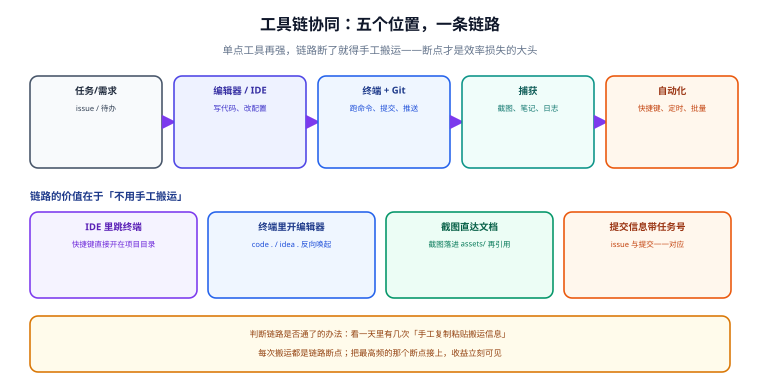
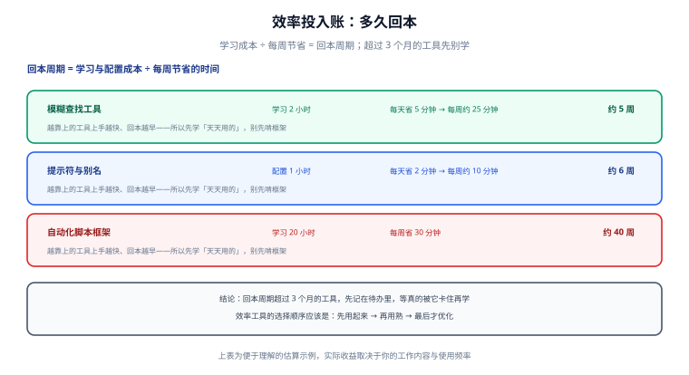

# 实战：搭一套个人效率工具链

前面几页分别讲了终端、命令行、剪贴板、截图、笔记、自动化这六块。这一页把它们**接成一条链路**——因为效率损失的大头不在单个工具，而在**工具之间的手工搬运**。

## 1. 一句话定位

**单点工具再强，链路断了就得手工搬运。** 判断你的链路通不通，看一天里有几次"手工复制粘贴搬运信息"。



## 2. 五个位置，一条链路

一条完整的个人效率链路，由五个位置构成。每个位置都要回答一个问题：**信息怎么自动流到下一个位置？**

| 位置 | 承担什么 | 对应本专题页面 | 与下一个位置的接口 |
| --- | --- | --- | --- |
| **① 任务 / 需求** | 待办、issue、用户反馈 | [笔记与知识管理](../Notes/index.md)（Inbox） | 任务号写进分支名与提交信息 |
| **② 编辑器 / IDE** | 写代码、改配置 | [IDE 配置](../../IDE/index.md) | IDE 内一键开终端，直接落在项目目录 |
| **③ 终端 + Git** | 跑命令、提交、推送 | [终端与 Shell 环境](../Terminal/index.md)、[命令行提效](../ShellProductivity/index.md) | 命令输出可进剪贴板 / 日志文件 |
| **④ 捕获** | 截图、笔记、日志留痕 | [截图与标注](../Screenshot/index.md)、[剪贴板与输入效率](../Clipboard/index.md) | 捕获物落进项目 `assets/`，正文引用 |
| **⑤ 自动化** | 快捷键、定时、批量 | [桌面与任务自动化](../Automation/index.md) | 把①~④的重复动作固化成脚本 |

### 2.1 三个关键接口

图中标注了三条最容易断、接上后收益最大的接口：

| 接口 | 断掉时 | 接上后 |
| --- | --- | --- |
| **IDE ⇄ 终端** | 每次手工 `cd` 到项目目录 | IDE 里快捷键直接开在当前项目目录 |
| **终端 ⇄ 编辑器** | 命令行里看到文件但要手工打开 | `code .` / `idea .` 反向唤起，或用[命令行提效](../ShellProductivity/index.md)的 `fzf + 编辑器`组合 |
| **截图 ⇄ 文档** | 截图存在下载目录，正文要手工搬图 | 截图直接落进主题的 `assets/`，正文用相对路径引用 |
| **提交 ⇄ 任务** | 提交信息是"改了一下" | 提交信息带任务号，issue 与提交一一对应 |

::: tip 一句话理解
**接接口的顺序，按"每天发生次数"从高到低。** 每天发生 20 次的那个断点，接上它一天的收益比接十个每天发生 1 次的断点都大。
:::

## 3. 先算回本周期，再决定学什么

不要一上来装一堆工具。用**回本周期**排序：



| 工具 | 学习 / 配置成本 | 每周节省（估算） | 回本周期 |
| --- | --- | --- | --- |
| 模糊查找（fzf / Command Palette） | 2 小时 | 约 25 分钟 | 约 5 周 |
| 提示符与别名（starship + aliases） | 1 小时 | 约 10 分钟 | 约 6 周 |
| 剪贴板加工（Advanced Paste） | 0.5 小时 | 约 15 分钟 | 约 2 周 |
| 截图归档规则 | 0.5 小时 | 约 10 分钟 | 约 3 周 |
| 自动化脚本框架 | 20 小时 | 约 30 分钟 | 约 40 周 |

::: warning 说明
**回本周期超过 3 个月的工具，先记在待办里。** 等真的被它卡住（同一个动作一周做三次以上且每次超过 1 分钟）时再学。上表是便于理解的估算示例，实际收益取决于你的工作内容。
:::

::: tip 一句话理解
**效率工具的选择顺序是：先用起来 → 再用熟 → 最后才优化。** 很多人卡在第一步（反复比较工具），结果一个都没用起来。
:::

## 4. 六步落地（每步都有验收点）

### 第 1 步：终端底座（约 10 分钟）

```powershell
# 装 Windows Terminal + PowerShell 7 + starship
winget install --id Microsoft.WindowsTerminal -e
winget install --id Microsoft.PowerShell -e
winget install Starship.Starship
```

**验收**：`wt --version` → 1.24.x；`pwsh -v` → 7.6.x；新开标签提示符带路径与 Git 分支。
详见[终端与 Shell 环境](../Terminal/index.md)。

### 第 2 步：命令行提效（约 15 分钟）

```powershell
# 五个高频工具
winget install junegunn.fzf
winget install BurntSushi.ripgrep.MSVC
winget install sharkdp.bat
winget install ajeetdsouza.zoxide
winget install jqlang.jq
```

**验收**：`rg --version` / `fzf --version` / `bat --version` / `zoxide --version` / `jq --version` 全部有输出。
详见[命令行提效](../ShellProductivity/index.md)。

### 第 3 步：把配置写进 profile 并版本化（约 10 分钟）

```powershell
# ① 写 profile（别名、函数、starship、zoxide、编码）
notepad $PROFILE
# ② 建 dotfiles 仓库
mkdir D:\dotfiles; cd D:\dotfiles; git init
Copy-Item $PROFILE .\powershell\ -Force
git add -A; git commit -m "feat: 初始化 dotfiles"
```

**验收**：`git log --oneline` 有提交；`$PROFILE` 内容与仓库中的备份一致。
这一步是全篇最重要的：**没有版本化，前面两步的投入会在换机器时全部归零。**

### 第 4 步：捕获层（截图 + 剪贴板，约 10 分钟）

```text
① 开启剪贴板历史：设置 → 系统 → 剪贴板 → 剪贴板历史记录
② 安装 PowerToys：winget install Microsoft.PowerToys
③ 在 PowerToys 里启用：Advanced Paste、Text Extractor、Keyboard Manager
④ 约定截图命名规则：YYYY-MM-DD-主题-序号.png
```

**验收**：`Win + V` 弹出历史面板；`Win + Shift + T` 框选屏幕文字能取出文字；`Win + Shift + V` 粘贴时能选"纯文本"。
详见[截图与标注](../Screenshot/index.md)与[剪贴板与输入效率](../Clipboard/index.md)。

### 第 5 步：笔记库（约 20 分钟）

```shell
mkdir -p ~/notes/{00-Inbox,10-Notes,90-Assets}
cd ~/notes && git init
git add -A && git commit -m "chore: 初始化笔记库"
```

**验收**：`rg --files ~/notes | wc -l` 能列出文件；`git log` 有提交。
详见[笔记与知识管理](../Notes/index.md)。

### 第 6 步：自动化（约 30 分钟）

从**最不想做的那件事**开始，只自动化一个：

```powershell
# 例：注册一个工作日定时任务
$action = New-ScheduledTaskAction -Execute "pwsh.exe" `
    -Argument "-NoProfile -File D:\scripts\fetch-daily.ps1" `
    -WorkingDirectory "D:\scripts"
$trigger = New-ScheduledTaskTrigger -Weekly -DaysOfWeek Monday,Tuesday,Wednesday,Thursday,Friday -At 9:30am
Register-ScheduledTask -TaskName "fetch-daily" -Action $action -Trigger $trigger `
    -Settings (New-ScheduledTaskSettingsSet -StartWhenAvailable) -Force
```

**验收**：`Start-ScheduledTask -TaskName "fetch-daily"` 手动跑一次成功，日志有输出。
详见[桌面与任务自动化](../Automation/index.md)。

::: warning 说明
**只自动化一个。** 一次加三个脚本，失败时你分不清是哪个出了问题，最后会把三个都删掉。**一个跑稳一周，再加下一个。**
:::

## 5. 总验收清单

完成六步后，用这张表逐项确认：

| 检查项 | 命令 / 操作 | 期望 |
| --- | --- | --- |
| 终端版本 | `wt --version` | 1.24.x |
| Shell 版本 | `pwsh -v` | 7.6.x |
| 提示符 | 新开标签 | 显示路径 + Git 分支 |
| 内容搜索 | `rg "关键词" .` | 有结果 |
| 模糊查找 | `fzf`（管道内） | 可交互筛选 |
| 目录跳转 | `z 项目名` | 跳到历史高频目录 |
| 剪贴板历史 | `Win + V` | 弹出面板 |
| 插写剪贴板 | `(Get-Location).Path \| Set-Clipboard` | 粘贴得到当前路径 |
| 截图 OCR | `Win + Shift + T` 框选文字 | 文字进剪贴板 |
| 配置版本化 | `cd $env:USERPROFILE; git -C D:\dotfiles log --oneline` | 有提交记录 |
| 笔记库 | `rg --files ~/notes` | 有文件输出 |
| 定时任务 | `Get-ScheduledTaskInfo -TaskName "fetch-daily"` | 有 `LastTaskResult` |

**一句话验收标准**：**这一整天里，你手工"复制粘贴搬运信息"的次数，比上周少了。**

## 6. 回滚：怎么安全地退回去

效率工具的配置改动**必须可回滚**，否则你会不敢改。

| 改动 | 回滚方式 |
| --- | --- |
| profile 改坏了 | `Copy-Item D:\dotfiles\powershell\Microsoft.PowerShell_profile.ps1 $PROFILE -Force` |
| 笔记库/配置仓库改坏了 | `git -C D:\dotfiles checkout -- .` |
| 快捷键冲突 | 在 PowerToys Keyboard Manager 里删除对应映射；AHK 脚本退出托盘图标 |
| 定时任务出问题 | `Unregister-ScheduledTask -TaskName "fetch-daily" -Confirm:$false` |
| 装了不用的工具 | `winget uninstall --id <包ID>` |

::: danger 注意：三条不可逆操作，做之前先备份
1. **批量重命名**（PowerRename / 脚本）。先在小批量上试跑并确认预览。
2. **删除类脚本**。任何 `Remove-Item` / `rm` 脚本，先加 `-WhatIf` 或先跑一遍只打印不删除的版本。
3. **改环境变量 `PATH`**。改坏了会让很多命令"突然找不到"。改之前先 `$env:PATH` 输出存一份到文件。
:::

## 7. 维护节奏：季度清理

链路搭好后，**每季度做一次"减法"**：

```text
① 列出所有装过的效率工具与脚本
② 标出「最近 30 天用过吗」
③ 没用过的：卸载 / 从 profile 注释掉 / 备份到 dotfiles 后删掉
④ 快捷键冲突自查：PowerToys Keyboard Manager + AHK 脚本 + 编辑器快捷键 三处比对
⑤ 提交一次 "chore: 季度清理"
```

理由：**工具越多，快捷键冲突与启动开销越大**，而新工具带来的边际收益递减。

## 8. 常见坑

| 现象 | 原因 | 解决 |
| --- | --- | --- |
| 一天下来还是很累 | 只装了工具，没接链路 | 先找最高频的那个"手工搬运"断点，接上它 |
| 装了一堆工具都不会用 | 违反"先用起来→用熟→优化" | 卸载没用过的；按回本周期排序，只学最快回本的 |
| 换机器后配置全没了 | 配置没进 Git | 第 3 步的 dotfiles 仓库是前提，不能跳 |
| 快捷键互相打架 | 三处（PowerToys / AHK / 编辑器）都设了同一组合 | 统一在一处定义；建立快捷键登记表 |
| 脚本越来越多但没省时间 | 自动化了低频或不稳定的任务 | 用三个标准重新筛，删掉不满足的 |
| 提示符变慢、开标签要等 | profile 里放了耗时命令 | profile 只做轻量配置；重活交给定时任务 |
| 定时任务静默失败 | 没日志 | 脚本内落地日志，退出码非 0 时写错误日志 |

## 9. 参考与延伸

本专题全部页面，建议按落地顺序读：

1. [概述与选型](../Overview/index.md) → 2. [终端与 Shell 环境](../Terminal/index.md) → 3. [命令行提效](../ShellProductivity/index.md) → 4. [剪贴板与输入效率](../Clipboard/index.md) → 5. [截图与标注](../Screenshot/index.md) → 6. [笔记与知识管理](../Notes/index.md) → 7. [桌面与任务自动化](../Automation/index.md) → 8. **实战（本页）** → 9. [常见问题与最佳实践](../FAQ/index.md)

相关专题：

- [IDE 配置](../../IDE/index.md)：编辑器侧的效率（快捷键、插件、配置同步、远程开发）
- [版本控制工具](../../VersionControl/index.md)：dotfiles 与笔记库的版本化
- [项目管理 · 后端通用模板](../../../../project/Base/BackendTemplate/index.md)：把脚本、Git 钩子、容器化落到真实项目
- [后端通用模板 · 集成测试](../../../../project/Base/BackendTemplate/IntegrationTest/index.md)：自动化脚本的"验收"如何变成可重复执行的测试
