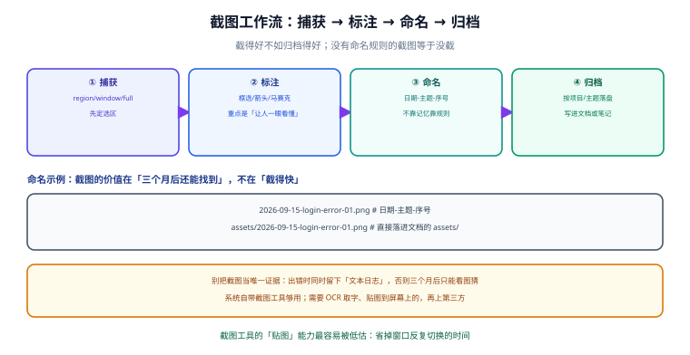

# 截图与标注

截图看似最没技术含量，实际是**技术工作流里最高频的"证据留痕"手段**：报 bug、写文档、做 code review、给同事解释问题，都要用。

但多数人的截图流程是断的——截完存在下载目录，文件名是 `QQ图片20260915xxxxxx.png`，三天后自己也找不到。这一页讲的是**捕获 → 标注 → 命名 → 归档**这条完整链路，以及如何让截图直接落进文档库。

## 1. 一句话定位

**截得好不如归档得好。** 一张三个月后还能被检索到的截图，价值是一张"截得快但现在找不到"的截图的十倍。



## 2. 四段链路

| 阶段 | 目标 | 关键决策 | 常见错误 |
| --- | --- | --- | --- |
| **① 捕获** | 拿到画面 | 选区 / 窗口 / 全屏 / 滚动截长图 | 直接全屏截，把无关信息（头像、内网地址）也截进去 |
| **② 标注** | 让人一眼看懂 | 框选、箭头、编号、马赛克 | 只截不标，发出去对方要问"看哪儿？" |
| **③ 命名** | 三个月后能搜到 | `日期-主题-序号` | 用工具默认名（时间戳），无检索价值 |
| **④ 归档** | 落在该在的位置 | 进项目 `assets/` 或笔记库附件目录 | 留在下载目录，最终被清理 |

::: tip 一句话理解
**捕获和标注决定"当下能不能沟通清"，命名和归档决定"三个月后能不能找到"。** 后者才是真正的成本大头——因为排查问题往往发生在几周之后。
:::

## 3. 捕获：用系统自带的就够

### 3.1 各平台原生能力

| 平台 | 快捷键 | 能力 |
| --- | --- | --- |
| Windows 10/11 | `Win + Shift + S` | 四项：矩形、任意形状、窗口、全屏；截完进剪贴板 + 通知中心历史 |
| Windows（全屏直存） | `Win + PrtScn` | 整屏存到 `图片\屏幕截图` |
| macOS | `Cmd + Shift + 4` | 选区（按住 `空格` 切窗口模式，按住 `Option` 从中心缩放） |
| macOS（录屏） | `Cmd + Shift + 5` | 截图 + 录屏一体化控制条 |
| Linux（GNOME） | `PrtScn` / `Shift+PrtScn` | 全屏 / 选区；配合 `gnome-screenshot` 命令行 |

::: warning 说明
Windows 的 `Win + Shift + S` 截完**进的是剪贴板**，不是文件。如果没有及时粘贴，内容会留在**剪贴板历史**里（需先开启 `Win + V`，见[剪贴板与输入效率](../Clipboard/index.md)）。想让它自动存文件，到 `设置 → 辅助功能 → 键盘` 里把"使用 Print Screen 键打开截图"打开。
:::

### 3.2 什么时候需要第三方工具

系统自带工具覆盖 90% 场景。以下情况才值得装：

| 需求 | 系统自带 | 建议 |
| --- | --- | --- |
| **OCR 取字**（把截图里的文字变成可复制文本） | 部分（Win11 的"文本操作"可 OCR，但入口深） | PowerToys Text Extractor（`Win + Shift + T`） |
| **贴图到屏幕**（截图钉在屏幕上做对照） | 无 | PowerToys / Snipaste |
| **滚动截长图** | Windows 无（macOS 无） | 浏览器自带（DevTools 截图）、第三方工具 |
| **录屏 + 转 GIF** | Windows 有 `Win + G`（Xbox Game Bar） | 需要 GIF 时用 ScreenToGif |

::: tip 一句话理解
**PowerToys 的 Text Extractor 是最被低估的一个功能**：`Win + Shift + T` 框选屏幕任意区域，文字直接进剪贴板。它把"看到报错 → 手敲报错去搜"变成了"框一下 → 直接粘进搜索框"。
:::

Windows 上批量用命令行捕获（自动化场景）：

```powershell
# 用 .NET 截全屏并存为 PNG（无需第三方工具）
Add-Type -AssemblyName System.Windows.Forms, System.Drawing
$b = [System.Windows.Forms.Screen]::PrimaryScreen.Bounds
$bmp = New-Object System.Drawing.Bitmap $b.Width, $b.Height
$g = [System.Drawing.Graphics]::FromImage($bmp)
$g.CopyFromScreen($b.Location, [System.Drawing.Point]::Empty, $b.Size)
$out = "D:\docs-website\docs\Tools\Efficiency\assets\2026-09-15-demo-01.png"
$bmp.Save($out, [System.Drawing.Imaging.ImageFormat]::Png)
$g.Dispose(); $bmp.Dispose()
Write-Host "已保存 $out"
```

macOS 命令行：

```shell
# -x 静音、-R 指定区域（x,y,w,h）
screencapture -x -R 0,0,1200,800 /tmp/2026-09-15-demo-01.png
# 截某个窗口（-l 窗口 id，需先拿到 id）
screencapture -x -l $(osascript -e 'tell app "Finder" to id of window 1') /tmp/win.png
```

## 4. 标注：目标是"让人一眼看懂"

标注不是"美化"，是**降低读者理解成本**。三个原则：

1. **一次只标一个重点**。多个重点就编号（①②③），不要画一堆箭头让人自己找。
2. **有顺序时用编号，无顺序时用框选**。表示流程用 `①→②→③`，表示"看这块"用红色矩形。
3. **敏感信息必须打码**。内网 IP、真实域名、员工姓名、Token、摄像头画面。

| 标注类型 | 用途 | 工具 |
| --- | --- | --- |
| 矩形框 | 圈出关注区域 | 系统截图工具自带（Win11 有）；Snipaste |
| 箭头 | 指出"点这里" / 流向 | 同上 |
| 文字 | 补充说明、写结论 | 同上 |
| 马赛克 / 模糊 | 遮蔽敏感信息 | 同上；**不要用纯色色块**（可能被还原） |
| 序号标记 | 多步骤说明 | PowerToys / Snipaste |

::: danger 注意：截图是数据泄露最常见的渠道之一
发截图前固定做三件事：
1. **看顶部标题栏**——有没有打开着与当前问题无关的文件名、客户名。
2. **看侧边栏 / 标签页**——浏览器与编辑器会把整个工作上下文暴露出来。
3. **看通知区域**——刚弹出的消息通知常带人名与内容，截图时正好录进去。

**打码用"模糊/马赛克"，不要用纯色矩形**：纯色块在某些渲染或转换流程下可以被移除，模糊是破坏性处理。
:::

## 5. 命名：不靠记忆，靠规则

统一的命名规则，是截图能被检索到的**唯一**前提。推荐格式：

```text
YYYY-MM-DD-主题-序号.png
```

```text
2026-09-15-login-error-01.png     # 报 bug 时的登录报错
2026-09-15-login-error-02.png     # 同一问题的第二张（比如点开后的详情）
2026-09-15-db-conn-timeout.png    # 无序号也允许，主题要能说明问题
```

三条规则：

| 规则 | 理由 |
| --- | --- |
| **日期在前** | 排序即时间线；同一目录按文件名排序就能看出事件顺序 |
| **主题用英文小写 + 连字符** | 跨平台安全（不依赖中文编码），也能直接用在 Markdown 路径里 |
| **序号补零（01、02）** | 避免 `10` 排在 `2` 前面 |

::: tip 一句话理解
**别在文件名里写"新建"、"截图"、"最终版"**。文件名的作用是三个月后你只看到文件名就能判断"要不要打开"。判断不了，就等于没有文件名。
:::

## 6. 归档：让截图直接落进文档

这是本页最重要的部分：**截图的终点不是"存下来"，是"被引用"**。

VitePress 文档库的约定（见 [AGENTS.md §7](../../../../AGENTS.md)）：每个主题的配图放在该主题目录下的 `assets/` 里，正文用**相对路径**引用。

```text
docs/Tools/Efficiency/
├── assets/
│   ├── screenshot-workflow.svg
│   └── 2026-09-15-login-error-01.png    ← 截图直接落在这里
└── Screenshot/
    └── index.md                          ← 正文用 ../assets/xxx.png 引用
```

正文引用（注意是 `../assets/`，因为页面在子目录里）。标准图片语法是「感叹号 + 方括号（替代文本）+ 圆括号（相对路径）」——**圆括号里只填路径**，例如：

```text
../assets/2026-09-15-login-error-01.png
```

主题首页（`Efficiency/index.md`）因为与 `assets/` 同级，圆括号里填：

```text
./assets/efficiency-logo.png
```

::: warning 说明
**路径写错是文档构建失败最常见的原因**。提交前用仓库的 `linkcheck.py` 检查相对链接（见[常见问题与最佳实践](../FAQ/index.md)），断链会直接导致构建报错。
:::

### 6.1 截图与文本日志必须配对

::: danger 注意：别把截图当唯一证据
截图里**没有可检索的文本**。三个月后你想搜"那个超时报错"，搜不到任何截图。

正确做法：**截图 + 文本日志配对留档**。

- 图：说明"长什么样"，用于快速辨认。
- 日志：说明"报了什么"，用于搜索与比对。

```powershell
# 出错时：把日志与截图一起落盘，命名保持一致
$stamp = "2026-09-15-db-conn-timeout"
Get-Content .\logs\app.log -Tail 200 | Set-Content ".\assets\$stamp.log"
# 截图另存为 $stamp.png —— 同名前缀，互为索引
```

这样在笔记或 issue 里写一行 `见 assets/2026-09-15-db-conn-timeout.{png,log}`，人和机器都能找到。
:::

## 7. 实战：30 秒完成一次"可归档"的截图

```text
① Win + Shift + S → 选「矩形」→ 框住报错区域（只框报错，别截整个屏幕）
② 在弹出的小窗里点「标注」→ 画一个红框 + 写一句结论（如「token 过期」）
③ Win + Shift + T（PowerToys OCR）→ 框选报错文字 → 直接粘进搜索框/日志文件
④ Ctrl+S 另存 → 文件名按 YYYY-MM-DD-主题-序号.png
⑤ 存到「对应主题的 assets/」目录，正文里引用
```

验收：三个月后，你在编辑器里搜主题关键词 `db-conn-timeout`，文件名、日志、正文引用**三处都能命中**。

## 8. 常见坑

| 现象 | 原因 | 解决 |
| --- | --- | --- |
| 截图后找不到文件 | `Win+Shift+S` 只进剪贴板 | 及时粘贴，或到通知中心的历史里找；或改为"PrtScn 打开截图" |
| 文档构建报错"图片不存在" | 相对路径写错（`./` 与 `../` 混用） | 子目录页面用 `../assets/`，主题首页用 `./assets/` |
| 截图里的文字搜不到 | 图片无文本层 | 同时留文本日志；或用 OCR（Text Extractor）转出文字 |
| 发出去的截图泄露了内网信息 | 截了整屏，带上了地址栏与侧边栏 | 只截必要区域；发前检查标题栏、侧边栏、通知 |
| 打码后被还原 | 用了纯色块而非模糊 | 用模糊/马赛克 |
| 截图文件名重复覆盖 | 同一天同一主题多次截图 | 加序号（`-01`、`-02`） |
| 截图显示不全（缩放被裁） | 高分屏 DPI 缩放导致尺寸不一致 | 在截图工具里显式设置捕获尺寸，或注明缩放比例 |
| 团队里截图风格各异 | 没有约定 | 把命名规则写进团队文档（本页即可作为模板） |

## 9. 参考与延伸

- [剪贴板与输入效率](../Clipboard/index.md)：截图 → 剪贴板 → 粘贴的完整链条
- [笔记与知识管理](../Notes/index.md)：截图在笔记库里的归档位置
- [实战：搭一套个人效率工具链](../Practice/index.md)：把截图环节接进整条链路
- [IDE 配置](../../IDE/index.md)：编辑器里的截图插件与粘贴图片自动落盘

官方文档：

- Windows 截图工具：[support.microsoft.com/windows/use-snipping-tool](https://support.microsoft.com/zh-cn/windows/%E4%BD%BF%E7%94%A8%E6%88%AA%E5%9B%BE%E5%B7%A5%E5%85%B7%E6%8D%95%E8%8E%B7%E5%B1%8F%E5%B9%95%E6%88%AA%E5%9B%BE-00246869-1843-655f-f220-97299b865f6b)
- PowerToys Text Extractor：[learn.microsoft.com/windows/powertoys/text-extractor](https://learn.microsoft.com/zh-cn/windows/powertoys/text-extractor)
- macOS 屏幕截图快捷键：[support.apple.com/guide/mac-help/mh26782/mac](https://support.apple.com/zh-cn/guide/mac-help/mh26782/mac)
- ScreenToGif：[github.com/NickeManarin/ScreenToGif](https://github.com/NickeManarin/ScreenToGif)
