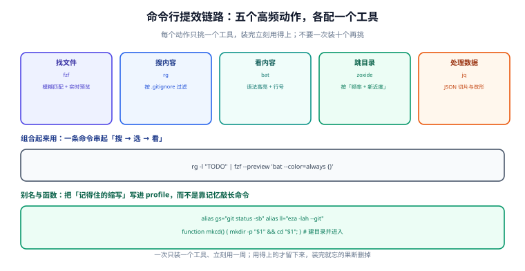

# 命令行提效

终端配好之后，下一个瓶颈是**手**：命令记不住、路径敲不准、输出看不清。这一页讲的是一组"一个工具只干一件事"的小工具，以及把它们串起来的组合用法。

原则很简单：**每个高频动作只配一个工具，装完立刻用一周；用得上的留下，用不上的删掉。**

## 1. 一句话定位

命令行提效不是"学更多命令"，而是**把每天重复的五个动作各缩短 5 秒**。一天 200 次操作，5 秒就是 16 分钟。

## 2. 五个高频动作与对应工具



| 动作 | 工具 | 一句话说明 | 当前版本（2026-09 核对） |
| --- | --- | --- | --- |
| 找文件 | **fzf** | 模糊查找器：把任何列表变成可搜索的选择器 | 0.74.3 / 2026-08-10 |
| 搜内容 | **ripgrep**（`rg`） | 按正则递归搜内容，默认遵守 `.gitignore` | 15.2.0（发行版打包）/ 2026-07-16 |
| 看内容 | **bat** | 带语法高亮、行号、Git 标记的 `cat` | 以官方 release 为准 |
| 跳目录 | **zoxide**（`z`） | 按"频率 + 新近度"记住你常去的目录 | 0.9.9 / 2026-01-31 |
| 处理数据 | **jq** | 命令行里的 JSON 切片器 | 以官方 release 为准 |

::: info 关于版本
`bat` 与 `jq` 的版本随发行版差异较大，本页不写死版本号；安装时以包管理器或官方 release 页为准（核对时间 2026-09）。`fzf` / `ripgrep` / `zoxide` 的行为差异已在下文标注。
:::

### 2.1 安装

```powershell
# Windows（winget）
winget install junegunn.fzf
winget install BurntSushi.ripgrep.MSVC
winget install sharkdp.bat
winget install ajeetdsouza.zoxide
winget install jqlang.jq
```

```shell
# macOS（Homebrew）
brew install fzf ripgrep bat zoxide jq

# Ubuntu / Debian（部分工具版本较旧，可按官方 release 装二进制）
sudo apt update && sudo apt install -y ripgrep bat jq fzf
```

验证：

```shell
fzf --version        # 期望 0.74.x
rg --version         # 期望 ripgrep 15.x
bat --version        # 期望 bat x.y.z
zoxide --version     # 期望 zoxide 0.9.x
jq --version         # 期望 jq-1.x
```

:::warning 说明
Ubuntu 上 `bat` 的可执行文件常被重命名为 `batcat`（与 `bacula-console-qt` 冲突），Debian 系可用 `alias bat='batcat'` 解决。
:::

## 3. 别名与函数：先把长命令变短

别名（alias）解决"记得住但敲得累"；函数（function）解决"要带参数或组合"。

### 3.1 PowerShell

```powershell [Microsoft.PowerShell_profile.ps1]
# 别名：只能做「换个名字」，不能带参数
Set-Alias which Get-Command

# 函数：要带参数就用函数
function gs  { git status -sb }
function gl  { git log --oneline --graph --decorate -20 }
function gd  { git diff --stat }
function mkcd($p) {
  New-Item -ItemType Directory -Path $p -Force | Out-Null
  Set-Location $p
}

# 给第三方工具起新名字（不要覆盖 ls/cat 这些内置别名）
function ll { eza -lah --git }
function cc { bat --style=plain --paging=never }
```

### 3.2 zsh / bash

```shell [~/.zshrc]
alias gs='git status -sb'
alias gl='git log --oneline --graph --decorate -20'
alias gd='git diff --stat'
alias ll='eza -lah --git'

mkcd() { mkdir -p "$1" && cd "$1"; }
```

::: danger 注意：别覆盖 `ls`、`cat`、`curl`
1. **`ls` / `cat` / `rm` / `curl` 在 PowerShell 里都是内置别名**（分别指向 `Get-ChildItem`、`Get-Content`、`Remove-Item`、`Invoke-WebRequest`）。覆盖它们会让脚本和 AI 生成的代码产生"看起来一样、行为不同"的问题。
2. **要给 `eza`/`bat` 起新名字**：`ll`、`cc`、`lsd` 都行，就是别叫 `ls`、`cat`。
3. **`alias` 不支持参数**。`alias gp='git push origin main'` 在 zsh/bash 里可以（因为没有参数），但 `alias gc='git commit -m'` 这种"半截命令"会让后面接的内容位置错乱——用函数写。
:::

## 4. fzf：把任何列表变成可搜索选择器

fzf 的定位很独特：**它不产生内容，它帮你选内容**。任何输出一行的命令都能接给它。

### 4.1 最小用法

```shell
# 从管道选一个
git branch --format='%(refname:short)' | fzf

# 从文件列表选一个并打开
rg --files | fzf --preview 'bat --color=always --line-range :120 {}'

# 查历史命令（Ctrl+R 的增强版，取决于 Shell 集成）
history | fzf
```

### 4.2 关键参数

| 参数 | 作用 | 建议 |
| --- | --- | --- |
| `--preview 'CMD'` | 右侧实时预览 | 配合 `bat` 看文件内容，配合 `git diff` 看改动 |
| `--preview-window` | 预览窗口位置与大小 | `right:60%:wrap` 是常用组合 |
| `--height 60%` | 不用全屏，占用下方 60% | 保留上下文，体验更好 |
| `--multi` | 允许选多项（Tab 标记） | 批量操作时必备 |
| `--bind` | 绑定事件到动作 | 见下方"结果确认"用法 |
| `--query` | 预设查询词 | 从当前词快速筛 |

### 4.3 组合：一条命令完成"搜 → 选 → 看"

```shell
# 搜索包含 TODO 的文件，选中后立刻用 bat 看内容
rg -l "TODO" | fzf --height 60% --preview 'bat --color=always {}'

# 选择 Git 分支并切换
git branch --format='%(refname:short)' | fzf --height 40% | xargs -r git switch
```

```powershell
# PowerShell 版本（注意管道传对象的差异，用 ForEach-Object）
git branch --format='%(refname:short)' | fzf --height 40% | ForEach-Object { git switch $_ }
```

:::tip 一句话理解
**fzf 的威力不在它自己，而在"它的左边可以接任何命令"。** 遇到"要从一堆东西里挑一个"的场景，第一反应应该是 `xxx | fzf`。
:::

## 5. ripgrep：搜内容的事实标准

### 5.1 为什么不用 `grep -r`

| 维度 | `grep -r` | `rg` |
| --- | --- | --- |
| 默认忽略 | 无（会搜 `node_modules`、`.git`） | 自动遵守 `.gitignore` |
| 速度 | 逐文件读，单线程为主 | 多线程 + 内存映射，通常快数倍 |
| 二进制文件 | 会输出乱码 | 默认跳过 |
| 输出 | 默认 `文件:行` | 分组显示、带行号与高亮 |
| 编码 | 需手动指定 | 自动处理 |

```shell
# 基础搜索
rg "Result<"                     # 当前目录递归搜
rg -i "todo"                     # 忽略大小写
rg -t java "RestController"      # 只在 Java 文件里搜
rg -g '!*.min.js' "console.log"  # 排除指定文件

# 只列文件名（配合 fzf 的黄金组合）
rg -l "TODO"

# 显示上下文
rg -C 3 "public Result"

# 统计每个文件的匹配数
rg -c "TODO"

# 搜所有文件（含被 gitignore 忽略的），并显示隐藏文件
rg -uu "config"

# 用正则替换预览（不写回文件）
rg -r "Controller" "RestController" -l
```

### 5.2 常用参数速查

| 参数 | 含义 |
| --- | --- |
| `-i` / `-s` | 忽略大小写 / 区分大小写 |
| `-l` | 只输出匹配的文件名 |
| `-c` | 只输出每个文件的匹配计数 |
| `-C N` / `-A N` / `-B N` | 上下文 N 行 / 后 N 行 / 前 N 行 |
| `-t <type>` | 只搜某类型文件（`rg --type-list` 查看全部） |
| `-g <glob>` | 包含/排除文件（`-g '!dist/**'`） |
| `-uu` | 不过滤：含隐藏文件与 gitignore 文件 |
| `--hidden` | 搜隐藏文件 |
| `-w` | 全词匹配 |
| `-v` | 反向匹配（不含该模式的行） |

::: warning 说明
ripgrep 15.x 起会把 `jj`（Jujutsu）仓库也当作版本控制仓库，遵守其 ignore 规则。如果你的仓库同时用 git 与 jj，注意 `--no-ignore-vcs` 的行为变化。
:::

## 6. bat：让输出可读

```shell
bat src/main/java/App.java              # 语法高亮 + 行号
bat -n file.txt                         # 只要行号
bat --style=plain file.txt              # 不要边框（适合作管道输入）
bat --paging=never file.txt             # 不分页
bat -r 100:200 big.log                  # 只看 100~200 行

# 与 fzf 组合（最重要的用法）
fzf --preview 'bat --color=always --style=numbers --line-range :120 {}'
```

`bat` 会替换 `cat` 用在**人看**的场景；脚本里读文件仍应用原生 `cat`/`Get-Content`，因为 `bat` 会加分页与装饰。

## 7. zoxide：目录跳转的"记忆"

zoxide 记录你 `cd` 过的目录，按 **frecency**（frequency + recency，频率 + 新近度）排序。

```shell
# 启用（各 Shell 选一行加入配置文件）
# PowerShell：Invoke-Expression (& { (zoxide init powershell | Out-String) })
# zsh：      eval "$(zoxide init zsh)"
# bash：     eval "$(zoxide init bash)"

z docs              # 跳到最匹配 "docs" 的目录
z web api           # 多关键词匹配（路径片段都出现即可）
zi                  # 交互式选择（需要 fzf）
z -                 # 回上一个目录（类似 cd -）
```

默认行为与 `cd` 无关，只是多了一个 `z`。若想用 `cd` 也走 zoxide，可用 `zoxide init zsh --cmd cd`，但**不建议**：它会让"字面路径"的行为变得不确定，导致脚本与文档里的 `cd` 命令结果不一致。

:::tip 一句话理解
**让 zoxide 当记忆，不要让 `cd` 当猜测。** 保留 `cd` 的原义（字面路径），只用 `z` 走加速路径。
:::

## 8. jq：JSON 处理

```shell
# 读接口返回值里的字段
curl -s http://localhost:8080/api/users | jq '.data.records[].username'

# 只看状态码
curl -s http://localhost:8080/api/users | jq '.code'

# 格式化打印（-r 去掉字符串引号）
jq -r '.data.accessToken' token.json

# 排序后输出（用于契约快照比对，避免字段顺序抖动）
jq -S . openapi.json > openapi.sorted.json

# 过滤数组元素
jq '.data.records[] | select(.status == 1)' resp.json

# 查看 JSON 结构（只看键名）
jq 'paths | map(tostring) | join(".")' openapi.json | head -20
```

| 参数 | 作用 |
| --- | --- |
| `-r` | 输出原始字符串（不带引号） |
| `-c` | 紧凑输出（单行） |
| `-S` | 对象键排序（**做 diff 必用**） |
| `-e` | 根据结果设置退出码（可用于脚本判断） |
| `.a.b // "默认值"` | 取不到时给默认值 |

在 PowerShell 里也可以不装 jq：

```powershell
$r = Invoke-RestMethod http://localhost:8080/api/users
$r.data.records | Select-Object -First 5 username
```

## 9. 实战：一天的命令行工作流

以在一个 Java 后端项目里排查"登录接口返回 401"为例：

```shell
# ① 定位：搜所有与 JWT 校验相关的位置
rg -l "JwtAuthenticationFilter|EXPIRED|jwt" --type java

# ② 选文件：从结果里模糊选出最可能的那一个，并预览
rg -l "jwt" --type java | fzf --height 60% --preview 'bat --color=always --line-range :120 {}'

# ③ 看内容：搜出关键行与上下文
rg -C 4 "EXPIRED|expired" --type java

# ④ 跳目录：切到配置目录核对密钥配置
z resources

# ⑤ 验证：实际调接口，用 jq 只取需要看的字段
curl -s -o /dev/null -w "%{http_code}\n" http://localhost:8080/api/users
curl -s -X POST http://localhost:8080/api/auth/login \
  -H 'Content-Type: application/json' \
  -d '{"username":"admin","password":"Admin@123"}' | jq '.code, .message'
```

这套流程的价值在于：**全程不用离开键盘，也不用打开图形化搜索**。对比"打开 IDE → 全局搜索 → 双击结果 → 复制路径 → 打开终端 → cd"，至少省 30 秒，而这类操作一天会发生几十次。

## 10. 验证方式

配置完成后逐条验证：

```shell
# 1. 别名与函数生效（Python 示例，按你的 profile 替换）
gs && gl
# 期望：输出精简的 git 状态与 20 行内的提交图

# 2. fzf 能找到文件并预览
rg --files | fzf --height 40%
# 期望：出现可搜索列表，右侧有语法高亮的预览

# 3. ripgrep 遵守 gitignore
rg "node_modules" -c
# 期望：无输出或极少匹配（因为 node_modules 被忽略）

# 4. zoxide 记录生效（需先 cd 过几次）
z --list
# 期望：列出按 frecency 排序的目录

# 5. jq 能解析并排序
echo '{"b":1,"a":2}' | jq -S .
# 期望：{"a":2,"b":1}
```

| 检查项 | 期望结果 |
| --- | --- |
| `fzf --version` | 0.74.x |
| `rg --version` | ripgrep 15.x |
| `zoxide --version` | 0.9.x |
| `rg` 是否忽略 `node_modules` | 是 |
| `z <关键词>` 能否跳转 | 能（且明显比逐级 `cd` 快） |

## 11. 常见坑

| 现象 | 原因 | 解决 |
| --- | --- | --- |
| `bat` 命令不存在 | Debian 系重命名为 `batcat` | `alias bat='batcat'` |
| `rg` 搜不到被忽略的文件 | 默认遵守 `.gitignore` | 加 `-uu` 或 `--no-ignore` |
| `fzf` 在管道里没有输出 | 上游命令无输出或输出到 stderr | 先单独跑上游命令确认有输出 |
| `fzf` 预览窗乱码 | 预览命令没有 `--color=always` | 加参数，并让 `bat` 输出彩色 |
| `z` 跳错目录 | 关键词太短，命中多个 | 用 `zi` 交互选择，或加更多路径片段 |
| `jq` 报 `parse error` | 输入不是合法 JSON（含日志前缀） | 用 `rg '^\{'` 先剥离前缀，或 `jq -R 'fromjson?'` |
| `jq -S` 后 diff 仍有差异 | 数值格式化差异（`1` vs `1.0`） | 比对脚本改用结构化比对，或容忍数值格式 |
| PowerShell 管道接 fzf 报错 | PowerShell 传对象而非文本 | 用 `| Out-String -Stream` 或 `ForEach-Object` |

::: danger 注意：三个最容易踩的坑
1. **覆盖 `cat`/`ls`/`curl`**。见第 3 节的说明：起新名字，别覆盖内置。
2. **把 fzf 写进脚本**。fzf 是**交互式**工具，需要 TTY；在 CI 或非交互脚本里会挂住。脚本里要判断，用 `rg -q`（有匹配返回 0）。
3. **`rg` 的正则默认不是 PCRE**。要用 `\d`、环视等高级语法，需加 `-P`（PCRE2），且注意 `-P` 会禁用部分优化，大仓库里明显变慢。
:::

## 12. 参考资料

- fzf 官方仓库与用法示例：[github.com/junegunn/fzf](https://github.com/junegunn/fzf)
- ripgrep 用户指南：[github.com/BurntSushi/ripgrep/blob/master/GUIDE.md](https://github.com/BurntSushi/ripgrep/blob/master/GUIDE.md)
- bat 官方仓库：[github.com/sharkdp/bat](https://github.com/sharkdp/bat)
- zoxide 官方仓库与迁移说明：[github.com/ajeetdsouza/zoxide](https://github.com/ajeetdsouza/zoxide)
- jq 手册：[jqlang.github.io/jq/manual](https://jqlang.github.io/jq/manual/)
- 相关页面：[终端与 Shell 环境](../Terminal/index.md) / [桌面与任务自动化](../Automation/index.md) / [实战：搭一套个人效率工具链](../Practice/index.md)
