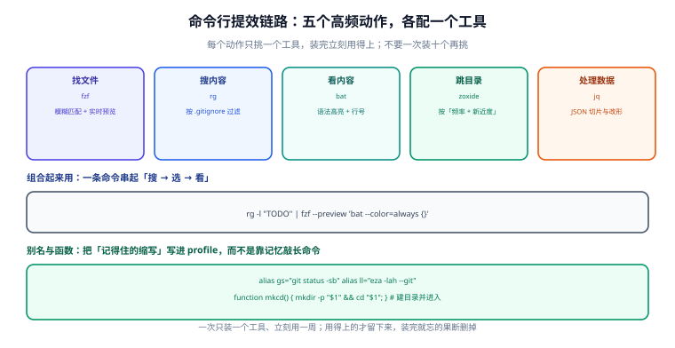
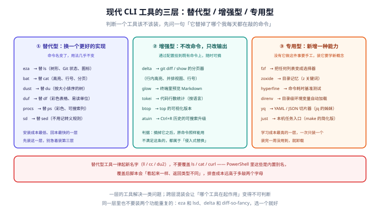

# 命令行提效与现代 CLI

终端配好之后，下一个瓶颈是**手**：命令记不住、路径敲不准、输出看不清。这一页讲的是一组"一个工具只干一件事"的小工具，以及把它们串起来的组合用法；第 9~11 节再往下讲**第二梯队工具**、**测量方法**与**管道工程化**。

原则很简单：**每个高频动作只配一个工具，装完立刻用一周；用得上的留下，用不上的删掉。**

## 1. 一句话定位

命令行提效不是"学更多命令"，而是**把每天重复的五个动作各缩短 5 秒**。一天 200 次操作，5 秒就是 16 分钟。

## 2. 五个高频动作与对应工具



| 动作 | 工具 | 一句话说明 | 当前版本（2026-09 核对） |
| --- | --- | --- | --- |
| 找文件 | **fzf** | 模糊查找器：把任何列表变成可搜索的选择器 | 0.74.3 / 2026-08-10 |
| 搜内容 | **ripgrep**（`rg`） | 按正则递归搜内容，默认遵守 `.gitignore` | 15.2.0（发行版打包）/ 2026-07-16 |
| 看内容 | **bat** | 带语法高亮、行号、Git 标记的 `cat` | 以官方 release 为准 |
| 跳目录 | **zoxide**（`z`） | 按"频率 + 新近度"记住你常去的目录 | 0.9.9 / 2026-01-31 |
| 处理数据 | **jq** | 命令行里的 JSON 切片器 | 以官方 release 为准 |

::: info 关于版本
`bat` 与 `jq` 的版本随发行版差异较大，本页不写死版本号；安装时以包管理器或官方 release 页为准（核对时间 2026-09）。`fzf` / `ripgrep` / `zoxide` 的行为差异已在下文标注。
:::

### 2.1 安装

```powershell
# Windows（winget）
winget install junegunn.fzf
winget install BurntSushi.ripgrep.MSVC
winget install sharkdp.bat
winget install ajeetdsouza.zoxide
winget install jqlang.jq
```

```shell
# macOS（Homebrew）
brew install fzf ripgrep bat zoxide jq

# Ubuntu / Debian（部分工具版本较旧，可按官方 release 装二进制）
sudo apt update && sudo apt install -y ripgrep bat jq fzf
```

验证：

```shell
fzf --version        # 期望 0.74.x
rg --version         # 期望 ripgrep 15.x
bat --version        # 期望 bat x.y.z
zoxide --version     # 期望 zoxide 0.9.x
jq --version         # 期望 jq-1.x
```

:::warning 说明
Ubuntu 上 `bat` 的可执行文件常被重命名为 `batcat`（与 `bacula-console-qt` 冲突），Debian 系可用 `alias bat='batcat'` 解决。
:::

## 3. 别名与函数：先把长命令变短

别名（alias）解决"记得住但敲得累"；函数（function）解决"要带参数或组合"。

### 3.1 PowerShell

```powershell [Microsoft.PowerShell_profile.ps1]
# 别名：只能做「换个名字」，不能带参数
Set-Alias which Get-Command

# 函数：要带参数就用函数
function gs  { git status -sb }
function gl  { git log --oneline --graph --decorate -20 }
function gd  { git diff --stat }
function mkcd($p) {
  New-Item -ItemType Directory -Path $p -Force | Out-Null
  Set-Location $p
}

# 给第三方工具起新名字（不要覆盖 ls/cat 这些内置别名）
function ll { eza -lah --git }
function cc { bat --style=plain --paging=never }
```

### 3.2 zsh / bash

```shell [~/.zshrc]
alias gs='git status -sb'
alias gl='git log --oneline --graph --decorate -20'
alias gd='git diff --stat'
alias ll='eza -lah --git'

mkcd() { mkdir -p "$1" && cd "$1"; }
```

::: danger 注意：别覆盖 `ls`、`cat`、`curl`
1. **`ls` / `cat` / `rm` / `curl` 在 PowerShell 里都是内置别名**（分别指向 `Get-ChildItem`、`Get-Content`、`Remove-Item`、`Invoke-WebRequest`）。覆盖它们会让脚本和 AI 生成的代码产生"看起来一样、行为不同"的问题。
2. **要给 `eza`/`bat` 起新名字**：`ll`、`cc`、`lsd` 都行，就是别叫 `ls`、`cat`。
3. **`alias` 不支持参数**。`alias gp='git push origin main'` 在 zsh/bash 里可以（因为没有参数），但 `alias gc='git commit -m'` 这种"半截命令"会让后面接的内容位置错乱——用函数写。
:::

## 4. fzf：把任何列表变成可搜索选择器

fzf 的定位很独特：**它不产生内容，它帮你选内容**。任何输出一行的命令都能接给它。

### 4.1 最小用法

```shell
# 从管道选一个
git branch --format='%(refname:short)' | fzf

# 从文件列表选一个并打开
rg --files | fzf --preview 'bat --color=always --line-range :120 {}'

# 查历史命令（Ctrl+R 的增强版，取决于 Shell 集成）
history | fzf
```

### 4.2 关键参数

| 参数 | 作用 | 建议 |
| --- | --- | --- |
| `--preview 'CMD'` | 右侧实时预览 | 配合 `bat` 看文件内容，配合 `git diff` 看改动 |
| `--preview-window` | 预览窗口位置与大小 | `right:60%:wrap` 是常用组合 |
| `--height 60%` | 不用全屏，占用下方 60% | 保留上下文，体验更好 |
| `--multi` | 允许选多项（Tab 标记） | 批量操作时必备 |
| `--bind` | 绑定事件到动作 | 见下方"结果确认"用法 |
| `--query` | 预设查询词 | 从当前词快速筛 |

### 4.3 组合：一条命令完成"搜 → 选 → 看"

```shell
# 搜索包含 TODO 的文件，选中后立刻用 bat 看内容
rg -l "TODO" | fzf --height 60% --preview 'bat --color=always {}'

# 选择 Git 分支并切换
git branch --format='%(refname:short)' | fzf --height 40% | xargs -r git switch
```

```powershell
# PowerShell 版本（注意管道传对象的差异，用 ForEach-Object）
git branch --format='%(refname:short)' | fzf --height 40% | ForEach-Object { git switch $_ }
```

:::tip 一句话理解
**fzf 的威力不在它自己，而在"它的左边可以接任何命令"。** 遇到"要从一堆东西里挑一个"的场景，第一反应应该是 `xxx | fzf`。
:::

## 5. ripgrep：搜内容的事实标准

### 5.1 为什么不用 `grep -r`

| 维度 | `grep -r` | `rg` |
| --- | --- | --- |
| 默认忽略 | 无（会搜 `node_modules`、`.git`） | 自动遵守 `.gitignore` |
| 速度 | 逐文件读，单线程为主 | 多线程 + 内存映射，通常快数倍 |
| 二进制文件 | 会输出乱码 | 默认跳过 |
| 输出 | 默认 `文件:行` | 分组显示、带行号与高亮 |
| 编码 | 需手动指定 | 自动处理 |

```shell
# 基础搜索
rg "Result<"                     # 当前目录递归搜
rg -i "todo"                     # 忽略大小写
rg -t java "RestController"      # 只在 Java 文件里搜
rg -g '!*.min.js' "console.log"  # 排除指定文件

# 只列文件名（配合 fzf 的黄金组合）
rg -l "TODO"

# 显示上下文
rg -C 3 "public Result"

# 统计每个文件的匹配数
rg -c "TODO"

# 搜所有文件（含被 gitignore 忽略的），并显示隐藏文件
rg -uu "config"

# 用正则替换预览（不写回文件）
rg -r "Controller" "RestController" -l
```

### 5.2 常用参数速查

| 参数 | 含义 |
| --- | --- |
| `-i` / `-s` | 忽略大小写 / 区分大小写 |
| `-l` | 只输出匹配的文件名 |
| `-c` | 只输出每个文件的匹配计数 |
| `-C N` / `-A N` / `-B N` | 上下文 N 行 / 后 N 行 / 前 N 行 |
| `-t <type>` | 只搜某类型文件（`rg --type-list` 查看全部） |
| `-g <glob>` | 包含/排除文件（`-g '!dist/**'`） |
| `-uu` | 不过滤：含隐藏文件与 gitignore 文件 |
| `--hidden` | 搜隐藏文件 |
| `-w` | 全词匹配 |
| `-v` | 反向匹配（不含该模式的行） |

::: warning 说明
ripgrep 15.x 起会把 `jj`（Jujutsu）仓库也当作版本控制仓库，遵守其 ignore 规则。如果你的仓库同时用 git 与 jj，注意 `--no-ignore-vcs` 的行为变化。
:::

## 6. bat：让输出可读

```shell
bat src/main/java/App.java              # 语法高亮 + 行号
bat -n file.txt                         # 只要行号
bat --style=plain file.txt              # 不要边框（适合作管道输入）
bat --paging=never file.txt             # 不分页
bat -r 100:200 big.log                  # 只看 100~200 行

# 与 fzf 组合（最重要的用法）
fzf --preview 'bat --color=always --style=numbers --line-range :120 {}'
```

`bat` 会替换 `cat` 用在**人看**的场景；脚本里读文件仍应用原生 `cat`/`Get-Content`，因为 `bat` 会加分页与装饰。

## 7. zoxide：目录跳转的"记忆"

zoxide 记录你 `cd` 过的目录，按 **frecency**（frequency + recency，频率 + 新近度）排序。

```shell
# 启用（各 Shell 选一行加入配置文件）
# PowerShell：Invoke-Expression (& { (zoxide init powershell | Out-String) })
# zsh：      eval "$(zoxide init zsh)"
# bash：     eval "$(zoxide init bash)"

z docs              # 跳到最匹配 "docs" 的目录
z web api           # 多关键词匹配（路径片段都出现即可）
zi                  # 交互式选择（需要 fzf）
z -                 # 回上一个目录（类似 cd -）
```

默认行为与 `cd` 无关，只是多了一个 `z`。若想用 `cd` 也走 zoxide，可用 `zoxide init zsh --cmd cd`，但**不建议**：它会让"字面路径"的行为变得不确定，导致脚本与文档里的 `cd` 命令结果不一致。

:::tip 一句话理解
**让 zoxide 当记忆，不要让 `cd` 当猜测。** 保留 `cd` 的原义（字面路径），只用 `z` 走加速路径。
:::

## 8. jq：JSON 处理

```shell
# 读接口返回值里的字段
curl -s http://localhost:8080/api/users | jq '.data.records[].username'

# 只看状态码
curl -s http://localhost:8080/api/users | jq '.code'

# 格式化打印（-r 去掉字符串引号）
jq -r '.data.accessToken' token.json

# 排序后输出（用于契约快照比对，避免字段顺序抖动）
jq -S . openapi.json > openapi.sorted.json

# 过滤数组元素
jq '.data.records[] | select(.status == 1)' resp.json

# 查看 JSON 结构（只看键名）
jq 'paths | map(tostring) | join(".")' openapi.json | head -20
```

| 参数 | 作用 |
| --- | --- |
| `-r` | 输出原始字符串（不带引号） |
| `-c` | 紧凑输出（单行） |
| `-S` | 对象键排序（**做 diff 必用**） |
| `-e` | 根据结果设置退出码（可用于脚本判断） |
| `.a.b // "默认值"` | 取不到时给默认值 |

在 PowerShell 里也可以不装 jq：

```powershell
$r = Invoke-RestMethod http://localhost:8080/api/users
$r.data.records | Select-Object -First 5 username
```

## 9. 第二梯队：现代 CLI 工具矩阵

第 2~8 节讲的五个工具（fzf / rg / bat / zoxide / jq）覆盖了"找、搜、看、跳、处理"五个动作，可以理解成第一梯队。**这一节讲第二梯队**：它们不是全新能力，而是"更顺手地做本来就在做的事"。



### 9.1 三层判据：先问"它替掉了哪条命令"

| 层 | 判据 | 风险 | 建议顺序 |
| --- | --- | --- | --- |
| **① 替代型** | 它替掉了一条你**每天都在敲**的命令 | 几乎无风险（命令名不同，用法相近） | **最先装**，回本最快 |
| **② 增强型** | 它不改命令，只改**输出**（通过配置挂上去） | 低（配置里一行，随时摘掉） | 第二优先，摘装都不留痕 |
| **③ 专用型** | 它是一种**新能力**，没有它这件事要手工做 | 中（要学新概念，可能装了不用） | **一次只装一个**，用一周再决定 |

::: tip 一句话理解
**"装了但不知道什么时候用"是效率工具的头号浪费。** 用上面这张表筛一遍：说不清它替掉了哪条命令、或摘掉之后原命令能不能照用的，一律先放待办。
:::

### 9.2 工具清单与当前版本

下表版本按各项目官方 GitHub Release 页核对（**核对时间 2026-10**）；这类工具迭代快，安装时以包管理器或官方 release 页为准。

| 工具 | 层 | 一句话 | 版本 / 日期 |
| --- | --- | --- | --- |
| **eza** | ① 替代 `ls` | 树形、Git 状态、图标、按字段排序 | 0.23.5 / 2026-07-09 |
| **dust** | ① 替代 `du` | 按大小排序的目录树，一眼看出谁占地方 | 1.2.6 / 2026-09-16 |
| **duf** | ① 替代 `df` | 彩色表格 + 易读单位 + 多挂载点分组 | 0.9.1 / 2025-09-08 |
| **procs** | ① 替代 `ps` | 彩色、默认显示常用列、支持搜索与排序 | 0.14.12 / 2026-06-25 |
| **sd** | ① 替代 `sed` 的替换场景 | 不用记转义规则，先预览再落盘 | 1.1.0 / 2026-02-25 |
| **delta** | ② 增强 `git diff` | 行内高亮、并排视图、行号（挂在 Git 配置里） | 0.19.2 / 2026-03-28 |
| **btop** | ② 增强 `top` | 图形化 CPU/内存/磁盘/网络，支持鼠标 | 1.4.7 / 2026-05-01 |
| **tokei** | ② 增强"数代码" | 按语言统计行数/注释/空白 | 15.0.0 / 2026-09-06 |
| **glow** | ② 增强"读 Markdown" | 终端里渲染 Markdown，适合读 README | 3.0.0 / 2026-08-11 |
| **atuin** | ② 增强 `Ctrl+R` | Shell 历史入库，可全文搜索、可同步 | 18.23.0 / 2026-09-22 |
| **hyperfine** | ③ 新能力 | 命令耗时基准测试（见第 10 节） | 1.20.0 / 2025-11-18 |
| **direnv** | ③ 新能力 | 进入目录自动加载 `.envrc`，离开自动卸载 | 2.37.1 / 2025-07-20 |
| **yq** | ③ 新能力 | YAML/XML/JSON 的 jq（配置文件的切片器） | 4.54.1 / 2026-09-29 |
| **just** | ③ 新能力 | 本机任务入口，`just <任务名>` 代替翻脚本 | 1.58.0 / 2026-08-03 |
| **lazygit** | ③ 新能力 | 终端里的 Git TUI，暂存/拣选/交互式 rebase | 0.65.1 / 2026-09-13 |
| **zellij** | ③ 新能力 | 会话复用，带快捷键提示栏（与 tmux 的取舍见[终端页 7.7](../Terminal/index.md)） | 0.45.1 / 2026-08-28 |

```powershell
# Windows：winget（部分包名不同，先 search 再 install）
winget install eza-community.eza
winget install dandavison.delta
winget install bootandy.dust
winget install muesli.duf
winget install dalance.procs
winget install aristocratos.btop4win
winget install ClementTsang.disko         # dust / duf 的 Windows 替代，见 9.4
```

```shell
# macOS
brew install eza git-delta dust duf procs btop tokei glow atuin hyperfine direnv yq sd just lazygit

# Linux：部分工具走 cargo 或官方二进制最稳（发行版版本常常落后）
cargo install --locked du-dust duf procs sd tokei
```

### 9.3 三个最值得先装的

::: tip 一句话理解
第二梯队里"回本最快"的三个是 **eza（替 ls）、delta（增强 diff）、dust（替 du）**——它们分别对应"每次列目录""每次看改动""每次查磁盘"这三件几乎每天都会做的事。
:::

```shell
# eza：最常用的四个形态
eza -lah --git --group-directories-first    # 长格式 + 大小易读 + Git 状态 + 目录优先
eza --tree --level=2 --ignore-glob='node_modules|dist'   # 两层树，跳过噪音目录
eza -lah --sort=size --reverse | head -20   # 当前目录最大的 20 个
eza -lah --time-style=long-iso -s modified  # 按修改时间排序

# delta：挂进 Git 配置（一次配置，之后所有 diff 都变好看）
git config --global core.pager delta
git config --global interactive.diffFilter 'delta --color-only'
git config --global delta.navigate true --bool            # n/N 在 diff 块间跳
git config --global delta.side-by-side true --bool
git config --global delta.line-numbers true --bool

# dust：谁占了磁盘
dust -d 2            # 只展开两层，输出不至于刷屏
dust -n 20 /var/log  # 只看最大的 20 项
```

::: danger 注意：替代型工具的三条纪律
1. **不要覆盖原命令名**。`alias ls='eza'` / `Set-Alias ls eza` 会让脚本与 AI 生成代码"看起来一样、返回类型不同"。用新名字（`ll` / `lt`）→ 详见[终端页的别名纪律](../Terminal/index.md)。
2. **`delta` 会改变 `git diff` 的管道行为**。它作为 pager 是"人能看"的；**脚本里判断 diff 结果要加 `--no-pager`**，否则拿到的是带 ANSI 颜色的文本。
3. **`sd` 直接改文件**。默认就是原地替换，先用 `--preview` 看一遍再执行——它比 `sed -i` 顺手，但也同样不可逆。
:::

### 9.4 两类不该装的

| 类型 | 为什么不该装 | 例子 |
| --- | --- | --- |
| **功能完全重叠的两个** | 快捷键与配置会互相干扰，"哪个在起作用"变得不可判断 | eza + lsd、delta + diff-so-fancy、dust + ncdu（都可，但别同时用） |
| **你要用的机器上装不上的** | 跳板机、容器基础镜像、CI runner 往往只有 GNU coreutils | 在服务器上依赖 `eza` / `dust`；直接用 `ls -lah` / `du -sh * \| sort -h` 更稳 |

::: warning 说明
**"本机好看"与"到处能跑"是两件事。** 本机（Windows / macOS）可以尽情装替代型工具；**写进脚本、写进 CI、写进服务器操作手册的命令，一律用 POSIX/GNU 基础命令**——这不是保守，是因为那些环境不一定有你的 dotfiles。
:::

### 9.5 把它们串起来：一次"盘点目录"的完整动作

```shell
# 场景：接手一个陌生仓库，想 3 分钟内知道「它有多大、什么语言、哪些文件最近在动」
tokei . --exclude node_modules,dist,target          # ① 语言与行数分布
dust -d 2                                           # ② 体积集中在哪
eza --tree --level=2 -I 'node_modules|dist|target'  # ③ 结构概览
eza -lah -s modified --reverse | head -15           # ④ 最近在动的文件
rg -c '^$' --type-not '' -g '!node_modules' | wc -l  # ⑤ 附：有多少个文件非空
```

验证方式：

| 检查项 | 命令 | 期望 |
| --- | --- | --- |
| eza 生效 | `eza --version` | 0.23.x |
| delta 挂在 Git 上 | `git config --get core.pager` | `delta` |
| delta 不影响脚本 | `git --no-pager diff --stat` | 无 ANSI 颜色字符 |
| dust 输出可控 | `dust -d 1 \| wc -l` | 行数在 20 以内（不是刷屏） |

## 10. 测量：`time` 不够用时的 hyperfine

"这个工具比那个快"是命令行里最常被随口断言、也最少被真正测量的话。`time` 只能测一次，而**单次测量在有缓存的机器上几乎必然骗人**。

```shell
# 安装后先看它能做什么
hyperfine --version      # 期望 1.20.x

# 最小用法：跑 10 次取统计（默认就是 10 次，并自动预热 3 次）
hyperfine 'rg TODO --files-with-matches' 'grep -rl TODO .'

# 关键参数
hyperfine --warmup 3 --runs 20 \
  --prepare 'sync; echo 3 | sudo tee /proc/sys/vm/drop_caches' \
  'rg -c TODO'

# 测"命令本身"而不是"Shell 启动"：排除 Shell 开销
hyperfine --shell=none '/path/to/binary --flag'

# 导出为 JSON 做对比（便于进 CI 或画图）
hyperfine --export-json bench.json 'cmd-a' 'cmd-b'
```

| 参数 | 作用 | 什么时候必须用 |
| --- | --- | --- |
| `--warmup N` | 先空跑 N 次不计入统计 | **总是要用**：第一次运行往往在冷缓存里 |
| `--runs N` | 正式测量次数（默认 10） | 结果抖动大时加大 |
| `--prepare CMD` | 每次运行前执行的准备命令 | 需要清缓存、重置状态、重建测试数据时 |
| `--shell=none` | 不经过 Shell 直接执行 | 想测二进制本身的耗时，排除 Shell 解析开销 |
| `--export-json` | 导出结构化结果 | 要把基准结果留档或对比时 |

::: danger 注意：三个让基准测试变成骗局的坑
1. **只看最快的一次（`min`）**。报告里有 mean / median / min / max / σ——**看 σ（标准差）**。σ 接近均值的测量说明环境噪声大到结论不可用（常见原因：别的进程在跑、机器在降频、测试数据不足）。
2. **用内存缓存里的数据测磁盘工具**。测 `rg` / `dust` / `git status` 这类吃 I/O 的工具，必须用 `--prepare` 清缓存，否则测的是"文件系统缓存有多快"，不是工具本身。
3. **用一次结果推翻结论**。两次测量的差异必须**大于噪声**才算差异——和第 2 节"回本周期"一样，先看判据再看结论。
:::

::: warning 说明
**不要把 hyperfine 的结论写进"性能对比"结论里就完事。** 它的价值是**发现你自己环境里的异常**（某个工具在你机器上慢了 10 倍，通常是因为配置错了，不是工具差）。跨机器的性能对比需要受控环境，本页不做这件事。
:::

## 11. 管道工程化：xargs、并行与安全

"一条命令能跑通"和"一条命令在 10 万个文件、文件名带空格的环境里还能跑通"是两回事。

### 11.1 `xargs` 的四个必用参数

```shell
# ① 用 NUL 分隔：处理含空格、含换行的文件名（最容易被忽略的一条）
find . -name '*.log' -print0 | xargs -0 rm -f

# ② 每批并行执行（-P）：把串行变成并行
find . -name '*.png' -print0 | xargs -0 -n 1 -P "$(nproc)" pngquant --force --ext .png

# ③ -I 占位符：把参数放到命令中间（注意 -I 会隐含"-n 1"，批量优势消失）
rg -l 'TODO' --type md | xargs -I{} sed -i '' 's/TODO/DONE/' {}   # macOS；Linux 用 -i

# ④ 默认行为要改：没输入时不要跑一次空命令
rg -l 'never-match' | xargs -r echo "有匹配"      # -r / --no-run-if-empty
```

| 参数 | 含义 | 忘记它的后果 |
| --- | --- | --- |
| `-0` | 输入按 NUL 分隔 | 文件名含空格时被拆成两条路径，`rm` 删错东西 |
| `-n N` | 每次传给命令 N 个参数 | 参数过长触发 `Argument list too long` |
| `-P N` | 并行 N 个进程 | 串行处理成千上万个文件时白等 |
| `-r` | 无输入时不执行 | 上游无输出时仍跑一次空命令（对删除类命令很危险） |
| `-I {}` | 替换占位符 | 参数需要出现在中间位置时无法表达 |

::: danger 注意：`xargs` 与删除类命令组合时的顺序
**先打印，再删除。** 把 `rm` 换成 `echo` 跑一遍，确认输出恰好是你要删的那批文件，再换回去：

```shell
find . -name '*.tmp' -print0 | xargs -0 -r -n 1 echo      # 第一步：只打印
find . -name '*.tmp' -print0 | xargs -0 -r -n 1 ls -l     # 第二步：确认属性
find . -name '*.tmp' -print0 | xargs -0 -r -n 1 rm -f     # 第三步：才真的删
```
:::

### 11.2 GNU Parallel 与 `xargs -P` 的取舍

| 维度 | `xargs -P` | GNU Parallel |
| --- | --- | --- |
| 可用性 | 几乎无处不在（busybox 也有） | 需要额外安装，脚本里不保证存在 |
| 输出 | 多进程输出会互相穿插 | 默认按任务加锁输出，不穿插 |
| 失败处理 | 不感知单个任务的失败 | 有 `--halt`、`--joblog`、可重试 |
| 进度 | 无 | `--bar` / `--eta` |
| 适合 | **一次性的批量操作** | **需要留痕、需要失败语义的批量任务** |

```shell
# GNU Parallel：要留 joblog 与失败即停时用它
ls *.png | parallel --bar --joblog /tmp/joblog --halt soon,fail=1 pngquant --ext .png --force
```

::: tip 一句话理解
**默认用 `xargs -P`：它到处都有。** 只有当你要"每个任务的日志/退出码/重试"时才上 GNU Parallel——**判据是"这次批量的失败能不能被忽略"，而不是"哪个更高级"**。
:::

### 11.3 并行度与环境瓶颈

并行不是越大越快，**先判断瓶颈在哪**：

| 瓶颈 | 表现 | 并行度的正确取法 |
| --- | --- | --- |
| CPU | `top` 里单核跑满、`iowait` 低 | `-P "$(nproc)"`（或 `nproc - 1`，给系统留一个核） |
| 磁盘 I/O | `iowait` 高、吞吐不随并行度上升 | 并行度压到 **4 以下**，机械盘用 1~2 |
| 网络 | 吞吐卡在带宽、延迟成主导 | 并行度按**带宽 ÷ 单请求大小 × 8** 粗估，再加连接数上限 |
| 内存 | 并行后开始 swap | 先减小并行度，再考虑减单任务内存 |

```shell
# 观察 I/O 与 CPU 的分工（Linux）
iostat -x 2 5     # 看 %util 与 await：接近 100% / 高 await 说明磁盘是瓶颈
vmstat 2 5        # 看 r（运行队列）与 wa（等待 I/O）
```

### 11.4 管道里的退出码：`pipefail`

```shell
# 默认行为：管道的退出码是「最后一个命令」的退出码
rg 'pattern' bigfile | head -1
echo $?          # 即使 rg 失败（比如文件不存在），也可能返回 0 —— 因为 head 成功了

# 打开 pipefail：任一环节失败，整条管道就失败
set -o pipefail
```

```shell
# 脚本里的固定开场（三件套）
set -euo pipefail
# -e 任一命令失败即退出
# -u 使用未定义变量即报错（防拼错的变量名静默变空）
# -o pipefail 管道中任一环节失败即整体失败

# 需要"允许失败"的地方显式写清楚
if ! rg -q 'pattern' "$f"; then
  echo "no match in $f" >&2      # 用 >&2 写错误流，便于与正常输出分开重定向
fi
```

::: danger 注意：三个让脚本"看起来成功"的写法
1. **`cmd | tee log` 加 `set -e` 却不加 `pipefail`**：`tee` 永远成功，所以整条管道永远成功。
2. **`for f in $(ls)`**：文件名含空格时会拆错（用 `for f in *` 或 `find -print0`）。
3. **`cmd || true` 一通滥用**：把真实的失败也吞掉。**只在明确知道"这里的失败是预期内的"时才用**，并且加注释说明为什么。
:::

## 12. 实战：一天的命令行工作流

以在一个 Java 后端项目里排查"登录接口返回 401"为例：

```shell
# ① 定位：搜所有与 JWT 校验相关的位置
rg -l "JwtAuthenticationFilter|EXPIRED|jwt" --type java

# ② 选文件：从结果里模糊选出最可能的那一个，并预览
rg -l "jwt" --type java | fzf --height 60% --preview 'bat --color=always --line-range :120 {}'

# ③ 看内容：搜出关键行与上下文
rg -C 4 "EXPIRED|expired" --type java

# ④ 跳目录：切到配置目录核对密钥配置
z resources

# ⑤ 验证：实际调接口，用 jq 只取需要看的字段
curl -s -o /dev/null -w "%{http_code}\n" http://localhost:8080/api/users
curl -s -X POST http://localhost:8080/api/auth/login \
  -H 'Content-Type: application/json' \
  -d '{"username":"admin","password":"Admin@123"}' | jq '.code, .message'
```

这套流程的价值在于：**全程不用离开键盘，也不用打开图形化搜索**。对比"打开 IDE → 全局搜索 → 双击结果 → 复制路径 → 打开终端 → cd"，至少省 30 秒，而这类操作一天会发生几十次。

## 13. 验证方式

配置完成后逐条验证：

```shell
# 1. 别名与函数生效（Python 示例，按你的 profile 替换）
gs && gl
# 期望：输出精简的 git 状态与 20 行内的提交图

# 2. fzf 能找到文件并预览
rg --files | fzf --height 40%
# 期望：出现可搜索列表，右侧有语法高亮的预览

# 3. ripgrep 遵守 gitignore
rg "node_modules" -c
# 期望：无输出或极少匹配（因为 node_modules 被忽略）

# 4. zoxide 记录生效（需先 cd 过几次）
z --list
# 期望：列出按 frecency 排序的目录

# 5. jq 能解析并排序
echo '{"b":1,"a":2}' | jq -S .
# 期望：{"a":2,"b":1}
```

| 检查项 | 期望结果 |
| --- | --- |
| `fzf --version` | 0.74.x |
| `rg --version` | ripgrep 15.x |
| `zoxide --version` | 0.9.x |
| `rg` 是否忽略 `node_modules` | 是 |
| `z <关键词>` 能否跳转 | 能（且明显比逐级 `cd` 快） |

## 14. 常见坑

| 现象 | 原因 | 解决 |
| --- | --- | --- |
| `bat` 命令不存在 | Debian 系重命名为 `batcat` | `alias bat='batcat'` |
| `rg` 搜不到被忽略的文件 | 默认遵守 `.gitignore` | 加 `-uu` 或 `--no-ignore` |
| `fzf` 在管道里没有输出 | 上游命令无输出或输出到 stderr | 先单独跑上游命令确认有输出 |
| `fzf` 预览窗乱码 | 预览命令没有 `--color=always` | 加参数，并让 `bat` 输出彩色 |
| `z` 跳错目录 | 关键词太短，命中多个 | 用 `zi` 交互选择，或加更多路径片段 |
| `jq` 报 `parse error` | 输入不是合法 JSON（含日志前缀） | 用 `rg '^\{'` 先剥离前缀，或 `jq -R 'fromjson?'` |
| `jq -S` 后 diff 仍有差异 | 数值格式化差异（`1` vs `1.0`） | 比对脚本改用结构化比对，或容忍数值格式 |
| PowerShell 管道接 fzf 报错 | PowerShell 传对象而非文本 | 用 `\| Out-String -Stream` 或 `ForEach-Object` |
| `xargs` 删错文件 | 文件名含空格，未用 `-0` | `find … -print0 \| xargs -0 …`；删除前先 `echo` 跑一遍 |
| 上游无输出仍跑了一次 | 没加 `-r` | `xargs -r`（删除类命令必加） |
| 参数过长报 `Argument list too long` | 一次传了全部参数 | `xargs -n 100` 分批 |
| `git diff` 输出带乱码控制符 | `delta` 作为 pager 生效 | 脚本里用 `git --no-pager diff` |
| 基准测试结论反复变化 | 没预热 / 没清缓存 / 看的是 min | `--warmup` + `--prepare` + 看 σ（第 10 节） |
| 脚本"明明失败了却返回 0" | 管道未开 `pipefail` | 脚本开头 `set -euo pipefail`（第 11.4 节） |
| 并行后反而更慢 | 瓶颈在磁盘而非 CPU | 用 `iostat` 判断，把 `-P` 压到 4 以下（第 11.3 节） |

::: danger 注意：四个最容易踩的坑
1. **覆盖 `cat`/`ls`/`curl`**。见第 3 节的说明：起新名字，别覆盖内置。
2. **把 fzf 写进脚本**。fzf 是**交互式**工具，需要 TTY；在 CI 或非交互脚本里会挂住。脚本里要判断，用 `rg -q`（有匹配返回 0）。
3. **`rg` 的正则默认不是 PCRE**。要用 `\d`、环视等高级语法，需加 `-P`（PCRE2），且注意 `-P` 会禁用部分优化，大仓库里明显变慢。
4. **把"本机装了的新工具"写进脚本**。`eza` / `dust` / `delta` 这些替代型工具在 CI 与服务器上大概率不存在——**脚本与文档里用基础命令，交互式才用新工具**（第 9.4 节）。
:::

## 15. 参考资料

- fzf 官方仓库与用法示例：[github.com/junegunn/fzf](https://github.com/junegunn/fzf)
- ripgrep 用户指南：[github.com/BurntSushi/ripgrep/blob/master/GUIDE.md](https://github.com/BurntSushi/ripgrep/blob/master/GUIDE.md)
- bat 官方仓库：[github.com/sharkdp/bat](https://github.com/sharkdp/bat)
- zoxide 官方仓库与迁移说明：[github.com/ajeetdsouza/zoxide](https://github.com/ajeetdsouza/zoxide)
- jq 手册：[jqlang.github.io/jq/manual](https://jqlang.github.io/jq/manual/)
- eza / delta / dust / duf / procs / sd / tokei / glow 官方仓库见各自的 `github.com/<owner>/<repo>`（版本见第 9.2 节表格）
- hyperfine 官方仓库与使用建议：[github.com/sharkdp/hyperfine](https://github.com/sharkdp/hyperfine)
- GNU Parallel 手册：[gnu.org/software/parallel/parallel_tutorial.html](https://www.gnu.org/software/parallel/parallel_tutorial.html)
- xargs 手册（`-0` / `-P` / `-n` / `-r` 的权威说明）：[man7.org/linux/man-pages/man1/xargs.1.html](https://man7.org/linux/man-pages/man1/xargs.1.html)
- 相关页面：[终端、Shell 与会话复用](../Terminal/index.md) / [自动化：桌面、调度与脚本](../Automation/index.md) / [实战：搭一套个人效率工具链](../Practice/index.md)
