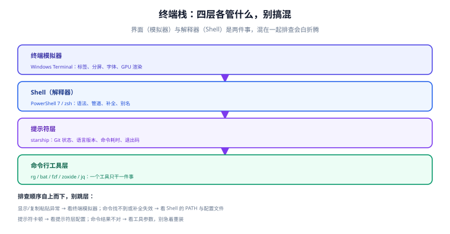

# 终端与 Shell 环境

终端（terminal）是效率工具里**投入产出比最高的一环**：配置一次，之后每一天都在用。但很多人一开始就把概念搞混——"终端慢"、"命令找不到"、"提示符很丑"，这三件事分别属于三个不同的层。

这一页讲清终端的四层结构，并把 Windows / macOS 两条主线各配一套可直接抄的配置。

## 1. 一句话定位

**终端模拟器是"窗口"，Shell 是"解释器"，提示符是"状态栏"，命令行工具是"干活的"。** 四层各管一段，出问题时先分层，再动手。

## 2. 四层结构



| 层 | 负责 | 常见配置项 | 换掉它的理由 |
| --- | --- | --- | --- |
| **终端模拟器** | 显示字符、处理按键、分屏标签、渲染 | 字体、配色、快捷键、默认 Shell | 需要分屏/GPU 渲染/更好的复制粘贴 |
| **Shell** | 解析命令、管道、变量、补全、别名 | `$PROFILE`（PowerShell）/ `.zshrc`（zsh） | 需要更好的语法与跨平台性 |
| **提示符** | 在提示符里显示 Git 状态、版本、耗时 | `starship.toml` | 想一眼看到当前分支与语言版本 |
| **命令行工具** | 具体功能：找文件、搜内容、看内容 | 各自配置文件 | 想更快、输出更可读 |

:::tip 一句话理解
判断问题在哪一层的口诀：**显示不对 → 模拟器；命令找不到 → Shell；提示符慢 → 提示符层；结果不对 → 工具参数。**
:::

## 3. Windows Terminal

### 3.1 安装与版本

Windows Terminal 需要 **Windows 10 2004（build 19041）或更高**。三种安装方式：

```powershell
# 方式一：winget（推荐，可脚本化）
winget search --id Microsoft.WindowsTerminal --exact
winget install --id Microsoft.WindowsTerminal -e

# 升级
winget upgrade --id Microsoft.WindowsTerminal -e

# 方式二：Microsoft Store（自动更新，最省心）
# 方式三：GitHub Releases 下载 .msixbundle（Store 被策略禁用时用，需手动更新）
```

```powershell
# 验证安装与版本
wt --version
```

预期：输出 `1.24.x`（2026-09 时的最新稳定线为 1.24.11911.0 / 2026-08-31）。

:::warning 说明
**Stable 与 Preview 是两个独立包**：稳定版是 `Microsoft.WindowsTerminal`，预览版是 `Microsoft.WindowsTerminal.Preview`，可以并存、分别升级。日常用稳定版即可。
:::

### 3.2 配置文件结构

Windows Terminal 的配置是一个 JSON 文件（`settings.json`），路径在应用内 `设置 → 打开 JSON 文件` 可以看到，常见位置：

```text
%LOCALAPPDATA%\Packages\Microsoft.WindowsTerminal_8wekyb3d8bbwe\LocalState\settings.json
```

最小可用结构：

```json [settings.json]
{
  "$schema": "https://aka.ms/terminal-profiles-schema",
  "defaultProfile": "{574e775e-4f2a-5b96-ac1e-a2962a402336}",
  "copyOnSelect": false,
  "copyFormatting": "none",
  "initialCols": 120,
  "initialRows": 30,
  "profiles": {
    "defaults": {
      "font": { "face": "Cascadia Mono NF", "size": 11 },
      "colorScheme": "One Half Dark",
      "startingDirectory": "D:\\docs-website",
      "scrollbarState": "visible"
    },
    "list": [
      {
        "guid": "{574e775e-4f2a-5b96-ac1e-a2962a402336}",
        "name": "PowerShell 7",
        "commandline": "pwsh.exe -NoLogo",
        "hidden": false
      }
    ]
  },
  "actions": [
    { "command": { "action": "splitPane", "split": "auto" }, "keys": "alt+shift+d" },
    { "command": "find", "keys": "ctrl+shift+f" },
    { "command": { "action": "moveTab", "direction": "forward" }, "keys": "ctrl+tab" }
  ]
}
```

三个关键项：

| 项 | 作用 | 建议 |
| --- | --- | --- |
| `copyFormatting: "none"` | 复制时不带富文本格式 | **强烈建议设为 `none`**：粘到编辑器/终端不再带一堆样式 |
| `profiles.defaults.startingDirectory` | 新标签默认目录 | 设成你最常打开的项目目录 |
| `actions` | 自定义快捷键 | 只改你真正常用的 3~5 个，别一次改一堆 |

### 3.3 Shell Integration（易被忽略的能力）

Windows Terminal 从 **1.21 起把 command marks 稳定下来**：Shell 通过转义序列把"这条命令从哪开始、到哪结束、退出码是多少"告诉终端。带来的实际好处：

- 滚动条上能看到每条命令的位置，**一键跳到上一条命令**
- 双击选中整段命令输出
- 命令失败时，滚动条标记显示为红色

配置方式：PowerShell 7 在 `$PROFILE` 中启用 Shell Integration（参考官方文档的 shell-integration 章节），zsh 侧由 starship 与终端配置协作完成。

### 3.4 常用操作清单

| 操作 | 默认快捷键 |
| --- | --- |
| 新建标签 / 关闭标签 | `Ctrl + Shift + T` / `Ctrl + Shift + W` |
| 垂直分屏 / 水平分屏 | `Alt + Shift + D`（auto）/ `Alt + Shift + -` |
| 在窗格间移动焦点 | `Alt + 方向键` |
| 调整字号 | `Ctrl + =` / `Ctrl + -` |
| 命令面板（搜索所有命令） | `Ctrl + Shift + P` |
| 复制 / 粘贴 | `Ctrl + Shift + C` / `Ctrl + Shift + V`（或 `Ctrl+C/V`，取决于设置） |

## 4. PowerShell 7.6（LTS）

### 4.1 与 Windows PowerShell 5.1 的区别

| 维度 | Windows PowerShell 5.1 | PowerShell 7.6（LTS） |
| --- | --- | --- |
| 可执行文件 | `powershell.exe` | `pwsh.exe` |
| 来源 | 随 Windows 分发，受 Windows 生命周期约束 | 独立安装，跨平台（Windows/macOS/Linux） |
| 支持周期 | 随 Windows | 至 **2028-11-14**（7.6 LTS，2026-03-18 发布） |
| 配置文件 | `$PROFILE` 指向 5.1 目录 | `$PROFILE` 指向 7 目录，**两者独立** |
| 模块兼容 | 老模块多 | 多数兼容，少数 Windows 专用模块需 `-UseWindowsPowerShell` |

**两者并存，安装 7 不会卸载 5.1**。这一点很重要：系统脚本仍可能依赖 5.1。

```powershell
# 查看当前会话用的是哪个版本
$PSVersionTable
# 期望：PSVersion 7.6.x（若是 5.1.x，说明打开的是 Windows PowerShell）

# 确认可执行文件位置
$PSHOME
Get-Command pwsh
```

### 4.2 Profile 与执行策略

```powershell
# 查看 profile 路径（可能不存在，需要自己创建）
$PROFILE
# 期望：C:\Users\<你>\Documents\PowerShell\Microsoft.PowerShell_profile.ps1

# 创建并编辑
if (-not (Test-Path $PROFILE)) { New-Item -ItemType File -Path $PROFILE -Force }
notepad $PROFILE

# 查看当前执行策略
Get-ExecutionPolicy -List
# 若为 Restricted，本机开发可放开当前用户范围：
Set-ExecutionPolicy -Scope CurrentUser RemoteSigned
```

配置文件片段（**可复制**）：

```powershell [Microsoft.PowerShell_profile.ps1]
# ── 编码：避免中文输出乱码
$OutputEncoding = [Console]::OutputEncoding = [Text.UTF8Encoding]::new()

# ── 别名（PowerShell 里叫 Set-Alias，参数不支持时改用函数）
Set-Alias ll  Get-ChildItem
Set-Alias which Get-Command
function gs  { git status -sb }
function gd  { git diff --stat }
function gl  { git log --oneline --graph -20 }
function mkcd($p) { New-Item -ItemType Directory -Path $p -Force | Out-Null; Set-Location $p }

# ── 常用导航
function proj { Set-Location D:\docs-website }
function back { Set-Location (Split-Path -Parent (Get-Location)) }

# ── 提示符交给 starship（见第 5 节）
Invoke-Expression (&starship init powershell)
```

:::danger 注意：PowerShell 别名有三个坑
1. **`Set-Alias` 不能带参数**。想写 `gs` 代替 `git status -sb`，必须用 `function`，不是 `Set-Alias`。
2. **内置别名会冲突**。`ls`、`cat`、`rm` 在 PowerShell 里是内置别名（指向 `Get-ChildItem` / `Get-Content` / `Remove-Item`），覆盖它们会让 AI 生成的脚本行为不一致。想用 `eza`/`bat` 这类工具，**给它们起新名字**（如 `ll`、`cc`）。
3. **`curl` 也是别名**（指向 `Invoke-WebRequest`）。脚本里要真用 `curl`，写 `curl.exe`。
:::

### 4.3 常用命令对照

| 需求 | PowerShell 写法 | Unix 等价 |
| --- | --- | --- |
| 找可执行文件 | `Get-Command rg` | `which rg` |
| 看环境变量 | `$env:PATH` | `echo $PATH` |
| 设环境变量（当前会话） | `$env:FOO = "bar"` | `export FOO=bar` |
| 管道过滤对象 | `Get-Process | Where-Object CPU -gt 10` | `ps | grep` |
| 输出为 JSON | `Get-Service | ConvertTo-Json` | — |
| 读 JSON | `Get-Content x.json | ConvertFrom-Json` | `cat x.json | jq` |

PowerShell 的核心差异是**管道传的是对象，不是文本**。这是它比 Unix Shell 更强的地方，也是"照抄 Unix 教程会失败"的原因。

## 5. 提示符：starship

starship 1.26.0 是跨 Shell 的提示符工具：**同一份 TOML 配置，在 Bash / zsh / fish / PowerShell / Nushell 上表现一致**。

```powershell
# 安装（Windows）
winget install Starship.Starship
starship --version
```

```shell
# macOS / Linux
brew install starship     # macOS
curl -sS https://starship.rs/install.sh | sh   # 通用脚本
```

各 Shell 启用方式：

| Shell | 加入配置文件的内容 | 配置文件 |
| --- | --- | --- |
| PowerShell | `Invoke-Expression (&starship init powershell)` | `$PROFILE` |
| zsh | `eval "$(starship init zsh)"` | `~/.zshrc` |
| bash | `eval "$(starship init bash)"` | `~/.bashrc` |
| fish | `starship init fish | source` | `~/.config/fish/config.fish` |

常用配置：

```toml [~/.config/starship.toml]
# 提示符换行，长路径不挤在一行
add_newline = true

[character]
success_symbol = "[❯](bold green)"
error_symbol = "[❯](bold red)"

[directory]
truncation_length = 4
truncate_to_repo = true      # 在 Git 仓库内只显示仓库相对路径

[git_branch]
symbol = " "

[cmd_duration]
min_time = 2000              # 只在命令超过 2 秒时显示耗时
format = "took [$duration]($style) "
```

:::warning 说明
`[cmd_duration]` 的 `min_time` 建议设 2000ms 以上。设成 0 会让每条短命令后面都跟一个耗时，视觉噪音很大。
:::

## 6. macOS / Linux 侧：zsh

macOS 从 Catalina 起默认 Shell 就是 zsh。最小可用配置：

```shell [~/.zshrc]
# 提示符用 starship
eval "$(starship init zsh)"

# 历史记录：加大容量、忽略重复、按时间戳排序
HISTFILE=~/.zsh_history
HISTSIZE=100000
SAVEHIST=100000
setopt HIST_IGNORE_ALL_DUPS HIST_REDUCE_BLANKS SHARE_HISTORY

# 补全
autoload -Uz compinit && compinit

# 别名
alias ll='eza -lah --git'
alias gs='git status -sb'
alias gd='git diff --stat'

# 目录跳转（见「命令行提效」）
eval "$(zoxide init zsh)"
```

:::tip 一句话理解
**不建议一上来就装 oh-my-zsh**：它会引入大量你不了解的默认行为、拖慢启动、并和 starship 的提示符主题冲突。先用 `~/.zshrc` 手写 20 行，等你明确缺什么再加。
:::

## 7. 会话复用：tmux / zellij（可选）

如果你经常 SSH 到服务器、或需要"关掉终端窗口但命令继续跑"，就需要会话复用（session multiplexer）：

| 需求 | tmux | zellij |
| --- | --- | --- |
| 断线后命令继续跑 | ✅ 核心能力 | ✅ |
| 多窗口/分屏 | ✅ | ✅ |
| 上手难度 | 需要记快捷键前缀 | 自带快捷键提示栏，更友好 |
| 适合 | 服务器运维、长期会话 | 本机多任务 |

Windows 侧一般不需要：Windows Terminal 的分屏 + 标签已经覆盖了大多数本机场景。

## 8. 实战：10 分钟配好一套终端

按顺序执行，每步都有验证点：

```powershell
# ① 装 Windows Terminal（若已随 Win11 预装可跳过）
winget install --id Microsoft.WindowsTerminal -e
# 验证：wt --version 输出 1.24.x

# ② 装 PowerShell 7（若已装可跳过）
winget install --id Microsoft.PowerShell --source winget
# 验证：pwsh -NoLogo -Command '$PSVersionTable.PSVersion'
# 期望：7.6.x

# ③ 装 starship
winget install Starship.Starship
# 验证：starship --version 输出 1.26.x

# ④ 写 profile
notepad $PROFILE
# 把第 4.2、第 5 节的片段粘进去，保存

# ⑤ 重开一个 PowerShell 7 标签
# 验证：提示符变成 starship 样式（带路径与 Git 分支）
```

验证清单：

| 检查项 | 期望 |
| --- | --- |
| `wt --version` | 1.24.x |
| `pwsh -v` | 7.6.x |
| `starship --version` | 1.26.x |
| 新标签默认目录 | 你设置的项目目录 |
| 复制代码粘到编辑器 | **不带**富文本格式 |
| 提示符 | 显示路径 + Git 分支，无报错 |

## 9. 常见坑

| 现象 | 原因 | 解决 |
| --- | --- | --- |
| `pwsh` 不是内部或外部命令 | PowerShell 7 未装或未入 PATH | `winget install Microsoft.PowerShell`；或直接用完整路径 |
| 配置改了没生效 | 改的是 5.1 的 profile | 确认 `$PROFILE` 路径在 `Documents\PowerShell\` 下，不是 `Documents\WindowsPowerShell\` |
| 脚本能跑但计划任务里失败 | 执行策略或工作目录不同 | 在任务里显式写 `pwsh -NoProfile -File ...` 并指定起始目录 |
| 中文输出乱码 | 编码未设 UTF-8 | 在 profile 里设 `[Console]::OutputEncoding` |
| 提示符每行都显示耗时 | `min_time` 设为 0 | 改为 2000 以上 |
| 复制的内容带一堆样式 | `copyFormatting` 未设 | 设为 `"none"` |
| `curl -H` 报参数错误 | `curl` 是 `Invoke-WebRequest` 的别名 | 用 `curl.exe` |
| 终端里粘贴多行命令直接执行 | 终端把换行当回车 | 用括号粘贴模式（bracketed paste），或先粘到编辑器确认 |

::: danger 注意：两个必须知道的坑
1. **不要把 `Set-Alias ls` 改成第三方工具**。大量脚本与 AI 生成代码默认 `ls` 是 `Get-ChildItem`，覆盖后行为会变成"看起来一样但返回类型不同"，排查成本极高。要给 `eza` 起名 `ll` 或 `lsd`。
2. **profile 里不要放耗时命令**。每次开新标签都会执行 profile；在里面调 API、跑扫描、启动后台进程，会让"开个终端"变成等 3 秒。
:::

## 10. 参考与延伸

- [命令行提效](../ShellProductivity/index.md)：装完终端接下来装什么
- [概述与选型](../Overview/index.md)：为什么建议键盘优先
- [运维 · Linux](../../../Ops/Linux/index.md)：服务器侧的 Shell 用法
- [IDE 配置 · 远程开发](../../IDE/RemoteDev/index.md)：把终端环境搬进容器

官方文档：

- Windows Terminal：[learn.microsoft.com/windows/terminal](https://learn.microsoft.com/zh-cn/windows/terminal/)
- Windows Terminal Shell Integration：[learn.microsoft.com/windows/terminal/tutorials/shell-integration](https://learn.microsoft.com/zh-cn/windows/terminal/tutorials/shell-integration)
- PowerShell 支持生命周期：[learn.microsoft.com/powershell/scripting/install/powershell-support-lifecycle](https://learn.microsoft.com/zh-cn/powershell/scripting/install/powershell-support-lifecycle)
- starship 配置文档：[starship.rs/config](https://starship.rs/config/)
