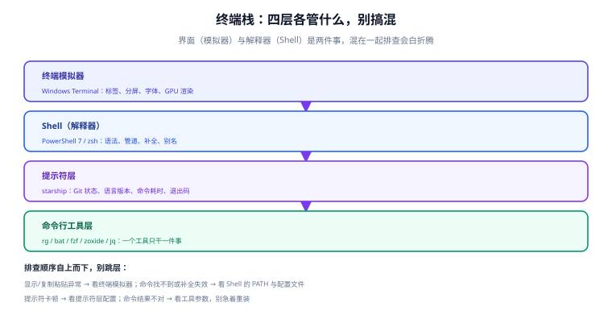
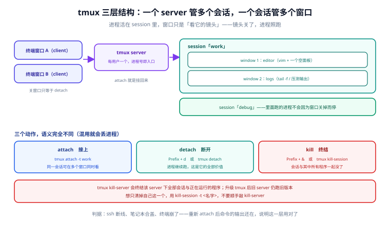

# 终端、Shell 与会话复用

终端（terminal）是效率工具里**投入产出比最高的一环**：配置一次，之后每一天都在用。但很多人一开始就把概念搞混——"终端慢"、"命令找不到"、"提示符很丑"、"关掉窗口命令就没了"，这四件事分别属于四个不同的层。

这一页讲清终端的四层结构，把 Windows / macOS 两条主线各配一套可直接抄的配置，再往下讲两件"配完基础就能立刻受益"的进阶事：**会话复用（tmux）** 和 **zsh 的补全、glob 与参数展开**。

## 1. 一句话定位

**终端模拟器是"窗口"，Shell 是"解释器"，提示符是"状态栏"，命令行工具是"干活的"，会话复用器是"让进程离开窗口活着"。** 五层各管一段，出问题时先分层，再动手。



## 2. 五层结构

| 层 | 负责 | 常见配置项 | 换掉它的理由 |
| --- | --- | --- | --- |
| **终端模拟器** | 显示字符、处理按键、分屏标签、渲染 | 字体、配色、快捷键、默认 Shell | 需要分屏/GPU 渲染/更好的复制粘贴 |
| **Shell** | 解析命令、管道、变量、补全、别名 | `$PROFILE`（PowerShell）/ `.zshrc`（zsh） | 需要更好的语法与跨平台性 |
| **提示符** | 在提示符里显示 Git 状态、版本、耗时 | `starship.toml` | 想一眼看到当前分支与语言版本 |
| **命令行工具** | 具体功能：找文件、搜内容、看内容 | 各自配置文件 | 想更快、输出更可读 |
| **会话复用器** | 让进程活在一个可以随时断开/接回的容器里 | `~/.tmux.conf` | ssh 断线、合盖、终端崩溃后命令还要继续跑 |

:::tip 一句话理解
判断问题在哪一层的口诀：**显示不对 → 模拟器；命令找不到 → Shell；提示符慢 → 提示符层；结果不对 → 工具参数；关掉窗口命令就没了 → 缺会话复用层。**
:::

::: warning 说明
本页是"配置到能用"的现场手册；各工具当前的版本状态集中在[概述与选型](../Overview/index.md)的版本速览表。**"命令自己能跑"和"命令能活过断线"是两个不同的问题**，前者靠 Shell，后者靠第 7 节的 tmux。
:::

## 3. Windows Terminal

### 3.1 安装与版本

Windows Terminal 需要 **Windows 10 2004（build 19041）或更高**。三种安装方式：

```powershell
# 方式一：winget（推荐，可脚本化）
winget search --id Microsoft.WindowsTerminal --exact
winget install --id Microsoft.WindowsTerminal -e

# 升级
winget upgrade --id Microsoft.WindowsTerminal -e

# 方式二：Microsoft Store（自动更新，最省心）
# 方式三：GitHub Releases 下载 .msixbundle（Store 被策略禁用时用，需手动更新）
```

```powershell
# 验证安装与版本
wt --version
```

预期：输出 `1.24.x`（2026-09 时的最新稳定线为 1.24.11911.0 / 2026-08-31）。

:::warning 说明
**Stable 与 Preview 是两个独立包**：稳定版是 `Microsoft.WindowsTerminal`，预览版是 `Microsoft.WindowsTerminal.Preview`，可以并存、分别升级。日常用稳定版即可。
:::

### 3.2 配置文件结构

Windows Terminal 的配置是一个 JSON 文件（`settings.json`），路径在应用内 `设置 → 打开 JSON 文件` 可以看到，常见位置：

```text
%LOCALAPPDATA%\Packages\Microsoft.WindowsTerminal_8wekyb3d8bbwe\LocalState\settings.json
```

最小可用结构：

```json [settings.json]
{
  "$schema": "https://aka.ms/terminal-profiles-schema",
  "defaultProfile": "{574e775e-4f2a-5b96-ac1e-a2962a402336}",
  "copyOnSelect": false,
  "copyFormatting": "none",
  "initialCols": 120,
  "initialRows": 30,
  "profiles": {
    "defaults": {
      "font": { "face": "Cascadia Mono NF", "size": 11 },
      "colorScheme": "One Half Dark",
      "startingDirectory": "D:\\docs-website",
      "scrollbarState": "visible"
    },
    "list": [
      {
        "guid": "{574e775e-4f2a-5b96-ac1e-a2962a402336}",
        "name": "PowerShell 7",
        "commandline": "pwsh.exe -NoLogo",
        "hidden": false
      }
    ]
  },
  "actions": [
    { "command": { "action": "splitPane", "split": "auto" }, "keys": "alt+shift+d" },
    { "command": "find", "keys": "ctrl+shift+f" },
    { "command": { "action": "moveTab", "direction": "forward" }, "keys": "ctrl+tab" }
  ]
}
```

三个关键项：

| 项 | 作用 | 建议 |
| --- | --- | --- |
| `copyFormatting: "none"` | 复制时不带富文本格式 | **强烈建议设为 `none`**：粘到编辑器/终端不再带一堆样式 |
| `profiles.defaults.startingDirectory` | 新标签默认目录 | 设成你最常打开的项目目录 |
| `actions` | 自定义快捷键 | 只改你真正常用的 3~5 个，别一次改一堆 |

### 3.3 Shell Integration（易被忽略的能力）

Windows Terminal 从 **1.21 起把 command marks 稳定下来**：Shell 通过转义序列把"这条命令从哪开始、到哪结束、退出码是多少"告诉终端。带来的实际好处：

- 滚动条上能看到每条命令的位置，**一键跳到上一条命令**
- 双击选中整段命令输出
- 命令失败时，滚动条标记显示为红色

配置方式：PowerShell 7 在 `$PROFILE` 中启用 Shell Integration（参考官方文档的 shell-integration 章节），zsh 侧由 starship 与终端配置协作完成。

### 3.4 常用操作清单

| 操作 | 默认快捷键 |
| --- | --- |
| 新建标签 / 关闭标签 | `Ctrl + Shift + T` / `Ctrl + Shift + W` |
| 垂直分屏 / 水平分屏 | `Alt + Shift + D`（auto）/ `Alt + Shift + -` |
| 在窗格间移动焦点 | `Alt + 方向键` |
| 调整字号 | `Ctrl + =` / `Ctrl + -` |
| 命令面板（搜索所有命令） | `Ctrl + Shift + P` |
| 复制 / 粘贴 | `Ctrl + Shift + C` / `Ctrl + Shift + V`（或 `Ctrl+C/V`，取决于设置） |

## 4. PowerShell 7.6（LTS）

### 4.1 与 Windows PowerShell 5.1 的区别

| 维度 | Windows PowerShell 5.1 | PowerShell 7.6（LTS） |
| --- | --- | --- |
| 可执行文件 | `powershell.exe` | `pwsh.exe` |
| 来源 | 随 Windows 分发，受 Windows 生命周期约束 | 独立安装，跨平台（Windows/macOS/Linux） |
| 支持周期 | 随 Windows | 至 **2028-11-14**（7.6 LTS，2026-03-18 发布） |
| 配置文件 | `$PROFILE` 指向 5.1 目录 | `$PROFILE` 指向 7 目录，**两者独立** |
| 模块兼容 | 老模块多 | 多数兼容，少数 Windows 专用模块需 `-UseWindowsPowerShell` |

**两者并存，安装 7 不会卸载 5.1**。这一点很重要：系统脚本仍可能依赖 5.1。

```powershell
# 查看当前会话用的是哪个版本
$PSVersionTable
# 期望：PSVersion 7.6.x（若是 5.1.x，说明打开的是 Windows PowerShell）

# 确认可执行文件位置
$PSHOME
Get-Command pwsh
```

### 4.2 Profile 与执行策略

```powershell
# 查看 profile 路径（可能不存在，需要自己创建）
$PROFILE
# 期望：C:\Users\<你>\Documents\PowerShell\Microsoft.PowerShell_profile.ps1

# 创建并编辑
if (-not (Test-Path $PROFILE)) { New-Item -ItemType File -Path $PROFILE -Force }
notepad $PROFILE

# 查看当前执行策略
Get-ExecutionPolicy -List
# 若为 Restricted，本机开发可放开当前用户范围：
Set-ExecutionPolicy -Scope CurrentUser RemoteSigned
```

配置文件片段（**可复制**）：

```powershell [Microsoft.PowerShell_profile.ps1]
# ── 编码：避免中文输出乱码
$OutputEncoding = [Console]::OutputEncoding = [Text.UTF8Encoding]::new()

# ── 别名（PowerShell 里叫 Set-Alias，参数不支持时改用函数）
Set-Alias ll  Get-ChildItem
Set-Alias which Get-Command
function gs  { git status -sb }
function gd  { git diff --stat }
function gl  { git log --oneline --graph -20 }
function mkcd($p) { New-Item -ItemType Directory -Path $p -Force | Out-Null; Set-Location $p }

# ── 常用导航
function proj { Set-Location D:\docs-website }
function back { Set-Location (Split-Path -Parent (Get-Location)) }

# ── 提示符交给 starship（见第 5 节）
Invoke-Expression (&starship init powershell)
```

:::danger 注意：PowerShell 别名有三个坑
1. **`Set-Alias` 不能带参数**。想写 `gs` 代替 `git status -sb`，必须用 `function`，不是 `Set-Alias`。
2. **内置别名会冲突**。`ls`、`cat`、`rm` 在 PowerShell 里是内置别名（指向 `Get-ChildItem` / `Get-Content` / `Remove-Item`），覆盖它们会让 AI 生成的脚本行为不一致。想用 `eza`/`bat` 这类工具，**给它们起新名字**（如 `ll`、`cc`）。
3. **`curl` 也是别名**（指向 `Invoke-WebRequest`）。脚本里要真用 `curl`，写 `curl.exe`。
:::

### 4.3 常用命令对照

| 需求 | PowerShell 写法 | Unix 等价 |
| --- | --- | --- |
| 找可执行文件 | `Get-Command rg` | `which rg` |
| 看环境变量 | `$env:PATH` | `echo $PATH` |
| 设环境变量（当前会话） | `$env:FOO = "bar"` | `export FOO=bar` |
| 管道过滤对象 | `Get-Process \| Where-Object CPU -gt 10` | `ps \| grep` |
| 输出为 JSON | `Get-Service \| ConvertTo-Json` | — |
| 读 JSON | `Get-Content x.json \| ConvertFrom-Json` | `cat x.json \| jq` |

PowerShell 的核心差异是**管道传的是对象，不是文本**。这是它比 Unix Shell 更强的地方，也是"照抄 Unix 教程会失败"的原因。

## 5. 提示符：starship

starship 1.26.0 是跨 Shell 的提示符工具：**同一份 TOML 配置，在 Bash / zsh / fish / PowerShell / Nushell 上表现一致**。

```powershell
# 安装（Windows）
winget install Starship.Starship
starship --version
```

```shell
# macOS / Linux
brew install starship     # macOS
curl -sS https://starship.rs/install.sh | sh   # 通用脚本
```

各 Shell 启用方式：

| Shell | 加入配置文件的内容 | 配置文件 |
| --- | --- | --- |
| PowerShell | `Invoke-Expression (&starship init powershell)` | `$PROFILE` |
| zsh | `eval "$(starship init zsh)"` | `~/.zshrc` |
| bash | `eval "$(starship init bash)"` | `~/.bashrc` |
| fish | `starship init fish \| source` | `~/.config/fish/config.fish` |

常用配置：

```toml [~/.config/starship.toml]
# 提示符换行，长路径不挤在一行
add_newline = true

[character]
success_symbol = "[❯](bold green)"
error_symbol = "[❯](bold red)"

[directory]
truncation_length = 4
truncate_to_repo = true      # 在 Git 仓库内只显示仓库相对路径

[git_branch]
symbol = " "

[cmd_duration]
min_time = 2000              # 只在命令超过 2 秒时显示耗时
format = "took [$duration]($style) "
```

:::warning 说明
`[cmd_duration]` 的 `min_time` 建议设 2000ms 以上。设成 0 会让每条短命令后面都跟一个耗时，视觉噪音很大。
:::

## 6. macOS / Linux 侧：zsh

macOS 从 Catalina 起默认 Shell 就是 zsh。最小可用配置：

```shell [~/.zshrc]
# 提示符用 starship
eval "$(starship init zsh)"

# 历史记录：加大容量、忽略重复、按时间戳排序
HISTFILE=~/.zsh_history
HISTSIZE=100000
SAVEHIST=100000
setopt HIST_IGNORE_ALL_DUPS HIST_REDUCE_BLANKS SHARE_HISTORY

# 补全
autoload -Uz compinit && compinit

# 别名
alias ll='eza -lah --git'
alias gs='git status -sb'
alias gd='git diff --stat'

# 目录跳转（见「命令行提效」）
eval "$(zoxide init zsh)"
```

:::tip 一句话理解
**不建议一上来就装 oh-my-zsh**：它会引入大量你不了解的默认行为、拖慢启动、并和 starship 的提示符主题冲突。先用 `~/.zshrc` 手写 20 行，等你明确缺什么再加。
:::

## 7. 会话复用：tmux 深入

"关掉终端窗口但命令继续跑"只是它的**入门用途**。会话复用器真正省时间的地方在于：**你把"工作现场"变成了一个可以命名、可以随时接回、可以脚本化的东西**，而不是一堆散落的窗口。

### 7.1 它解决的三件具体的事

| 场景 | 没有会话复用 | 有会话复用 |
| --- | --- | --- |
| 在服务器上跑 20 分钟的构建，ssh 断了 | 进程被挂断信号带走，从头再来 | 重新 attach，输出还在滚动 |
| 笔记本合盖通勤，回来接着看 | 终端可能被系统回收 | 会话在后台继续，回来接上 |
| 同时要看服务日志、敲命令、盯压测 | 开三个终端窗口，窗口标题分不清谁是谁 | 一个会话三个面板，命名清楚，切换是 `Prefix + 数字` |

::: tip 一句话理解
**tmux 的价值不在"分屏"（终端自己也能分屏），而在"进程的宿主可以脱离窗口独立存在"。** 分屏只是顺带的红利。
:::

### 7.2 三层模型：server → session → window → pane



理解这三层之后，**所有"我东西哪去了"的问题都能自答**：

| 你做了什么 | 发生了什么 | 怎么找回 |
| --- | --- | --- |
| 关掉了终端窗口 | client 断开（detach），session 与其中的进程继续 | `tmux attach -t work` |
| 按了 `Prefix + d` | 主动 detach，等价于关窗口 | 同上 |
| 按了 `Prefix + &` 并确认 | 当前 window 被销毁，里面的进程收到终止信号 | 找不回来，重新跑 |
| 敲了 `kill-server` | 该 server 下**全部**会话与程序一起终止 | 找不回来 |

::: danger 注意：`kill-server` 和 `kill-session` 不是一回事
1. **`tmux kill-server` 会终结当前用户的所有会话**（包括你没在看的那个正在跑备份的会话）。想清掉单个，用 `tmux kill-session -t <名字>`。
2. **升级 tmux 不会影响正在运行的 server**：旧 server 仍跑旧版本的代码，直到你把它杀掉重启。所以"我升级了但行为没变"是正常现象，不是升级失败。
3. **`Prefix + &` 有个确认提示**（`kill-window? (y/n)`），但很多人把提示当成卡住，随手按了 `y`。看到确认提示先看清它问的是什么。
:::

### 7.3 最小可用命令表

前缀键（prefix）默认是 `Ctrl + b`。下表里 `P` 代表前缀键。

| 类别 | 按键 / 命令（在 tmux 里） | 作用 |
| --- | --- | --- |
| 会话 | `tmux new -s work` | 新建名为 work 的会话 |
| 会话 | `tmux ls` | 列出会话（哪个在 attach、有几个窗口） |
| 会话 | `tmux attach -t work` | 接上 work |
| 会话 | `P` `d` | 断开（detach），会话继续 |
| 会话 | `P` `s` | 会话列表，方向键选择切换 |
| 会话 | `P` `$` | 重命名当前会话 |
| 窗口 | `P` `c` | 新建窗口 |
| 窗口 | `P` `,` | 重命名当前窗口（**强烈建议用**） |
| 窗口 | `P` `1..9` / `P` `n` / `P` `p` | 按编号/下一个/上一个切换 |
| 窗口 | `P` `&` | 关闭当前窗口（有确认） |
| 面板 | `P` `%` / `P` `"` | 左右分屏 / 上下分屏 |
| 面板 | `P` `方向键` | 在面板间移动焦点 |
| 面板 | `P` `z` | 把当前面板临时全屏（再按一次还原） |
| 面板 | `P` `x` | 关闭当前面板（有确认） |
| 复制 | `P` `[` | 进入复制模式，`方向键`/`PageUp` 翻历史输出 |
| 复制 | 复制模式里空格开始选择、回车结束 | 内容进入 tmux 缓冲区 |
| 复制 | `P` `]` | 把缓冲区粘到当前面板 |
| 其他 | `P` `t` | 在面板里显示一个时钟（确认它还活着） |

::: warning 说明
**"翻历史输出"要用 tmux 自己的复制模式**（`P` `[`），不是终端自己的滚动条——终端滚动条看不到 tmux 面板内部的历史。这是刚用 tmux 的人最常问的一个问题。
:::

### 7.4 一份可直接用的 `.tmux.conf`

```text [~/.tmux.conf]
# ── 前缀键改成 Ctrl+a（比 Ctrl+b 好按，且不与默认的向后翻页冲突）
set -g prefix C-a
unbind C-b
bind C-a send-prefix

# ── 索引从 1 开始（键盘上 1 在 0 左边，更好按）
set -g base-index 1
setw -g pane-base-index 1
set -g renumber-windows on          # 关掉中间窗口后自动重排编号

# ── 用 | 和 - 分屏：与直觉的横竖一致
bind | split-window -h -c "#{pane_current_path}"
bind - split-window -v -c "#{pane_current_path}"
unbind '"'
unbind %

# ── 新窗口/新面板继承当前路径（默认是 home，几乎总是错的）
bind c new-window -c "#{pane_current_path}"

# ── 开鼠标：可点选面板、拖动边界、滚轮翻页（3.7 起还可开 focus-follows-mouse）
set -g mouse on
# set -g focus-follows-mouse on      # 3.7+：鼠标移到哪个面板就激活哪个，按需开

# ── 历史行数与转义延迟（3.5 起默认已是 10ms，老版本需要显式设）
set -g history-limit 50000
set -sg escape-time 10

# ── 状态栏：左边显示会话/窗口，右边显示主机与时间
set -g status-interval 5
set -g status-left " #S "
set -g status-right " %m-%d %H:%M "

# ── vi 风格的按键（会覆盖默认的 emacs 风格，二选一）
setw -g mode-keys vi
bind -T copy-mode-vi v send -X begin-selection
bind -T copy-mode-vi y send -X copy-selection-and-cancel

# ── 与终端配合：允许终端识别"这是一次粘贴"，避免多行命令被逐行执行
set -g set-clipboard on
```

重载配置（不改会话、不丢进程）：

```shell
tmux source-file ~/.tmux.conf      # 在 tmux 里也可以：P 然后输入 :source-file ~/.tmux.conf
```

::: danger 注意：`~/.tmux.conf` 的三个高频错误
1. **改完不生效就去重开会话**。先用 `tmux source-file ~/.tmux.conf` 重载；只有改**全局选项**（如 `base-index`）才需要重开，因为已存在的窗口编号已经分配完了。
2. **`unbind` 忘了写**。`bind |` 只是新增绑定，默认的 `%`/`"` 还在。想"换一套"就要显式 `unbind`，否则两套按键并存，你自己也记不清。
3. **把 `mouse on` 当成万能**。开了鼠标之后，**终端里的文本选择要用 `Shift` 配合**（否则被 tmux 截获），复制路径的行为和以前不同——这是开了鼠标后第一个"感觉坏了"的地方。
:::

### 7.5 脚本化：把"开工"变成一条命令

会话复用器真正的分水岭，是**你开始用脚本创建它**，而不是手敲：

```shell [~/bin/dev-up.sh]
#!/usr/bin/env bash
# 用法：dev-up.sh          → 已存在就接上，不存在就按布局建好
set -euo pipefail

S=blog                                  # 会话名

# -A：会话存在就 attach，不存在就新建——这一条就实现了「幂等」
if [ -z "${TMUX:-}" ]; then             # 不在 tmux 里才 attach（在里面的重入会嵌套）
  tmux new-session -A -s "$S" -c "$HOME/project/service"
  exit 0
fi

# 以下只在 tmux 内部执行：命名窗口 + 按用途分面板
tmux rename-window -t "$S":1 "api"
tmux send-keys -t "$S":api "mvn spring-boot:run" C-m

tmux new-window -t "$S" -n "logs"
tmux send-keys -t "$S":logs "tail -f logs/app.log" C-m

tmux new-window -t "$S" -n "shell"
tmux split-window -h -t "$S":shell
tmux send-keys -t "$S":shell.0 "git status -sb" C-m

tmux select-window -t "$S":shell
```

| 命令 | 作用 | 注意 |
| --- | --- | --- |
| `tmux new-session -A -s NAME` | 存在则接上、不存在则新建 | `-A` 是脚本化的关键，别用 `new-session` 裸写 |
| `tmux new-window -n NAME -c DIR` | 新建命名窗口并指定起始目录 | 不指定 `-c` 会落在 home |
| `tmux split-window -h/-v` | 横/竖分屏，默认继承当前路径 | 新版支持 `-c` 显式指定 |
| `tmux send-keys -t NAME:win.0 "cmd" C-m` | 向指定面板"敲"命令 | `C-m` 是回车；忘写就只输入不执行 |
| `tmux select-window -t NAME:win` | 切换到最后要给用户看的窗口 | 脚本末尾最好固定焦点 |

::: tip 一句话理解
**脚本化的判据是"幂等"**：同一个脚本跑第二遍，结果应该和第一遍一样（接上已有会话），而不是又建一套重复的窗口。`-A` 就是为这件事存在的。
:::

### 7.6 从"能用"到"可靠"：长任务的正确跑法

需要跑 30 分钟以上的任务（构建、数据迁移、压测）时，顺序应该是：

```shell
# ① 先建一个专用会话（不要附着在正在用的开发会话上，避免误关）
tmux new-session -d -s longrun -c ~/project/service

# ② 在它里面启动任务，并把输出同时写进日志
tmux send-keys -t longrun "mvn -q clean verify 2>&1 | tee ~/logs/verify-$(date +%Y%m%d-%H%M).log" C-m

# ③ 想看看当前状态（不 attach 也能看）：抓最后一屏
tmux capture-pane -p -t longrun | tail -20

# ④ 真正想看时再接上；看完 detach 走人
tmux attach -t longrun
```

| 做法 | 为什么 |
| --- | --- |
| **建独立的 `-d` 会话，而不是在现有会话里开窗口** | 现有会话可能被你随手 `kill-session` 掉；`-d` 建的是后台会话，与开发现场隔离 |
| **输出同时 `tee` 到文件** | tmux 的缓冲区有行数上限，日志文件没有；排查时也更方便 `rg` |
| **用 `capture-pane` 巡检，而不是频繁 attach** | 自动化脚本里不能 attach（需要 TTY），`capture-pane` 可以在脚本里用 |
| **不要把交互式工具放进 `send-keys`** | `fzf`、`vim`、任何要 TTY 交互的东西放进 `send-keys` 都会挂住 |

::: warning 说明
`tmux capture-pane`（截图式抓取）与 `tmux pipe-pane`（把面板输出持续转发到命令）是脚本化两块最常用的能力。前者用于"看一眼现在什么样"，后者用于"把输出喂给 logger 或文件"。**两者都不需要 TTY，所以能在 CI 与定时任务里用。**
:::

### 7.7 与 zellij 的取舍

| 维度 | tmux 3.7c | zellij 0.45.1 |
| --- | --- | --- |
| 定位 | 事实标准，服务器预装率高 | 面向"本机多任务"的现代替代 |
| 上手成本 | 要记前缀键（或花钱改配置） | 底部常驻快捷键提示栏，识字即可 |
| 配置 | `.tmux.conf`，纯命令式 | KDL 配置文件 + 插件体系 |
| 生态 | 大量插件（resurrect / continuum 等） | 内置布局与"会话管理器" |
| 可用性 | 几乎所有 Linux 发行版一行装好，跳板机上通常已有 | 多数发行版要靠包管理器或二进制装 |
| 适合 | **服务器、跳板机、需要长期稳定的会话** | 本机多窗口编排、喜欢可视化提示的人 |

::: tip 一句话理解
**tmux 是"到处都有"，zellij 是"更好用"。** 判断方法很简单：**如果目标机器上本来就装了 tmux，就用 tmux**——你不可能在每一台跳板机上都装一个 zellij。
:::

### 7.8 Windows 侧怎么办

Windows 上有两条现实路径，不要试图在 `cmd.exe` / PowerShell 里找等价物——**Windows 没有原生会话复用**：

| 路径 | 做法 | 适用 |
| --- | --- | --- |
| **WSL2 里跑 tmux** | 在 WSL 发行版里 `apt install tmux`，命令通过 Windows Terminal 的 WSL profile 进入 | 长期项目、需要 Unix 工具链 |
| **Windows Terminal 分屏 + detached 进程** | 终端本身的分屏（`Alt+Shift+D`）+ 用 `Start-Process -WindowStyle Hidden` 让任务独立于窗口 | 只在本机跑脚本，不涉及断线 |

```powershell
# 让一个长任务脱离当前窗口运行（Windows 侧的「detach」近似物）
$log = "$HOME\logs\verify-$(Get-Date -Format 'yyyyMMdd-HHmm').log"
Start-Process pwsh -ArgumentList "-NoProfile", "-Command", `
    "mvn -q clean verify *>&1 | Tee-Object -FilePath '$log'" `
    -WindowStyle Hidden
# 查看是否还在跑
Get-Process pwsh | Where-Object { $_.StartTime -gt (Get-Date).AddMinutes(-30) } |
    Select-Object Id, StartTime, @{n='MB';e={[math]::Round($_.WorkingSet64/1MB,1)}}
```

::: danger 注意：Windows 侧最容易踩的一个坑
**`Start-Process` 起的进程在你注销（logoff）时仍会被终止**，它只解决"脱离窗口"，不解决"脱离登录会话"。真正的无人值守要靠[第 10 节](../Automation/index.md)的任务计划程序——**那两个问题的解药不一样，混用会得到一个"看着在跑其实没跑"的假象。**
:::

### 7.9 验证方式

```shell
# ① 装好且版本对（3.7.x 为当前稳定线）
tmux -V                      # 期望：tmux 3.7c

# ② 三层结构能自己走通一遍
tmux new -s demo -d
tmux new-window -t demo -n logs
tmux ls                      # 期望：demo: 2 windows (created ...) 且没有 attached 字样
tmux kill-session -t demo    # 收尾，别用 kill-server

# ③ 断线存活性（本页最重要的判据）
tmux new -d -s survivor 'sleep 300; echo done > /tmp/survivor.txt'
tmux detach -s survivor 2>/dev/null || true
tmux ls                                     # 期望：survivor 仍在
tmux capture-pane -p -t survivor             # 期望：有输出（进程在跑）
tmux kill-session -t survivor
```

| 检查项 | 期望 | 说明 |
| --- | --- | --- |
| `tmux -V` | 3.7c（或更高的稳定补丁） | 3.6 起有面板滚动条，3.7 起有浮动面板与复制模式行号 |
| `tmux ls` 里有未 attach 的会话 | 有 | 说明"窗口关掉、会话还在"这条链路成立 |
| 重载配置不丢会话 | 会话数量不变 | 证明 `source-file` 是安全的改法 |
| 复用脚本跑两遍 | 会话与窗口数量不变 | 幂等判据（`-A` 生效） |

## 8. zsh 进阶：补全系统、glob 与参数展开

上一节的配置让 zsh "能用"。这一节讲三件让它"省手"的东西——**补全、glob 限定符、参数展开**。它们不需要装任何东西，是 zsh 自带的。

### 8.1 补全系统：`compinit` 之后才有补全

```shell [~/.zshrc]
# 第一件事：初始化补全系统。不写这一行，Tab 只能补文件名，不能补命令参数
autoload -Uz compinit && compinit

# 补全菜单：连续按 Tab 在候选之间循环，而不是只列一次
zstyle ':completion:*' menu select

# 大小写不敏感（大小写不同的前缀也能补出来）
zstyle ':completion:*' matcher-list 'm:{a-zA-Z}={A-Za-z}'

# 补全列表分组显示，并带说明（需要终端支持）
zstyle ':completion:*' group-name ''
zstyle ':completion:*:descriptions' format '%F{yellow}-- %d --%f'

# 补全列表配色（用 ls 的颜色方案）
zstyle ':completion:*' list-colors "${(s.:.)LS_COLORS}"
```

| 想要的效果 | zstyle 写法 |
| --- | --- |
| Tab 连续按可循环候选 | `zstyle ':completion:*' menu select` |
| 大小写不敏感补全 | `zstyle ':completion:*' matcher-list 'm:{a-zA-Z}={A-Za-z}'` |
| 忽略补全列表里的重复项 | `zstyle ':completion:*' ignore-line yes` |
| 为某些命令自定义补全 | `compdef _git gst=git-status` 之类，或直接用 `compdef` 注册脚本 |

::: tip 一句话理解
**补全不是"zsh 自带的"，而是"要显式初始化并配的"。** 很多人说"zsh 补全也就那样"，几乎都是因为 `.zshrc` 里少了 `compinit` 那一行，或者补全来自 `bash` 时代留下的补全脚本。
:::

::: danger 注意：`compinit` 的两个坑
1. **`compinit` 会重建补全缓存，可能拖慢启动**。如果启动变慢，用 `compinit -C` 跳过安全检查（只在可信环境下用），或把 `compinit` 放在启动最末。
2. **`compinit: insecure directories` 警告不要用 `chmod -R 777` 消掉**。它是因为补全目录对其他用户可写——正确做法是 `chmod go-w` 收紧权限，而不是放开它。
:::

### 8.2 glob 限定符：让通配符自己带筛选条件

zsh 的 glob 比 bash 强一个量级，因为它可以在通配符后面加**限定符**：

| 写法 | 含义 | 等价的老办法 |
| --- | --- | --- |
| `*(.)` | 只要普通文件 | `find . -maxdepth 1 -type f` |
| `*(/)` | 只要目录 | `find . -maxdepth 1 -type d` |
| `*(@)` | 只要符号链接 | `find . -maxdepth 1 -type l` |
| `*(Lk+100)` | 大于 100KB 的文件 | `find . -size +100k` |
| `*(om[1,3])` | 按修改时间倒序取前 3 个 | `ls -t \| head -3` |
| `*(.om[1])` | **最近修改的那个普通文件** | 一串管道 |
| `^*.md` | 排除 `.md`（`^` 取反） | `ls \| grep -v` |
| `**/*.ts` | 递归匹配（需要 `setopt globstar` 之外无额外配置） | `find . -name '*.ts'` |

```shell
# 最常用的一个：找到最近改过的那个文件（排查时常说「刚改的那个」）
print -l *(om[1])

# 列出当前目录最大的 5 个文件
print -l *(Lk+1000om[1,5])

# 递归统计 TypeScript 文件行数（不经过 shell 之外的任何工具）
wc -l **/*.ts | tail -1
```

::: warning 说明
**glob 匹配失败时 zsh 默认会直接报错**（`zsh: no matches found`），而不是把原样的通配符传给命令——这与 bash 不同。如果想让它"没匹配就原样传"，用 `setopt null_glob`（不匹配则展开为空）或 `setopt nonomatch`。**这是从 bash 换到 zsh 后第一批遇到的差异之一。**
:::

### 8.3 参数展开修饰符：在变量上做切片、去后缀、批量改

不需要 `basename`、`dirname`、`sed`——zsh 的参数展开修饰符能直接做：

| 写法 | 结果 | 常见用途 |
| --- | --- | --- |
| `${f:h}` | 去掉最后一段（相当于 `dirname`） | 取目录部分 |
| `${f:t}` | 只留最后一段（相当于 `basename`） | 取文件名 |
| `${f:r}` | 去掉扩展名 | 生成同名输出文件 |
| `${f:e}` | 只留扩展名 | 判断类型 |
| `${f:l}` / `${f:u}` | 全小写 / 全大写 | 规范化路径 |
| `${(f)data}` | 按行切成数组 | 处理多行输出 |
| `${(j:,:)arr}` | 用 `,` 连接数组 | 拼 SQL/CSV |
| `${(q)var}` | 加引号转义 | 路径含空格时安全传递 |
| `${#arr[@]}` | 数组长度 | 循环计数 |

```shell [批量把 .log 重命名成 .log.bak]
for f in *.log; do mv -- "$f" "${f:r}.log.bak"; done   # ${f:r} 去掉扩展名后再拼

# 把多行输出变成数组，逐个处理（对含空格的行也安全）
lines=("${(@f)$(git diff --name-only)}")
printf '%s\n' "${lines[@]}" | head -3

# 拼一个逗号分隔的列表（生成 SQL 的 IN 子句时常用）
ids=(101 102 103); echo "(${(j:,:)ids})"     # → (101,102,103)
```

::: danger 注意：`$arr` 与 `${arr[@]}` 不是一回事
1. **在 zsh 里 `$arr` 也能展开成全部元素**（这是 zsh 与 bash 的一个著名差异），但**带空格的元素是否被拆开，取决于有没有 `SH_WORD_SPLIT`**。要写可读、可移植的脚本，一律用 `${arr[@]}` 并加引号：`"${arr[@]}"`。
2. **`"${(@f)$(cmd)}"` 里的 `@f` 不能省**：不加 `f`，命令输出的多行会被当成一个元素，`for` 循环只跑一次——这是"循环只执行了一遍"这类 bug 的根因。
3. **参数展开不会做路径存在性检查**。`${f:r}` 只是字符串操作，`a/b/c.txt` 与 `c.txt` 都会得到 `c`；要判存在仍得 `[[ -f $x ]]`。
:::

### 8.4 与 bash 的差异速查

写跨 Shell 脚本时，下面几条最容易"在 bash 里跑得好好的、到 zsh 里就变了样"：

| 主题 | bash | zsh | 建议 |
| --- | --- | --- | --- |
| 数组下标 | 从 0 开始 | **从 1 开始** | 脚本显式声明 `#!/usr/bin/env bash`，别指望两边通用 |
| `$arr` | 取第 0 个元素 | 取全部元素 | 一律写 `"${arr[@]}"` |
| 未定义变量 | 展开成空 | 默认报错（`nounset` 相关） | 用 `${var:-默认值}` |
| glob 无匹配 | 原样传给命令 | **报错并中止** | 显式 `setopt null_glob` / `nonomatch` |
| 词分割 | 默认分割 | 默认**不**分割 | 需要分割时用 `"${=var}"` |
| 补全 | 需 bash-completion 包 | 内置 `compinit` | 见 8.1 |

::: warning 说明
**结论不是"选一个更好"，而是"脚本里不要依赖交互式 Shell 的默认行为"。** 任何会被 `bash script.sh` 或 CI 执行的文件，首行写清 `#!/usr/bin/env bash`，并在脚本内用 `set -euo pipefail`——这样它的行为与你的交互式 zsh 配置完全无关。
:::

## 9. 实战：10 分钟配好一套终端

按顺序执行，每步都有验证点：

```powershell
# ① 装 Windows Terminal（若已随 Win11 预装可跳过）
winget install --id Microsoft.WindowsTerminal -e
# 验证：wt --version 输出 1.24.x

# ② 装 PowerShell 7（若已装可跳过）
winget install --id Microsoft.PowerShell --source winget
# 验证：pwsh -NoLogo -Command '$PSVersionTable.PSVersion'
# 期望：7.6.x

# ③ 装 starship
winget install Starship.Starship
# 验证：starship --version 输出 1.26.x

# ④ 写 profile
notepad $PROFILE
# 把第 4.2、第 5 节的片段粘进去，保存

# ⑤ 重开一个 PowerShell 7 标签
# 验证：提示符变成 starship 样式（带路径与 Git 分支）

# ⑥ 会话复用层（可选，但只要有远程或长任务就建议装）
# WSL2 里：sudo apt update && sudo apt install -y tmux
# 验证：tmux -V 输出 3.7x；配置文件见第 7.4 节
```

验证清单：

| 检查项 | 期望 |
| --- | --- |
| `wt --version` | 1.24.x |
| `pwsh -v` | 7.6.x |
| `starship --version` | 1.26.x |
| 新标签默认目录 | 你设置的项目目录 |
| 复制代码粘到编辑器 | **不带**富文本格式 |
| 提示符 | 显示路径 + Git 分支，无报错 |
| `tmux -V`（若装了） | 3.7x |
| 建一个 `-d` 会话后关掉所有窗口 | `tmux ls` 里那个会话仍在（第 7.9 节） |
| zsh 侧 `zstyle ':completion:*' menu select` | 连续按 Tab 能在候选间循环 |

## 10. 常见坑

| 现象 | 原因 | 解决 |
| --- | --- | --- |
| `pwsh` 不是内部或外部命令 | PowerShell 7 未装或未入 PATH | `winget install Microsoft.PowerShell`；或直接用完整路径 |
| 配置改了没生效 | 改的是 5.1 的 profile | 确认 `$PROFILE` 路径在 `Documents\PowerShell\` 下，不是 `Documents\WindowsPowerShell\` |
| 脚本能跑但计划任务里失败 | 执行策略或工作目录不同 | 在任务里显式写 `pwsh -NoProfile -File ...` 并指定起始目录 |
| 中文输出乱码 | 编码未设 UTF-8 | 在 profile 里设 `[Console]::OutputEncoding` |
| 提示符每行都显示耗时 | `min_time` 设为 0 | 改为 2000 以上 |
| 复制的内容带一堆样式 | `copyFormatting` 未设 | 设为 `"none"` |
| `curl -H` 报参数错误 | `curl` 是 `Invoke-WebRequest` 的别名 | 用 `curl.exe` |
| 终端里粘贴多行命令直接执行 | 终端把换行当回车 | 用括号粘贴模式（bracketed paste），或先粘到编辑器确认 |
| tmux 里翻不到历史输出 | 看的是终端自己的滚动条 | 用 tmux 的复制模式 `Prefix + [`（第 7.3 节） |
| 改了 `~/.tmux.conf` 没反应 | 没重载，或改的是已分配过的全局选项 | `tmux source-file ~/.tmux.conf`；`base-index` 之类要重开会话 |
| tmux 里文本选不中 | 开了 `mouse on`，鼠标事件被 tmux 截获 | 按住 `Shift` 再拖选（各终端按键可能不同） |
| 关掉窗口后命令没了 | 根本没在 tmux 里跑 | 长任务用 `tmux new -d -s <名>` 起，见第 7.6 节 |
| `kill-server` 之后所有会话都没了 | 用了 server 级命令 | 平时只用 `kill-session -t <名>`；把 `kill-server` 当成"关整台机器"来对待 |
| zsh 里 Tab 不补参数 | 少了 `autoload -Uz compinit && compinit` | 加进 `.zshrc` 后重开 Shell（第 8.1 节） |
| zsh 报 `no matches found` | zsh 的 glob 无匹配时会报错，bash 是原样传参 | 用 `setopt null_glob` / `nonomatch`（第 8.2 节） |
| 脚本里 `for` 只循环了一次 | 多行输出没切成数组（缺 `(@f)`） | `lines=("${(@f)$(cmd)}")`（第 8.3 节） |

::: danger 注意：两个必须知道的坑
1. **不要把 `Set-Alias ls` 改成第三方工具**。大量脚本与 AI 生成代码默认 `ls` 是 `Get-ChildItem`，覆盖后行为会变成"看起来一样但返回类型不同"，排查成本极高。要给 `eza` 起名 `ll` 或 `lsd`。
2. **profile 里不要放耗时命令**。每次开新标签都会执行 profile；在里面调 API、跑扫描、启动后台进程，会让"开个终端"变成等 3 秒。
:::

::: tip 一句话理解
上面九行里，**前五行是"层用错了"，后四行是"默认行为记错了"**。前者靠认清分层解决，后者只能靠把差异写成表格——这也是本页把 zsh 与 bash 的差异单列一节（8.4）的原因。
:::

## 11. 参考与延伸

- [命令行提效](../ShellProductivity/index.md)：装完终端接下来装什么
- [概述与选型](../Overview/index.md)：为什么建议键盘优先
- [自动化：桌面、调度与脚本](../Automation/index.md)：让长任务无人值守地跑起来（与 tmux 的分工见 7.8）
- [运维 · Linux · Shell 基础](../../../Ops/Linux/ShellBasic/index.md)：服务器侧的 Shell 用法
- [运维 · Linux · Shell 脚本编程](../../../Ops/Linux/Advanced/ShellScripting/index.md)：本页 8.3 的参数展开用在脚本里时的完整工程约束
- [IDE 配置 · 远程开发](../../IDE/RemoteDev/index.md)：把终端环境搬进容器

官方文档：

- Windows Terminal：[learn.microsoft.com/windows/terminal](https://learn.microsoft.com/zh-cn/windows/terminal/)
- Windows Terminal Shell Integration：[learn.microsoft.com/windows/terminal/tutorials/shell-integration](https://learn.microsoft.com/zh-cn/windows/terminal/tutorials/shell-integration)
- PowerShell 支持生命周期：[learn.microsoft.com/powershell/scripting/install/powershell-support-lifecycle](https://learn.microsoft.com/zh-cn/powershell/scripting/install/powershell-support-lifecycle)
- starship 配置文档：[starship.rs/config](https://starship.rs/config/)
- tmux 官方仓库与手册：[github.com/tmux/tmux/wiki](https://github.com/tmux/tmux/wiki)
- tmux 版本说明（3.7c / 2026-08-17，3.8-rc 自 2026-09-22 起进入预发布）：[tmux.info/releases](https://tmux.info/releases)
- zsh 参数展开与 glob 限定符手册：[zsh.sourceforge.io/Doc/Release/Expansion.html](https://zsh.sourceforge.io/Doc/Release/Expansion.html)
- zsh 补全系统手册：[zsh.sourceforge.io/Doc/Release/Completion-System.html](https://zsh.sourceforge.io/Doc/Release/Completion-System.html)
