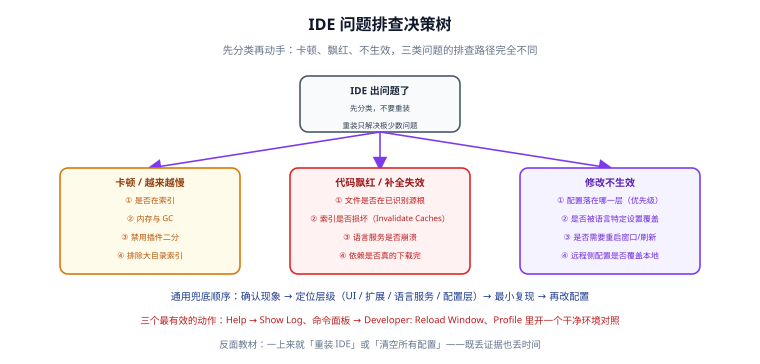

# 常见问题与最佳实践

本页收口整个专题：把高频疑问分类回答，把踩过的坑集中列一遍，并给出一份可以直接抄进团队文档的最佳实践清单。

## 分类问答

### 选型

#### Q1：IntelliJ IDEA 和 VS Code 到底选哪个？

先看主力语言。**JVM 大型多模块工程选 IDEA**——Spring 支持、重构安全性、跨模块导航的差距仍然明显；**前端、脚本、多语言混合团队选 VS Code**——扩展生态与远程开发成熟度更高。

两者不是互斥的：不少人是「IDEA 写后端、VS Code 改配置和写文档」。此时要做的是**把两边的冲突键位统一**，而不是只用一个。

细节见 [概述与选型](../Overview/index.md)。

#### Q2：团队必须用同一个 IDE 吗？

不必。**必须一致的是「代码风格、检查规则、提交格式」这三件事，而不是工具本身。**

做法：把规则交给 `.editorconfig` 与 CI（Prettier / Spotless），让 IDEA 与 VS Code 都只是规则的「消费者」。见 [实战：搭一套统一的 IDE 环境](../Practice/index.md)。

#### Q3：Community 版还值得讨论吗？

**不建议再讨论。** 自 IntelliJ IDEA 2025.3 起，Community 与 Ultimate 已合并为**单一安装包**：核心 Java/Kotlin 功能免费，高级功能由 Ultimate 订阅解锁。老教程里的「Community vs Ultimate」对比大多已过期。

#### Q4：JetBrains Fleet 还能用吗？

Fleet 自 **2025-12-22** 起不再更新、不再提供下载，仅存量安装可用（部分依赖服务端的能力可能随时间失效）。JetBrains 的团队已转向基于 Fleet 平台的智能体开发环境 **Air**。**新项目不要以 Fleet 为基线。**

#### Q5：Eclipse 还值得学吗？

看项目。Eclipse 平台仍是 13 周一个发布列车（当前 2026-09 / Platform 4.41），在**企业存量项目、特定插件链、云原生工具链**场景下仍有一席之地。如果目标是「找份新工作」而不是「维护现有项目」，优先级可以往后放。

### 配置为什么没生效

#### Q6：我在设置里改了，为什么行为没变？

按优先级从下往上查（越靠下优先级越高）：

```text
默认设置 → 用户设置 → 远程设置 → 工作区设置 → 多根文件夹设置 → 语言特定设置
```

九成情况是**语言特定设置**或**远程设置**覆盖了你改的那项。VS Code 里可以用命令面板的 `Developer: Inspect Key Mappings`（键位）或直接查看 `.vscode/settings.json` 搜索关键字来定位。

#### Q7：`.editorconfig` 写了但 IDE 不遵守？

两个可能：

1. IDEA 未启用 EditorConfig 支持：`Settings` → `Editor` → `Code Style` → 勾选 `Enable EditorConfig support`；
2. IDE 的代码风格设置优先于 `.editorconfig`：启用后 `.editorconfig` 出现的属性会接管同名设置，界面会置灰；若仍可编辑，说明没接管成功。

#### Q8：为什么每次打开文件都显示整文件被修改？

**换行符在打架。** `.editorconfig` 的 `end_of_line` 与 Git 的 `core.autocrlf` / `.gitattributes` 不一致。

```shell
# 排查
git config --get core.autocrlf
cat .gitattributes
grep end_of_line .editorconfig
# 对策：三者统一为 lf，Windows 工作区差异交给 Git 处理
```

#### Q9：`Ctrl+Space` 补全弹不出来？

大概率被输入法占用（中英文切换）。把输入法的中英切换改成 `Shift` 或 `Ctrl+Shift`，或改 IDE 键位。

#### Q10：VS Code 装了扩展，远端却不生效？

扩展分「本地」与「远端」两组。语言服务类扩展需要 **Install in SSH: host** / **Install in Container**。把必备扩展写进 `devcontainer.json` 的 `customizations.vscode.extensions` 可避免重复踩坑。

### 性能

#### Q11：IDEA 越来越卡怎么办？

按顺序排查三类原因：

| 顺序 | 检查 | 动作 |
| --- | --- | --- |
| 1 | 左下角是否在 `Scanning` / `Indexing` | 等它跑完；把 `node_modules`、`target`、`dist` 标记为 Excluded |
| 2 | 内存指示器是否长期贴顶 | `Help → Change Memory Settings`，8G 机器给 2~3G、16G 给 4G |
| 3 | 是否某个插件在拖慢 | 二分法禁用；精简 `Inspections` |

详见 [IntelliJ IDEA 深入](../IntelliJIDEA/index.md)。

#### Q12：VS Code 启动慢、输入有延迟？

```text
① 命令面板 → "Developer: Startup Performance" → 看各扩展激活耗时
② 二分法禁用可疑扩展
③ 配 search.exclude 与 files.watcherExclude（收益最高的一项）
④ 用 Profile 隔离不同场景的扩展集
```

#### Q13：加内存能解决一切吗？

不能。**超过 8G 后收益递减明显**，而且堆设得过大反而会让 GC 一次停顿更久。更重要的是把不该索引的东西排除掉。

#### Q14：`Invalidate Caches` 可以随便用吗？

不可以。它会**同时清掉本地历史（Local History）**。动手前先 `git commit` 或 `git stash`，否则未提交的改动会失去最后一道兜底。

### 团队与同步

#### Q15：怎么让团队代码风格一致？

三层做法：`.editorconfig`（跨工具基础）+ 唯一格式化工具（Prettier 或 Spotless）+ CI 门禁。**IDE 只做触发器，不做标准。**

#### Q16：`.idea/` 该不该提交？

**按文件粒度提交，不要一刀切。** 提交 `codeStyles/`、`inspectionProfiles/`、`compiler.xml`、`encodings.xml`、`externalDependencies.xml`；忽略 `workspace.xml`、`shelf/`、`usage.statistics.xml`、`dataSources*.xml`。

#### Q17：用 Settings Sync 分发团队规则行不行？

不行。**没开同步的人收不到**，问题会更隐蔽。团队规则必须进仓库。

#### Q18：如何让新人 30 分钟上手？

把流程写成可执行清单（见 [实战](../Practice/index.md) 的 onboarding 一节），并保证第一步是一条自检命令：

```shell
bash scripts/check-ide-config.sh
```

### 远程开发

#### Q19：远程开发和本地开发怎么选？

先答一个问题：**代码能不能留在本地？** 能，就本地开发；不能（合规、体积、网络），再考虑远程。远程不是「更高级」，弱网下体验会明显更差。

#### Q20：WSL 里项目放哪？

放在 **WSL 文件系统内**（如 `~/projects/app`）。放 `/mnt/c/...` 会跨文件系统调用，文件多时能慢十倍。

#### Q21：调试端口怎么开才安全？

只映射到 `127.0.0.1`，或用 SSH 本地转发；排查结束立刻移除 `-agentlib:jdwp` 参数。**不要用 `suspend=y` 上生产**——目标进程会卡在启动处。

### AI 与合规

#### Q22：IDE 里的 AI 助手能把代码传出去吗？

取决于你开启的能力与数据共享设置。团队应明确三点：**哪些 AI 能力允许开启、代码是否允许离开内网、费用由谁承担**。企业环境通常有组织级策略开关。

#### Q23：AI Free 档为什么在我的 IDEA 里没有？

JetBrains 的 AI 分层中，**AI Free 不在 IntelliJ IDEA（无 Ultimate 订阅时）与 PyCharm（无 Pro 订阅时）中提供**，Android Studio 同样不支持。另外可用区域与地区限制以官方许可页为准。

#### Q24：装了 AI 插件后 IDE 变慢？

AI 类扩展通常常驻监听编辑行为，属于「高频激活」类型。用 Profile 隔离，或只在需要时启用。

### 排障

IDE 的疑难杂症容易越修越乱，原因是把三类完全不同的问题混在一起处理。下面这张决策树把入口收成三条：



三条路径的核心区别：

| 现象 | 最可能的层级 | 第一个该看的证据 | 最不该做的事 |
| --- | --- | --- | --- |
| 卡顿 / 越来越慢 | 索引、内存、插件 | 状态栏索引进度、`Help → Show Log`、堆占用 | 直接加大 `-Xmx`（可能让 Full GC 更久） |
| 代码飘红 / 补全失效 | 源根识别、索引损坏、语言服务 | 文件是否在已识别源根、依赖是否下载完 | 删 `.idea/` 重来（丢掉索引与运行配置） |
| 修改不生效 | 配置层级被覆盖 | 设置页右上角的层级标记（用户 / 远程 / 工作区） | 反复改同一个值而不确认它落在哪一层 |

::: tip 通用兜底顺序
**确认现象 → 定位层级（IDE 界面 / 扩展 / 语言服务 / 配置层）→ 最小复现 → 再改配置。** 三个最有效的动作：`Help → Show Log` 看日志、命令面板执行 `Developer: Reload Window`、用 Profile 开一个干净环境做对照——**用「换环境对照」定位，永远比「猜」快**。
:::

## 踩坑清单（15 条）

::: danger 逐条对照，命中哪条就去修哪条
1. **`.editorconfig` 少了 `root = true`** → 继承了上层目录配置，行为随机。
2. **`[*.md]` 没关 `trim_trailing_whitespace`** → 破坏 Markdown 硬换行，diff 噪音大。
3. **`.editorconfig` 与 `.gitattributes` 换行策略不一致** → 整文件 diff 反复出现。
4. **`.vscode/settings.json` 写了绝对路径** → 他人机器无效，泄露本机信息。
5. **用户设置里放项目配置** → 多项目互相干扰，新人 clone 后没这套设置。
6. **工作区设置里放个人偏好**（主题/字号）→ 团队被迫接受某人的审美。
7. **`.idea/` 整体忽略** → 代码风格与必需插件无法共享。
8. **提交 `.idea/workspace.xml`** → 打开的文件与布局全在里面，必然冲突。
9. **`.idea/dataSources*.xml` 入库** → 可能带数据库凭据。
10. **装了「破解版」插件** → 供应链风险极高，可能窃取凭据。
11. **同时装两个格式化器** → 保存时循环格式化。
12. **扩展 ID 写死在文档里** → 发布者更换 ID 后文档失效，需附「搜索关键字」。
13. **`postCreateCommand` 里做全量构建** → 首次进环境等十几分钟。
14. **Dev Container 不挂依赖缓存卷** → 每次重建重新下载全部依赖。
15. **远程调试端口映射到 `0.0.0.0`** → 任何人都能附加调试器。
:::

## 最佳实践（12 条）

::: tip 可以直接抄进团队文档
1. **IDE 是长期基础设施**：先定标准（配置入库），再谈个人偏好。
2. **三层分明**：个人偏好归同步，团队规则归仓库，运行环境归容器。
3. **`.editorconfig` 是地基**：跨工具能一致的部分先锁住。
4. **格式化标准唯一**：Prettier 或 Spotless，二选一，IDE 只做触发。
5. **标准以命令行工具为准**：IDE 只是它的前端。
6. **构建配置以构建工具为准**：开启「委托 IDE 构建给 Maven/Gradle」。
7. **版本锁大版本线，不锁补丁号**：大版本升级走窗口与评审。
8. **配置改动走 review**：影响全员的文件不能随手改。
9. **一条命令自检**：让「环境对不对」有客观答案。
10. **性能排查顺序固定**：索引 → 内存 → 插件（IDEA）；UI → 扩展宿主 → 语言服务（VS Code）。
11. **插件宁少勿多**：每个都问「它什么时候激活」。
12. **文档写「为什么」**：只写「装这个」，三个月后没人敢删。
:::

## 升级检查清单

IDE 大版本升级前，逐条过一遍，能避免绝大多数「升级完就出事」。

| # | 检查项 | 说明 |
| --- | --- | --- |
| 1 | 团队必备插件是否已支持新版本 | 查 `since-build` / `engines.vscode` |
| 2 | 构建工具链是否兼容 | JDK / Maven / Gradle 版本联动 |
| 3 | 配置文件是否已备份 | IDEA 的 `options/`、`.idea/codeStyles/` |
| 4 | 是否安排了升级窗口 | 先一人验证，再全员放量 |
| 5 | 是否保留可回退版本 | Toolbox 多版本并存 |
| 6 | 索引重建时间是否可接受 | 大型项目提前通知 |
| 7 | CI 是否用同一版本线 | 避免「本地能过 CI 不过」 |
| 8 | 升级后是否跑通完整构建与测试 | 不是「能打开项目」就算过 |

## 术语表

| 术语 | 一句话解释 |
| --- | --- |
| IDE | 集成开发环境，把编辑、构建、调试等揉进一个工具 |
| Editor / 编辑器 | 以「不挡路」为默认假设的工具，智能程度依赖扩展 |
| LSP | 语言服务器协议，编辑器与语言能力之间的标准接口 |
| DAP | 调试适配器协议，调试前端与各语言调试后端的接口 |
| PSI | IntelliJ 的程序结构接口，索引与重构的基础 |
| Extension Host | VS Code 中运行所有扩展的独立进程 |
| Profile | VS Code 的配置组合（设置 + 键位 + 扩展 + 片段） |
| Portable Mode | VS Code 的便携模式，全部数据写入可执行文件同级的 `data/` |
| Toolchain | 构建时真正使用的 JDK / 编译器集合 |
| `.editorconfig` | 跨编辑器的代码风格声明文件，事实标准 |
| Dev Container | 用容器定义开发环境，`devcontainer.json` 是规范入口 |
| Run Configuration | IDEA 的运行/调试配置，可随仓库共享 |
| Logpoint | 不中断程序即可输出表达式的「日志断点」 |
| SBOM | 软件物料清单，用于供应链治理 |
| Inlay Hints | 编辑器内联提示（参数名、推断类型） |

## 相关文档

- [IDE 配置总览](../index.md)：版本状态速览与阅读路径。
- [概述与选型](../Overview/index.md)：生态全景与选型决策。
- [IntelliJ IDEA 深入](../IntelliJIDEA/index.md)
- [VS Code 深入](../VSCode/index.md)
- [插件与扩展](../Plugins/index.md)
- [快捷键与高效操作](../Shortcuts/index.md)
- [配置同步与团队统一](../ConfigSync/index.md)
- [远程开发与容器化环境](../RemoteDev/index.md)
- [实战：搭一套统一的 IDE 环境](../Practice/index.md)

## 参考资料

- IntelliJ IDEA 官方文档：[jetbrains.com/help/idea](https://www.jetbrains.com/help/idea/)
- VS Code 官方文档：[code.visualstudio.com/docs](https://code.visualstudio.com/docs)
- EditorConfig 规范：[editorconfig.org](https://editorconfig.org/)
- Dev Container 规范：[containers.dev](https://containers.dev/)
- AI 能力分层说明（JetBrains）：[jetbrains.com/help/ai-assistant](https://www.jetbrains.com/help/ai-assistant/)
