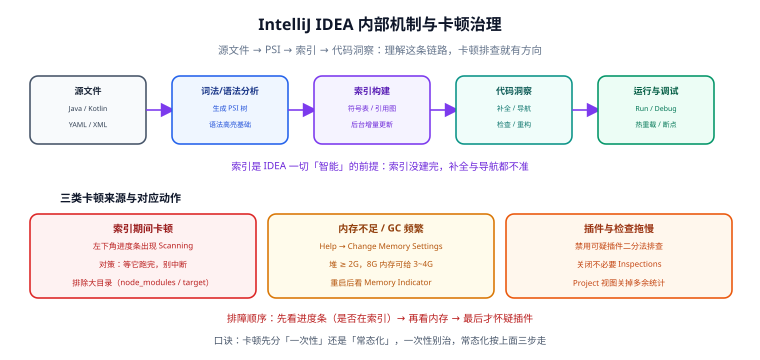

# IntelliJ IDEA 深入

IntelliJ IDEA 是 JVM 生态最主流的重型 IDE：它用一套**语义模型（PSI）+ 全项目索引**换取「重构安全、导航精准、框架能看懂」。代价是更高的内存与首次索引成本。本页讲**怎么把它配得又快又稳**，以及那些「不知道就会一直难受」的设置。



## 一句话定位

IDEA 的性能问题 90% 不是「它变慢了」，而是**索引、内存、插件三件事之一出状况**。分清这三类，绝大多数卡顿都能自己解决。

## 版本形态与授权（2026-09 现状）

这是最容易被旧资料误导的一节。

| 项目 | 现状 |
| --- | --- |
| 发行形态 | 自 **2025.3** 起为**统一产品**：不再分别下载 Community / Ultimate，只有一个安装包 |
| 免费范围 | 核心 Java / Kotlin 开发（编辑、导航、重构、调试、版本控制、Maven/Gradle 集成）**免费且可商用** |
| 订阅解锁 | Ultimate 订阅解锁 Spring 支持、完整 JVM 生态、数据库工具、Web 框架支持、企业级集成等 |
| 试用 | 新安装默认带 **30 天 Ultimate 试用**；试用结束不订阅也能继续用核心功能 |
| 当前版本线 | **2026.2 系列**（维护更新持续发布中），每年三个大版本：`2026.1 / 2026.2 / 2026.3` |
| AI 能力 | AI Assistant 与 Junie（编码 Agent）分层订阅（AI Free / Pro / Ultimate）。**IDEA 中不提供 AI Free 档**，需 AI Pro 及以上；可用区域与数据合规限制以官方许可页为准 |

::: danger 关于「先装 Community 版」的老建议
网上大量教程仍写「个人学习装 Community，公司项目装 Ultimate」。**统一发行版之后这个说法已经失效**：现在只有一个安装包，差别只在「有没有 Ultimate 订阅」。团队内部文档如果还留着旧说法，应当更新。
:::

## 安装与版本管理

### 安装渠道对比

| 渠道 | 优点 | 适合谁 | 注意 |
| --- | --- | --- | --- |
| JetBrains **Toolbox App** | 可同时装多个大版本、一键回滚、自动更新可控 | 绝大多数开发者 | 团队统一用它锁版本最省事 |
| 官方独立安装包 | 干净、可离线下发 | 内网环境、受管终端 | 升级要重新下载安装包 |
| Snap / Homebrew / AUR | 命令行一键升级 | Linux / macOS 用户 | 沙箱与权限可能影响部分功能 |

### 为什么团队应该「锁大版本线」

IDE 的小版本自动更新几乎无感，但**大版本升级会改变索引格式、检查规则与默认设置**：

- 索引重建：升级后首次打开项目要重新索引，大项目可能十几分钟；
- 检查规则变化：原来通过的新检查项可能让代码「突然飘黄」；
- 插件兼容：部分插件只支持特定 `since-build` 区间，大版本升级后可能不可用。

**做法**：

```text
1. 团队文档写「基线 = IDEA 2026.2 系列」，而不是写死补丁号
2. 用 Toolbox 关闭大版本自动升级，只允许自动安装补丁
3. 每季度安排一次「大版本升级窗口」：先由一人升级、跑通完整构建与测试，再放全员
4. 保留上一个版本可随时回退（Toolbox 支持多版本并存）
```

## 配置目录：出问题时该找哪里

IDEA 的配置分散在三个目录，排查与迁移时经常要用到。

| 平台 | 配置（Config） | 缓存与日志（System / Cache） | 插件 |
| --- | --- | --- | --- |
| Windows | `%APPDATA%\JetBrains\IntelliJIdea2026.2\` | `%LOCALAPPDATA%\JetBrains\IntelliJIdea2026.2\` | 配置目录下的 `plugins\` |
| macOS | `~/Library/Application Support/JetBrains/IntelliJIdea2026.2/` | `~/Library/Caches/JetBrains/IntelliJIdea2026.2/` | 同上 |
| Linux | `~/.config/JetBrains/IntelliJIdea2026.2/` | `~/.cache/JetBrains/IntelliJIdea2026.2/` | 同上 |

::: warning 版本号会出现在路径里
目录名带大版本号（如 `IntelliJIdea2026.2`），所以**升级大版本等于换了一个配置目录**，旧配置不会自动搬过去（IDE 首次启动会提示导入）。这也是「升级后设置全丢了」的常见原因。
:::

常用的三个子目录：

- `options/`：大部分设置以 XML 存放（代码风格、检查配置、编辑器设置）。**做 dotfiles 方案时主要备份这一层**。
- `keymaps/`：自定义快捷键。
- `plugins/`：插件目录，内网离线安装时可直接拷贝。

## 内存与 JVM 参数

IDEA 跑在 JVM 上，「越用越卡」经常就是堆不够或 GC 太频繁。

### 两种改法

| 方式 | 操作路径 | 适合场景 |
| --- | --- | --- |
| 图形界面 | `Help` → `Change Memory Settings` → 修改 `Maximum Heap Size` → 重启 | 90% 的情况，改完即可 |
| 直接改 vmoptions | `Help` → `Edit Custom VM Options`，或直接编辑配置目录下的 `idea64.exe.vmoptions`（Linux/macOS 为 `idea.vmoptions`） | 需要加 GC、JIT 等参数时 |

::: danger 别改安装目录里的 vmoptions
安装目录下的 `idea64.exe.vmoptions` 会在升级时被覆盖。**正确做法是用 `Help → Edit Custom VM Options`**，它写入的是用户配置目录，升级不丢。
:::

### 堆大小的取值建议

| 物理内存 | 建议 `-Xmx` | 说明 |
| --- | --- | --- |
| 8 GB | 2048 ~ 3072 MB | 再高会挤压系统与其他进程，反而更卡 |
| 16 GB | 4096 MB | 大多数单体项目的舒适区 |
| 32 GB 及以上 | 6144 ~ 8192 MB | 多模块大型项目；超过 8G 收益递减明显 |

补充参数（写在 vmoptions 的 `-XX:` 段）：

```text
-Xms1024m
-Xmx4096m
-XX:ReservedCodeCacheSize=512m
-XX:+UseG1GC
-XX:SoftRefLRUPolicyMSPerMB=50
```

::: tip 怎么判断「堆不够」
打开 `Settings` → `Appearance & Behavior` → `Appearance`，勾选 `Show memory indicator`，右下角会显示当前堆占用。频繁贴着上限并伴随界面停顿，就是该加堆了。
:::

## 索引机制与卡顿治理

### 索引链路

```text
源文件 → 词法/语法分析 → PSI 树 → 索引（符号表 + 引用图）→ 补全 / 导航 / 检查 / 重构
```

**关键结论**：索引不完整时，补全与导航会「时灵时不灵」，这不是 bug，是还没建完。

### 三类卡顿与对应动作

| 症状 | 常见原因 | 处理动作 |
| --- | --- | --- |
| 左下角一直显示 `Scanning` / `Indexing`，编辑器反应慢 | 正在建索引（首次打开、切换分支、大版本升级后） | **等它跑完**，不要在这期间做重构；确认 `node_modules`、`target`、`dist` 等目录被排除索引 |
| 用一段时间后越来越慢，内存指示器长期贴顶 | 堆不足、GC 频繁 | 调大 `-Xmx`；关闭不用的项目窗口；`File → Invalidate Caches` 清理索引缓存后重建 |
| 打开项目就慢、输入有延迟，索引并不在跑 | 插件或检查规则拖慢 | 用二分法禁用插件定位；精简 `Inspections` 中不用的规则 |

### 排除目录（最容易被忽略的一步）

`Settings` → `Directories`（`Project Structure` → `Modules` → `Sources`），把不参与开发的大目录标记为 **Excluded**：

```text
node_modules/   target/   build/   dist/   .git/   logs/   *.min.js
```

::: tip 效果
排除后这些目录不再被索引，大项目首次索引用时可以下降三分之一以上。前端与后端混在一个仓库的项目，这一步几乎是必做项。
:::

### 缓存重建

```text
File → Invalidate Caches… → 勾选 "Clear file system cache and Local History"
                            → Invalidate and Restart
```

::: danger 重建前先提交
清缓存会同时清掉本地历史（Local History）。**动手前先 `git commit` 或 `git stash`**，否则本地未提交的改动会失去最后一道兜底。
:::

## 项目结构与 .idea 目录

### 哪些该提交，哪些不该

`.idea/` 目录里混着「项目级配置」与「个人级配置」，全提交会造成大量无意义冲突。

| 文件 / 目录 | 建议 | 原因 |
| --- | --- | --- |
| `.idea/compiler.xml` | 提交 | 编译输出路径、注解处理器等，团队应一致 |
| `.idea/encodings.xml` | 提交 | 统一字符集，避免中文乱码 |
| `.idea/misc.xml` | 提交 | JDK 级别、项目 SDK 名称等 |
| `.idea/codeStyles/` | 提交 | **代码风格与团队一致的核心**，见 [配置同步与团队统一](../ConfigSync/index.md) |
| `.idea/inspectionProfiles/` | 提交 | 检查规则应统一 |
| `.idea/externalDependencies.xml` | 提交 | 声明项目**必需插件**，缺插件时 IDE 会提示安装 |
| `.idea/workspace.xml` | **不提交** | 打开的文件、窗口布局、运行历史，纯个人状态，冲突高发 |
| `.idea/usage.statistics.xml`、`shelf/`、`.idea/*.iml`（按需） | 不提交 | 个人使用统计与本地搁置 |
| `.idea/dataSources*.xml` | **谨慎** | 可能含数据库密码等敏感信息 |
| `.idea/httpRequests/` | 不提交 | HTTP Client 的历史响应 |

推荐的 `.gitignore` 片段：

``` text
# IDE 个人状态
.idea/workspace.xml
.idea/usage.statistics.xml
.idea/shelf/
.idea/httpRequests/
# 可能含敏感信息
.idea/dataSources*.xml
.idea/dataSources.local.xml
```

::: danger 不要整体忽略 .idea/
`gitignore` 里写 `.idea/` 一刀切是常见做法，但代价是**代码风格与必需插件无法共享**——新人 clone 后风格就是 IDE 默认值。正确做法是按文件粒度忽略。
:::

## 运行与调试配置

### Run Configuration 的组成

一个运行配置基本由四块决定：**启动类 / 模块与类路径 / 环境与 VM 参数 / 工作目录**。

| 字段 | 作用 | 常见错误 |
| --- | --- | --- |
| Main class | 入口类 | 有多个 `main` 时选错，表现为「跑起来没反应」 |
| Use classpath of module | 用哪个模块的类路径 | 多模块项目选错模块 → `NoClassDefFoundError` |
| VM options | JVM 参数 | 写了 `-Dspring.profiles.active=dev` 却在程序参数里重复配 |
| Program arguments | 业务参数 | 与 VM options 混用，`-D` 参数放进 Program arguments 会失效 |
| Working directory | 相对路径的基准 | 读 `./config/*.yml` 类相对路径时出错 |

推荐把常用环境固化成多个配置并放进 `Run/Debug Configurations` 的**共享**区（勾选 `Store as project file`），这样会写入 `.idea/runConfigurations/` 并随仓库共享。

### Logpoints：不中断、不重启的运行时排查

2026.2 系列引入/强化的 **Logpoints（日志断点）** 允许你**不中断程序**输出表达式与上下文，等价于「动态插入 `System.out.println` 但不用改代码、不用重新编译」。

适用场景：

- 想知道某个方法被调用了几次、入参是什么，但不想暂停程序；
- 生产环境排查时不能随意加日志（需配合远程调试）。

::: tip 与普通断点的取舍
普通断点会让线程停下、影响时序（并发问题甚至因此不复现）；**排查时序相关与高频调用问题优先用 Logpoints**。
:::

### 远程调试

```text
# 1. 被调试的 Java 进程加上（JDK 9+ 语法，端口 5005）
java -agentlib:jdwp=transport=dt_socket,server=y,suspend=n,address=*:5005 -jar app.jar

# 2. IDEA 侧：Run → Edit Configurations → + → Remote JVM Debug
#    Host: <目标主机 IP>，Port: 5005

# 3. Docker 容器里还需把端口映射出来
docker run -p 5005:5005 -e JAVA_TOOL_OPTIONS="-agentlib:jdwp=transport=dt_socket,server=y,suspend=n,address=*:5005" app:latest
```

::: danger 三个必知的点
1. `suspend=y` 会让目标进程**卡在启动处等你附加**，生产环境误用等于造成故障，排查完必须确认参数已移除。
2. `address=*:5005` 表示监听所有网卡，**只应在受控网络使用**；更安全的做法是绑 `127.0.0.1` 再走 SSH 端口转发。
3. 远程调试会**小幅拖慢目标进程**（断点命中时线程阻塞），不要在核心生产实例上长时间挂着。
:::

## 编译器与 Maven/Gradle 的联动

这一节是本专题与项目实践关联最紧的部分——**IDE 里改的编译目标，和命令行 Maven 的编译目标经常不一致**，这是「我这边能跑 CI 跑不过」的高频原因。

### 三条独立的「JDK 概念」

| 概念 | 在哪里配 | 决定什么 |
| --- | --- | --- |
| IDE 自身运行的 JDK | `Help` → `Change Boot JDK Version`（或安装时选定） | IDE 本身的性能与兼容性 |
| Project SDK / Language level | `Project Structure` → `Project` | IDE 代码分析按哪个版本解释语法与 API |
| 构建实际使用的 JDK（toolchain） | Maven/Gradle 的 toolchain 配置 | **真正编译出字节码的 JDK** |

::: danger 「IDE 里改了就能跑了」是错觉
IDEA 默认可以**自己执行编译**（`Build → Build Project`），它会用 Project SDK，而 Maven 命令行走的是 `pom.xml` 里的 `maven.compiler.release` 与 toolchain。两者不一致时：
- IDE 里编译通过 → 命令行 `mvn clean package` 失败（或反之）；
- 更隐蔽的情况：两边都通过，但产物字节码版本不同，部署后才暴露 `UnsupportedClassVersionError`。

**对策**：把三处对齐——`pom.xml` 的 `maven.compiler.release`、toolchain 指定的 JDK、`Project Structure` 的 SDK 与 Language level。日常以 Maven 为准，IDE 只是它的一个前端。
:::

### 让 IDE 跟随 Maven

| 设置 | 位置 | 建议 |
| --- | --- | --- |
| 构建委托给 Maven | `Settings` → `Build Tools` → `Maven` → `Runner` → 勾选 `Delegate IDE build/run actions to Maven` | 多模块项目强烈建议开启，避免 IDE 与 Maven 两套编译结果 |
| 自动导入 | `Settings` → `Build Tools` → `Maven` → `Importing` → `Automatically download` 与自动重载 `pom.xml` | 开启，否则改完 `pom.xml` 类路径不更新 |
| 使用 `.mvn/maven.config` | 项目根有该文件时 IDE 会自动读取 | 三轴 Profile 的默认激活就靠它，见下 |

仓库里 `project/Base/BackendTemplate/Skeleton/index.md` 给出了用 **Maven Profile + Toolchains** 管理「同一大版本下不同小版本与 JDK 目标」的完整方案，其中 `.mvn/maven.config` 会被 IDE 与命令行同时读取：

```text
# .mvn/maven.config（随仓库提交）
-P boot-4.1.1,jdk-25
```

::: warning IDE 里的 Profile 面板与命令行不是一回事
IDEA 的 Maven 工具窗口可以勾选 Profile，但那是**本次导入/运行的临时选择**；命令行 `-P` 与 `.mvn/maven.config` 是**求并集**的关系。直接照抄别人的 Profile 勾选，很容易出现「IDE 跑的是 A 组合、CI 跑的是 B 组合」。
:::

### Gradle 项目补充

| 项目 | 做法 |
| --- | --- |
| 构建/运行委托 | `Settings` → `Build Tools` → `Gradle` → `Build and run using` 选 `Gradle`（而非 IntelliJ IDEA） |
| JDK 指定 | `Gradle JVM` 选与 `build.gradle` 中 toolchain 一致的值 |
| 依赖刷新 | 关闭 `Offline mode`，否则新依赖永远下不下来 |

## 代码风格与 EditorConfig

### 两条规则要分清

| 机制 | 作用范围 | 优先级 |
| --- | --- | --- |
| `.editorconfig` | 跨编辑器，只管缩进/换行/字符集等基础项 | IDE 内置支持，**默认开启**，会覆盖 IDE 里的同名基础设置 |
| IDE 代码风格（`.idea/codeStyles/`） | IDEA 专有，涵盖格式化规则的完整细节（空行、导入顺序、换行策略等） | 只对 IDEA 生效 |

**结论**：两者都要有。`.editorconfig` 保证「不同工具的人看起来一致」，`.idea/codeStyles/` 保证「IDEA 用户之间完全一致」。

### 强制从 .editorconfig 读取

```text
Settings → Editor → Code Style → 勾选 "Enable EditorConfig support"
```

之后 IDEA 会对 `.editorconfig` 中出现的属性**禁用**其界面设置，避免两套规则打架。

### 格式化的标准操作

| 操作 | 说明 |
| --- | --- |
| `Ctrl+Alt+L` | 格式化当前文件 |
| `Ctrl+Alt+Shift+L` | 打开格式化对话框（可只对选中范围、只优化导入） |
| 提交前自动格式化 | `Settings` → `Tools` → `Actions on Save` → 勾选 `Reformat code`、`Optimize imports` |

::: danger Actions on Save 的取舍
开启 `Reformat code` 会让「提交即产生大量格式 diff」，如果团队里有人没开，就会互相覆盖。**更稳的做法是：仓库里有 `.editorconfig` + 格式化工具（Prettier / google-java-format / spotless），由 CI 做最终门禁**，IDE 的自动格式化只作为个人便利。
:::

## 常用效率功能清单

| 功能 | 入口 | 用途 |
| --- | --- | --- |
| Live Templates | `Settings` → `Editor` → `Live Templates` | 输入 `sout`、`psvm` 展开代码片段；可自定义团队模板 |
| Postfix Completion | 输入 `.` 后触发（如 `list.for`、`str.if`） | 以「后缀」形式补全常用结构 |
| Structural Search | `Edit` → `Find` → `Search Structurally` | 按语法结构搜索，如「所有没用 try-with-resources 的流」 |
| Inlay Hints | `Settings` → `Editor` → `Inlay Hints` | 行内显示参数名、推断类型，减少来回跳转 |
| Recent Files / Locations | `Ctrl+E` / `Ctrl+Shift+E` | 快速回到刚改过的文件与位置 |
| Local History | 右键 → `Local History` → `Show History` | 未提交改动的「后悔药」（清缓存前务必留意） |

## 实战：把一个大项目配到「不卡」

场景：多模块 Maven 项目 + 前端目录混放，首次打开索引 12 分钟，日常输入有延迟。

```text
① 排除不参与开发的目录（node_modules / target / dist）
② 调堆：Help → Change Memory Settings → 4096 MB → 重启
③ 委托构建给 Maven：Settings → Build Tools → Maven → Runner
   勾选 "Delegate IDE build/run actions to Maven"
④ 对齐三处 JDK：pom 的 maven.compiler.release = toolchain 的 JDK = Project SDK
⑤ 精简检查：关闭不用的 Inspections 分组（如 SQL、Kotlin 相关）
⑥ 观察：Show memory indicator 打开，连续工作 1 小时不应长期贴顶
```

预期结果：

- 首次索引用时明显下降（排除目录的收益最大）；
- 连续编码 1 小时无周期性停顿（GC 不再频繁）；
- `Build → Build Project` 与 `mvn -q clean package` 结果一致。

## 验证方式

```shell
# 1. 确认 IDE 版本与 Build 号
#    路径：Help → About（期望形如 IntelliJ IDEA 2026.2.2）

# 2. 确认堆设置真的生效
#    路径：Settings → Appearance & Behavior → Appearance → Show memory indicator
#    期望：右下角出现形如 "512M of 4096M" 的指示器

# 3. 确认构建委托生效（改一处语法错误，用 IDE 构建应报同样的错）
#    预期日志：命令行出现 Maven 的 output，而非 IDEA 自带的编译器输出

# 4. 确认 IDE 与命令行编译目标一致
mvn -q clean package -DskipTests
javap -v -cp template-application/target/classes \
  com.example.template.TemplateApplication | grep "major version"
# 期望：major version 与 maven.compiler.release 的换算一致（release 25 → major 69）
```

::: info 关于本文的验证环境
本文的设置项按 **IntelliJ IDEA 2026.2 系列官方文档**编写。菜单路径在不同大版本间偶有微调，若与你的 IDE 不一致，以 `Settings` 中的搜索框（直接搜设置名）为准。
:::

## 常见问题与坑

::: danger 十个高频坑
1. **升级大版本后设置全丢**：配置目录名带版本号，升级等于换目录。提前备份 `options/`，或用 Settings Sync。
2. **改安装目录的 vmoptions**：升级被覆盖。改用 `Help → Edit Custom VM Options`。
3. **整个 `.idea/` 一刀切忽略**：代码风格与必需插件无法共享，新人体验断层。按文件粒度忽略。
4. **提交 `workspace.xml`**：打开的文件、窗口布局、运行历史全在里面，多人协作必然冲突。
5. **`Invalidate Caches` 前不提交**：会连本地历史一起清掉，未提交改动失去兜底。
6. **IDE 编译目标与 Maven 不一致**：以 Maven 为准，开启「委托 IDE 构建给 Maven」。
7. **远程调试用 `suspend=y` 上生产**：目标进程会卡在启动处，等同故障。
8. **索引没跑完就重构**：补全与导航不可靠，重构结果可能不符合预期。
9. **`Actions on Save` 全员不一致**：格式 diff 互相覆盖，应由 CI 统一兜底。
10. **`.idea/dataSources*.xml` 入库**：可能带数据库账号密码，务必加入 `.gitignore` 并检查历史提交。
:::

::: tip 最佳实践五条
1. **以 Maven / Gradle 为唯一事实来源**，IDE 只做前端。
2. **把「团队必须一致」的东西写进仓库**：`.editorconfig`、`.idea/codeStyles/`、`.idea/inspectionProfiles/`、`.editorconfig` 之外的必需插件清单。
3. **升级有窗口**：大版本先一人验证，再全员放量，并保留可回退版本。
4. **性能问题按「索引 → 内存 → 插件」顺序排查**，不要一上来重装。
5. **本地历史不是备份**：重要改动先提交，再动缓存与重构。
:::

## 相关文档

- [IDE 配置总览](../index.md)：生态、选型与版本状态速览。
- [快捷键与高效操作](../Shortcuts/index.md)：IDEA 键位与 VS Code 对照、自定义 keymap。
- [配置同步与团队统一](../ConfigSync/index.md)：`.idea/codeStyles/` 怎么管、怎么让新人 30 分钟上手。
- [远程开发与容器化环境](../RemoteDev/index.md)：JetBrains Gateway 的用法。
- [后端通用模板 · 骨架与目录结构](../../../../project/Base/BackendTemplate/Skeleton/index.md)：Maven Profile 与 Toolchains 的完整落地方案。
- [Java 环境搭建](../../../Backend/Java/JavaSE/Environment/index.md)：JDK 安装与多版本管理。

## 参考资料

- IntelliJ IDEA 官方文档（含内存、索引、构建工具设置）：[jetbrains.com/help/idea](https://www.jetbrains.com/help/idea/)
- IDEA 统一产品说明与 FAQ：[jetbrains.com/idea/download](https://www.jetbrains.com/idea/download/)
- JetBrains AI 分层与配额说明：[jetbrains.com/help/ai-assistant](https://www.jetbrains.com/help/ai-assistant/)
- JetBrains 博客（版本更新公告）：[blog.jetbrains.com/idea](https://blog.jetbrains.com/idea/)
- EditorConfig 规范：[editorconfig.org](https://editorconfig.org/)
