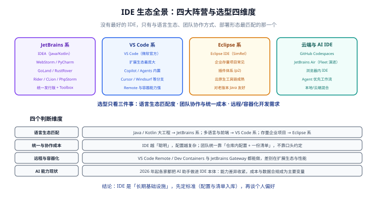

# 概述与选型

IDE（Integrated Development Environment，集成开发环境）不止是「能写代码的窗口」：它把**编辑、导航、重构、构建、调试、版本控制**揉在一个进程里，并用索引与语义分析把「找代码」的成本从分钟级压到秒级。本页回答三个问题：**IDE 现在长什么样、2026 年发生了什么变化、我该怎么选**。



## 一句话定位

选 IDE 的本质是选**一套长期成本结构**：它决定了你每天的操作手感、团队的协作摩擦、以及机器与网络的依赖程度。功能对比表只值五分钟，成本结构要想清楚再决定。

## IDE 与「编辑器」的边界

这两类工具的差别不在「功能多少」，而在**默认假设**：

| 维度 | 编辑器（Editor） | IDE |
| --- | --- | --- |
| 默认假设 | 你清楚自己要什么，工具尽量不挡路 | 工具比你更了解这个工程 |
| 起步成本 | 打开文件夹即可 | 需要识别项目结构、建索引 |
| 智能程度 | 依赖语言服务器（LSP），按语言装 | 内建语义模型（PSI），跨语言、跨模块理解 |
| 擅长场景 | 改配置、写文档、临时脚本、多语言轻量开发 | 大型单体/多模块工程、重构、调试、框架深度支持 |
| 典型代表 | VS Code、Sublime Text、Zed、Neovim | IntelliJ IDEA、PyCharm、GoLand、Eclipse、Rider |

::: tip 边界在移动
现代 VS Code 装上语言服务器后，体验已经很接近 IDE；而 IntelliJ 系也在做「打开即用」的轻量化。**真正的分水岭是「工程语义理解深度」和「重构安全性」**，不是界面长相。
:::

## 2026 年的四项结构性变化

这一节是本专题的「时效锚点」——如果你在看一两年前的教程，下面四点大概都没提。

### 变化一：JetBrains 系改成统一发行版

自 **2025.3** 起，IntelliJ IDEA 不再分别发行 Community Edition 与 Ultimate，而是**一个安装包**：

- 核心 Java / Kotlin 开发功能（编辑、导航、重构、调试、版本控制、构建工具集成）**免费**，可商用；
- 高级能力（业界领先的 Spring 支持、完整 JVM 生态、数据库工具、Web 框架支持、企业级集成）由 **Ultimate 订阅**解锁；
- 新安装默认带 **30 天 Ultimate 试用**，试用结束不订阅也能继续用核心功能。

PyCharm 走的是同一路线（统一产品 + 30 天 Pro 试用）。**影响**：团队里再讨论「用 Community 还是 Ultimate」时要先纠正——现在是同一份安装包，「有没有订阅」而不是「装哪个版本」。

::: warning
统一发行版之后，网上大量「Community vs Ultimate 功能对照表」已经过期。要判断某项功能是否免费，直接看官方当前的功能与订阅页，不要引用旧对比文章。
:::

### 变化二：AI 助手从「插件」变成「本体」

2026 年各家的做法趋同：把 AI 能力做进 IDE 本体，而不是让用户去装插件。

| 产品 | AI 形态 | 需要注意的点 |
| --- | --- | --- |
| IntelliJ IDEA 2026.2 | AI Assistant + Junie（编码 Agent）、支持第三方 Agent（Claude Agent、Codex、GitHub Copilot）与 MCP 扩展 | 分层订阅（AI Free / Pro / Ultimate），**IDEA 里不提供 AI Free 档，需要 AI Pro 及以上**；可用区域与数据合规限制以官方许可页为准 |
| VS Code 1.13x | 内置 Copilot 与 **Agents 窗口**，新增 Automations（定时 Agent 任务）与 Voice Mode（实验） | 企业环境要关注组织级策略开关，例如管理员可关闭预览特性 |
| 其他 | 大量 VS Code 分支（Cursor 等）以 Agent 优先为卖点 | 分支版本的扩展兼容性与数据流向需单独评估 |

**影响**：AI 能力正在从「选型加分项」变成「成本与合规变量」。团队选型时该问的问题变成：**模型调用走谁的账、代码是否会离开内网、关闭 AI 后 IDE 是否还能正常工作**。

### 变化三：Agentic 开发环境作为新形态出现

JetBrains 已停止分发 **Fleet**（自 2025-12-22 起不再更新与下载），并把团队转向基于 Fleet 平台的**智能体开发环境 Air**。这背后的判断值得记住：

> 传统 IDE 的工作流是**同步、即时反馈、单一稳定本地状态**；Agent 工作流是**结构化任务定义、多轮异步执行、隔离运行、先审后合**。把两者塞进同一个工具，体验会割裂。

**影响**：不要把 Agent 工具当成「IDE 的新版本」，它是另一类工具。短期内现实的做法是「IDE 负责改代码、Agent 负责批量任务」，两者并行。

### 变化四：发版节奏加快，固定版本号越来越没意义

VS Code 2026 年内已发布 1.111~1.137 共 27 个版本；JetBrains 保持每年三个大版本（`2026.1 / 2026.2 / 2026.3`）+ 若干补丁；Eclipse 坚持 13 周一个发布列车。

**影响**：团队文档里写「请使用 XX 版本」的价值正在下降。更稳的写法是：**写「大版本线 + 升级节奏 + 回退方式」**，把具体补丁号交给工具自动更新。

## 主流方案横向对比

只列有代表性的六个，覆盖「重型 IDE / 轻量编辑器 / 企业存量 / 云端」。

| 方案 | 定位 | 语言强项 | 插件生态 | 远程/容器 | 许可与成本 | 适合谁 |
| --- | --- | --- | --- | --- | --- | --- |
| IntelliJ IDEA | 重型 IDE | Java / Kotlin / JVM 生态 | JetBrains Marketplace，质量高、数量少 | Gateway + 远程后端、Dev Containers、WSL | 免费核心 + Ultimate 订阅 | JVM 后端团队、大型多模块工程 |
| VS Code | 轻量编辑器 + 扩展平台 | 全语言（靠扩展），前端/脚本最强 | 数量最庞大，质量方差大 | Remote-SSH / Dev Containers / WSL / Tunnels 最成熟 | 免费（二进制分发许可需留意，非纯 OSS 构建） | 前端、全栈、脚本、多语言混合团队 |
| JetBrains 其他 IDE | 分语言重型 IDE | Web / Python / Go / Rust / .NET / PHP | 同 JetBrains 体系 | 同 IDEA | 免费核心 + 对应 Pro/Ultimate 订阅 | 专精某语言但想用 JetBrains 体验 |
| Eclipse IDE | 企业级 IDE 平台 | Java（ECJ 编译器独立可用） | p2 插件体系，云原生工具链成熟 | 有远程开发支持，配置偏重 | 免费开源（EPL） | 存量企业项目、需要特定 Eclipse 插件链 |
| 云端 IDE（Codespaces 等） | 浏览器内开发环境 | 全语言 | 多为 VS Code 兼容扩展 | 天然远程，即开即用 | 按量计费 | 临时环境、培训、演示、评审 |
| Agent 优先工具 | 任务驱动的开发环境 | 全语言 | 新生态，仍在形成 | 天然隔离运行 | 多数按模型用量计费 | 批量重构、测试补齐、代码库探索 |

::: danger 选型时最容易踩的四个坑
1. **用「谁功能多」来选**。功能多 ≠ 适合你：重型 IDE 在小型脚本项目上只会让你等索引。
2. **用「同事都在用」来选**。团队一致性确实重要，但应该先确定「必须一致的清单」，再决定用哪套工具承载它。
3. **忽略许可与数据链路**。免费不等于无限制，AI 能力尤其：先确认代码会不会离开你的网络。
4. **只看本地体验**。如果你要连内网服务器改代码，远程开发能力的优先级会在「UI 好不好看」之上。
:::

## 选型决策

### 四个判断维度

| 维度 | 判断要点 | 结论倾向 |
| --- | --- | --- |
| 语言生态匹配 | 主力语言是否为该 IDE 的「一等公民」？框架支持（Spring、Vue、React）是否深度集成？ | JVM 大工程 → JetBrains 系；多语言 / 前端 → VS Code 系；特定企业插件链 → Eclipse |
| 统一与协作成本 | 团队能否用仓库内配置文件统一风格与插件？IDE 自身的配置文件是否适合入库？ | 配置越简单可共享的部分，协作成本越低 |
| 远程与容器化需求 | 代码要不要跑在服务器/容器里？网络延迟能否接受？ | 强需求 → 优先看 Remote / Gateway 成熟度 |
| 成本与合规 | 订阅费用、AI 用量、代码出境、数据留存策略 | 有合规红线时，本地模型或关闭 AI 才可接受 |

### 决策树

```text
主力语言是 Java / Kotlin，且项目是多模块大工程？
├─ 是 → IntelliJ IDEA（配 Gateway 做远程）
└─ 否 → 继续
     │
     团队成员语言背景分散（前端 + 后端 + 脚本 + 运维）？
     ├─ 是 → VS Code（用 .vscode/ + .editorconfig 统一）
     └─ 否 → 继续
          │
          项目必须复用某个只在 Eclipse 生态可用的插件链？
          ├─ 是 → Eclipse IDE（2026-09 发布列车）
          └─ 否 → 继续
               │
               需要「零配置、用完即弃」的环境（培训 / 评审 / 演示）？
               ├─ 是 → 云端 IDE
               └─ 否 → 按团队习惯选 VS Code 或 IDEA，并要求「配置进仓库」
```

### 版本状态与维护策略

参考仓库根目录 [AGENTS.md](../../../../AGENTS.md) 的版本管理约定，本专题对版本采用「主线 / 维护中 / 仅存量」三档标注：

| 档位 | 含义 | 本专题中的例子 |
| --- | --- | --- |
| 主线 | 推荐使用，文档与插件兼容性有保证 | IntelliJ IDEA 2026.2 系列、VS Code 1.13x、Eclipse 2026-09 |
| 维护中 | 仍可用，官方只修缺陷不再加功能 | 上一个 JetBrains 大版本线、VS Code 上一个 1.1xx |
| 仅存量 | 不再更新，仅用于维护遗留项目 | JetBrains Fleet（已停止分发）、Eclipse 2026-03 及更早 |

## 术语表

| 术语 | 全称 / 含义 | 一句话解释 |
| --- | --- | --- |
| IDE | Integrated Development Environment | 集成开发环境，把编辑、构建、调试等揉进一个工具 |
| LSP | Language Server Protocol | 语言服务器协议，编辑器与语言能力之间的标准接口 |
| DAP | Debug Adapter Protocol | 调试适配器协议，编辑器的调试前端与各语言调试后端之间的接口 |
| PSI | Program Structure Interface | IntelliJ 的语义模型，索引与重构的基础 |
| Extension Host | — | VS Code 中运行所有扩展的独立进程 |
| `.editorconfig` | — | 跨编辑器的代码风格声明文件，缩进/换行/字符集的事实标准 |
| Dev Container | Development Container | 用容器定义开发环境，`devcontainer.json` 是规范入口 |
| Toolchain | 工具链 | 构建时真正使用的 JDK / 编译器集合，与「运行 Maven 的 JDK」是两回事 |

## 验证方式

本页内容可以在 5 分钟内自证——确认你本地工具的版本与形态：

```shell
# 1. 查看 VS Code 版本（期望输出形如 1.137.x）
code --version

# 2. 查看 IntelliJ IDEA 版本（macOS 示例，Windows 在安装目录 bin 下）
#    IDEA 的版本号形如 IDEA 2026.2.2
#    界面路径：Help → About
echo "IDEA: 打开 Help → About 查看版本与 Build 号"

# 3. 确认你的仓库里是否存在跨编辑器风格声明文件
ls -l .editorconfig
# 期望：文件存在；不存在则说明团队风格只写在某个 IDE 里，别人换个工具就不一致
```

预期结论：

- 你能准确说出自己 IDE 的**大版本线**（如 `2026.2` / `1.13x`），而不是只知道「最新版」；
- 你能说出团队里「必须一致」的配置项有哪几项，以及它们现在写在哪里；
- 如果答案是「不知道」，先读 [配置同步与团队统一](../ConfigSync/index.md)。

## 参考资料

- IntelliJ IDEA 官方下载与统一产品说明：[jetbrains.com/idea/download](https://www.jetbrains.com/idea/download/)
- VS Code 1.137 发布说明：[code.visualstudio.com/updates](https://code.visualstudio.com/updates)
- Eclipse 发布列车日程：[github.com/eclipse-simrel](https://github.com/eclipse-simrel/.github/blob/main/wiki/Simultaneous_Release.md)
- JetBrains 关于 Fleet 与后续产品方向的说明：[blog.jetbrains.com](https://blog.jetbrains.com/fleet/2025/12/the-future-of-fleet/)
- Language Server Protocol 官方站点：[microsoft.github.io/language-server-protocol](https://microsoft.github.io/language-server-protocol/)
- Debug Adapter Protocol 官方站点：[microsoft.github.io/debug-adapter-protocol](https://microsoft.github.io/debug-adapter-protocol/)
