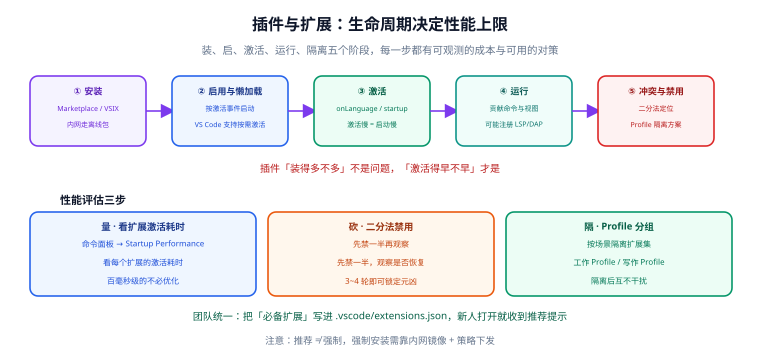

# 插件与扩展

插件是 IDE 的「第二产品」：它决定你的工具能长成什么样，也决定它会不会越用越慢。本页讲**怎么选、怎么装、怎么控制性能、怎么让团队一致**。



## 一句话定位

插件本身不慢，**「提前激活的插件」才慢**。选插件的标准不是「装了多少」，而是「有几个在启动时就必须干活」。

## 两套插件体系对比

| 维度 | JetBrains 插件 | VS Code 扩展 |
| --- | --- | --- |
| 官方市场 | JetBrains Marketplace | Visual Studio Marketplace |
| 开放市场 | 无对应物 | [Open VSX](https://open-vsx.org/)（VSCodium、部分云端 IDE 使用） |
| 数量 | 少而精，审核相对严格 | 数量最庞大，质量方差大 |
| 隔离性 | 大量插件**与 IDE 同进程**，出问题可能拖垮整个 IDE | 扩展默认在 **扩展宿主进程**，可隔离运行 |
| 语言无关能力 | 靠 IDE 平台 API | 靠扩展 API + LSP/DAP |
| 兼容声明 | `plugin.xml` 的 `since-build` / `until-build` | `package.json` 的 `engines.vscode` |
| 离线安装 | 下载 zip 后 `Settings → Plugins → ⚙ → Install Plugin from Disk` | 下载 `.vsix` 后 `code --install-extension xxx.vsix` |
| 企业策略 | 可用 License Server / 私有插件仓库 | 可用私有 Marketplace 与 `extensions.gallery` 策略控制 |

::: danger 微软系扩展的许可限制
部分微软官方发布的扩展（如 C#、C# Dev Kit、部分 Remote 组件、Pylance）**只授权在官方 VS Code 中使用，且不发布到 Open VSX**。这意味着用 VSCodium、Cursor 等第三方分支时，这些扩展可能**装不上或使用受限**。团队若使用分支编辑器，选型阶段就要把这条纳入评估。
:::

## 插件是怎么被加载的

| 阶段 | 发生了什么 | 你能控制什么 |
| --- | --- | --- |
| 安装 | 下载到插件目录 | 走市场还是离线包 |
| 启用 | 被标记为可用，但**尚未运行** | 关闭不用的插件 |
| 激活 | 满足激活条件后才真正加载代码 | 延迟激活（按语言/按命令） |
| 运行 | 贡献命令、视图、监听器、语言服务 | 冲突时禁用或换替代品 |
| 隔离 | 放入独立进程或独立 Profile | 性能与稳定性兜底 |

**结论**：优化点在「激活」这一步。一个只在打开 `.sql` 时才需要激活的插件，对启动耗时的影响应该接近零；如果你观察到它拖慢了启动，说明激活条件写得不好。

## IntelliJ IDEA 推荐清单

按「团队必备 / 按需 / 谨慎」三档给，避免一律「装就完了」。

### 团队必备

| 插件 | 作用 | 为什么必备 |
| --- | --- | --- |
| **Lombok** | 识别 `@Data`、`@Builder` 等注解生成的代码 | 不装则 IDE 中对 lombok 类型「全是红」，与命令行构建结果不一致 |
| **Chinese (Simplified) Language Pack** | 官方中文语言包 | 团队若用中文界面，装它比各自找汉化包安全 |
| **EditorConfig** | 由 IDE 内置支持，确认已启用 | 与 `.editorconfig` 联动，是跨工具一致性的基础 |
| **SonarQube for IDE** | 本地静态检查，与 CI 的 Sonar 规则对齐 | 把问题拦在提交前，减少返工 |
| **CheckStyle-IDEA** | 接入团队 `checkstyle.xml` | 让「格式问题」在 IDE 里就暴露 |
| **Maven Helper** | 依赖冲突分析（Dependency Analyzer） | `NoSuchMethodError` 类问题的定位利器 |

### 按需

| 插件 | 适合场景 |
| --- | --- |
| GitToolBox | 想直接在编辑器里看到行级 blame 与提交信息 |
| .ignore | 频繁维护 `.gitignore` / `.dockerignore` |
| MyBatisX | 使用 MyBatis / MyBatis-Plus，需要在 Mapper 与 XML 间跳转 |
| String Manipulation | 经常做大小写转换、排序、转义 |
| PlantUML Integration | 用代码画时序图/架构图，且团队已有图源仓库 |
| Key Promoter X | 想通过「每次用鼠标就提示快捷键」来纠正习惯 |
| IdeaVim | 已有 Vim 肌肉记忆，想在 IDEA 中沿用 |

### 谨慎

| 插件 | 风险 |
| --- | --- |
| 大量「美化 / 括号高亮 / 装饰」类插件 | 全部作用于编辑器渲染路径，叠加后输入延迟明显 |
| 来源不明的「破解 / 激活」类插件 | 供应链风险极高，可能植入凭据窃取代码 |
| 与已有插件功能重叠的（如两个代码统计插件） | 重复监听文件事件，收益为零 |
| 未声明 `until-build` 兼容区间的小众插件 | 大版本升级后直接不可用，甚至导致 IDE 启动异常 |

::: warning 插件供应链也是供应链
企业环境应把 IDE 插件纳入依赖治理：明确来源（只用官方 Marketplace）、记录清单与版本、定期做漏洞扫描。相关方法论见 [SBOM 与软件供应链](../../../Ops/SecurityHardening/SbomSupplyChain/index.md)。
:::

## VS Code 推荐清单

### 通用必备

| 扩展 | 扩展 ID | 作用 |
| --- | --- | --- |
| EditorConfig for VS Code | `EditorConfig.EditorConfig` | 让 VS Code 读取 `.editorconfig`（**本体不内置**） |
| Prettier | `esbenp.prettier-vscode` | 统一格式化，前端与文档工程几乎必备 |
| ESLint | `dbaeumer.vscode-eslint` | JS/TS 静态检查，与 CI 规则对齐 |
| GitLens | `eamodio.gitlens` | 行级 blame、历史对比 |
| Error Lens | `usernamehw.errorlens` | 把错误直接显示在行尾，少一次悬停 |
| Code Spell Checker | `streetsidesoftware.code-spell-checker` | 拼写检查，对英文注释与变量名有效 |
| SonarQube for IDE | `sonarsource.sonarlint-vscode` | 与 Sonar 规则对齐的本地检查 |

### 按语言

| 语言 | 扩展 | 备注 |
| --- | --- | --- |
| Java | `vscjava.vscode-java-pack` | 扩展包，含语言支持、调试、测试、Maven |
| Spring | `vmware.vscode-boot-dev-pack` | Spring Boot 开发包；发布者 ID 历史上有变更，以市场页为准 |
| Python | `ms-python.python` | 官方扩展，含调试与测试 |
| Go | `golang.go` | 官方 Go 扩展 |
| Rust | `rust-lang.rust-analyzer` | rust-analyzer 前端的官方分发 |
| Vue | `vue.volar` | Vue 3 官方推荐 |
| Tailwind | `bradlc.vscode-tailwindcss` | 类名补全与预览 |

### 远程开发（见 [远程开发与容器化环境](../RemoteDev/index.md)）

| 扩展 | 扩展 ID |
| --- | --- |
| Remote - SSH | `ms-vscode-remote.remote-ssh` |
| Dev Containers | `ms-vscode-remote.remote-containers` |
| WSL | `ms-vscode-remote.remote-wsl` |

::: danger 扩展 ID 会变，别写死在文档里就完事
扩展的发布者可能更换（历史上多次发生），ID 也随之变化。**团队文档里写 ID 的同时，附上「市场搜索关键字」**，避免 ID 失效后新人找不到扩展。
:::

## 内网与离线安装

内网或受管终端无法访问公网市场时，走离线安装。

### JetBrains 插件离线安装

```text
方式一（推荐）：Settings → Plugins → ⚙ → Install Plugin from Disk…
             选择下载好的插件 zip/zip 包

方式二：把插件解压后的目录拷贝到配置目录的 plugins/ 下
       Windows: %APPDATA%\JetBrains\IntelliJIdea2026.2\plugins\
       macOS  : ~/Library/Application Support/JetBrains/IntelliJIdea2026.2/plugins/
       Linux  : ~/.config/JetBrains/IntelliJIdea2026.2/plugins/

注意：从市场页面的 "Versions" 标签下载时，务必核对
      与你的 IDE 大版本匹配的 since-build / until-build 区间
```

### VS Code 扩展离线安装

```shell
# 在有网的机器上先下载 .vsix（市场页面 → 右侧 Download Extension）
# 或使用 vsce / ovsx 之类工具批量下载

# 在目标机器上安装
code --install-extension /path/to/publisher.name-1.2.3.vsix --force

# 卸载
code --uninstall-extension publisher.name

# 列出已装（生成团队清单）
code --list-extensions
```

::: tip 企业做法
更稳的方案不是「一个个拷 vsix」，而是**搭一个内网镜像市场**（VS Code 支持配置私有扩展库，JetBrains 有企业插件仓库方案），再用组织策略把市场地址指向内网。这样版本与来源都可审计。
:::

## 版本兼容声明

| 体系 | 声明位置 | 字段 | 含义 |
| --- | --- | --- | --- |
| JetBrains | 插件包内 `plugin.xml` | `since-build` / `until-build` | 支持的 IDE 版本区间（形如 `262.*` 对应 2026.2 系列） |
| VS Code | 扩展内 `package.json` | `engines.vscode` | 最低支持的 VS Code 版本，如 `^1.100.0` |

**实践要点**：

1. 升级 IDE 大版本前，先查「团队必备插件」是否都已支持新版本；
2. 插件市场页面通常会标「兼容的 IDE 版本」，装之前看一眼比装完报错再查快得多；
3. 若某个关键插件明确不兼容，**升级窗口应推迟到该插件发布兼容版本之后**，而不是先升再说。

## 团队统一插件清单

插件不一致的直接后果：有人有代码检查、有人没有，于是「同一个问题在不同人机器上表现不同」。

### VS Code：用 `.vscode/extensions.json` 推荐

```json [.vscode/extensions.json]
{
  "recommendations": [
    "EditorConfig.EditorConfig",
    "esbenp.prettier-vscode",
    "dbaeumer.vscode-eslint",
    "eamodio.gitlens",
    "usernamehw.errorlens",
    "vscjava.vscode-java-pack"
  ],
  "unwantedRecommendations": [
    "hookyqr.beautify"
  ]
}
```

| 字段 | 作用 |
| --- | --- |
| `recommendations` | 打开项目时提示「是否安装推荐扩展」 |
| `unwantedRecommendations` | 提示「不建议安装」（例如与团队格式化器冲突的扩展） |

::: danger 推荐 ≠ 强制
`extensions.json` 只产生一个提示，用户可以不装。**要真正强制，只能靠内网镜像市场 + 组织策略**。团队文档里不要写成「强制」，否则新人会以为装不上是 bug。
:::

### JetBrains：用必需插件声明

IDEA 支持在项目里声明「必需插件」，缺少时会在打开项目时提示安装：

```text
.idea/externalDependencies.xml
```

配合一份**团队插件清单文档**（插件名 + 版本 + 用途 + 来源链接）一起入库。清单文档比配置文件更好用，因为它能写「为什么需要」。

## 性能与冲突排查

### 快速定位三招

```text
① VS Code：命令面板 → "Developer: Startup Performance" → 看各扩展激活耗时
② JetBrains：Settings → Plugins → 按「Enabled」排序，逐个禁用做二分
③ 两者通用：临时切到「干净环境」对照
   - VS Code：Developer: Reload Window With Extensions Disabled，或切到空 Profile
   - IDEA：Settings → Plugins → Disable All Downloaded Plugins（重启后逐个开）
```

### 常见冲突模式

| 冲突 | 表现 | 解法 |
| --- | --- | --- |
| 两个格式化器 | 保存时反复格式化、diff 抖动 | 只保留一个默认格式化器 |
| 两个同语言语言服务 | 内存翻倍、诊断重复上报 | 卸载其中一个 |
| 两个 Git 增强插件 | 状态栏与提交面板数据不一致 | 保留一个 |
| 检查规则互相矛盾 | 一个说错、一个说对 | 以 CI 为准，关掉 IDE 里冲突的那套 |

## 验证方式

```shell
# VS Code：确认扩展清单与团队一致
code --list-extensions | sort > /tmp/ext.now
diff <(sort .vscode/extensions.txt) /tmp/ext.now
# 期望：无输出（完全一致）；有差异则逐个确认是否必要

# VS Code：量一次启动耗时
# 命令面板 → "Developer: Startup Performance"，记录总耗时作为基线

# IntelliJ IDEA：确认必需插件声明生效
# 打开项目时若缺少 .idea/externalDependencies.xml 中声明的插件，应出现安装提示
cat .idea/externalDependencies.xml
```

## 常见问题与坑

::: danger 十个高频坑
1. **Lombok 没装或没开注解处理**：IDE 里全是红，命令行却能编译，误导判断。
2. **同时装两个格式化器**：保存时循环格式化，diff 无穷无尽。
3. **装了「破解版」插件**：供应链风险极高，可能窃取凭据与代码。
4. **忽略 `until-build`**：IDE 升级后插件失活甚至导致启动异常。
5. **把扩展 ID 写死进文档**：发布者更换 ID 后文档失效。
6. **用 `extensions.json` 当强制手段**：它只是推荐，落不了地。
7. **离线安装没核对版本区间**：装上去报「incompatible with this installation」。
8. **编辑器渲染类插件装太多**：输入延迟肉眼可见，收益却是「好看」。
9. **不记录团队插件清单**：新人靠问，老人靠记忆，实际永远是「各自为政」。
10. **插件当依赖但不做安全审计**：IDE 插件能读你的全部代码，风险等级高于普通依赖。
:::

::: tip 最佳实践五条
1. **宁可少装**：每装一个插件都问「它什么时候激活」。
2. **必备清单要短**：能靠 `.editorconfig` 与 CI 解决的风格问题，不靠插件。
3. **来源只用官方市场**：企业环境走内网镜像，并记录清单与版本。
4. **升级前先查兼容**：IDE 大版本升级窗口与关键插件兼容版本对齐。
5. **把清单写进文档**：写「为什么需要」，而不只是「装这个」。
:::

## 相关文档

- [IDE 配置总览](../index.md)
- [IntelliJ IDEA 深入](../IntelliJIDEA/index.md)：插件与内存、索引的关系。
- [VS Code 深入](../VSCode/index.md)：Profile 如何隔离扩展集。
- [配置同步与团队统一](../ConfigSync/index.md)：插件清单如何随仓库分发。
- [实战：搭一套统一的 IDE 环境](../Practice/index.md)：插件统一在六步中的位置。
- [SBOM 与软件供应链](../../../Ops/SecurityHardening/SbomSupplyChain/index.md)：把 IDE 插件纳入依赖治理。

## 参考资料

- JetBrains Marketplace：[plugins.jetbrains.com](https://plugins.jetbrains.com/)
- Visual Studio Marketplace：[marketplace.visualstudio.com](https://marketplace.visualstudio.com/)
- Open VSX Registry（开放替代市场）：[open-vsx.org](https://open-vsx.org/)
- VS Code 扩展 API 与激活事件：[code.visualstudio.com/api](https://code.visualstudio.com/api)
- VS Code 扩展市场与私有库配置：[code.visualstudio.com/docs/configure/extensions](https://code.visualstudio.com/docs/configure/extensions)
