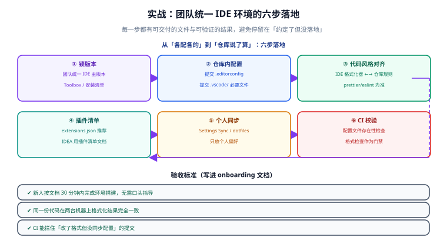

# 实战：搭一套统一的 IDE 环境

前几页讲了原理，这一页把它走完一遍。场景是真实项目中很常见的一种：**5 人团队、Windows 与 macOS 混用、后端 Java + 前端 Node 在同一个仓库**，现状是「各配各的」——有人保存自动格式化、有人不格式化、有人 JDK 版本不一样，每次联调都在修风格差异。



## 目标与验收标准

| 维度 | 目标 | 验收方式 |
| --- | --- | --- |
| 一致性 | 同一份代码在任意成员机器上格式化结果相同 | 两台不同系统机器各保存一次，`git diff` 无差异 |
| 可复现 | 新人按文档 30 分钟内完成环境搭建 | 计时实测，不需要口头指导 |
| 可校验 | 配置腐化能被 CI 拦住 | 故意改坏配置，CI 失败 |
| 不越界 | 个人偏好不被强加给团队 | 检查 `.vscode/` 无主题/字号等个人项 |

::: tip 一条原则
**「必须一致」的进仓库，「个人偏好」留本地。** 每一步都要问：这东西团队不一致会不会出问题？不会，就别入库。
:::

## 第 ① 步：锁版本

版本不一致是「最隐蔽的不一致」——代码看起来一样，行为不一样。

### 团队版本矩阵（写进 `docs/dev-env.md`）

| 组件 | 基线 | 允许区间 | 升级流程 |
| --- | --- | --- | --- |
| JDK | 25（LTS） | `25.x` 补丁自动 | 大版本升级需评审 |
| IntelliJ IDEA | 2026.2 系列 | `2026.2.*` | 只在季度窗口升大版本 |
| VS Code | 1.137 | `>=1.137` | 允许自动更新，实验特性按白名单 |
| Node.js | 22（LTS） | `22.x` | 随 lockfile 与 CI 同步 |
| Maven | 3.9+ | `3.9.*` | 随 CI 镜像同步 |
| MySQL（本地） | 8.4 | `8.4.*` | 与生产一致 |

```text
为什么写「区间」而不是「精确版本」：
- 精确版本会让人每天被升级提示烦到，最后集体无视；
- 区间 + 自动补丁，既保证一致性又不需要人工干预；
- 只对大版本升级设门槛，因为大版本才会改变索引、检查规则与插件兼容性。
```

### 落地手段

| 工具 | 做法 |
| --- | --- |
| IntelliJ IDEA | Toolbox App 关闭「大版本自动升级」，只允许补丁；用 Toolbox 的「保留上一版本」做回退 |
| VS Code | 关闭 Insiders；用「允许自动更新稳定版」；实验特性按白名单开启 |
| JDK | 用版本管理器统一（如 `sdkman` / `jenv` / 官方安装包 + 环境变量），并写进环境自检脚本 |
| Node.js | 用 `package.json` 的 `engines` + `nvm`/`fnm` 锁版本，配 `.nvmrc` |

## 第 ② 步：仓库内配置

先建立最小可用的文件集合。**不要一次上太多，先解决「缩进不一致」这个最痛的问题。**

```text
仓库根/
├─ .editorconfig                 # ① 跨编辑器基础风格
├─ .gitattributes                # ② 换行符策略（关键！）
├─ .vscode/
│  ├─ settings.json              # ③ 工作区设置（团队规则）
│  ├─ extensions.json            # ④ 推荐扩展
│  ├─ tasks.json                 # ⑤ 构建任务
│  └─ launch.json                # ⑥ 调试配置
├─ .idea/
│  ├─ codeStyles/                # ⑦ IDEA 代码风格（提交）
│  ├─ inspectionProfiles/        # ⑧ 检查规则（提交）
│  ├─ compiler.xml               # ⑨ 编译配置（提交）
│  ├─ encodings.xml              # ⑩ 字符集（提交）
│  └─ .gitignore                 # ⑪ 忽略个人状态文件
└─ scripts/
   └─ check-ide-config.sh        # ⑫ CI 校验脚本
```

### `.gitattributes`：被严重低估的一个文件

```text [.gitattributes]
# 默认：仓库内一律使用 LF
* text=auto eol=lf

# Windows 专用脚本保持 CRLF，避免部分工具解析异常
*.bat text eol=crlf
*.cmd text eol=crlf
*.ps1 text eol=crlf

# 二进制文件不做换行转换
*.png binary
*.jpg binary
*.jar binary
*.svg text eol=lf
```

::: danger 少了这一步，前面的努力会白费
`.editorconfig` 管的是**编辑器写文件时的行为**，而 Git 在检出/提交时还会做一次换行转换。如果 `.gitattributes` 与 `.editorconfig` 的 `end_of_line` 不一致，就会出现「**每次打开文件都显示整文件被修改**」——团队会以为格式化坏了，实际上换行符在打架。

**两者必须统一为 `lf`**（Windows 成员的工作区由 Git 自动处理）。
:::

## 第 ③ 步：代码风格对齐

### 3.1 `.editorconfig`

```ini [.editorconfig]
root = true

[*]
charset = utf-8
end_of_line = lf
insert_final_newline = true
trim_trailing_whitespace = true
indent_style = space
indent_size = 2

[*.java]
indent_size = 4
max_line_length = 120

[*.{xml,yml,yaml}]
indent_size = 2

[*.md]
trim_trailing_whitespace = false

[Makefile]
indent_style = tab
```

### 3.2 前端：让 Prettier 成为唯一标准

```json [.prettierrc.json]
{
  "printWidth": 100,
  "tabWidth": 2,
  "useTabs": false,
  "semi": false,
  "singleQuote": true,
  "endOfLine": "lf",
  "trailingComma": "all"
}
```

**关键决策：`editor.defaultFormatter` 只留一个。** 团队里既有 Prettier 又有 ESLint 的格式化能力时，必须显式指定由谁负责格式化，否则保存时会互相覆盖。

```json [.vscode/settings.json]
{
  "editor.defaultFormatter": "esbenp.prettier-vscode",
  "editor.formatOnSave": true,
  "editor.codeActionsOnSave": {
    "source.fixAll.eslint": "explicit"
  },
  "eslint.format.enable": false
}
```

### 3.3 后端：让 IDEA 风格与 CLI 一致

有两条路线，**选一条并写进文档，不要两条并行**：

| 路线 | 做法 | 优点 | 代价 |
| --- | --- | --- | --- |
| IDEA 风格为主 | 提交 `.idea/codeStyles/`，团队以 IDEA 格式化为准 | IDEA 用户零配置 | 非 IDEA 用户需另配格式化工具 |
| CLI 工具为主（推荐） | 用 **Spotless** / `google-java-format` 定义规则，IDE 只做触发 | CI 与 IDE 用同一套规则 | 需要引入构建插件 |

推荐路线：**Spotless 定义为唯一标准，把它绑到 Maven 生命周期。**

```xml [pom.xml（片段）]
<plugin>
  <groupId>com.diffplug.spotless</groupId>
  <artifactId>spotless-maven-plugin</artifactId>
  <version>3.1.0</version>
  <configuration>
    <java>
      <googleJavaFormat/>
      <removeUnusedImports/>
      <trimTrailingWhitespace/>
      <endWithNewline/>
    </java>
  </configuration>
  <executions>
    <execution>
      <goals>
        <goal>check</goal>
      </goals>
    </execution>
  </executions>
</plugin>
```

::: warning 版本以官方为准
构建插件的版本号会持续发布新版本。本文只示范写法，**具体版本号请在引入时查一次官方仓库**（Maven Central 或项目官网），并写进团队的依赖版本管理里。
:::

### 3.4 让 IDEA 服从 `.editorconfig`

```text
Settings → Editor → Code Style
  ✅ Enable EditorConfig support
  ⚙ → Export → EditorConfig   # 需要把 IDEA 专有风格导出为 ij_ 前缀属性时用
```

## 第 ④ 步：插件清单

### 4.1 VS Code：`.vscode/extensions.json`

```json [.vscode/extensions.json]
{
  "recommendations": [
    "EditorConfig.EditorConfig",
    "esbenp.prettier-vscode",
    "dbaeumer.vscode-eslint",
    "eamodio.gitlens",
    "usernamehw.errorlens",
    "vscjava.vscode-java-pack",
    "vmware.vscode-boot-dev-pack",
    "redhat.vscode-yaml",
    "ms-azuretools.vscode-docker"
  ],
  "unwantedRecommendations": []
}
```

### 4.2 JetBrains：必需插件声明 + 清单文档

```text
.idea/externalDependencies.xml   # 声明项目必需插件，缺失时 IDE 提示安装
docs/idea-plugins.md             # 人可读清单：插件名 + 用途 + 来源
```

清单文档模板：

| 插件 | 用途 | 是否必需 |
| --- | --- | --- |
| Lombok | 识别注解生成代码 | 必需 |
| SonarQube for IDE | 与 CI 规则对齐的本地检查 | 必需 |
| CheckStyle-IDEA | 接入团队 `checkstyle.xml` | 必需 |
| Maven Helper | 依赖冲突分析 | 推荐 |
| Translation | 英文文档/注释辅助 | 可选 |

::: danger `extensions.json` 只是「推荐」
它不会强制安装。团队文档里不要写「强制」，否则新人以为装不上是 bug。真正强制要靠**内网镜像市场 + 组织策略**。
:::

## 第 ⑤ 步：个人同步

明确分工，避免「团队规则靠个人同步分发」这个致命错误。

| 内容 | 归谁管 | 手段 |
| --- | --- | --- |
| 主题、字号、窗口布局 | 个人 | IDE Settings Sync |
| 键位（大多人保留默认） | 个人 | Settings Sync；重度自定义者用 dotfiles |
| 代码片段（团队通用） | 团队 | 入库（`.vscode/*.code-snippets`） |
| 代码片段（个人） | 个人 | Settings Sync |
| 代码风格、检查规则、插件清单 | **团队** | 仓库（本页第 ②③④ 步） |

```shell
# dotfiles 方案（Linux/macOS 示例）
ln -sfn ~/dotfiles/vscode/settings.json   ~/.config/Code/User/settings.json
ln -sfn ~/dotfiles/vscode/keybindings.json ~/.config/Code/User/keybindings.json
```

## 第 ⑥ 步：CI 校验

把「配置存在且没被改坏」变成流水线的一部分。

```yaml [.github/workflows/dev-env-check.yml]
name: dev-env-check
on:
  pull_request:
    paths:
      - ".editorconfig"
      - ".gitattributes"
      - ".vscode/**"
      - ".idea/**"
      - "scripts/check-ide-config.sh"
jobs:
  check:
    runs-on: ubuntu-latest
    steps:
      - uses: actions/checkout@v4
      - name: 校验 IDE 配置
        run: bash scripts/check-ide-config.sh
```

```shell
#!/usr/bin/env bash
# scripts/check-ide-config.sh
set -euo pipefail
fail=0

[ -f .editorconfig ] || { echo "✗ 缺少 .editorconfig"; fail=1; }
grep -qE '^\s*root\s*=\s*true' .editorconfig || { echo "✗ .editorconfig 缺少 root = true"; fail=1; }
[ -f .gitattributes ] || { echo "✗ 缺少 .gitattributes（换行符策略未定义）"; fail=1; }

# .editorconfig 与 .gitattributes 的换行策略必须都是 lf
if ! grep -qE '^\s*end_of_line\s*=\s*lf' .editorconfig; then
  echo "✗ .editorconfig 的 end_of_line 不是 lf"; fail=1
fi
if grep -qE '^\s*\*\s+text\s*=\s*auto\s*$' .gitattributes; then
  echo "⚠ .gitattributes 建议显式写 eol=lf，避免与 .editorconfig 不一致"
fi

# 工作区设置不得含绝对路径
if grep -rnE '([A-Za-z]:\\\\|/Users/|/home/)' .vscode/settings.json 2>/dev/null; then
  echo "✗ .vscode/settings.json 含绝对路径"; fail=1
fi

# 工作区设置不得含个人偏好
if grep -qE '"(workbench\.colorTheme|editor\.fontSize)"' .vscode/settings.json 2>/dev/null; then
  echo "✗ .vscode/settings.json 含个人偏好项"; fail=1
fi

[ "$fail" -eq 0 ] && echo "✓ IDE 配置校验通过"
exit "$fail"
```

## 新人 Onboarding：30 分钟流程

把这段直接写进团队文档，目标是**不需要任何人指导**。

```text
第 0~5 分钟  装工具
  - 装 JDK 25（版本管理器或官方安装包）
  - 装 Node 22（nvm / fnm）
  - 装 IDE：IntelliJ IDEA 2026.2 系列（Toolbox）或 VS Code 1.137+

第 5~10 分钟 拉代码
  - git clone <repo> && cd <repo>
  - 确认根目录能看到 .editorconfig、.gitattributes、.vscode/

第 10~20 分钟 跑起来（二选一）
  A. 本地原生：按 README 装依赖 → 启动后端 → 启动前端
  B. Dev Container：用 VS Code 打开 → 「Reopen in Container」→ 等环境就绪

第 20~25 分钟 打开 IDE
  - VS Code：看到「推荐扩展」提示 → 一键安装
  - IDEA：看到「缺少必需插件」提示 → 安装后重启

第 25~30 分钟 自检
  - bash scripts/check-ide-config.sh        # 期望：✓ IDE 配置校验通过
  - 打开任一源文件保存一次 → git diff --stat # 期望：无改动（说明风格已一致）
```

::: tip 判断这套方案是否真的落地
**看新人第一次保存文件时 `git diff` 是否为空。** 如果为空，说明所有人的格式化规则真的统一了；如果有改动，说明某一层还没对齐。
:::

## 验收清单

| # | 检查项 | 期望 | 通过 |
| --- | --- | --- | --- |
| 1 | `.editorconfig` 存在且含 `root = true` | 是 | ☐ |
| 2 | `.gitattributes` 与 `.editorconfig` 换行策略一致 | 都是 `lf` | ☐ |
| 3 | Windows 与 macOS 各保存一次，`git diff` 无差异 | 无差异 | ☐ |
| 4 | `.vscode/settings.json` 无绝对路径、无个人偏好 | 是 | ☐ |
| 5 | `.vscode/extensions.json` 列出团队必备扩展 | 是 | ☐ |
| 6 | `.idea/` 已忽略 `workspace.xml` 等个人状态 | 是 | ☐ |
| 7 | `.idea/codeStyles/` 或 Spotless 规则已入库 | 二选一 | ☐ |
| 8 | 插件清单文档可读、含「为什么需要」 | 是 | ☐ |
| 9 | CI 校验脚本在流水线中运行 | 是 | ☐ |
| 10 | 新人按文档 30 分钟内完成搭建 | 实测通过 | ☐ |

## 回滚

配置类改动也要能回退——记录清楚「改了什么、为什么、怎么退」。

```shell
# 查看配置类文件的改动历史
git log --oneline -- .editorconfig .gitattributes .vscode .idea/codeStyles

# 回退某个配置文件到上一个提交
git checkout HEAD~1 -- .editorconfig

# 回退一次「批量格式化」提交（它通常是最容易出问题的一次提交）
git revert --no-edit <commit>
```

::: danger 批量格式化提交要单独成一次提交
不要把它和业务改动混在一起。**单独一次「chore: 统一格式」提交**，出问题时可以直接 revert，而不会牵连业务代码。
:::

## 常见问题与坑

::: danger 十个高频坑
1. **只做 `.editorconfig` 不做 `.gitattributes`**：换行符仍在打架，整文件 diff 反复出现。
2. **一次上全套配置**：改动太大，review 不动，团队抵触。先解决「缩进」这一个痛点。
3. **`editor.defaultFormatter` 不唯一**：保存时格式化结果随机。
4. **把 IDEA 风格与 Spotless 两套并行**：IDE 与 CI 结果不一致，扯皮来源。
5. **`.vscode/settings.json` 放个人偏好**：团队被迫接受某个人的审美。
6. **`extensions.json` 当强制手段**：落不了地，新人体验反而更差。
7. **`.idea/` 整体忽略**：风格与必需插件无法共享。
8. **CI 校验脚本只在本地跑**：没人会记得手动跑，必须进流水线。
9. **批量格式化与业务改动混在一个提交**：出问题无法干净回退。
10. **没有 onboarding 文档**：所有约定只存在于老人脑子里，新人靠问。
:::

::: tip 最佳实践六条
1. **渐进式**：先缩进与换行，再格式化器，最后插件与检查规则。
2. **标准归属唯一**：格式化这件事，要么 Prettier，要么 Spotless，不要并列。
3. **配置改动走 review**：`devcontainer.json`、`.editorconfig` 的变更影响全员。
4. **一条命令自检**：`check-ide-config.sh` 是新人第一天的第一个命令。
5. **验收看 `git diff`**：格式化是否真的统一，用 diff 说话。
6. **文档写「为什么」**：只写「装这个」，三个月后就没人知道能不能删。
:::

## 相关文档

- [配置同步与团队统一](../ConfigSync/index.md)：本页方法论的原理与完整文件说明。
- [插件与扩展](../Plugins/index.md)：插件清单与性能控制。
- [远程开发与容器化环境](../RemoteDev/index.md)：第 3 层「环境可复现」的容器方案。
- [快捷键与高效操作](../Shortcuts/index.md)：键位同步的个人侧做法。
- [IntelliJ IDEA 深入](../IntelliJIDEA/index.md)：`.idea/` 目录的提交策略细节。
- [VS Code 深入](../VSCode/index.md)：配置层级与工作区文件。
- [版本控制工具](../../VersionControl/index.md)：提交规范与 `.gitattributes` 的关系。

## 参考资料

- EditorConfig 规范：[editorconfig.org](https://editorconfig.org/)
- Git 属性（`.gitattributes`）文档：[git-scm.com/docs/gitattributes](https://git-scm.com/docs/gitattributes)
- Prettier 配置参考：[prettier.io/docs/options](https://prettier.io/docs/options)
- Spotless 官方仓库：[github.com/diffplug/spotless](https://github.com/diffplug/spotless)
- Dev Container 规范：[containers.dev](https://containers.dev/)
