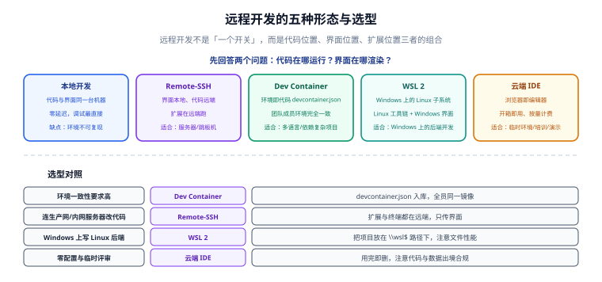

# 远程开发与容器化环境

远程开发解决的是「**代码跑在别处，体验留在本地**」：代码在内网服务器上、在容器里、在 Linux 子系统里，但编辑器界面、快捷键、插件还是你熟悉的那一套。本页讲清五种形态的差别、`devcontainer.json` 怎么写，以及团队怎么把它变成「环境即代码」。



## 一句话定位

远程开发不是「一个开关」，而是三个问题的组合答案：**代码在哪运行、界面在哪渲染、扩展/语言服务在哪运行**。把这三个位置说清楚，选型就不会错。

## 什么时候真的需要远程开发

| 场景 | 本地开发的痛点 | 远程开发的价值 |
| --- | --- | --- |
| 代码在内网服务器 | 代码不方便拉到本地（合规/体积/网络） | 只传界面，代码不出内网 |
| 生产问题排查 | 本地复现不了环境 | 在贴近真实的环境里调试 |
| 环境依赖复杂（多语言、多服务） | 每人装一遍，版本各不相同 | 容器定义环境，全员一致 |
| Windows 上开发 Linux 后端 | 脚本、路径、权限表现不同 | WSL 2 提供真实 Linux 内核 |
| 机器配置低 | 编译/索引拖垮本机 | 计算放到远端服务器 |
| 临时评审与演示 | 配环境比看代码还久 | 云端 IDE 打开即用 |

::: warning 什么时候不需要
如果代码在本地、环境简单、网络一般，**本地开发就是最优解**。远程开发引入网络延迟、文件监听限制、调试链路变长等成本，不是「更高级所以更好」。
:::

## 五种形态对比

| 形态 | 代码位置 | 界面位置 | 扩展/语言服务位置 | 环境一致性 | 典型工具 |
| --- | --- | --- | --- | --- | --- |
| 本地开发 | 本地 | 本地 | 本地 | 低（靠人维护） | 任意 IDE |
| Remote-SSH | 远端主机 | 本地 | **远端** | 中（取决于主机） | VS Code Remote-SSH、JetBrains Gateway |
| Dev Container | 容器 | 本地 | 容器内 | **高（环境即代码）** | VS Code Dev Containers、Gateway |
| WSL 2 | WSL 发行版 | 本地（Windows） | WSL 内 | 中高（Windows 上的 Linux） | VS Code WSL、Gateway |
| 云端 IDE | 云端 | 浏览器 | 云端 | 高（镜像定义） | Codespaces 等 |

## VS Code：Remote 系列

VS Code 的远程能力由一组扩展提供，核心机制是**把「界面」与「后端」拆开**：本地只跑渲染进程与 UI，扩展宿主与语言服务跑到远端。

| 扩展 | 连接什么 | 关键点 |
| --- | --- | --- |
| Remote - SSH | 任意可通过 SSH 访问的主机 | 需要免密或每次输密码；默认会把扩展装到远端 |
| Dev Containers | 本地或远端的 Docker 容器 | 由 `devcontainer.json` 定义，团队一致性最强 |
| WSL | Windows 的 WSL 2 发行版 | 项目要放在 WSL 文件系统内，不要放在 `/mnt/c/...` |
| Tunnels | 无需公网 IP 的隧道连接 | 适合「机器在内网、你在外面」的场景 |

### 扩展装在哪：最容易困惑的一点

```text
本地 UI 扩展（主题、键位、片段）          → 装在本地
与代码/语言相关的扩展（语言服务、调试器）  → 装在远端
```

VS Code 在扩展面板里会区分 `Local - Installed` 与 `<远端> - Installed` 两组。**「我装了 Java 扩展为什么远端没生效」的答案就在这里**：装的时候要选「Install in SSH: host」。

::: tip 一条实用建议
把「远端必需扩展」写进 `devcontainer.json` 或远程环境的 `settings.json`，避免每次换机器重装一遍。
:::

### WSL 的文件性能陷阱

| 项目位置 | 访问速度 | 建议 |
| --- | --- | --- |
| WSL 文件系统内（如 `~/projects/app`） | 快 | **推荐** |
| Windows 盘挂载点（如 `/mnt/d/projects/app`） | 明显慢（跨文件系统调用） | 避免；文件多时能慢十倍 |

## JetBrains：Gateway 与远程后端

JetBrains 的做法是「**瘦客户端 + 远端后端**」：Gateway 只负责连接与界面转发，真正的 IDE 后端进程跑在远端。

| 连接方式 | 说明 |
| --- | --- |
| SSH | 连到远端主机，由 Gateway 自动下载并启动后端 |
| Dev Containers | 用容器作为远端环境 |
| WSL | 直接连本机 WSL 发行版 |

::: tip 与 VS Code 思路的差别
VS Code 是「本地渲染 + 远端扩展宿主」；JetBrains 是「本地精简前端 + 远端完整 IDE 后端」。前者本地负担更轻，后者功能完整度更接近本地 IDEA。**弱网环境下两者的体验差异会很明显**，选型时建议实测。
:::

## `devcontainer.json` 详解

这是「环境即代码」的核心文件，推荐放在仓库的 `.devcontainer/devcontainer.json`。

### 一个完整可用的例子（Java + Node 双栈）

```json [.devcontainer/devcontainer.json]
{
  "name": "backend-template-dev",
  "image": "mcr.microsoft.com/devcontainers/base:ubuntu-24.04",

  "features": {
    "ghcr.io/devcontainers/features/java:1": {
      "version": "25",
      "installMaven": true
    },
    "ghcr.io/devcontainers/features/node:1": {
      "version": "22"
    },
    "ghcr.io/devcontainers/features/docker-in-docker:2": {}
  },

  "remoteUser": "vscode",

  "containerEnv": {
    "TZ": "Asia/Shanghai",
    "LANG": "C.UTF-8"
  },

  "forwardPorts": [8080, 5005, 6379],
  "portsAttributes": {
    "8080": { "label": "app", "onAutoForward": "notify" },
    "5005": { "label": "debug", "onAutoForward": "silent" }
  },

  "postCreateCommand": "mvn -q -B dependency:go-offline",

  "customizations": {
    "vscode": {
      "extensions": [
        "vscjava.vscode-java-pack",
        "vmware.vscode-boot-dev-pack",
        "redhat.vscode-yaml",
        "EditorConfig.EditorConfig"
      ],
      "settings": {
        "java.configuration.updateBuildConfiguration": "automatic",
        "files.eol": "\n"
      }
    }
  }
}
```

### 字段逐个说明

| 字段 | 作用 | 注意 |
| --- | --- | --- |
| `name` | 开发环境显示名 | 建议与项目名一致，便于识别 |
| `image` | 基础镜像 | 也可用 `build.dockerfile` 自定义 |
| `features` | 在基础镜像上叠加官方特性（Java / Node / Docker 等） | **比自己在 Dockerfile 里装更稳**，官方维护版本与依赖 |
| `remoteUser` | 容器内以哪个用户运行 | 非 root 更安全；注意文件属主 |
| `containerEnv` | 注入环境变量 | 时区与语言必须设，否则日志时间与中文都可能异常 |
| `forwardPorts` | 自动转发端口 | 应用端口、调试端口、数据库端口 |
| `portsAttributes` | 端口描述与自动转发行为 | `notify` / `silent` / `openBrowser` |
| `postCreateCommand` | 容器创建后执行一次 | 适合预下载依赖；**不要放长耗时全量构建** |
| `postStartCommand` | 每次启动容器执行 | 适合启动本地依赖服务 |
| `customizations.vscode.extensions` | 容器内自动安装的扩展 | 团队必备扩展写这里 |
| `customizations.vscode.settings` | 容器内工作区设置 | 与仓库内 `.vscode/settings.json` 合并生效 |
| `mounts` | 挂载卷（如缓存目录） | 把 Maven 本地仓库挂出来，避免每次重建都重新下载 |
| `dockerComposeFile` + `service` | 用 Compose 起多服务环境 | 需要数据库/缓存等依赖服务时用 |

::: danger 三个高频错误
1. **把依赖预下载放在 `postCreateCommand` 里做全量构建**：首次进入环境要等十几分钟，体验很差。只做 `dependency:go-offline` 这类预热。
2. **不挂载依赖缓存卷**：容器一重建，Maven/npm 缓存全丢。用 `mounts` 挂出 `~/.m2` 与 `~/.npm`。
3. **不设时区与 `LANG`**：容器默认 UTC + POSIX locale，日志时间差 8 小时、中文可能乱码。
:::

## 端口转发与调试

远程环境下有一个关键前提：**你本地端口 ≠ 远端端口**。

```text
本地 IDE 界面  ──(隧道)──▶  远端 8080       应用服务
本地 IDE 界面  ──(隧道)──▶  远端 5005       JVM 调试端口
本地 Redis 客户端 ──(隧道)──▶ 远端 6379    依赖服务
```

| 场景 | 做法 |
| --- | --- |
| 应用访问 | `forwardPorts` 自动转发，本地 `localhost:8080` 直连 |
| JVM 远程调试 | 远端进程加 `-agentlib:jdwp=...address=*:5005`，IDE 用 Remote JVM Debug 附加到本地转发端口 |
| 纯 SSH 场景（无 IDE 转发） | 手动建立隧道：`ssh -L 5005:localhost:5005 user@host` |
| 多服务 | 用 `portsAttributes` 命名，避免端口冲突时找不到是哪个服务 |

::: danger 调试端口的安全线
`address=*:5005` 会监听所有网卡，**在容器里意味着只要有端口映射就能被外部附加调试器**。安全做法是：
- 容器只把调试端口映射到 `127.0.0.1`（`-p 127.0.0.1:5005:5005`）；
- 或完全不映射，改用 SSH 本地转发；
- 排查结束立刻移除调试参数。
:::

## 与 Docker / Kubernetes 的分工

| 层 | 负责什么 | 相关专题 |
| --- | --- | --- |
| 开发环境 | 用 Dev Container 定义「开发者需要的镜像」 | 本页 |
| 构建与运行 | 用 Dockerfile / Compose 定义「应用怎么跑」 | [Docker](../../../Ops/Docker/index.md) |
| 部署编排 | 用 K8s 定义「生产怎么调度与伸缩」 | [Kubernetes](../../../Ops/Kubernetes/index.md) |
| 网络连通 | 端口、隧道、DNS、防火墙 | [网络基础](../../../Ops/Network/index.md) |

::: tip 一个常见混淆
**开发容器 ≠ 生产镜像。** 开发容器通常包含调试工具、语言服务、缓存卷，体积大、权限高；生产镜像追求最小化与安全加固。两者可以共享基础镜像，但**不要指望「开发容器直接上线」**。
:::

## 云端 IDE

| 形态 | 优势 | 代价 |
| --- | --- | --- |
| 托管云端开发环境（如 Codespaces） | 打开即用、按量计费、预置镜像 | 代码在第三方、网络依赖强、成本随用量增长 |
| 自建云端 IDE | 完全可控 | 运维成本高（多用户、资源隔离、持久化） |

**选型前必答的三个问题**：

1. 代码是否允许离开公司网络 / 境内？
2. 停机后环境资源怎么回收？成本上限是多少？
3. 断网时能否继续工作（本地降级路径）？

## 团队规范化：把远程环境纳入仓库

```text
仓库根/
├─ .devcontainer/
│  ├─ devcontainer.json        # 环境定义（提交）
│  └─ Dockerfile               # 需要自定义时使用（提交）
├─ .editorconfig               # 跨编辑器风格（提交）
└─ .vscode/                    # 工作区配置（提交）
```

配套要求：

1. **README 写清「三种进入方式」**：本地原生、Dev Container、Remote-SSH，各自的前置条件；
2. **环境自检脚本**：进入环境后一条命令确认 JDK/Maven/Node 版本正确；
3. **升级流程**：`devcontainer.json` 的镜像与 feature 版本变更要走 review，避免「某人升级后所有人重建失败」；
4. **缓存卷约定**：统一定义 `~/.m2`、`~/.npm` 的挂载点，写进文档。

## 验证方式

```shell
# 1. 环境已进入容器/远端（而不是本机）
uname -a && whoami
# 期望：显示容器或远端主机信息，用户为 remoteUser 指定的账号

# 2. 工具链版本符合 devcontainer.json 声明
java -version && mvn -v && node -v
# 期望：Java 25、Maven 3.9+、Node 22

# 3. 时区与语言正确
date && locale
# 期望：显示 Asia/Shanghai（+0800）；locale 不应为 POSIX 导致中文乱码

# 4. 端口转发可用（应用启动后在本机侧验证）
curl -s -o /dev/null -w "%{http_code}\n" http://localhost:8080/actuator/health
# 期望：200

# 5. 依赖缓存卷生效：重建容器后不做全量下载
ls -d ~/.m2/repository >/dev/null && echo "m2 cache mounted"
```

## 常见问题与坑

::: danger 十二个高频坑
1. **WSL 项目放在 `/mnt/c/...`**：文件监听与 I/O 极慢，改为放在 WSL 文件系统内。
2. **扩展只装在本地**：远端不生效。装的时候选「Install in SSH/Container」。
3. **不挂依赖缓存卷**：容器重建后重新下载全部依赖，十几分钟起步。
4. **`postCreateCommand` 里做全量构建**：首次进入环境极慢，只做预热。
5. **不设时区/Locale**：日志时间差 8 小时、中文乱码。
6. **把生产镜像当开发容器**：缺调试工具与语言服务，开发体验差；反之开发容器上线则不安全。
7. **调试端口映射到 `0.0.0.0`**：任何能访问该端口的人都能附加调试器。
8. **`suspend=y` 上生产**：目标进程卡在启动处，等同故障。
9. **文件监听溢出（Linux）**：热更新失效、报 `ENOSPC`，需调高 `inotify` 上限。
10. **SSH 断线导致后端进程被杀**：JetBrains 远程后端会随连接退出，考虑用 `tmux`/`nohup` 或常驻服务方案。
11. **弱网环境强上远程开发**：每次保存都要往返，体验比本地差很多。
12. **把内网地址、账号写进提交的配置文件**：用环境变量或本地覆盖文件替代。
:::

::: tip 最佳实践六条
1. **先问「代码能不能离开本机」**，这是第一道闸门。
2. **环境即代码**：`devcontainer.json` 入库并走 review。
3. **缓存卷必备**：`~/.m2`、`~/.npm`、`~/.gradle` 挂出来。
4. **端口只开必要的**，调试端口绑 `127.0.0.1`。
5. **准备好本地降级路径**：断网或服务不可用时能切回本地开发。
6. **维护「进入方式」文档**：新人第一天就该能独立跑起来。
:::

## 相关文档

- [IDE 配置总览](../index.md)
- [VS Code 深入](../VSCode/index.md)：配置层级与扩展安装位置。
- [IntelliJ IDEA 深入](../IntelliJIDEA/index.md)：远程调试参数与 toolchain 对齐。
- [插件与扩展](../Plugins/index.md)：Remote 系列扩展与离线安装。
- [配置同步与团队统一](../ConfigSync/index.md)：环境可复现这一层的完整方法。
- [Docker](../../../Ops/Docker/index.md)：镜像与 Compose 的基础。
- [Kubernetes](../../../Ops/Kubernetes/index.md)：部署侧的编排。

## 参考资料

- Dev Container 规范与特性索引：[containers.dev](https://containers.dev/)
- Dev Containers 官方文档（VS Code）：[code.visualstudio.com/docs/devcontainers/containers](https://code.visualstudio.com/docs/devcontainers/containers)
- Remote-SSH 文档：[code.visualstudio.com/docs/remote/ssh](https://code.visualstudio.com/docs/remote/ssh)
- WSL 开发文档：[code.visualstudio.com/docs/remote/wsl](https://code.visualstudio.com/docs/remote/wsl)
- JetBrains Gateway 文档：[jetbrains.com/help/idea/jetbrains-gateway.html](https://www.jetbrains.com/help/idea/jetbrains-gateway.html)
