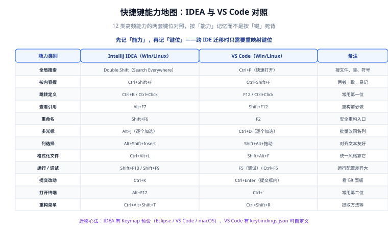

# 快捷键与高效操作

快捷键的价值不在「记住多少组合键」，而在**把手指留在键盘上**。本页给的不是背诵表，而是一张**能力地图**：先想清楚「我下一步要做什么」，键位自然记得住，跨 IDE 迁移时也只需要换映射。



## 一句话定位

**先记能力，再记键位。** 能力是通用的（跳转、搜索、重构、多光标），键位是方言。把能力地图刻进脑子，换 IDE 只需换词典。

## 设计哲学：三种「减少动作」的快捷键

| 类型 | 作用 | 典型例子 |
| --- | --- | --- |
| 减少定位动作 | 不用鼠标找文件、找符号 | Search Everywhere（IDEA）/ 快速打开（VS Code） |
| 减少重复动作 | 一次修改 N 处 | 多光标、重命名重构、列编辑 |
| 减少上下文切换 | 不离开编辑器完成构建/调试/提交 | 集成终端、运行配置、Git 面板 |

::: tip 自检方法
统计你一天里用鼠标点得最多的三个动作，去键位表里找对应快捷键——**先补这三个，收益最大**。一次性背 50 个组合键通常三天后忘一半。
:::

## 能力地图总表

前 12 项见顶部示意图，这里补全到「日常覆盖 90%」的规模。

### 搜索与导航

| 能力 | IntelliJ IDEA（Win/Linux） | IntelliJ IDEA（macOS） | VS Code（Win/Linux） |
| --- | --- | --- | --- |
| Search Everywhere（文件/类/符号/动作） | `Double Shift` | `Double Shift` | `Ctrl+P`（快速打开） |
| 搜索动作（命令面板） | `Ctrl+Shift+A` | `Cmd+Shift+A` | `Ctrl+Shift+P` |
| 按内容搜索 | `Ctrl+Shift+F` | `Cmd+Shift+F` | `Ctrl+Shift+F` |
| 当前文件内搜索 | `Ctrl+F` | `Cmd+F` | `Ctrl+F` |
| 跳到文件中的符号 | `Ctrl+F12` | `Cmd+F12` | `Ctrl+Shift+O` |
| 跳转定义 | `Ctrl+B` / `Ctrl+Click` | `Cmd+B` | `F12` / `Ctrl+Click` |
| 查看实现类 | `Ctrl+Alt+B` | `Cmd+Alt+B` | `Ctrl+F12` 后看大纲 |
| 查看引用 | `Alt+F7` | `Option+F7` | `Shift+F12` |
| 最近打开的文件 | `Ctrl+E` | `Cmd+E` | `Ctrl+Tab`（MRU） |
| 最近编辑位置 | `Ctrl+Shift+E` | `Cmd+Shift+E` | `Alt+Left` / `Alt+Right` 前后跳转 |
| 跳转到行 | `Ctrl+G` | `Cmd+L` | `Ctrl+G` |
| 在项目树中定位当前文件 | `Alt+F1` → `1` | `Option+F1` → `1` | `Ctrl+Shift+E`（用资源管理器聚焦） |

### 编辑与多光标

| 能力 | IDEA | VS Code |
| --- | --- | --- |
| 选中下一个相同词 | `Alt+J` | `Ctrl+D` |
| 选中所有相同词 | `Ctrl+Alt+Shift+J` | `Ctrl+Shift+L` |
| 列选择模式开关 | `Alt+Shift+Insert` | 无开关，用 `Shift+Alt+鼠标拖动` |
| 上下添加光标 | `Shift+Alt+↑/↓`（部分键位方案） | `Ctrl+Alt+↑/↓` |
| 复制当前行 | `Ctrl+D` | `Shift+Alt+↓` |
| 移动当前行 | `Shift+Alt+↑/↓` | `Alt+↑/↓` |
| 删除当前行 | `Ctrl+Y` | `Ctrl+Shift+K` |
| 注释/取消注释 | `Ctrl+/` | `Ctrl+/` |
| 块注释 | `Ctrl+Shift+/` | `Shift+Alt+A` |
| 折叠/展开代码块 | `Ctrl+-` / `Ctrl++` | `Ctrl+Shift+[` / `Ctrl+Shift+]` |
| 格式化文件 | `Ctrl+Alt+L` | `Shift+Alt+F` |
| 补全基本项 | `Ctrl+Space` | `Ctrl+Space` |
| 智能补全 | `Ctrl+Shift+Space` | `Ctrl+Space`（唯一入口） |

::: danger `Ctrl+D` 的语义完全不同
IDEA 里 `Ctrl+D` 是「复制当前行」，VS Code 里是「选中下一个相同词」。**两个工具混用时这是最容易误操作的一项**，建议在其中一个里改掉它，形成肌肉记忆的一致。
:::

### 重构

| 能力 | IDEA | VS Code |
| --- | --- | --- |
| 重构菜单 | `Ctrl+Alt+Shift+T` | `Ctrl+Shift+R` |
| 重命名（含引用） | `Shift+F6` | `F2` |
| 提取变量 | `Ctrl+Alt+V` | `Ctrl+Shift+R` → Extract Variable（需语言支持） |
| 提取方法/函数 | `Ctrl+Alt+M` | 走重构菜单 |
| 内联 | `Ctrl+Alt+N` | 走重构菜单 |
| 查看文件结构 / 大纲 | `Ctrl+F12` | `Ctrl+Shift+O` |
| 类型层次 | `Ctrl+H` | 依赖语言扩展 |

::: warning VS Code 的重构能力取决于语言扩展
VS Code 本体的重构能力有限，实际能做什么由语言服务器决定。**Java 的重构体验与 IDEA 仍有差距**——这也是 JVM 团队选 IDEA 的主要原因之一。跨工具做重构前，先用小范围验证。
:::

### 运行与调试

| 能力 | IDEA | VS Code |
| --- | --- | --- |
| 运行当前配置 | `Shift+F10` | `Ctrl+F5` |
| 调试当前配置 | `Shift+F9` | `F5` |
| 停止 | `Ctrl+F2` | `Shift+F5` |
| 切换断点 | `Ctrl+F8` | `F9` |
| 步过 / 步入 / 步出 | `F8` / `F7` / `Shift+F8` | `F10` / `F11` / `Shift+F11` |
| 继续执行 | `F9` | `F5` |
| 求值表达式 | `Alt+F8` | 调试控制台输入 |
| 查看所有断点 | `Ctrl+Shift+F8` | 调试侧栏 Breakpoints 面板 |

### 版本控制与工具窗口

| 能力 | IDEA | VS Code |
| --- | --- | --- |
| 提交 | `Ctrl+K` | 提交框内 `Ctrl+Enter` |
| 推送 | `Ctrl+Shift+K` | 命令面板 → Git: Push |
| 更新（Pull） | `Ctrl+T` | 命令面板 → Git: Pull |
| 查看当前文件历史 | `Alt+Shift+C` | GitLens 提供 |
| 打开终端 | `Alt+F12` | `Ctrl` + 反引号 |
| 切换工具窗口 | `Alt+1` ~ `Alt+9` | `Ctrl+Shift+E` 等固定面板 |
| 全屏 / 禅模式 | `Ctrl+Shift+F12` | `Ctrl+K Z` |
| 打开设置 | `Ctrl+Alt+S` | `Ctrl+,` |

::: tip 关于 macOS
IDEA 的 macOS 键位把 `Ctrl` 换成 `Cmd`、`Alt` 换成 `Option` 的大原则成立，但有例外（如 `Ctrl+F12` 是 `Cmd+F12`，而 `Alt+F7` 是 `Option+F7`）。**不要凭规律推，切到对应键位方案后以 IDE 内搜索为准。**
:::

## 自定义键位

### IntelliJ IDEA

```text
Settings → Keymap

① 预设方案：顶部下拉可切到 Eclipse / Visual Studio / Visual Studio Code / NetBeans 等
   —— 从其他 IDE 迁移时先切预设，再改个别不合手的
② 改键位：右键某动作 → Add Keyboard Shortcut
③ 冲突提示：添加时若与已有动作冲突，IDE 会标红并给出冲突项
④ 导出分享：Keymap 下拉右侧 ⚙ → Export，得到 XML，可入库供团队参考
```

### VS Code

`keybindings.json` 是纯数组，支持条件表达式与组合键序列。

```json [keybindings.json]
[
  {
    "key": "ctrl+alt+d",
    "command": "editor.action.copyLinesDownAction",
    "when": "editorTextFocus"
  },
  {
    "key": "alt+up",
    "command": "editor.action.moveLinesUpAction",
    "when": "editorTextFocus && !editorReadonly"
  },
  {
    "key": "ctrl+k ctrl+d",
    "command": "editor.action.formatDocument",
    "when": "editorTextFocus"
  },
  {
    "key": "ctrl+shift+r",
    "command": "-workbench.action.reloadWindow",
    "when": "always"
  }
]
```

| 要点 | 说明 |
| --- | --- |
| `key` 支持 `chord` | 形如 `ctrl+k ctrl+d`，先按前一半再按后一半，适合给冲突严重的高频操作腾位置 |
| `when` 是上下文条件 | 常见：`editorTextFocus`、`textInputFocus`、`inDebugMode`、`terminalFocus`、`editorReadonly` |
| 用 `-` 前缀解除绑定 | `"command": "-xxx"` 表示解除该命令的默认键位 |
| 查命令 ID | 命令面板 → 鼠标悬停某个命令可看到 ID；或 `Developer: Inspect Key Mappings` |

::: tip 内建的键位排查工具
命令面板 → `Developer: Inspect Key Mappings`：进入后按任意组合键，会显示**所有**匹配的绑定与它们的 `when` 条件，并指出最终生效的那一条。排查「我明明改过却不生效」最快的方式。
:::

## 冲突排查：三步定位

```text
① 明确「改了没生效」还是「按键没反应」
   - 改了没生效 → 九成是 when 条件不满足，或另一条绑定优先级更高
   - 按键没反应 → 可能是被系统或输入法占用

② 用检查工具看实际绑定
   - VS Code：Developer: Inspect Key Mappings（如上）
   - IDEA：Settings → Keymap 搜索该键位，看是否被多个动作占用

③ 排除系统与输入法
   - 中文输入法常占用 Ctrl+Space（切换中英文），与 IDE 补全冲突
   - macOS 的 Cmd+Space 是 Spotlight；Windows 的 Win+* 多为系统级
```

::: danger 三个典型冲突
1. **`Ctrl+Space` 补全不出来**：被输入法占用。把输入法的中英切换改为 `Shift` 或 `Ctrl+Shift`。
2. **`Ctrl+Shift+F` 搜索面板乱码/不弹**：被输入法的简繁切换占用。
3. **macOS 上 `Cmd+Space` 无响应**：Spotlight 占用。要么改 Spotlight，要么改 IDE 键位。
:::

## 命令行入口

图形界面之外，命令行是「打开工程」最快的方式，也是脚本化的基础。

| 场景 | IDEA | VS Code |
| --- | --- | --- |
| 用当前目录打开 | `idea .`（Windows 为 `idea64.exe .`） | `code .` |
| 跳到指定行 | `idea --line 42 src/Main.java` | `code --goto src/Main.java:42` |
| 打开 diff | `idea diff a.txt b.txt` | `code --diff a.txt b.txt` |
| 新建项目 | `idea /path/to/new-project` | `code -n /path/to/dir` |
| 指定 Profile | — | `code --profile 前端 .` |

::: tip 装好命令行工具
- IDEA：`Tools` → `Create Command-line Launcher`
- VS Code：命令面板 → `Shell Command: Install 'code' command in PATH`
:::

## 效率习惯清单

这些不是快捷键，但比快捷键更省时间：

| 习惯 | 收益 |
| --- | --- |
| 用 `Ctrl+Shift+A` / `Ctrl+Shift+P` 找功能，而不是翻菜单 | 消除「菜单里到底在哪」的探索成本 |
| 用 Search Everywhere 找文件，不再手点目录树 | 大型项目里省下最多时间的一项 |
| 重构一律用「重命名」而不是全局替换 | 避免误改字符串与注释 |
| 提交前用「查看引用」确认影响面 | 减少「改漏了」型 bug |
| 常用命令做成 `tasks.json` / Run Configuration 并入库 | 团队一致，且新人不用问 |
| 用集成终端而非外部终端 | 工作目录与项目一致，少一次 `cd` |
| 用 `.editorconfig` 而不是手动调缩进 | 一次配置，长期免维护 |
| 学会「只看改动」的视图（Git 面板 / diff） | 减少无意识提交 |
| 用 Local History / 时间线查看未提交的改动 | 免去「刚才改没了」的懊恼 |
| 每季度清一次键位表：删掉没用上的自定义 | 减少认知负担 |

## 验证方式

```shell
# VS Code：确认键位文件有效（JSON 语法错误会导致所有自定义失效）
python -c "import json,os,pathlib; p=pathlib.Path(os.environ.get('APPDATA',''))/'Code/User/keybindings.json'; print('OK' if json.loads(p.read_text(encoding='utf-8')) is not None else 'BAD')"
# 期望：OK（Windows 路径示例；macOS/Linux 换成对应目录）

# VS Code：确认三个高频改动能生效
# ① Ctrl+D 改为「复制当前行」后，在编辑器里按 Ctrl+D 应复制整行
# ② Alt+↑/↓ 应能移动当前行
# ③ Developer: Inspect Key Mappings 里能看到上述绑定

# IDEA：确认自定义键位已导出（用于团队参考）
# Settings → Keymap → ⚙ → Export，得到 XML 文件
```

## 常见问题与坑

::: danger 十个高频坑
1. **一次性背太多键位**：三天后忘一半。只补「每天最耗时的三个动作」。
2. **IDEA 与 VS Code 混用却不统一冲突键**：`Ctrl+D` 语义不同，误操作频繁。
3. **`Ctrl+Space` 与输入法冲突**：补全弹不出来，误以为 IDE 坏了。
4. **改了 keybindings.json 有语法错误**：整份文件静默失效。改完先校验 JSON。
5. **在 VS Code 里用 `-` 解除绑定时写错命令 ID**：不报错也不生效，需用 Inspect Key Mappings 核对。
6. **`when` 条件写得太宽**：导致在终端、侧栏里也触发编辑器命令。
7. **macOS 上照搬 Windows 键位表**：部分映射不成立，容易挫败。
8. **忽略 IDE 的键位预设**：从 Eclipse/VS Code 迁过来时，先切预设能省 90% 的自定义工作。
9. **把「个人键位」写进团队文档要求全员一致**：键位是个人偏好，团队应统一的是「能力」与「配置文件格式」。
10. **没有命令行入口**：每次打开项目靠鼠标点，批量操作与脚本化无从谈起。
:::

::: tip 最佳实践五条
1. **能力优先**：先记「我要重命名」，再记 `Shift+F6`。
2. **迁移先切预设**：IDEA 的 Keymap 预设能覆盖大部分迁移场景。
3. **冲突键统一**：`Ctrl+D` 这类语义冲突的键，在其中一个 IDE 里改掉。
4. **导出并归档**：个人键位导出成文件放进 dotfiles，换机器不重来。
5. **不要求全员键位一致**：要求一致的是「能做什么」，不是「按哪个键」。
:::

## 相关文档

- [IDE 配置总览](../index.md)
- [IntelliJ IDEA 深入](../IntelliJIDEA/index.md)：运行配置与调试断点。
- [VS Code 深入](../VSCode/index.md)：`keybindings.json` 与配置层级。
- [配置同步与团队统一](../ConfigSync/index.md)：把键位纳入个人同步方案。
- [版本控制工具](../../VersionControl/index.md)：Git 命令与 IDE 图形化的分工。

## 参考资料

- IDEA 键位参考（官方 Keymap 文档）：[jetbrains.com/help/idea/mastering-keyboard-shortcuts](https://www.jetbrains.com/help/idea/mastering-keyboard-shortcuts.html)
- VS Code 默认键位参考（PDF 可下载）：[code.visualstudio.com/docs/reference/default-keybindings](https://code.visualstudio.com/docs/reference/default-keybindings)
- VS Code `when` 上下文条件：[code.visualstudio.com/api/references/when-clause-contexts](https://code.visualstudio.com/api/references/when-clause-contexts)
- VS Code 键位自定义：[code.visualstudio.com/docs/configure/keybindings](https://code.visualstudio.com/docs/configure/keybindings)
