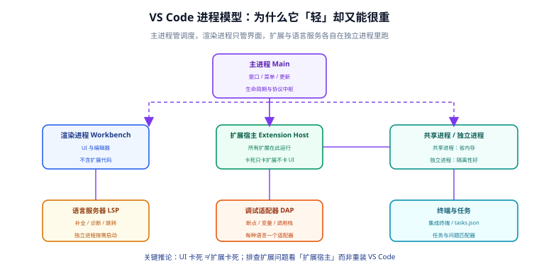
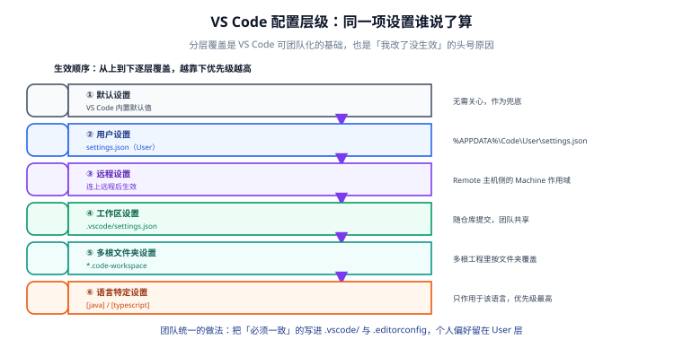

# VS Code 深入

Visual Studio Code 是「轻量编辑器 + 扩展平台」的典型代表：本体只提供编辑器骨架，语言能力靠扩展与语言服务器补上。它的可配置性极高，也因此**配置层级与优先级是最大的理解门槛**。本页讲清它的进程模型、配置文件全貌、配置优先级，以及性能排查路径。



## 一句话定位

VS Code 的「轻」指的是**本体轻**，「重」指的是**你装的扩展重**。理解进程模型后，很多「卡」的问题就不再需要靠重装解决。

## 版本与发版节奏（2026-09 现状）

| 项目 | 现状 |
| --- | --- |
| 当前稳定版 | **1.137**（2026-09-09 发布） |
| 发版节奏 | 2026 年内官方归档已列出 1.111 ~ 1.137 共 27 个版本，**节奏明显快于往年** |
| 预览渠道 | Insiders（每日构建），新特性先在此验证 |
| 构建许可 | 微软官方二进制分发受其许可条款约束，与上游开源代码（MIT）不同——企业合规审查时需注意这一点 |

### 1.137 的几个方向性变化

这一版的主线是「把 Agent 工作流做进编辑器本体」：

| 能力 | 状态 | 说明 |
| --- | --- | --- |
| Automations | 预览（`chat.automations.enabled`） | 定时执行 Agent 任务（每小时/每日/每周），也可手动触发 |
| Voice Mode | 实验 | 用语音与 Agent 对话，并可在其执行中打断或改变方向 |
| Agents 窗口 | 逐步铺开 | 在窗口内直接查看 GitHub issue 与 PR，即使仓库未打开 |
| 智能 diff 布局 | 稳定 | 普通 diff、多文件 diff、Agents 窗口统一选择内联/并排/自动 |
| Markdown 富链接 | 实验 | GitHub issue/PR 链接在编辑器里直接显示标题与状态 |

::: warning 企业环境要先看策略开关
这些预览/实验能力通常有组织级策略控制（例如管理员可关闭预览特性）。**团队文档里应写明「允许开启哪些实验特性」**，而不是让每个人自己试。
:::

## 进程模型：卡顿时先分清「谁卡」

| 进程 | 职责 | 卡了的症状 |
| --- | --- | --- |
| 主进程（Main） | 窗口、菜单、更新、协议中枢 | 整个应用无响应、菜单点不动 |
| 渲染进程（Workbench / Renderer） | UI 与编辑器渲染，**不含扩展代码** | 界面卡顿、滚动掉帧 |
| 扩展宿主（Extension Host） | 所有扩展在此运行（可共享进程或独立进程） | 某个扩展卡死；UI 仍可操作 |
| 语言服务器（LSP） | 补全、诊断、跳转 | 补全不出来、飘红不消失 |
| 调试适配器（DAP） | 断点、变量、调用栈 | 断点不生效、变量刷新慢 |

::: tip 关键推论
**UI 卡死 ≠ 扩展卡死**。如果界面还能滚动、菜单还能点开，问题基本在扩展宿主或语言服务器；这时去重装 VS Code 是无效动作。
:::

### 定位扩展问题的三个动作

```text
1. 看日志：Help → Toggle Developer Tools → Console；Output 面板里每个扩展有自己的通道
2. 看启动：命令面板 → "Developer: Startup Performance"，查看各扩展的激活耗时
3. 看隔离：命令面板 → "Developer: Reload Window With Extensions Disabled"（干净环境对照）
```

扩展宿主的进程策略：`Settings` → 搜索 `extensions.experimental.affinity` 或使用「独立扩展宿主」相关设置，可以把可疑扩展放到独立进程里，减少互相影响。

## 配置文件全表

这是 VS Code 可团队化的基础。**位置决定作用范围，作用范围决定该不该提交。**

| 文件 | 典型路径 | 作用 | 是否入库 |
| --- | --- | --- | --- |
| `settings.json`（用户） | `%APPDATA%\Code\User\settings.json`（Windows）<br/>`~/Library/Application Support/Code/User/settings.json`（macOS）<br/>`~/.config/Code/User/settings.json`（Linux） | 个人设置 | 否 |
| `settings.json`（工作区） | `<项目>/.vscode/settings.json` | 项目级设置 | **是** |
| `keybindings.json` | 用户目录下同名文件 | 自定义快捷键 | 个人为主；团队可另存一份供参考 |
| `tasks.json` | `<项目>/.vscode/tasks.json` | 构建/运行任务 | **是** |
| `launch.json` | `<项目>/.vscode/launch.json` | 调试配置 | **是** |
| `extensions.json` | `<项目>/.vscode/extensions.json` | 推荐（或禁止）的扩展 | **是** |
| `<名字>.code-workspace` | 项目根 | 多根工作区定义 | 按需（微服务多仓库时推荐） |
| `*.code-snippets` | `.vscode/` 或用户目录 | 代码片段 | 团队通用片段建议入库 |
| `.editorconfig` | 项目根 | 跨编辑器基础风格 | **是** |

::: danger 用户设置里不要放「项目相关」的东西
把项目的 JDK 路径、Python 解释器写进**用户级** `settings.json`，会导致你在另一个项目里也受影响，而且新人 clone 后完全没有这套设置。**凡是「这个项目需要」的，一律写进 `.vscode/settings.json`。**
:::

## 配置层级与优先级



生效顺序（越靠下优先级越高，同名项逐层覆盖）：

```text
默认设置  →  用户设置  →  远程设置  →  工作区设置  →  多根文件夹设置  →  语言特定设置
```

| 层级 | 载体 | 什么时候用 |
| --- | --- | --- |
| 默认设置 | 内置 | 兜底，不用管 |
| 用户设置 | 用户 `settings.json` | 个人偏好：主题、字体、`editor.formatOnSave` |
| 远程设置 | 连接远端后的 Machine 作用域 | 远端机器上的路径、远端工具链 |
| 工作区设置 | `.vscode/settings.json` | 项目约定：缩进、格式化器、排除项 |
| 多根文件夹设置 | `*.code-workspace` | 多仓库工作区里给某个文件夹单独覆盖 |
| 语言特定设置 | `"[java]": { ... }` | 只对该语言生效，优先级最高 |

### 语言特定设置怎么写

```json [.vscode/settings.json]
{
  "editor.formatOnSave": true,
  "editor.defaultFormatter": "esbenp.prettier-vscode",

  "[java]": {
    "editor.defaultFormatter": "redhat.java",
    "editor.tabSize": 4
  },
  "[markdown]": {
    "editor.formatOnSave": false,
    "files.trimTrailingWhitespace": false
  }
}
```

::: tip 排查「我改了怎么没生效」
按优先级从下往上找：**语言特定设置有没有覆盖你改的那项？** 其次看是否被远程设置盖掉（连了 Remote-SSH 时，工作区设置会覆盖远程设置，但远端机器的用户设置不影响本地）。最后才是重启窗口。
:::

### 一眼看出「这项设置被谁改了」

在设置界面里点击某项右侧的齿轮，选择 **Copy Setting as JSON** 或直接查看 `settings.json` 搜索关键字；也可以右键某行选择「在 settings.json 中编辑」。**当界面显示的默认值与实际行为不符时，八成是某一层 `settings.json` 覆盖了它。**

## tasks.json 与 launch.json

这两个文件把「构建、运行、调试」也变成了可入库的代码。

### tasks.json：定义可复用的任务

```json [.vscode/tasks.json]
{
  "version": "2.0.0",
  "tasks": [
    {
      "label": "maven: package",
      "type": "shell",
      "command": "mvn",
      "args": ["-q", "clean", "package", "-DskipTests"],
      "group": { "kind": "build", "isDefault": true },
      "problemMatcher": []
    },
    {
      "label": "npm: dev",
      "type": "npm",
      "script": "dev",
      "isBackground": true,
      "problemMatcher": []
    }
  ]
}
```

| 字段 | 作用 | 注意 |
| --- | --- | --- |
| `label` | 任务名，命令面板里用它调用 | 团队内命名统一，便于文档引用 |
| `group.isDefault` | 标记默认构建任务 | 之后 `Ctrl+Shift+B` 直接跑它 |
| `problemMatcher` | 把输出解析成「问题」面板条目 | 自定义工具需自写匹配器，否则留空 |
| `isBackground` | 常驻任务（如 dev server） | 不设会导致任务「一直不结束」 |
| `dependsOn` | 任务依赖 | 如「先编译再运行」 |

### launch.json：定义调试配置

```json [.vscode/launch.json]
{
  "version": "0.2.0",
  "configurations": [
    {
      "name": "java: attach 5005",
      "type": "java",
      "request": "attach",
      "hostName": "localhost",
      "port": 5005
    },
    {
      "name": "node: current file",
      "type": "node",
      "request": "launch",
      "program": "${file}",
      "console": "integratedTerminal",
      "preLaunchTask": "npm: dev"
    }
  ]
}
```

常用变量替换（`tasks.json` 与 `launch.json` 通用）：

| 变量 | 含义 |
| --- | --- |
| `${workspaceFolder}` | 工作区根目录的绝对路径 |
| `${file}` / `${fileBasename}` / `${fileBasenameNoExtension}` | 当前文件及其文件名 |
| `${relativeFileDirname}` | 当前文件相对工作区根的目录 |
| `${env:NAME}` | 读环境变量 |
| `${config:editor.tabSize}` | 读某个设置项的值 |
| `${input:变量名}` | 交互式输入（需在 `inputs` 中定义） |

::: danger 不要往 launch.json 里写密钥
`launch.json` 会随仓库提交。数据库口令、API Key 这类内容应通过 `${env:XXX}` 从环境变量读取，或放进**本地未跟踪**的同名 `launch.json` 覆盖层。
:::

## Profile 与便携模式

### Profile：把「一套扩展 + 一套设置」打包

命令面板 → `Profiles: Create Profile`。Profile 会保存**设置、快捷键、扩展、片段、任务、UI 状态**的组合，可按项目自动关联。

| 场景 | 建议 |
| --- | --- |
| 同一台机器同时做 Java 后端与前端 | 建两个 Profile，各自只装该领域扩展，减少启动耗时与冲突 |
| 排查「是不是扩展导致的问题」 | 临时切到一个空 Profile，等价于「干净环境」 |
| 团队新成员入门 | 提供一份「Profile 导出文件 + 说明」，比口头指导快得多 |

### 便携模式（Portable Mode）

把 `data` 文件夹放到 VS Code 可执行文件同级目录，所有设置、扩展、缓存都写在 `data/` 下，不再写入系统用户目录：

```text
VSCode-portable/
├─ Code.exe
└─ data/
   ├─ user-data/     # 设置、快捷键、片段
   └─ extensions/    # 扩展
```

**适合场景**：U 盘随身携带、受管终端不允许写用户目录、需要多个互不干扰的独立环境。

::: tip 与 Profile 的区别
Profile 是**同一个安装内的多套配置**；便携模式是**多个完全独立的安装**。前者轻，后者隔离彻底。
:::

## 命令行入口

VS Code 的命令行 `code` 是与 IDE 图形界面等价的一等入口。

| 命令 | 作用 |
| --- | --- |
| `code .` | 用当前目录作为工作区打开 |
| `code -n <path>` | 新窗口打开 |
| `code --diff <a> <b>` | 打开 diff 对比 |
| `code --goto <file>:<line>:<col>` | 跳到指定位置（脚本里非常有用） |
| `code --profile <名字>` | 用指定 Profile 打开 |
| `code --list-extensions` | 列出已装扩展（做清单与审计用） |
| `code --install-extension <id> --force` | 安装扩展（`.vsix` 路径也可） |
| `code --uninstall-extension <id>` | 卸载扩展 |
| `code --version` | 查看版本（脚本里做版本校验用） |

**一个实用套路**：把「装齐团队扩展」做成一行命令，写进 onboarding 文档。

```shell
# 从清单批量安装扩展
while read -r ext; do
  [ -n "$ext" ] && code --install-extension "$ext" --force
done < .vscode/extensions.txt

# 反向：把当前扩展导出成清单（人工筛选后入库）
code --list-extensions > .vscode/extensions.txt
```

## 性能排查：从「感觉慢」到「定位到具体扩展」

```text
第一步 量化：命令面板 → "Developer: Startup Performance"
        → 看每个扩展的激活耗时，找出百毫秒级以上的
第二步 二分：把可疑扩展禁掉一半，重启窗口观察是否恢复，3~4 轮锁定
第三步 隔离：把确定有问题的扩展放进独立扩展宿主进程，或直接换替代品
第四步 收口：把结论写进团队文档（哪个扩展在某版本下有性能问题）
```

常见的「隐形重负载」来源：

| 来源 | 表现 | 对策 |
| --- | --- | --- |
| 文件监听器（watcher）溢出 | 报 `ENOSPC`，热更新失效 | 调整系统 `inotify` 上限（Linux） |
| 大目录被搜索 | 全局搜索极慢 | `search.exclude` / `files.watcherExclude` 排除 `node_modules`、`dist` |
| 语言服务器重复启动 | 内存翻倍 | 检查是否同时装了多个同语言扩展 |
| 格式化链互相触发 | 保存变得很慢 | 只保留一个默认格式化器 |

```json [.vscode/settings.json]
{
  "search.exclude": {
    "**/node_modules": true,
    "**/dist": true,
    "**/target": true,
    "**/*.min.js": true
  },
  "files.watcherExclude": {
    "**/node_modules/**": true,
    "**/target/**": true,
    "**/dist/**": true
  }
}
```

## 验证方式

```shell
# 1. 版本确认（期望形如 1.137.x）
code --version

# 2. 确认工作区设置真的生效：打开设置界面搜 "formatOnSave"
#    期望：显示来源为「工作区」，而不是「用户」

# 3. 确认扩展清单可复现
code --list-extensions | sort > /tmp/ext.now
# 与 .vscode/extensions.txt 对比，差异即为「你多装/少装」的扩展

# 4. 确认排除项生效：命令面板 → "Developer: Startup Performance"
#    期望：启动耗时与上一次相比无明显回退
```

::: info 关于本文的验证环境
本文按 **VS Code 1.137 官方文档**编写。设置项名称会随版本演进，若搜不到某项，请在 `Settings` 搜索框里输入关键字（如 `exclude`）按语义查找，而不是照抄旧版名称。
:::

## 常见问题与坑

::: danger 十个高频坑
1. **用户设置里写项目配置**：换项目就互相干扰，新人 clone 后完全没有这套设置。
2. **工作区设置里写绝对路径**：别人机器上无效，还容易泄露本机用户名。用 `${workspaceFolder}` 或相对路径。
3. **`files.exclude` 和 `search.exclude` 搞混**：前者是「隐藏不显示」，后者是「搜索时排除」。想提高搜索速度要配后者。
4. **改了配置文件却没重启窗口**：部分设置需要 `Developer: Reload Window` 才生效。
5. **`extensions.json` 写成了强制安装**：它只是「推荐」，强制安装需靠内网镜像 + 组织策略。
6. **`launch.json` 提交了密钥**：务必改用 `${env:XXX}`。
7. **`tasks.json` 忘了 `isBackground`**：dev server 这类常驻任务会被当成「没结束」，导致调试卡在 `preLaunchTask`。
8. **同时装多个同语言扩展**：语言服务器重复启动，内存与 CPU 双涨。
9. **Insiders 当主力**：预览版会带来不确定的兼容问题，团队基线应用稳定版。
10. **把「Agent 预览特性全员开启」写进默认配置**：预览特性行为会变，应显式记录「允许开启清单」并由团队决定。
:::

::: tip 最佳实践五条
1. **能进仓库的都进仓库**：`.vscode/settings.json`、`tasks.json`、`launch.json`、`extensions.json`、`.editorconfig`。
2. **个人偏好留在 User 层**：主题、字号、`formatOnSave` 这类不进仓库。
3. **扩展按 Profile 分组**：前端、后端、写作各一套，启动更快、冲突更少。
4. **搜索性能靠排除项**：`search.exclude` 与 `files.watcherExclude` 是投入产出比最高的两项。
5. **问题先分层再动手**：UI / 扩展宿主 / 语言服务，三层排查路径不同。
:::

## 相关文档

- [IDE 配置总览](../index.md)：生态与选型。
- [IntelliJ IDEA 深入](../IntelliJIDEA/index.md)：如果你同时用 IDEA，可对照它的 `.idea/` 管理方式。
- [快捷键与高效操作](../Shortcuts/index.md)：键位对照与自定义。
- [配置同步与团队统一](../ConfigSync/index.md)：`.vscode/` 与 `.editorconfig` 的完整模板。
- [远程开发与容器化环境](../RemoteDev/index.md)：Remote-SSH / Dev Containers / WSL 的细节。
- [包管理器深入](../../PackageManager/index.md)：`node_modules` 相关问题的根源。

## 参考资料

- VS Code 官方文档：[code.visualstudio.com/docs](https://code.visualstudio.com/docs)
- VS Code 1.137 发布说明：[code.visualstudio.com/updates](https://code.visualstudio.com/updates)
- 版本归档（含 2026 年内全部版本）：[code.visualstudio.com/updates/archive](https://code.visualstudio.com/updates/archive)
- 设置优先级说明：[code.visualstudio.com/docs/getstarted/settings](https://code.visualstudio.com/docs/getstarted/settings)
- 变量替换参考：[code.visualstudio.com/docs/reference/variables-reference](https://code.visualstudio.com/docs/reference/variables-reference)
