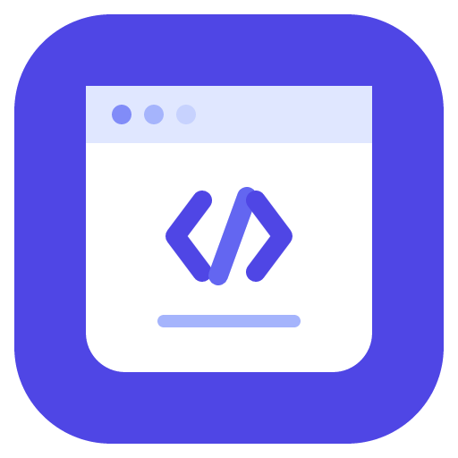

# IDE 配置

IDE（Integrated Development Environment，集成开发环境）是日常开发的「主战场」——一天有六七个小时在里面。本专题讲的是**怎么选、怎么配、怎么让团队一致**，而不是罗列一堆快捷键：选错工具是长期摩擦，配置不一致是长期扯皮，两者都比「不会用某个功能」更贵。

::: tip 一句话理解
IDE 配置的目标不是「配得花哨」，而是**把团队必须一致的部分放进代码仓库，把个人偏好留给个人**。前者决定协作效率，后者决定你的心情。
:::

## 版本状态速览（2026-09 核对）

| 工具 | 当前版本 | 状态 | 说明 |
| --- | --- | --- | --- |
| IntelliJ IDEA | 2026.2 系列（2026.2.2 / 2026-09-02） | 主线 | 自 **2025.3 起为统一产品**：Community 与 Ultimate 合并为单一安装包，核心 Java/Kotlin 功能免费，高级功能由 Ultimate 订阅解锁 |
| Visual Studio Code | **1.137**（2026-09-09） | 主线 | 2026 年发版节奏明显加快，官方归档显示年内已发布 1.111~1.137 共 27 个版本 |
| JetBrains 其他 IDE | 2026.2 系列 | 主线 | WebStorm / PyCharm / GoLand / Rider 等与 IDEA 同步版本号与发版节奏 |
| Eclipse IDE | **2026-09**（Platform 4.41 / 2026-09-09） | 主线 | 采用 13 周一个发布列车（SimRel），当前为 2026-09，上一个为 2026-06（4.40） |
| JetBrains Fleet | **已停止分发**（2025-12-22） | 已终止 | 不再发布更新、不再提供下载，仅存量可用；团队转向新的 Agentic 开发环境 **Air** |
| 云端 IDE | 持续交付 | — | Codespaces 等按量计费，代码与数据出境合规需先评估 |

::: warning
上一段表格里的版本号会过期，**不要把它当成「固定答案」抄进团队文档**。正确做法是在团队文档里写「当前基线 + 修改流程」，并让升级这件事有记录、可回退。
:::

## 专题导航

1. [概述与选型](Overview/index.md)：IDE 与编辑器的边界、2026 年的四项结构性变化、主流方案横向对比与选型决策。
2. [IntelliJ IDEA 深入](IntelliJIDEA/index.md)：统一发行版与授权、内存与 JVM 参数、索引与卡顿治理、运行调试配置、与 Maven toolchain 的联动。
3. [VS Code 深入](VSCode/index.md)：进程模型、配置文件全表、配置层级与优先级、任务与调试、Profile 与便携模式、性能排查。
4. [插件与扩展](Plugins/index.md)：两套插件体系对比、推荐清单、内网离线安装、版本兼容声明、团队统一插件清单。
5. [快捷键与高效操作](Shortcuts/index.md)：能力地图与键位对照、自定义 keymap、冲突排查、命令行入口、效率习惯清单。
6. [配置同步与团队统一](ConfigSync/index.md)：个人同步 / 团队统一 / 环境可复现三个层次，`.editorconfig` 与代码风格对齐，CI 校验。
7. [远程开发与容器化环境](RemoteDev/index.md)：SSH / 容器 / WSL / 云端五种形态，`devcontainer.json` 与端口转发，团队环境即代码。
8. [实战：搭一套统一的 IDE 环境](Practice/index.md)：从零为「3 名 Java + 2 名前端」的团队落地六步方案，含全部配置文件与验收清单。
9. [常见问题与最佳实践](FAQ/index.md)：分类问答、踩坑清单、最佳实践与术语表。

## 阅读路径

| 你的处境 | 建议顺序 |
| --- | --- |
| 刚换机器 / 刚入职 | [配置同步与团队统一](ConfigSync/index.md) → [插件与扩展](Plugins/index.md) → [快捷键与高效操作](Shortcuts/index.md) |
| 团队里「各配各的」 | [实战：搭一套统一的 IDE 环境](Practice/index.md) → [配置同步与团队统一](ConfigSync/index.md) |
| IDE 越用越卡 | [IntelliJ IDEA 深入](IntelliJIDEA/index.md) / [VS Code 深入](VSCode/index.md) 的「卡顿治理」小节 → [常见问题](FAQ/index.md) |
| 要把环境搬到服务器或容器 | [远程开发与容器化环境](RemoteDev/index.md) → [Docker](../../Ops/Docker/index.md) 相关专题 |
| 正在做技术选型 | [概述与选型](Overview/index.md) → [实战](Practice/index.md) 的「锁版本」一节 |

## 相关专题

- [构建和依赖管理工具](../Build/index.md)：Maven / Gradle 在 IDE 里的集成方式不同，本专题讲的是**IDE 侧**怎么接。
- [版本控制工具](../VersionControl/index.md)：Git 的命令行与 IDE 图形化操作是互补关系，冲突解决建议以命令行为主、IDE 为辅。
- [包管理器深入](../PackageManager/index.md)：依赖装不上、锁文件冲突，本质是包管理器问题而不是 IDE 问题。
- [接口调试工具](../APITools/index.md)：IDEA 的 HTTP Client 与 VS Code 的 REST Client 可以把 `.http` 文件当接口用例，和 Postman/Apifox 互补。
- [数据库客户端](../DatabaseClients/index.md)：IDEA Ultimate 自带数据库工具，与 Navicat / DBeaver 有重叠，按需取舍。
- [后端通用模板](../../../project/Base/BackendTemplate/index.md)：项目里 Maven Profile 与 Toolchains 的落地方式，与 IDE 的编译目标设置直接相关。

## 参考资料

- IntelliJ IDEA 官方文档：[jetbrains.com/help/idea](https://www.jetbrains.com/help/idea/)
- VS Code 官方文档：[code.visualstudio.com/docs](https://code.visualstudio.com/docs)
- VS Code 版本归档：[code.visualstudio.com/updates/archive](https://code.visualstudio.com/updates/archive)
- Eclipse IDE 下载与发布列车：[eclipse.org/downloads/packages](https://www.eclipse.org/downloads/packages/)
- EditorConfig 规范：[editorconfig.org](https://editorconfig.org/)
- Dev Container 规范：[containers.dev](https://containers.dev/)
