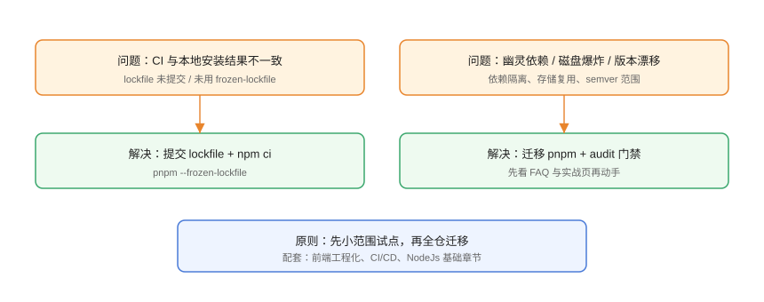

# 常见问题与最佳实践

本页汇总包管理器的高频问题：lockfile 不一致、幽灵依赖、磁盘爆炸、版本漂移、发布事故、安全审计等，按「现象 → 排查 → 解决 → 验证」组织。

## 问题总览



## 安装与构建类

### Q1：CI 与本地构建结果不一致

**排查**：

```shell
git status          # lockfile 是否被改
git log --oneline -- package-lock.json
```

**原因**：lockfile 未提交，或 CI 用了 `npm install`。

**解决**：

```shell
npm ci
# 或
pnpm install --frozen-lockfile
```

### Q2：`pnpm install` 报 ERR_PNPM_LOCKFILE_CONFIG_MISMATCH

**原因**：lockfile 与当前 pnpm 版本/配置不匹配。

**解决**：升级到与 lockfile 相同的 pnpm 版本（`packageManager` 字段），或确认后重新生成 lockfile。

### Q3：node_modules 被误删/损坏

```shell
pnpm install --force
# 或删除后重装
Remove-Item node_modules -Recurse -Force
pnpm install
```

不要复制别人的 node_modules。

## 依赖解析类

### Q4：幽灵依赖报错（模块找不到但 npm 能跑）

```text
ERR_PNPM_NO_IMPORTER_MANIFEST_FIELD: dayjs is not in the dependencies
```

**解决**：把缺的依赖显式加进对应包的 package.json：

```shell
pnpm --filter @my/web add dayjs
```

这是 pnpm 的**安全特性**，不是 bug。

### Q5：同版本包出现多份

```shell
pnpm why lodash
```

**原因**：不同包声明了不同版本范围，解析出多个版本。

**解决**：用 `pnpm overrides` 强制统一版本（确认兼容后）：

```json [package.json]
{
  "pnpm": {
    "overrides": {
      "lodash": "4.17.21"
    }
  }
}
```

### Q6：`pnpm update` 后行为变化

**原因**：范围声明（`^`/`~`）允许小版本升级。

**解决**：升级单独提交、看 changelog、跑全量测试；关键包用精确版本。

## 磁盘与性能类

### Q7：磁盘被 node_modules 占满

```shell
# 定位大依赖
pnpm list --depth 0
du -sh node_modules/*

# pnpm 全局存储清理
pnpm store prune
```

**预防**：用 pnpm 存储复用；删除无用依赖；CI 缓存 store。

### Q8：pnpm 安装反而变慢

**排查**：

1. store 与项目是否跨盘（硬链接失效）。
2. 是否大量首次下载新包（冷缓存）。
3. 镜像源是否慢。

```shell
pnpm config get registry
pnpm store path
```

**解决**：统一盘符、配置国内镜像、CI 预热缓存。

## 发布类

### Q9：`npm publish` 403 / E403

**原因**：包名被占用、无权限、作用域包默认私有。

**解决**：

```shell
npm login
npm access grant read-only my-team @my/utils
# 公共包
pnpm publish --no-git-checks
```

### Q10：发布后发现 bug

```shell
npm deprecate @my/utils@1.3.0 "存在缺陷，请升级到 1.3.1"
pnpm version patch
pnpm publish
```

不要随手 `npm unpublish`（会破坏已安装的下游）。

### Q11：想删除一个版本

**规则**：72 小时内、无下游依赖时可 unpublish；否则用 deprecate。撤销是最后手段，团队应避免依赖它。

## 安全类

### Q12：audit 报高危但无法升级

```shell
pnpm why <漏洞包>
pnpm overrides
```

**处理**：

1. 升级依赖到修复版本。
2. 无修复版本时用 overrides 强制升级传递依赖。
3. 仍无法处理时登记豁免（owner + 到期时间 + 缓解措施）。

### Q13：依赖被投毒/抢注怎么办

```text
1. 立即锁定受影响版本并审计 lockfile 哈希
2. 检查 .npmrc 来源配置，内部包只走私有源
3. 轮换可能泄露的 token/密钥
4. 复盘：为什么能装到未经验证的包
```

## 工具选择类

### Q14：npm、pnpm、Yarn、Bun 怎么选？

| 场景 | 推荐 |
| --- | --- |
| 默认、零改动 | npm |
| 多项目省磁盘、强隔离 | pnpm |
| zero-install、Git 友好 | Yarn Berry |
| 已用 Bun 全家桶 | Bun |

详细对比见「包管理器生态与选型」页。

## 最佳实践清单

::: tip 生产环境清单
- lockfile 提交 Git，CI 用 `--frozen-lockfile` / `npm ci`。
- 依赖升级单独 PR，跑全量测试后再合。
- 统一包管理器与版本（`packageManager` + corepack）。
- `pnpm audit` 每周一次，高危 72 小时内处理。
- 内部包走私有源 + 作用域，杜绝依赖混淆。
- 发布走 CI + tag，2FA + 最小权限 token。
- 定期 `pnpm outdated` 与 `pnpm store prune`。
- 每个包显式声明依赖，禁止访问未声明包。
:::

## 参考资料

- pnpm FAQ：<https://pnpm.io/zh/faq>
- npm 常见问题：<https://docs.npmjs.com/faq>
- Yarn 文档：<https://yarnpkg.com/>
- semver：<https://semver.org/lang/zh-CN/>
