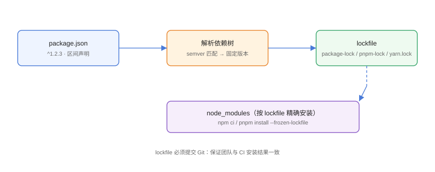

# lockfile 与依赖解析

lockfile（锁文件）是**依赖安装结果的「快照」**：把 package.json 里的版本区间解析成精确版本并记录完整性哈希，保证任何人在任何时间安装到完全一致的依赖树。本页讲清解析过程、各工具 lockfile 差异与 CI 用法。

## 为什么需要 lockfile



```text
package.json:  "lodash": "^4.17.21"
lockfile:      lodash@4.17.21 的精确版本 + 依赖树 + 哈希
```

没有 lockfile 的后果：

1. 三个月后 `^4.17.21` 可能解析到 4.17.30，行为悄悄变化。
2. 团队成员安装结果不一致，「我这边能跑」。
3. CI 与本地不一致，回归难以复现。
4. 依赖被恶意更新时无感知。

## semver 解析规则

| 声明 | 匹配范围 | 说明 |
| --- | --- | --- |
| `1.2.3` | 仅 1.2.3 | 精确锁定 |
| `^1.2.3` | >=1.2.3 <2.0.0 | 不跨越 major |
| `~1.2.3` | >=1.2.3 <1.3.0 | 只允许 patch |
| `>=1.2.3 <2` | 区间 | 自定义范围 |
| `latest` / `*` | 最新 | **生产禁止** |

```json [package.json]
{
  "dependencies": {
    "lodash": "^4.17.21",
    "dayjs": "~1.11.13",
    "react": "18.3.1"
  }
}
```

## 各工具 lockfile

| 工具 | lockfile | 特点 |
| --- | --- | --- |
| npm | package-lock.json | 记录完整依赖树与 integrity 哈希 |
| pnpm | pnpm-lock.yaml | YAML 格式，记录存储 key |
| Yarn Classic | yarn.lock | 扁平的解析表 |
| Yarn Berry | yarn.lock | 含 PnP 所需元数据 |
| Bun | bun.lockb | 二进制格式 |

## 精确安装命令

### npm

```shell
# 严格按 package-lock.json 安装（CI 必须用）
npm ci

# 常规安装（会按需更新 lockfile）
npm install
```

### pnpm

```shell
# lockfile 与 package.json 不一致时报错，不静默更新
pnpm install --frozen-lockfile

# 更新 lockfile
pnpm install
pnpm update
```

### Yarn

```shell
yarn install --immutable      # Berry：lockfile 不一致即失败
yarn install --immutable-cache
```

## 依赖解析与去重

### npm 的扁平 node_modules

```text
node_modules/
├─ lodash/          # 顶层提升（hoisting）
├─ react/
└─ a/               # a 的依赖若版本冲突，则嵌套在 a/node_modules
   └─ node_modules/
      └─ lodash@4.x
```

优点：解析直接；缺点：可能出现**幽灵依赖**（未声明的包被提升到顶层，代码能 import 到但没写进 package.json）。

### pnpm 的严格隔离

```text
node_modules/
├─ .pnpm/           # 真实文件（硬链接自全局存储）
│  └─ lodash@4.17.21/node_modules/lodash
├─ lodash -> .pnpm/lodash@4.17.21/node_modules/lodash  # 符号链接
└─ react -> ...
```

只有 package.json 声明的依赖才会出现在顶层，幽灵依赖直接被拦截。

## lockfile 与 Git

```gitignore [.gitignore]
# 以下文件必须提交（不要忽略）
package-lock.json
pnpm-lock.yaml
yarn.lock
bun.lockb
```

```gitignore [.gitignore]
# node_modules 必须忽略
node_modules/
```

::: tip 最佳实践
lockfile 提交 Git 后，**依赖升级是显式动作**（`pnpm update` / `npm update`），提交时能看到 diff，天然形成变更记录。
:::

## 易错点与最佳实践

::: danger 常见问题
1. **lockfile 没提交**：CI 每次解析出新版本，构建不可复现。把 lockfile 纳入强制评审。
2. **CI 用 `npm install` 而不是 `npm ci`**：前者会悄悄改 lockfile。CI 必须用精确安装命令。
3. **手动编辑 lockfile**：格式复杂，手改极易出错。用工具生成。
4. **同时存在多个 lockfile**：仓库里既有 package-lock 又有 pnpm-lock，说明混用工具，选一个并删除另一个。
5. **`latest`/`*` 依赖**：每次安装都可能变，生产依赖一律写明确版本或受控范围。
:::

::: tip 最佳实践
- 本地用 `pnpm install`，CI 用 `--frozen-lockfile`，升级依赖单独提交。
- lockfile 冲突用 `git checkout --theirs` 后重新安装生成，不要手拼。
- 在 CI 里加一步校验：`pnpm install --frozen-lockfile` 失败即阻断。
- 定期 `pnpm outdated` 查看可升级依赖，集中安排升级批次。
- lockfile 变更的 PR 需要附上「为什么升级」说明。
:::

## 实战：让 CI 与本地安装完全一致

```shell
# 本地
pnpm install

# CI（GitHub Actions 示例）
corepack enable
pnpm install --frozen-lockfile
pnpm build
```

```yaml [.github/workflows/build.yml]
jobs:
  build:
    runs-on: ubuntu-latest
    steps:
      - uses: actions/checkout@v4
      - uses: actions/setup-node@v4
        with:
          node-version: 24
          cache: pnpm
      - run: corepack enable
      - run: pnpm install --frozen-lockfile
      - run: pnpm build
```

## 验证方式

1. `pnpm install --frozen-lockfile` 两次结果一致。
2. 删除 node_modules 后重新安装，构建通过。
3. CI 与本地 `pnpm list` 输出的依赖树一致。

## 参考资料

- npm ci：<https://docs.npmjs.com/cli/v11/commands/npm-ci>
- pnpm lockfile：<https://pnpm.io/zh/lockfile>
- Yarn lockfile：<https://yarnpkg.com/configuration/yarnrc>
- semver：<https://semver.org/lang/zh-CN/>
