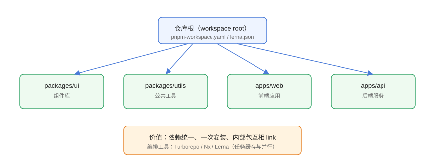

# monorepo 与 workspaces

monorepo（单仓多包）把多个项目/包放进**一个 Git 仓库**，用 workspace 统一管理依赖、共享代码、统一发布。本页讲清 workspace 的三种实现（npm/pnpm/Yarn）、目录规范与构建编排（Turborepo/Nx/Lerna）。

## 什么是 monorepo



```text
my-monorepo/
├─ pnpm-workspace.yaml      # workspace 声明
├─ package.json             # 根配置
├─ packages/
│  ├─ ui/                   # 组件库
│  ├─ utils/                # 工具库
│  └─ shared/               # 共享类型
└─ apps/
   ├─ web/                  # 前端应用
   └─ api/                  # 后端服务
```

与 multi-repo（多仓）对比：

| 维度 | monorepo | multi-repo |
| --- | --- | --- |
| 依赖管理 | 一次安装、统一版本 | 各仓独立 |
| 代码复用 | workspace 内部直接 link | 发包 + 版本升级 |
| 原子提交 | 跨包改动一次提交 | 跨仓联动繁琐 |
| 构建编排 | 需要工具（Turborepo/Nx） | 各仓自己管 |
| 规模边界 | 仓库变大后需治理 | 天然隔离 |

## workspace 三种实现

### npm workspaces

```json [package.json]
{
  "workspaces": ["packages/*", "apps/*"]
}
```

```shell
npm install
npm run build --workspace=@my/ui
```

### pnpm workspace

```yaml [pnpm-workspace.yaml]
packages:
  - packages/*
  - apps/*
```

```shell
pnpm install
pnpm --filter @my/ui build
pnpm -r build
```

### Yarn workspaces

```json [package.json]
{
  "workspaces": ["packages/*", "apps/*"]
}
```

```shell
yarn workspace @my/ui build
yarn workspaces foreach -pt run build
```

## workspace 互引

包 A 依赖包 B 时，workspace 直接链接本地源码，无需发布：

```json [packages/ui/package.json]
{
  "name": "@my/ui",
  "dependencies": {
    "@my/utils": "workspace:*"
  }
}
```

```shell
# 验证本地链接
pnpm ls --depth 1
ls node_modules/@my/utils
```

`workspace:*` 表示始终使用本地 workspace 版本；发布时可自动转换为实际版本号。

## 构建编排：Turborepo / Nx

workspace 只解决「依赖与链接」，**任务编排**（哪些包先构建、缓存结果、并行执行）交给专用工具：

| 工具 | 特点 |
| --- | --- |
| Turborepo | 基于任务图与哈希缓存，配置简单，与 pnpm 配合好 |
| Nx | 功能全：影响分析、依赖图、缓存、生成器 |
| Lerna | 经典发布流程工具，常与 npm/yarn 配合 |

### Turborepo 示例

```json [turbo.json]
{
  "$schema": "https://turbo.build/schema.json",
  "tasks": {
    "build": {
      "dependsOn": ["^build"],
      "outputs": ["dist/**"]
    },
    "test": {
      "dependsOn": ["^build"]
    }
  }
}
```

```json [package.json]
{
  "scripts": {
    "build": "turbo run build",
    "test": "turbo run test"
  }
}
```

```shell
pnpm build
# 只构建受影响包 + 缓存命中加速
```

## 版本管理与发布

monorepo 发布有两种模式：

| 模式 | 说明 | 工具 |
| --- | --- | --- |
| 统一版本 | 所有包同版本号 | Lerna fixed |
| 独立版本 | 每个包独立版本 | changesets、Lerna independent |

推荐 **Changesets**：按变更生成 changelog 与版本号，PR 合并时自动发布。

```md [.changeset/xxx.md]
---
"@my/utils": patch
---

修复 getDate 时区问题
```

```shell
pnpm changeset
pnpm changeset version
pnpm changeset publish
```

## 依赖提升与隔离

pnpm 在 monorepo 中默认**依赖隔离**：每个包只看到自己声明的依赖 + workspace 包。共享的公共依赖（如 typescript）放根 `devDependencies`。

```json [package.json（根）]
{
  "devDependencies": {
    "typescript": "^5.8.0",
    "vitest": "^3.0.0"
  }
}
```

## 易错点与最佳实践

::: danger 常见问题
1. **忘记声明 workspace 包依赖**：包 A 用了包 B，但 A 的 package.json 没写 `@my/b: workspace:*`。必须显式声明。
2. **根 node_modules 与包内依赖混用**：包级命令找不到依赖，多半是依赖放在了根而非声明在包内。用 `pnpm --filter` 明确作用域。
3. **`workspace:*` 发布后没转换**：发布前检查打包后的 package.json 依赖是否为真实版本，或用 changesets 自动处理。
4. **构建顺序错误**：无 `dependsOn` 时并行构建可能「上游还没 build 下游就 build」。用 Turborepo/Nx 声明依赖关系。
5. **仓库无节制膨胀**：monorepo 也要定边界（哪些包进、哪些不进），配套 CODEOWNERS 与变更影响分析。
:::

::: tip 最佳实践
- 包命名统一作用域：`@<org>/<name>`，避免包名冲突。
- 公共工具链（TS、lint、测试）放根 devDependencies，统一版本。
- 用 `pnpm --filter <pkg> <cmd>` 精确操作，避免整仓误跑。
- CI 缓存 pnpm store 与 Turborepo 缓存目录，大幅提速。
- 每个包必须有清晰的边界文档，新人知道「代码放哪、依赖怎么加」。
:::

## 实战：搭一个最小 monorepo

```shell
# 1. 初始化
mkdir my-monorepo && cd my-monorepo
pnpm init

# 2. 声明 workspace
echo "packages:" > pnpm-workspace.yaml
echo "  - 'packages/*'" >> pnpm-workspace.yaml

# 3. 建两个包
mkdir -p packages/utils packages/ui
cd packages/utils && pnpm init && cd ../..
cd packages/ui && pnpm init && cd ../..

# 4. ui 依赖 utils
cd packages/ui
pnpm add @my/utils@workspace:* --workspace
cd ../..

# 5. 根安装 + 验证
pnpm install
pnpm --filter @my/ui build
```

## 验证方式

1. `pnpm -r ls --depth 0` 显示所有 workspace 包。
2. 修改 utils 源码，ui 构建立即反映（本地链接生效）。
3. `pnpm install --frozen-lockfile` 全绿。
4. Turborepo 二次构建命中缓存。

## 参考资料

- pnpm workspaces：<https://pnpm.io/zh/workspaces>
- npm workspaces：<https://docs.npmjs.com/cli/v11/using-npm/workspaces>
- Turborepo：<https://turbo.build/repo/docs>
- Changesets：<https://github.com/changesets/changesets>
- Yarn workspaces：<https://yarnpkg.com/features/workspaces>
