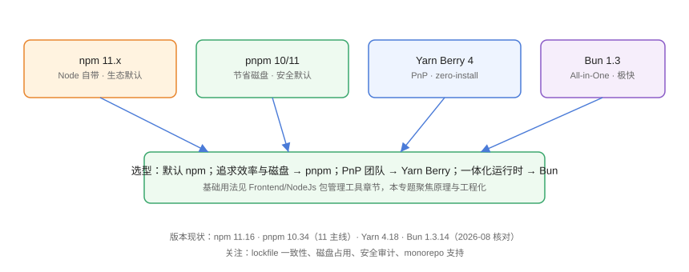

# 包管理器生态与选型

包管理器（Package Manager）负责「依赖从哪来、装到哪、怎么解析版本、如何隔离」，直接决定安装速度、磁盘占用与供应链风险。本页从**工程化视角**对比 npm、pnpm、Yarn、Bun，帮助团队做出选型决策。

## 包管理器解决什么问题

```text
package.json 声明依赖
  → 解析版本（semver）
  → 下载并安装
  → 生成 lockfile 锁定结果
  → 提供 scripts 与发布能力
```

没有包管理器时：手动下载压缩包、复制进 node_modules、版本冲突全靠人肉，基本不可维护。

## 四大工具



| 工具 | 当前主线 | 安装策略 | 特色 |
| --- | --- | --- | --- |
| npm | 11.x | 嵌套 node_modules | Node 自带、生态默认 |
| pnpm | 10.x 稳定、11.x 主线 | 内容寻址存储 + 硬链接/符号链接 | 省磁盘、严格依赖隔离 |
| Yarn Berry | 4.x | 可 PnP（无 node_modules）或 node-modules | Zero-Install、约束引擎 |
| Bun | 1.3.x | 全局缓存 + 硬链接 | 一体化的运行时 + 包管理器 |

::: info 版本现状（2026-08 核对）
- **npm 11.16**：npm 11 随 Node.js 24 于 2025 年推出，2026 持续更新；npm 11.15 起支持 staged publishing。
- **pnpm 10.34** 仍在支持期（EOL 2027-04），**pnpm 11 于 2026-05 发布**，逐步成为主线。
- **Yarn Berry 4.18**（2026-07 发布）：PnP 与 Zero-Install 方向。
- **Bun 1.3.14**：Bun 1.2（2026-01）是兼容性大版本，包管理器支持全局内容寻址缓存。
:::

## 基础 vs 深入

基础用法（安装、缓存清理、常用命令）已在 [Node.js 包管理工具](../../../Frontend/Basic/NodeJs/PackageManagementTool/index.md) 讲解，本专题聚焦：

1. lockfile 与依赖解析原理
2. pnpm 的存储与链接机制
3. monorepo 与 workspace 编排
4. 发布流程、版本策略与私有源
5. 供应链安全与 CI 集成

## 选型决策

| 团队情况 | 推荐 | 理由 |
| --- | --- | --- |
| 默认上手、工具链成熟 | npm | 零额外安装 |
| 多项目、磁盘紧张、严格依赖隔离 | pnpm | 存储复用 + 防幽灵依赖 |
| 追求 zero-install 与 Git 集成 | Yarn Berry（PnP） | 依赖进仓库、克隆即用 |
| 已全面使用 Bun 运行时 | Bun | 一体化、安装极快 |
| 公司规范统一 | 全团队统一一款 | 避免 lockfile 混用 |

## 关键对比维度

| 维度 | npm | pnpm | Yarn Berry | Bun |
| --- | --- | --- | --- | --- |
| 安装速度 | 基准 | 快（缓存命中高） | 中 | 极快 |
| 磁盘占用 | 高（每项目一份） | 低（全局一份） | 中（zip 缓存） | 低（全局缓存） |
| 依赖隔离 | 弱（可幽灵依赖） | 强 | 强（PnP） | 中 |
| lockfile | package-lock.json | pnpm-lock.yaml | yarn.lock | bun.lockb |
| monorepo | workspaces | workspace 原生 | workspaces | workspace |
| 生态 | 默认 | 兼容 | 兼容 | 兼容度持续提升 |

::: tip 选型建议
没有特殊诉求的团队从 **pnpm** 起步收益最大：安装快、省磁盘、默认安全；需要保持「零改动」则继续 npm。Yarn Berry 与 Bun 适合有明确诉求（zero-install / 一体化运行时）的团队。
:::

## 常见误区

::: danger 常见问题
1. **换包管理器不换 lockfile**：npm 与 pnpm 的 lockfile 不通用，切换后必须重新生成并提交。
2. **「哪个快」只看一次安装**：缓存命中率、CI 冷启动才是真实场景，用自己项目的依赖树实测。
3. **忽略安全默认值**：pnpm 10 默认禁止未声明依赖，升级后报错要先理解再放行，而不是直接关掉。
4. **团队混用工具**：有人 npm、有人 pnpm，lockfile 打架，构建结果不一致。统一一款并写入文档。
5. **只看安装器不看运行时**：Bun 快，但迁移到 Bun 运行时是更大工程，别只为了「装得快」换全家桶。
:::

## 团队落地 checklist

选定工具后，用这张清单统一工程基线：

1. 全仓库统一使用同一包管理器，`packageManager` 字段固定版本（配合 corepack）。
2. lockfile 提交 Git，CI 使用 `--frozen-lockfile` / `npm ci`。
3. 确定镜像源（公司私有源或加速镜像）并写入 `.npmrc`。
4. 明确依赖升级流程：单独 PR + 全量测试。
5. 接入 `audit` 安全门禁与依赖扫描。
6. 新项目脚手架默认启用选定的包管理器，避免新人回退 npm。

## 验证方式

1. 用同一份 package.json 分别在 npm/pnpm 安装，对比耗时与磁盘占用。
2. 检查生成的 lockfile 类型与是否已提交 Git。
3. 在 CI 用 `--frozen-lockfile`/`npm ci` 验证构建一致。

## 参考资料

- npm 文档：<https://docs.npmjs.com/>
- pnpm 文档：<https://pnpm.io/zh/>
- Yarn Berry：<https://yarnpkg.com/>
- Bun 文档：<https://bun.sh/docs>
- 依赖安装基准对比：<https://pnpm.io/benchmarks>
