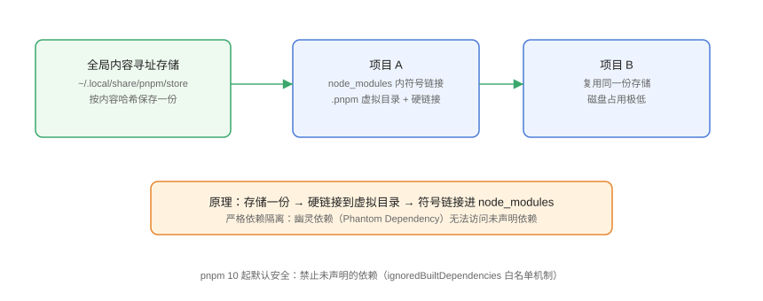

# pnpm 原理：存储、链接与安全

pnpm 用**内容寻址存储（Content-Addressable Storage）+ 硬链接/符号链接**实现「全局只存一份、项目按需链接」，同时通过严格依赖隔离拦截幽灵依赖。本页讲清 pnpm 的核心机制、常见命令与 10/11 的安全默认值。

## 核心原理



```text
全局存储（store）
  └─ 按内容哈希保存每个包版本，全局一份
项目安装时：
  存储 → 硬链接进 node_modules/.pnpm/<pkg>@<ver>/node_modules/<pkg>
  再 → 符号链接到项目 node_modules/<pkg>
```

结果：

1. **磁盘占用低**：同一版本包在多个项目间只存一份。
2. **安装快**：缓存命中时只需创建链接。
3. **依赖隔离**：node_modules 顶层只有显式声明的依赖。

## 存储位置

```shell
# 查看 store 路径
pnpm store path

# 清理未被引用的包
pnpm store prune

# 查看 store 状态
pnpm store status
```

| 平台 | 默认 store 路径 |
| --- | --- |
| Windows | `%LOCALAPPDATA%\pnpm\store` |
| Linux/macOS | `~/.local/share/pnpm/store` |

## 硬链接与符号链接

| 链接类型 | 作用 | 特点 |
| --- | --- | --- |
| 硬链接 | store → .pnpm 虚拟目录 | 同一文件系统内共享 inode，不占双份 |
| 符号链接 | .pnpm → 顶层 node_modules | 暴露显式声明的依赖 |

::: warning 说明
硬链接依赖同一文件系统：若 store 与项目不在同一磁盘（如跨盘挂载），pnpm 会退化为复制。CI 缓存 pnpm store 时也要保证同一文件系统。
:::

## 幽灵依赖与严格隔离

```javascript [src/xxx.js]
// 幽灵依赖：能跑但没声明
import dayjs from "dayjs"; // package.json 没写 dayjs
```

```shell
# npm 可能因为 hoisting 让这段代码「碰巧能跑」
# pnpm 直接报错：ERR_PNPM_NO_IMPORTER_MANIFEST_FIELD 或模块找不到
pnpm install
```

pnpm 的做法：只有 package.json 里声明的依赖出现在顶层。这迫使开发者**显式声明每个依赖**，构建结果更可预测。

## pnpm 10/11 的安全默认

```text
pnpm 10 起默认行为：
1. 禁止未在 dependencies 中声明的导入（ERR_PNPM_NO_IMPORTER_MANIFEST_FIELD）
2. 构建脚本需要白名单（ignoredBuiltDependencies）
3. onlyBuiltDependencies 控制 postinstall 脚本
```

从 npm 迁移时常见报错：

```shell
ERR_PNPM_RECURSIVE_RUN_FIRST_FAIL
pnpm approve-builds   # 交互式批准构建脚本
```

```json [package.json]
{
  "pnpm": {
    "onlyBuiltDependencies": ["esbuild", "sharp"]
  }
}
```

::: tip 理解安全默认
这些限制是为了防**供应链投毒**（恶意 postinstall 脚本）。迁移期遇到报错，先确认包可信再白名单，而不是全局关闭校验。
:::

## 常用命令

| 命令 | 作用 |
| --- | --- |
| `pnpm add lodash` | 安装依赖并写入 dependencies |
| `pnpm add -D typescript` | 安装开发依赖 |
| `pnpm remove lodash` | 移除依赖 |
| `pnpm update` | 更新到允许的最新版本 |
| `pnpm outdated` | 查看可升级依赖 |
| `pnpm why lodash` | 查看依赖来源链 |
| `pnpm ls --depth 2` | 查看依赖树 |
| `pnpm audit` | 安全审计 |
| `pnpm approve-builds` | 批准构建脚本白名单 |
| `pnpm dlx create-vite` | 免安装执行 CLI（同 npx） |

## 与 npm 的迁移要点

| npm | pnpm |
| --- | --- |
| `npm install` | `pnpm install` |
| `npm ci` | `pnpm install --frozen-lockfile` |
| `npx vitest` | `pnpm dlx vitest` / `pnpm exec vitest` |
| `npm run build` | `pnpm build` |
| package-lock.json | pnpm-lock.yaml（删除前者） |

```shell
# 使用 corepack 固定 pnpm 版本
corepack enable
corepack prepare pnpm@latest --activate
```

```json [package.json]
{
  "packageManager": "pnpm@10.34.5"
}
```

## 易错点与最佳实践

::: danger 常见问题
1. **跨盘符 store**：Windows 上项目在 D 盘、store 在 C 盘，硬链接失效变复制，速度与磁盘优势消失。把 store 路径配到同一盘。
2. **迁移后报「模块找不到」**：多半是幽灵依赖被拦截。把缺的依赖显式 `pnpm add` 到对应包。
3. **postinstall 脚本被跳过**：pnpm 10 默认不执行未批准的构建脚本。用 `onlyBuiltDependencies` 白名单。
4. **node_modules 被手删**：删除后重新 `pnpm install` 即可，不要复制别人的 node_modules。
5. **store 无限增长**：定期 `pnpm store prune`，或在 CI 里用带缓存的 setup 流程。
:::

::: tip 最佳实践
- 全团队用 corepack + `packageManager` 字段固定 pnpm 版本。
- CI 缓存 `~/.local/share/pnpm/store`（Windows 为 `%LOCALAPPDATA%\pnpm\store`），加速安装。
- 新项目直接用 pnpm；存量 npm 项目按「实战」页的步骤小范围迁移。
- 用 `pnpm why` 排查依赖来源，别靠猜。
:::

## 实战：三个项目共享存储

```shell
# 1. 三个项目都启用 pnpm
cd project-a && pnpm install
cd ../project-b && pnpm install
cd ../project-c && pnpm install

# 2. 验证共享存储
pnpm store path
du -sh "$(pnpm store path)"   # 只存一份

# 3. 验证依赖隔离
pnpm ls --depth 0
```

## 验证方式

1. `pnpm store path` 有输出。
2. 三个项目安装后 store 中同版本包只有一份。
3. 尝试 import 未声明依赖，报错（隔离生效）。
4. `pnpm install --frozen-lockfile` 在 CI 全绿。

## 参考资料

- pnpm 官方文档：<https://pnpm.io/zh/>
- pnpm 原理（符号链接与硬链接）：<https://pnpm.io/zh/symlinked-node-modules-structure>
- pnpm 10 发布说明：<https://github.com/pnpm/pnpm/releases>
- 为什么应使用 pnpm：<https://pnpm.io/zh/motivation>
