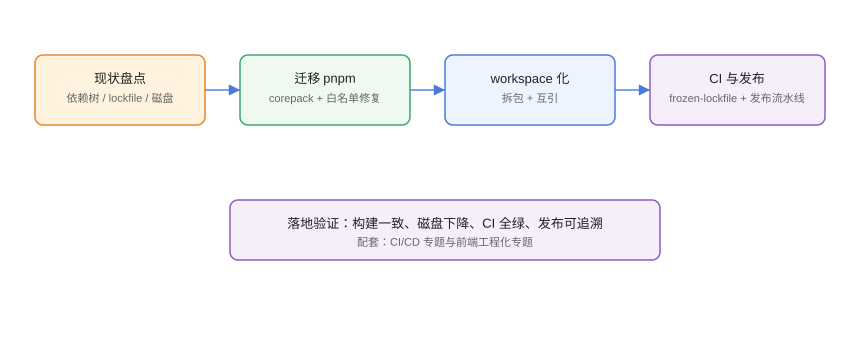

# 实战：迁移 pnpm 与 monorepo 落地

本页把专题能力串成一次真实改造：把存量 npm 项目**迁移到 pnpm**，再把多个相关项目重组为 **monorepo**，最终让 CI 更快、磁盘更省、构建更一致。全程给出可复现的命令与验证点。

## 改造目标



```text
现状：npm + 多仓、依赖重复、构建时快时慢
目标：pnpm + monorepo、存储复用、CI 全绿、发布可追溯
```

## 第一步：现状盘点

```shell
# 依赖树与体积
npm ls --depth 1
du -sh node_modules

# lockfile 情况
ls package-lock.json

# 是否有幽灵依赖风险
npm ls --all | wc -l
```

记录基线：安装耗时、磁盘占用、构建时长，用于改造后对比。

## 第二步：迁移到 pnpm（单项目验证）

```shell
# 1. 启用 corepack 固定 pnpm
corepack enable
corepack prepare pnpm@10.34.5 --activate

# 2. 删除旧锁文件与 node_modules（保留 package.json）
Remove-Item package-lock.json, node_modules -Recurse -Force

# 3. 首次安装（会生成 pnpm-lock.yaml）
pnpm install

# 4. 处理安全默认报错
pnpm approve-builds
# 在 package.json 中固化白名单
```

```json [package.json]
{
  "packageManager": "pnpm@10.34.5",
  "pnpm": {
    "onlyBuiltDependencies": ["esbuild", "sharp"]
  }
}
```

常见迁移报错：

| 报错 | 原因 | 处理 |
| --- | --- | --- |
| `ERR_PNPM_NO_IMPORTER_MANIFEST_FIELD` | 幽灵依赖被拦截 | 把缺的包 `pnpm add` 到对应包 |
| `ERR_PNPM_RECURSIVE_RUN_FIRST_FAIL` | 脚本找不到依赖 | 检查根 vs 包级依赖声明 |
| `Cannot find module` | 硬链接/符号链接异常 | 重新 `pnpm install` |

## 第三步：验证单项目

```shell
pnpm install --frozen-lockfile
pnpm test
pnpm build

# 对比基线
du -sh node_modules
```

预期：构建通过、磁盘下降、耗时持平或更短。

## 第四步：重组 monorepo

```shell
# 1. 建仓库骨架
mkdir my-monorepo && cd my-monorepo
pnpm init

# 2. workspace 声明
@"
packages:
  - packages/*
  - apps/*
"@ | Set-Content pnpm-workspace.yaml

# 3. 移入存量项目
git mv ../project-a apps/web
git mv ../project-b packages/ui

# 4. 包名统一作用域
# 修改各自 package.json 的 name 为 @my/web、@my/ui

# 5. 根安装
pnpm install
```

```json [apps/web/package.json]
{
  "name": "@my/web",
  "dependencies": {
    "@my/ui": "workspace:*"
  }
}
```

## 第五步：构建编排

```shell
pnpm add -Dw turbo
```

```json [turbo.json]
{
  "tasks": {
    "build": {
      "dependsOn": ["^build"],
      "outputs": ["dist/**"]
    },
    "test": {
      "dependsOn": ["^build"]
    }
  }
}
```

```shell
pnpm build
pnpm test
```

## 第六步：CI 与发布

```yaml [.github/workflows/ci.yml]
name: CI
on:
  pull_request:
jobs:
  build:
    runs-on: ubuntu-latest
    steps:
      - uses: actions/checkout@v4
      - uses: actions/setup-node@v4
        with:
          node-version: 24
          cache: pnpm
      - run: corepack enable
      - run: pnpm install --frozen-lockfile
      - run: pnpm audit --audit-level high
      - run: pnpm test
      - run: pnpm build
```

发布接入 Changesets：

```shell
pnpm add -Dw @changesets/cli
pnpm changeset init
pnpm changeset
pnpm changeset version
pnpm changeset publish
```

## 团队规范沉淀

1. `packageManager` 字段固定 pnpm 版本，corepack 自动匹配。
2. lockfile 必提交；升级依赖单独 PR。
3. 包内依赖显式声明，禁止访问未声明包。
4. 发布走 CI + tag，禁止本地手工 publish。
5. 每月跑一次 audit + outdated，登记处理结果。

## 易错点与最佳实践

::: danger 常见问题
1. **一次性全仓迁移**：风险集中。先在 1 个仓库试点，跑通再推广。
2. **忽略构建脚本白名单**：迁移后构建产物异常，多半是 postinstall 没执行。逐一审查并白名单。
3. **monorepo 后脚本互相踩**：根 scripts 与包 scripts 同名冲突。用 `--filter` 明确作用域。
4. **CI 缓存失效**：缓存 key 不含 lockfile 哈希时永远不命中。用 setup-node 的 `cache: pnpm`。
5. **发布没有回滚预案**：先 `pnpm publish --dry-run`，出问题用 deprecate 而非裸 unpublish。
:::

::: tip 最佳实践
- 迁移按「单项目 → 多项目 → monorepo」分三步走，每步可回退。
- 用 `pnpm --filter` 在 CI 里只构建受影响包，配合 Turborepo 缓存。
- 把改造前后的「安装耗时/磁盘/构建时长」写进文档，向团队证明收益。
- 与 [前端工程化](../../../Frontend/Others/FrontendEngineering/index.md)、[CI/CD](../CICD/index.md) 专题联动，形成完整工程基线。
:::

## 验证方式

1. `pnpm install --frozen-lockfile` 在 CI 全绿。
2. `du -sh node_modules` 与迁移前对比下降。
3. workspace 包互引走本地链接（`pnpm ls` 可验证）。
4. Turborepo 缓存命中（二次构建明显更快）。
5. 发布流程从打 tag 到下游安装全链路跑通。

## 参考资料

- pnpm 迁移指南：<https://pnpm.io/zh/installation>
- pnpm workspaces：<https://pnpm.io/zh/workspaces>
- Turborepo：<https://turbo.build/repo/docs>
- Changesets：<https://github.com/changesets/changesets>
- GitHub Actions 缓存 pnpm：<https://github.com/actions/setup-node>
