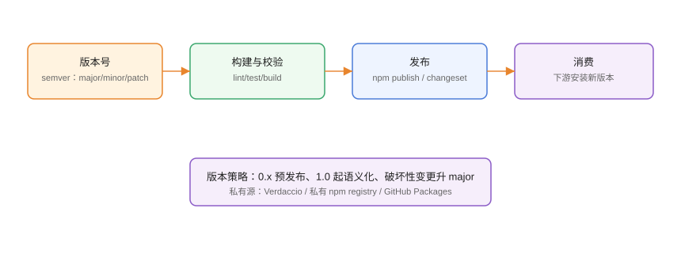

# 包发布流程与版本管理

发布 npm 包是「把代码交付给下游消费者」的正式动作：版本号、构建产物、发布脚本、私有源、权限与回滚都影响可靠性。本页给出一套可复制的发布流程。

## 发布流程全景



```text
版本规划 → 构建与校验 → 本地试装 → 发布 → 验证消费 → 打 tag/发布说明
```

## 语义化版本（semver）

| 版本位 | 含义 | 何时递增 |
| --- | --- | --- |
| major | 破坏性变更 | 不兼容 API |
| minor | 向后兼容新功能 | 新增功能 |
| patch | 向后兼容修复 | bug 修复 |

```shell
# npm
npm version patch   # 1.2.3 → 1.2.4
npm version minor   # → 1.3.0
npm version major   # → 2.0.0

# pnpm
pnpm version patch
```

预发布版本：`1.0.0-beta.1`、`2.0.0-rc.1`，用 `npm publish --tag beta`。

## 发布前准备

### 1. 检查 package.json 关键字段

```json [package.json]
{
  "name": "@my/utils",
  "version": "1.4.0",
  "main": "./dist/index.js",
  "types": "./dist/index.d.ts",
  "exports": {
    ".": {
      "types": "./dist/index.d.ts",
      "import": "./dist/index.mjs",
      "require": "./dist/index.cjs"
    }
  },
  "files": ["dist"],
  "sideEffects": false,
  "engines": {
    "node": ">=18"
  },
  "publishConfig": {
    "access": "public"
  }
}
```

| 字段 | 作用 |
| --- | --- |
| `files` | 只发布 dist，避免源码/测试进包 |
| `exports` | 现代包入口映射（含 ESM/CJS） |
| `types` | TypeScript 类型入口 |
| `engines` | 声明 Node 版本要求 |
| `publishConfig.access` | 作用域包发布权限 |

### 2. 本地校验

```shell
pnpm build
pnpm test
pnpm publish --dry-run    # 预览将发布的文件
```

### 3. 本地试装

```shell
pnpm pack                 # 生成 tarball
cd /tmp && npm init -y
npm install /path/to/my-utils-1.4.0.tgz
node -e "require('@my/utils')"
```

## 发布命令

```shell
# 登录（含双因子）
npm login
pnpm publish

# 指定 tag（预发布）
pnpm publish --tag beta

# 撤销发布（24 小时内）
npm unpublish @my/utils@1.4.0
```

::: warning 说明
`npm unpublish` 只能删除发布后 **72 小时内**且无依赖的版本；一旦被下游使用，应改用 `deprecate` 标记废弃而不是删除。
:::

```shell
# 标记废弃
npm deprecate @my/utils@1.3.0 "存在安全漏洞，请升级到 1.4.0"
```

## 私有源

| 方案 | 适用 |
| --- | --- |
| 私有 npm registry（GitHub Packages / 云服务） | 不想自建 |
| Verdaccio | 自建轻量私有源 |
| 公司统一源 + 代理 | 大规模团队 |

```shell
# 私有源配置
npm config set registry https://registry.example.com/

# 作用域包走私有源
npm config set @my:registry https://registry.example.com/

# 发布到私有源
npm publish --registry https://registry.example.com/
```

```yaml [.npmrc]
@my:registry=https://registry.example.com/
//registry.example.com/:always-auth=true
```

## CI 自动化发布

```yaml [.github/workflows/release.yml]
name: Release
on:
  push:
    tags: ["v*"]
jobs:
  publish:
    runs-on: ubuntu-latest
    permissions:
      contents: read
      packages: write
    steps:
      - uses: actions/checkout@v4
      - uses: actions/setup-node@v4
        with:
          node-version: 24
          registry-url: https://npm.pkg.github.com/
      - run: corepack enable
      - run: pnpm install --frozen-lockfile
      - run: pnpm test
      - run: pnpm build
      - run: pnpm publish
        env:
          NODE_AUTH_TOKEN: ${{ secrets.GITHUB_TOKEN }}
```

## 版本策略

1. 0.x 阶段：minor 可能破坏兼容，下游谨慎升级。
2. 1.0 起严格 semver：破坏性变更必须升 major。
3. 预发布用 `-beta`/`-rc` tag，验证后再发正式版。
4. 破坏性变更提供**迁移指南**（changelog + 升级文档）。

## 易错点与最佳实践

::: danger 常见问题
1. **把 dist 漏发/多发**：`files` 不配导致发布源码或遗漏产物。用 `pnpm publish --dry-run` 检查。
2. **发布后才发现 bug**：先 `npm deprecate` 标记，再快速发 patch，不要随便 unpublish。
3. **版本号不升就 publish**：同版本重复发布报错，或覆盖历史。养成 `pnpm version` 先行。
4. **Token 泄露**：NODE_AUTH_TOKEN 只放 CI Secret，不进仓库。
5. **作用域包默认私有**：发布到公共源要 `publishConfig.access: public`。
:::

::: tip 最佳实践
- 发布前 `pnpm pack` + 本地试装，验证入口、类型与产物完整性。
- changelog 用 Changesets 或 `conventional-changelog` 自动生成。
- 打 tag 触发 CI 发布，禁止本地手工 publish（统一可审计）。
- 发布后立刻 `pnpm add <pkg>@latest` 验证可安装。
- 定期审计已发布包的依赖与权限，回收离职成员 token。
:::

## 实战：发布一个最小工具包

```shell
# 1. 项目与构建
mkdir my-utils && cd my-utils
pnpm init
pnpm add -D typescript
# 编写 src/index.ts，配置 tsconfig 输出 dist
pnpm build

# 2. 检查发布内容
pnpm publish --dry-run

# 3. 版本与发布
pnpm version patch
pnpm publish

# 4. 验证消费
cd /tmp && npm init -y
npm install @my/utils
node -e "console.log(require('@my/utils').hello())"
```

## 验证方式

1. `pnpm publish --dry-run` 文件列表只含预期内容。
2. 安装 tarball 后 `require`/`import` 均可用，类型提示正常。
3. 私有源发布后能 `npm install` 拉取。
4. CI 打 tag 自动发布，changelog 与版本对应。

## 参考资料

- npm publish：<https://docs.npmjs.com/cli/v11/commands/npm-publish>
- pnpm publish：<https://pnpm.io/zh/cli/publish>
- semver：<https://semver.org/lang/zh-CN/>
- Verdaccio：<https://verdaccio.org/zh-cn/>
- GitHub Packages：<https://docs.github.com/zh/packages>
