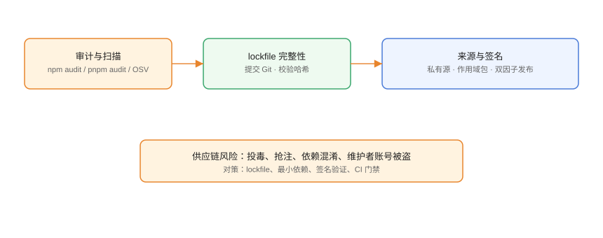

# 依赖安全与供应链防护

开源依赖的便利伴随着**供应链风险**：恶意包、依赖混淆、维护者账号被盗、postinstall 脚本投毒。本页给出从审计、lockfile、来源控制到 CI 门禁的完整防护清单。

## 威胁全景



```text
上游风险 → 仓库风险 → 安装风险 → 运行时风险
投毒包    → 抢注/混淆  → 脚本执行  → 漏洞利用
```

## 1. 漏洞审计

```shell
# npm
npm audit
npm audit fix

# pnpm
pnpm audit
pnpm audit --fix

# 只看高危
pnpm audit --prod --audit-level high
```

```json [审计输出要点]
{
  "vulnerabilities": {
    "total": 3,
    "high": 1,
    "critical": 0
  }
}
```

CI 门禁：高危/严重漏洞失败即阻断。

## 2. lockfile 与完整性

lockfile 里的 `integrity`（如 `sha512-...`）由注册表提供，安装时校验，防篡改：

```json [package-lock.json 片段]
{
  "node_modules/lodash": {
    "version": "4.17.21",
    "integrity": "sha512-v2kDEe57lecTulaDIuNTPy3Ry4gLGJ6Z1O3vE1krgXZNrsQ+LFTGHVxVjcXPs17LhbZVGedAJv8XZ1tvj5FvSg=="
  }
}
```

提交 lockfile + CI `--frozen-lockfile` = 安装结果可复现且经过校验。

## 3. 来源控制：依赖混淆与抢注

**依赖混淆**：内部包名在公共源上被恶意同名包抢注，npm 解析时拉到恶意版本。

对策：

```yaml [.npmrc]
# 内部作用域只走私有源，杜绝回退公共源
@my:registry=https://registry.example.com/
```

```shell
# 检查实际来源
npm view @my/utils dist.tarball
pnpm view @my/utils
```

## 4. 最小依赖与锁版本

1. 只安装真正需要的包，`pnpm why` 定期清理。
2. 生产依赖用精确版本或严格范围，`latest` 禁用。
3. 用 `pnpm list --prod` 检查生产依赖树，越小攻击面越小。

## 5. 构建脚本治理

恶意 postinstall 是最常见的投毒点。pnpm 10 默认白名单机制：

```json [package.json]
{
  "pnpm": {
    "onlyBuiltDependencies": ["esbuild", "sharp", "@my/trusted"]
  }
}
```

```shell
pnpm approve-builds        # 交互式审查后批准
```

原则：默认不执行构建脚本，只有可信且必要的包才白名单。

## 6. 发布安全

1. 双因子认证（2FA）强制开启。
2. 发布 token 最小权限 + 定期轮换。
3. 作用域包走私有源，公共发布需审批。
4. 离职成员立即回收 token 与团队权限。

## 7. CI 门禁清单

```yaml [.github/workflows/deps.yml]
name: Dependency Security
on:
  pull_request:
  schedule:
    - cron: "0 4 * * *"
jobs:
  audit:
    runs-on: ubuntu-latest
    steps:
      - uses: actions/checkout@v4
      - uses: actions/setup-node@v4
        with:
          node-version: 24
          cache: pnpm
      - run: corepack enable
      - run: pnpm install --frozen-lockfile
      - name: Audit
        run: pnpm audit --audit-level high
      - name: Outdated check
        run: pnpm outdated || true
```

## 易错点与最佳实践

::: danger 常见问题
1. **`npm audit fix` 盲目执行**：可能升级 major 引入破坏。先看变更再执行，或手动升级并跑测试。
2. **忽略 devDependencies 漏洞**：构建期投毒同样致命（CI 环境），审计不能只查生产依赖。
3. **无 lockfile 防篡改**：不提交 lockfile 等于放弃完整性校验。
4. **postinstall 全放行**：`ignore-scripts=true` 或全白名单会绕过保护。按包逐个批准。
5. **私有源裸奔**：内部包不发公共源，但要在私有源上控制发布权限与审计。
:::

::: tip 最佳实践
- 每周跑一次 `pnpm audit`，高危漏洞 72 小时内处理。
- 用 Dependabot/Renovate 自动提升级 PR，配合测试门禁。
- 关键包固定精确版本 + lockfile，升级走显式 PR。
- 内部包一律 `@<org>/` 作用域 + 私有源，杜绝混淆。
- 发布账号强制 2FA，token 最小化、定期轮换。
:::

## 实战：处理一次高危漏洞

```shell
# 1. 定位
pnpm audit --audit-level high

# 2. 查看影响链
pnpm why <漏洞包>

# 3. 升级修复
pnpm update <漏洞包>

# 4. 回归
pnpm install --frozen-lockfile
pnpm test

# 5. 复核
pnpm audit --audit-level high
# 预期：high/critical 归零或已豁免登记
```

## 验证方式

1. `pnpm audit` 无 high/critical 漏洞（或已登记豁免）。
2. lockfile 已提交且包含 integrity 字段。
3. 内部包安装只来自私有源（`.npmrc` 生效）。
4. 构建脚本白名单与实际需要一致。

## 参考资料

- npm audit：<https://docs.npmjs.com/cli/v11/commands/npm-audit>
- pnpm 安全：<https://pnpm.io/zh/security>
- OSV（开源漏洞库）：<https://osv.dev/>
- OWASP 供应链安全：<https://owasp.org/www-project-web-security-testing-guide/>
- npm 双重认证：<https://docs.npmjs.com/configuring-two-factor-authentication>
