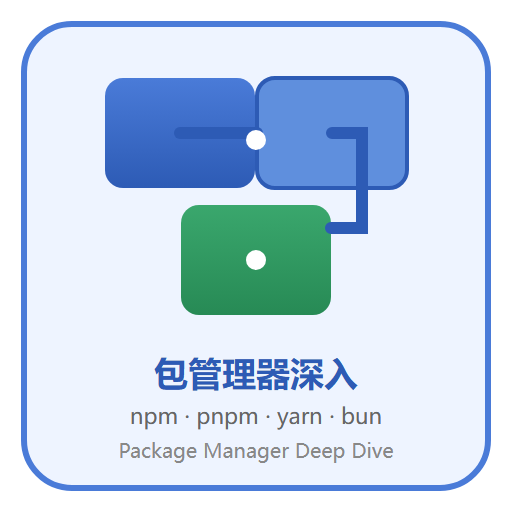

# 包管理器深入

包管理器是 JavaScript/TypeScript 工程化的地基：安装依赖、解析版本、维护 lockfile、发布与消费包、支撑 monorepo。本专题在既有 [Node.js 包管理工具基础](../../Frontend/Basic/NodeJs/PackageManagementTool/index.md) 之上深入讲解 **npm / pnpm / Yarn / Bun 的原理对比、pnpm 存储机制、lockfile 与依赖解析、monorepo、发布流程与供应链安全**。

## 专题导航

- [包管理器生态与选型](Overview/index.md)
- [lockfile 与依赖解析](Lockfile/index.md)
- [pnpm 原理：存储、链接与安全](Pnpm/index.md)
- [monorepo 与 workspaces](Monorepo/index.md)
- [包发布流程与版本管理](Publish/index.md)
- [依赖安全与供应链防护](Security/index.md)
- [实战：迁移 pnpm 与 monorepo 落地](Practice/index.md)
- [常见问题与最佳实践](FAQ/index.md)

## 阅读建议

1. 还没接触过 npm/pnpm 基础命令：先读 [Node.js 包管理工具](../../Frontend/Basic/NodeJs/PackageManagementTool/index.md) 再回来。
2. 想搞懂 pnpm 为什么快、为什么省磁盘：重点读「pnpm 原理」。
3. 多包仓库与微前端：重点读「monorepo 与 workspaces」。
4. 准备发 npm 包或搭私有源：重点读「发布流程」与「依赖安全」。
