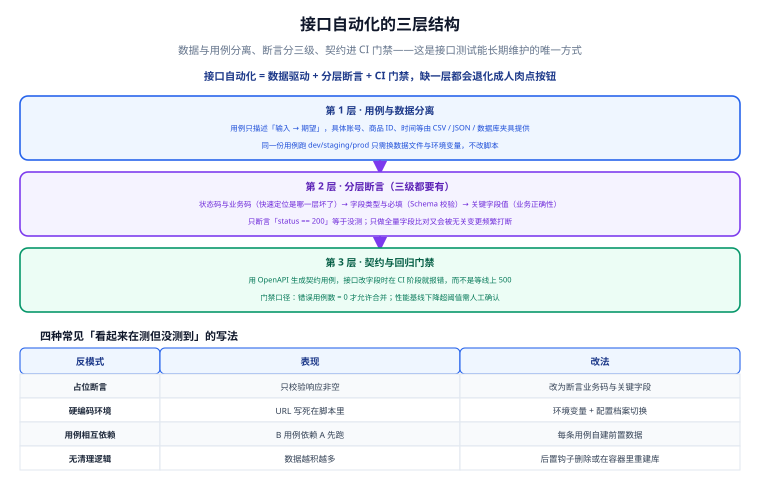

# 接口自动化

接口自动化是投入产出比最高的一层：比 UI 快一个数量级，比单元测试更接近真实业务。但它**极易退化成人肉点按钮**——只要少了「数据与用例分离」「分层断言」「契约门禁」中的任何一层，脚本就会在几个月内变成没人敢碰的负债。



## 一句话定位

本页解决**「接口脚本怎么写才能长期维护」**的问题：用三层结构（数据分离 / 分层断言 / 契约门禁）组织用例，配合数据夹具纪律与 CI 阈值，让接口回归从「一次性调试脚本」变成「可回归的资产」。

## 三层结构

| 层 | 做什么 | 缺了会怎样 |
| --- | --- | --- |
| 第 1 层 · 用例与数据分离 | 用例只描述「输入 → 期望」，账号/商品 ID/时间由 CSV/JSON/DB 夹具提供 | 换环境要改代码，脚本无法复用 |
| 第 2 层 · 分层断言 | 状态码与业务码 → 字段类型与必填（Schema）→ 关键字段值 | 只断 `status == 200` 等于没测；全量比对又频繁误报 |
| 第 3 层 · 契约与回归门禁 | 用 OpenAPI 生成契约用例，接口改字段时在 CI 阶段报错 | 字段悄悄改了，等线上 500 才发现 |

### 第 1 层：用例与数据分离

同一条用例，跑 dev/staging/prod 只换数据文件与环境变量，**不改脚本**。

```python [tests/test_order.py]
import os
import pytest

# ✅ 输入来自夹具，期望来自用例；环境来自变量
def test_create_order(api, order_data):
    resp = api.post("/api/order", json=order_data)
    assert resp.status_code == 200
    assert resp.json()["code"] == 0

# ❌ 反例：账号、URL、商品 ID 全写死在用例里
# resp = requests.post("http://dev.internal:8080/api/order",
#                      json={"userId": "10001", "skuId": "SKU-001"})
```

### 第 2 层：分层断言（三级都要有）

```python [tests/test_order_assert.py]
def test_create_order_three_levels(api, order_data):
    resp = api.post("/api/order", json=order_data)

    # ① 状态码与业务码：快速定位是哪一层坏了
    assert resp.status_code == 200, resp.text
    assert resp.json()["code"] == 0, resp.text

    # ② 字段类型与必填（Schema 校验）
    body = resp.json()["data"]
    assert isinstance(body["orderId"], str) and body["orderId"]
    assert isinstance(body["amount"], (int, float))

    # ③ 关键字段值（业务正确性）
    assert body["status"] == "CREATED"
```

:::warning 为什么三级都要有
只做 ①，语法错误能过；只做 ③，字段缺失时 `KeyError` 报得莫名其妙。**① 定位层级、② 保结构、③ 保业务**，缺一级就会在别的地方付出排查成本。
:::

### 第 3 层：契约与回归门禁

用 OpenAPI 生成契约用例，校验真实响应是否符合 Schema；接口改字段时在 CI 阶段就报错，而不是等线上 500。

## 四种反模式与改法

| 反模式 | 表现 | 改法 |
| --- | --- | --- |
| 占位断言 | 只校验「响应非空」 | 改为断言业务码 + 关键字段 |
| 硬编码环境 URL | 写死在脚本里 | 环境变量 + 配置档案（fixture）切换 |
| 用例相互依赖 | B 用例依赖 A 先跑 | 每条用例自建前置数据 |
| 无清理逻辑 | 数据越积越多，跑久了必挂 | 后置钩子删除，或在容器里重建库 |

:::danger 四个都会「看起来在测但没测到」
1. **占位断言**：`assert resp` 只要不是空就过，业务错了也不报。正确做法是断言业务码与关键字段。
2. **硬编码 URL**：本地能跑、CI 全红。正确做法是把 base_url 放进环境变量，用 fixture 注入。
3. **用例相互依赖**：单跑必挂，还无法并行。正确做法是每条用例自己准备数据。
4. **无清理**：跑 100 次后唯一约束冲突。正确做法是后置清理或用容器重建库。
:::

## 用例组织结构

目录即文档，命名即用例。推荐结构：

```text
api-tests/
├─ conftest.py              # fixture：api 客户端、环境、清理钩子
├─ env/
│  ├─ dev.yaml              # base_url、账号占位
│  └─ staging.yaml
├─ data/
│  ├─ order_valid.json      # 合法下单数据
│  └─ order_missing_sku.json# 非法数据（负向用例）
├─ tests/
│  ├─ test_order_create.py
│  ├─ test_order_cancel.py
│  └─ contract/
│     └─ test_openapi_schema.py
└─ pytest.ini
```

命名纪律：

1. **用例名描述「场景 + 期望」**，如 `test_create_order_with_invalid_sku_returns_4001`。
2. **正向与负向分文件或分目录**，一眼看出覆盖度。
3. **契约用例单独目录**（`tests/contract/`），便于单独跑或单独卡门禁。
4. **数据文件与用例同名同义**，`order_valid.json` 对应 `test_order_create.py`。

## 数据夹具的三条纪律

1. **每次运行前重置**：用固定种子数据，或在容器里重建库，保证初始状态一致。
2. **用例自建前置**：不依赖别的用例产物，能单跑、能并行。
3. **后置必清理**：用 fixture 的 teardown 删除本次创建的数据；清理失败也要记录，别静默吞掉。

```python [conftest.py]
import pytest
import requests

@pytest.fixture(scope="session")
def api():
    base = os.environ.get("API_BASE_URL", "http://localhost:8080")
    s = requests.Session()
    s.base_url = base
    return s

@pytest.fixture
def created_order(api, order_data):
    """前置：创建订单；后置：无论成功失败都尝试取消"""
    resp = api.post("/api/order", json=order_data)
    order_id = resp.json()["data"]["orderId"]
    yield order_id
    # teardown：清理现场
    api.delete(f"/api/order/{order_id}")
```

:::tip 固定种子 > 随机数据
随机数据看起来更真实，但会让「失败不可复现」。用固定种子的 Faker（`Faker.seed(42)`）兼顾真实感与可复现；确需随机时，把本次种子打进日志。
:::

## 契约测试怎么做

流程四步：

1. **导出/维护 OpenAPI 文档**（`openapi.json`），作为契约唯一来源。
2. **用工具生成契约用例骨架**：可手写，也可按官方文档用生成器产出请求骨架（**具体参数以所用生成器文档为准，建议本地验证**）。
3. **跑真实请求，用 Schema 校验响应**：字段类型、必填、枚举、边界。
4. **把契约校验接进 CI**：契约不通过即阻断合并。

```python [tests/contract/test_openapi_schema.py]
import json
import jsonschema
import pytest

@pytest.fixture(scope="session")
def openapi_spec():
    with open("openapi.json", encoding="utf-8") as f:
        return json.load(f)

def test_order_response_matches_schema(api, order_data, openapi_spec):
    resp = api.post("/api/order", json=order_data)
    schema = openapi_spec["components"]["schemas"]["OrderResponse"]
    # 校验响应是否符合契约，而不是逐个字段手写比对
    jsonschema.validate(instance=resp.json(), schema=schema)
```

:::info 契约测试的价值在哪
它把「接口悄悄改字段」这类问题**从线上提前到 CI**。典型场景：后端把 `amount` 从数字改成字符串，功能回归可能仍然过（值能转），但契约校验会立刻失败，且报错直指字段与期望类型。
:::

## CI 门禁阈值怎么定

阈值不是拍脑袋，而是**先本地跑三次基线，再取稳定值**。

| 指标 | 建议口径 | 说明 |
| --- | --- | --- |
| 错误用例数 | **= 0** 才允许合并 | 最硬的判据，无例外 |
| 契约校验失败 | **= 0** | 字段类型/必填不符即失败 |
| 跳过用例数 | 0（特殊情况需注释说明） | 防止用 skip 掩盖失败 |
| 性能基线 | p95 退化 > 阈值（如 10%）需人工确认 | 不用自动阻断，但必须有人看 |

## 完整可运行示例（pytest + requests）

### 环境切换

```yaml [env/staging.yaml]
base_url: "http://staging.internal:8080"
default_headers:
  Content-Type: "application/json"
```

```python [conftest.py（节选）]
import os, yaml
import pytest, requests

@pytest.fixture(scope="session")
def env():
    name = os.environ.get("API_ENV", "dev")
    with open(f"env/{name}.yaml", encoding="utf-8") as f:
        return yaml.safe_load(f)

@pytest.fixture(scope="session")
def api(env):
    s = requests.Session()
    s.base_url = env["base_url"]
    s.headers.update(env["default_headers"])
    return s
```

### 用例：三级断言 + 后置清理

```python [tests/test_order_create.py]
import pytest

def test_create_order_success(api, order_data):
    """正向：下单成功，订单状态为 CREATED"""
    resp = api.post("/api/order", json=order_data)

    # ① 状态码 / 业务码
    assert resp.status_code == 200, resp.text
    assert resp.json()["code"] == 0, resp.text

    # ② 字段类型与必填
    data = resp.json()["data"]
    assert isinstance(data["orderId"], str) and data["orderId"]
    assert data["amount"] > 0

    # ③ 关键字段值
    assert data["status"] == "CREATED"

    # 后置清理：删掉本次数据
    cleaned = api.delete(f"/api/order/{data['orderId']}")
    assert cleaned.status_code == 200


def test_create_order_missing_sku_returns_biz_error(api, order_data):
    """负向：缺 skuId 时返回业务码 4001"""
    bad = {k: v for k, v in order_data.items() if k != "skuId"}
    resp = api.post("/api/order", json=bad)

    assert resp.status_code == 200          # 参数错通常仍是 HTTP 200
    assert resp.json()["code"] == 4001      # 但业务码必须正确
```

### 运行与预期输出

```shell
API_ENV=staging pytest tests/ -v
```

```text
======================= test session starts ========================
collected 6 items

tests/test_order_create.py::test_create_order_success PASSED
tests/test_order_create.py::test_create_order_missing_sku_returns_biz_error PASSED
tests/test_order_cancel.py::test_cancel_paid_order_rejected PASSED
tests/contract/test_openapi_schema.py::test_order_response_matches_schema PASSED
...
======================== 6 passed in 1.82s =========================
```

CI 里把退出码用起来（pytest 失败返回非 0，流水线自动阻断）：

```shell
pytest tests/ --junitxml=report/api.xml || exit 1
```

## 常用清单

1. **用例只写输入与期望**，数据从夹具来。
2. **三级断言**：状态码/业务码 → 类型与必填 → 关键字段值。
3. **每条用例自建前置、必做后置清理**。
4. **环境靠变量切换**，脚本零硬编码。
5. **契约单独目录**，Schema 校验进 CI。
6. **门禁**：错误用例数 = 0、契约失败 = 0。
7. **报告归档**：`--junitxml` 产出 XML 供 CI 展示。

## 易错点与建议

:::danger 常见错误
1. **只断言 `status == 200`**：业务码错了也过。正确做法是加业务码与关键字段断言。
2. **在用例间传递数据**：用例 B 依赖 A 先跑。正确做法是用 fixture 自建前置。
3. **清理写在用例末尾而非 teardown**：断言失败就跳过清理，数据越积越多。正确做法是用 `yield` 型 fixture 保证 teardown 执行。
4. **契约用「全量字段相等」**：新增字段就误报。正确做法是用 Schema 校验类型与必填，而非逐字段相等。
5. **硬编码环境**：换环境全改。正确做法是 `API_ENV` + 配置文件。
6. **用 skip 掩盖失败**：CI 假绿。正确做法是把 skip 数也纳入门禁监控。
:::

:::tip 最佳实践
1. 接口回归与性能压测**共用一份脚本与夹具**，避免两套各修各的 bug。
2. 负向用例与正向用例同等重要，业务码边界是缺陷高发区。
3. 固定随机种子，把种子打进日志，保证失败可复现。
4. 契约文档与代码同仓库、同评审，避免「文档漂移」。
5. 报告统一归档，失败时直接看「哪条用例、期望值、实际值」。
:::

## 验证方式

1. 本地 `API_ENV=staging pytest tests/ -v`，确认全部通过且输出 6 passed。
2. 故意把某字段断言写错，确认用例失败且报错信息含期望值与实际值。
3. 用 `openapi.json` 校验一个真实响应，故意删掉一个必填字段，确认契约用例失败。
4. 连续跑两次全量用例，确认第二次仍然全绿（证明清理逻辑有效）。

## 相关专题

- [测试工具](../index.md)：回到本专题目录页，查看全部页面与阅读建议。
- [JMeter 性能测试](../JMeter/index.md)：本页用 JMeter 断言器做接口回归；该页把它扩展成**容量与分位延迟**的压测。
- [Selenium 与 UI 自动化](../Selenium/index.md)：业务规则在本页验证，UI 只覆盖关键链路。
- [接口调试工具](../../APITools/index.md)：该页是**手工调试与 Mock**；本页把调试结果沉淀为**可回归脚本**。
- [CI/CD 自动化测试与质量门禁](../../CICD/Testing/index.md)：本页给脚本与断言写法；该页给**流水线位置与覆盖率/门禁口径**。
- [实战：回归与压测流水线](../Practice/index.md)：把本页的接口回归与压测基线串成一条完整流水线。

## 参考资料

- OpenAPI 规范：https://spec.openapis.org/oas/latest.html
- JSON Schema 规范：https://json-schema.org/
- pytest 官方文档：https://docs.pytest.org/en/stable/
- Requests 文档：https://requests.readthedocs.io/
- Schemathesis（契约测试）：https://schemathesis.readthedocs.io/
- 测试金字塔（Martin Fowler）：https://martinfowler.com/bliki/TestPyramid.html
