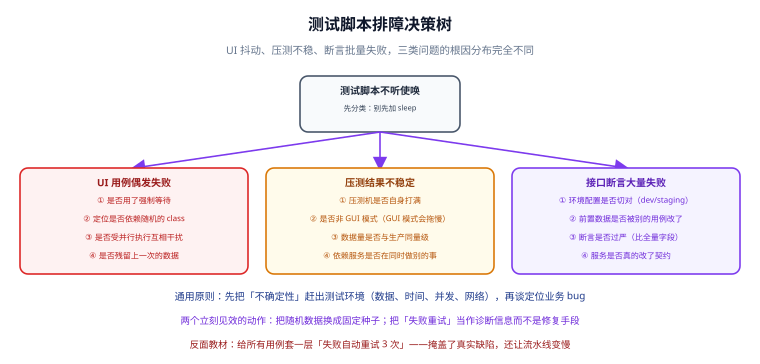

# 常见问题与排错

测试脚本「不听使唤」时，**先分类，别先加 `sleep`**。UI 抖动、压测不稳、断言批量失败，这三类问题的根因分布完全不同。本页用一页决策树式的问答，覆盖排障顺序、等待纪律、并行隔离、数据隔离与重试取舍。



## 通用原则

- 先把**不确定性**赶出测试环境（数据、时间、并发、网络），再谈定位业务 bug。
- 两个立刻见效的动作：**把随机数据换成固定种子**；**把「失败重试」当作诊断信息而不是修复手段**。

## UI 用例偶发失败怎么查

**结论**：先按四个高概率原因逐一排除，别一上来就加等待时长。

**原因**：偶发失败几乎都来自不确定性——等待写法、定位方式、用例耦合、残留数据。

**做法**：

1. **是否用了强制等待**（`Thread.sleep`）？慢机器上照样失败。改为显式等待具体条件。
2. **定位是否依赖随机的 class**？前端构建会生成哈希 class。改用 `data-testid`。
3. **是否受并行执行互相干扰**？共享 driver 或共享数据会串台。每个线程独立 driver，数据隔离。
4. **是否残留上一次的数据**？后置清理没跑或没跑净。用 teardown 保证清理。
5. 仍查不出：开启失败截图 + 页面源码归档，对比失败与成功两次的 DOM 差异。

## 压测结果波动大怎么办

**结论**：先怀疑环境，再怀疑代码。

**原因**：压测对压测机、网络、依赖数据量级极其敏感，任何一处不稳定都会放大成分位延迟的抖动。

**做法**：

1. **压测机是否自身打满**（CPU、网卡）？JMeter 自身也会成为瓶颈。
2. **是否用了非 GUI 模式**？GUI 模式会拖慢压测机并制造抖动。
3. **数据量是否与生产同量级**？小数据集全命中缓存，结论乐观且不稳。
4. **依赖服务是否在同时做别的事**？同环境跑别的任务会抢资源。
5. 收尾验证：连续两次运行 p95 差异 **< 5%** 才认为环境可重复（见 [实战：回归与压测流水线](../Practice/index.md)）。

## 隐式与显式等待能否混用

**结论**：**不能**。隐式等待一律设 0，全项目只用显式等待。

**原因**：隐式等待是全局的、只对「查找元素」生效；与显式等待混用时，实际超时时间变成两者叠加，且叠加规则难以推理，偶发失败的根因就会被掩盖。

**做法**：

```java
driver.manage().timeouts().implicitlyWait(Duration.ZERO);   // ✅ 设 0
WebDriverWait wait = new WebDriverWait(driver, Duration.ofSeconds(10));
wait.until(ExpectedConditions.elementToBeClickable(By.cssSelector("[data-testid='submit']")));
```

把这条写进团队规范，比任何封装都管用。

## JMeter GUI 模式为什么不能用于正式压测

**结论**：GUI 只用来编写与调试脚本，正式压测一律 `-n`。

**原因**：GUI 会渲染大量监听器结果与图表，占用压测机 CPU 与内存，导致压测机先成为瓶颈，测出来的吞吐与延迟都不真实。

**做法**：

```shell
jmeter -n -t order.jmx -l result.jtl -e -o report/
```

需要看结果就打开生成的 `report/index.html`，而不是在 GUI 里盯实时图表。

## TPS 上不去是不是被测端问题

**结论**：不一定，先看是不是压测机或配置的瓶颈。

**原因**：TPS 与并发**不线性相关**，到拐点后会走平甚至下降；同时连接池、网络、压测机都可能先到上限。

**做法**：

1. 看压测机 CPU/网卡是否打满——是，则改 CLI + 分布式。
2. 看被测端 CPU 是否打满——否，则瓶颈可能在 DB 连接池、锁、下游依赖。
3. 看 DB 连接数与慢查询——连接池打满常见于「并发涨、DB 连接数不涨」。
4. 找到拐点：并发继续加而 TPS 不再涨、延迟陡增，那个点就是容量上限，**不是失败**。

## 如何模拟慢网络

**结论**：不要靠「加 sleep」模拟网络，用协议层或代理层手段。

**原因**：`sleep` 模拟的是服务端处理慢，与网络往返慢的故障特征完全不同，会误导优化方向。

**做法**：

1. **JMeter**：用定时器（如 Constant Throughput Timer 或 Precise Throughput Timer）控制请求节奏，模拟低带宽；配合超时断言验证超时处理。
2. **Selenium/浏览器**：走 CDP/BiDi 的 Network 域做限速与延迟注入（CDP 写法请尽早迁 BiDi）。
3. **接口层**：用代理（如 mitmproxy）注入延迟，或用容器网络工具限速。
4. 无论哪种，都要在报告里写清**注入的参数**，否则结论无法复现。

## 并行执行如何避免互相干扰

**结论**：隔离两类资源——浏览器会话与测试数据。

**原因**：并行时多条用例共享同一浏览器会串台；共享同一批数据会互相改坏。

**做法**：

1. **会话隔离**：每个线程独立 driver 实例，用 `ThreadLocal<WebDriver>` 管理，用完必 `quit()`。
2. **数据隔离**：每条用例自建前置数据（唯一 ID 或独立账号），不依赖别的用例产物。
3. **环境隔离**：CI 里给并行任务分配独立命名空间或独立库。
4. **断言隔离**：只断言本次用例自己创建的数据，不做全局扫描式断言。

## 驱动版本与浏览器不匹配怎么办

**结论**：交给 Selenium Manager，别手工管驱动。

**原因**：手工维护驱动极易出现「浏览器自动升级后驱动过期」，报错通常是会话创建失败或 `session not created`。

**做法**：

1. 确认用的是 Selenium **4.6+**，删掉 `System.setProperty("webdriver.chrome.driver", ...)`。
2. 跑一个最小脚本，在日志里确认 Selenium Manager 的下载与缓存记录。
3. 只有内网离线或需锁版本时才手工指定，并纳入版本管理。
4. 容器里跑时用官方镜像（如 `selenium/node-chrome:4.49.0`），浏览器与驱动天然匹配。

## 接口断言批量失败先查什么

**结论**：先查环境与数据，最后才怀疑业务代码。

**原因**：批量失败通常是「共性因素」出问题——环境切错、前置数据被改、断言过严、服务契约变更。

**做法**：

1. **环境配置是否切对**（dev/staging）？`API_BASE_URL` 是否指向预期目标。
2. **前置数据是否被别的用例改了**？检查是否有共享数据。
3. **断言是否过严**（比全量字段）？改为 Schema 校验类型与必填。
4. **服务是否真的改了契约**？用 OpenAPI 契约用例确认字段变化。
5. 都不是，再逐个看响应报文定位业务缺陷。

## 失败重试该不该开

**结论**：可以作为**诊断信息**收集，但**不能当作修复手段**。

**原因**：给所有用例套一层「失败自动重试 3 次」会掩盖真实缺陷，还让流水线变慢；它把「稳定的红灯」变成「偶发的绿」，剥夺了团队发现问题的机会。

**做法**：

1. 默认**关闭重试**，让失败暴露。
2. 确需重试时，**记录重试次数**并在报告中高亮，重试才通过的用例应被当作「待修缺陷」跟踪。
3. 只对已知的环境性抖动（如依赖初始化慢）做有限重试，并注明原因。
4. 复盘时统计「重试才过」的用例，作为稳定性改进清单。

## 测试数据怎么隔离

**结论**：三档隔离，按可靠性要求选。

**原因**：数据是所有测试确定性的根基，共享数据必然导致「我跑的时候你也在跑」。

**做法**：

| 档位 | 做法 | 适用 | 代价 |
| --- | --- | --- | --- |
| 轻 | 每条用例用唯一 ID 自建自清 | 接口/UI 日常回归 | 需写清理逻辑 |
| 中 | 每次运行前重建种子数据 | 压测、集成测试 | 需容器与种子 SQL |
| 重 | 每个任务独立数据库/命名空间 | 并行 CI、多分支 | 资源开销大 |

无论哪档，都要保证：**用例能单跑、能并行、失败可复现**。

## 一个通用的排障顺序

遇到任何「偶发失败」，按这个顺序走，能覆盖绝大多数场景：

1. **复现**：能本地稳定复现吗？不能，先固定随机源（数据、时间、并发）。
2. **分类**：是等待、定位、数据、环境，还是真的业务缺陷？
3. **缩小**：禁用并行、只跑单条用例，看是否还失败。
4. **留证**：截图、响应报文、日志、种子数据。
5. **修复**：改根因，不加重试、不加 `sleep`。
6. **回归**：连跑三次确认稳定，再合并。

## 易错点与建议

:::danger 排障时的四个坏习惯
1. **一失败就加 `sleep`**：掩盖根因，慢机器上照样失败。正确做法是等待具体条件。
2. **给所有用例套失败重试**：把稳定的红灯变成偶发的绿。正确做法是默认关闭重试，只把它当诊断信息。
3. **压测前不重置数据**：结果不可比。正确做法是每次运行前重建种子数据。
4. **只看平均值与错误率为 0**：长尾被掩盖。正确做法是看 p95/p99 与错误类型分布。
:::

:::tip 排障口诀
**先分类，再定位；先固定随机源，再谈业务 bug。** 把「重试」当诊断信息，把「固定种子」当默认动作。
:::

## 相关专题

- [测试工具](../index.md)：回到本专题目录页，查看全部页面与阅读建议。
- [Selenium 与 UI 自动化](../Selenium/index.md)：等待写法、定位策略与并行隔离的完整方法见该页。
- [JMeter 性能测试](../JMeter/index.md)：报告判读、CLI 与分布式压测的细节见该页。
- [接口自动化](../APIAutomation/index.md)：分层断言与数据夹具纪律见该页。
- [实战：回归与压测流水线](../Practice/index.md)：环境可重复性的验收方法见该页。
- [CI/CD 自动化测试与质量门禁](../../CICD/Testing/index.md)：测试策略与门禁口径见该页。

## 参考资料

- Selenium 官方文档（等待与定位）：https://www.selenium.dev/documentation/webdriver/waits/
- JMeter 最佳实践：https://jmeter.apache.org/usermanual/best-practices.html
- W3C WebDriver 规范：https://www.w3.org/TR/webdriver2/
- pytest 文档（fixture 与清理）：https://docs.pytest.org/en/stable/how-to/fixtures.html
- OpenAPI 规范：https://spec.openapis.org/oas/latest.html
