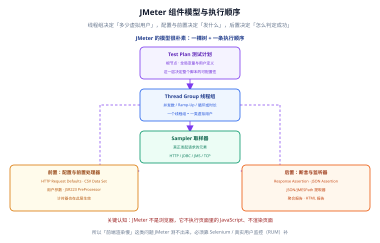
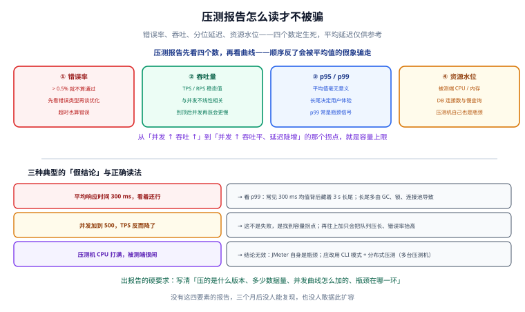

# JMeter 性能测试

Apache JMeter 是**协议级**的压力测试与接口回归工具：它按一棵「测试计划树」发起 HTTP/DB/JMS 等请求，用虚拟用户模拟并发，输出错误率、吞吐量与分位延迟。本页讲清版本取舍、组件模型、线程组、参数化与关联、断言、报告判读、CLI 与分布式，并给一个完整的「下单接口」压测实战。



## 一句话定位

JMeter 解决的是**「这个接口/系统能扛多少并发、在多少并发下开始退化」**的问题。它同时能承担接口功能回归，但要记住它的边界：**JMeter 不是浏览器，不执行页面里的 JavaScript、不渲染页面**——「前端渲染慢」这类问题它测不出来，得靠 [Selenium 与 UI 自动化](../Selenium/index.md) 或真实用户监控（RUM）补。

## 安装与版本选择

截至 2026-09 核对，JMeter 的版本线是这样的：

| 版本 | 发布时间 | 运行要求 | 定位 |
| --- | --- | --- | --- |
| 5.6.3 | 2024-01-07 | Java 8+（推荐 17+） | 5.x 的末版，稳定、生态最全 |
| 6.0.0 | —— | **最低 Java 17**，另需 Kotlin 1.9+ | 新一代，移除历史包袱 |

:::info 当前使用的版本
- 存量项目建议先留在 **5.6.3**：插件（尤其是 `jp@gc` 系列）兼容性最好，团队不用动 JDK。
- 新项目直接上 **6.0.0**：与 Java 17+ 的技术栈一致，避免将来再迁一次。
- 两者**不是小版本升级**，6.0.0 有破坏性变更，升级前务必对照迁移清单。
:::

### 5.6.3 → 6.0.0 迁移清单

| 变更项 | 5.6.3 现状 | 6.0.0 变化 | 迁移动作 |
| --- | --- | --- | --- |
| Java 版本 | Java 8+ 可跑 | **最低 Java 17** | 升级运行环境 JDK |
| Kotlin | 无要求 | 需 **Kotlin 1.9+** | 跟随发行包，无需手装 |
| 日志框架 | Log4j / SLF4J 1.x | 升级到 **SLF4J 2.x** | 自定义日志配置需重写 |
| MongoDB 插件 | 内置支持 | **完全移除** | 用 JDBC/JSR223 自实现 |
| MySQL 驱动类名 | `com.mysql.jdbc.Driver` | `com.mysql.cj.jdbc.Driver` | 改 JDBC 配置里的驱动类 |
| Open Model 线程组计时基准 | 从「测试开始时间」算 | 改为「线程组开始时间」 | 校准加压曲线预期 |
| Precise Throughput Timer 基准 | 从「测试开始时间」算 | 改为「线程组开始时间」 | 同上，重新验证吞吐 |

```shell
# 下载与解压（以 5.6.3 为例）
wget https://archive.apache.org/dist/jmeter/binaries/apache-jmeter-5.6.3.tgz
tar -xzf apache-jmeter-5.6.3.tgz -C /opt

# 验证 Java 版本（6.0.0 需要 17+）
java -version

# 查看版本
/opt/apache-jmeter-5.6.3/bin/jmeter --version
```

预期输出（节选）：

```text
    _    ____   _    ____ _   _ _____       _ __  __ _____ _____ _____ ____
   / \  |  _ \ / \  / ___| | | | ____|     | |  \/  | ____|_   _| ____|  _ \
  ...
5.6.3
```

:::danger 注意
不要把 `jmeter` 直接加进 PATH 后在 GUI 高频使用——**GUI 模式只用于编写与调试脚本，绝不用于正式压测**。GUI 自身的渲染会占用压测机资源，导致结果失真。正式压测一律走 `-n` 非 GUI 模式。
:::

## 组件模型与执行顺序

JMeter 的模型很朴素：**一棵树 + 一条执行顺序**。

```text
Test Plan（测试计划，根节点）
└─ Thread Group（线程组：并发数 / Ramp-Up / 时长）
   ├─ 配置元件（HTTP Request Defaults、CSV Data Set Config）
   ├─ 前置处理器（用户参数、JSR223 PreProcessor）
   ├─ 定时器（Constant Timer、Precise Throughput Timer）
   ├─ Sampler（HTTP Request / JDBC Request ...）
   ├─ 后置处理器（JSON 提取器、JMESPath 提取器）
   ├─ 断言（Response Assertion、JSON Assertion）
   └─ 监听器（聚合报告、View Results Tree、HTML 报告）
```

| 组件 | 作用 | 必配示例 |
| --- | --- | --- |
| Test Plan | 全局变量、用户定义变量、运行方式 | `host`、`port` 等全局配置 |
| Thread Group | 决定「多少虚拟用户、怎么加压」 | 并发数、Ramp-Up、循环/时长 |
| Sampler | 真正发请求的元素 | HTTP Request、JDBC Request |
| 配置元件 | 为请求提供默认值与数据 | HTTP Request Defaults、CSV Data Set Config |
| 前置处理器 | 请求发出前准备数据 | 生成签名、时间戳 |
| 后置处理器 | 从响应中提取数据供后续用 | JSON 提取器（关联） |
| 断言 | 判断响应是否正确 | Response Assertion |
| 定时器 | 控制请求节奏 | Constant Throughput Timer |
| 监听器 | 收集与展示结果 | 聚合报告、HTML 报告 |

:::tip 执行顺序口诀
**配置 → 前置 → 定时器 → Sampler → 后置 → 断言 → 监听器**。同一个作用域内按此顺序生效；父子节点（如 Test Plan 级的配置元件）先作用域再执行。
:::

## 线程组三种模式

| 模式 | 怎么加 | 加压曲线 | 适用场景 |
| --- | --- | --- | --- |
| 普通线程组 | 内置，直接添加 | 线性 Ramp-Up | 简单定并发、快速验证 |
| 阶梯线程组 | `jp@gc - Stepping Thread Group` | 分阶段爬升 | 找容量拐点（推荐） |
| Open Model 线程组 | 内置（6.0.0 计时基准有变） | 按目标吞吐开环控制 | 模拟真实流量曲线 |

- **普通线程组**：适合「50 并发跑 5 分钟」这类固定场景，配置最简单。
- **阶梯线程组**：每 N 秒加一批用户，能清楚看到「加到多少并发时错误率与延迟开始抬头」。
- **Open Model 线程组**：以「每秒达到多少请求」为目标做开环加压，更接近真实用户到达模型；注意 6.0.0 起其计时基准改为线程组开始时间。

## 参数化与关联

压测要贴近真实，就需要**参数化**（每次请求用不同数据）和**关联**（用上一个响应的值做下一个请求的输入）。

### CSV Data Set Config（参数化）

```text
# order-data.csv（放在脚本同级 data/ 目录）
userId,skuId,qty
10001,SKU-001,1
10002,SKU-002,2
10003,SKU-001,1
```

配置要点：Filename 填 `data/order-data.csv`，Variable Names 填 `userId,skuId,qty`，Delimiter 用 `,`，**Recycle on EOF = True**（数据用完循环），**Sharing mode = All threads**（所有线程共享一份游标）。

### JSON 提取器（关联）

下单前通常要先登录拿 token，再用 token 下单：

- 变量名：`token`
- JSON Path expression：`$.data.token`
- Match No.：`1`（取第一个）
- Default Value：`NOT_FOUND`（**必须设默认值**，否则提取失败时脚本行为不可预测）

### JMESPath 提取器

对结构复杂的 JSON，JMESPath 比 JSON Path 表达力更强，例如：

```text
# 取出第一个商品的 id 与价格
items[0].[id, price]
```

:::danger 注意
1. **提取器不设默认值**：一旦响应结构变化，后续请求会拿到空值，错误会「串到很远的地方」才暴露。正确做法是设 `Default Value`，并在断言里校验它不为 `NOT_FOUND`。
2. **CSV 用相对路径但没随脚本打包**：CI 里跑时找不到文件。正确做法是脚本与数据一起提交，路径用相对路径。
3. **所有线程共享游标却没意识到**：`Sharing mode` 选错会导致数据分配方式不符预期。按是否需要「每个线程独立遍历」选择。
:::

## 断言器

压测脚本没有断言，等于只制造流量不验证结果——**流量再大也可能是全错的**。

| 断言器 | 校验对象 | 常用写法 |
| --- | --- | --- |
| Response Assertion | 响应码、响应文本、响应头 | 断言 `Response Code` 等于 `200` |
| JSON Assertion | JSON 字段值 | 断言 `$.code` 等于 `0` |
| Duration Assertion | 单请求耗时 | 断言耗时 < 3000ms |
| Size Assertion | 响应体大小 | 过滤空响应 |

```text
# Response Assertion 典型配置
Field to Test:      Response Code
Pattern Matching:   Equals
Patterns to Test:   200

# JSON Assertion 典型配置
Assert JSON Path exists:   $.code
Additionally assert value: true
Expected Value:            "0"
```

:::warning 断言太严会误报
压测时断言「字段全量相等」会被无关变更频繁打断（比如新增了一个字段）。建议压测脚本**只断言状态码 + 业务码 + 关键字段**，字段级 Schema 校验交给 [接口自动化](../APIAutomation/index.md) 的契约测试。
:::

## 结果判读：四个数定生死



拿到报告先看四个数，再看曲线——**顺序反了会被平均值的假象骗走**。

| 指标 | 及格线 | 怎么读 |
| --- | --- | --- |
| 错误率 | ≤ 0.5% | 先看错误类型再谈优化，**超时也算错误** |
| 吞吐量 TPS/RPS | 看稳态值 | 与并发**不线性相关**，到顶后并发再涨会更慢 |
| p95 / p99 | 按业务定 | 平均值毫无意义，**长尾决定体验**，p99 常是瓶颈信号 |
| 资源水位 | 留 30% 余量 | 被测端 CPU/内存/DB 连接数，**压测机自己也是瓶颈** |

### 三种「假结论」的正确读法

1. **「平均响应时间 300ms，看着还行」** → 看 p99：常见 300ms 均值背后藏着 3s 长尾；长尾多由 GC、锁、连接池导致。
2. **「并发加到 500，TPS 反而降了」** → 这不是失败，是找到了**容量拐点**；再往上加只会把队列压长、错误率抬高。
3. **「压测机 CPU 打满，被测端很闲」** → 结论无效：JMeter 自身成了瓶颈；应改用 **CLI 模式 + 分布式压测**（多台压测机）。

:::tip 报告四要素
一份能复现的报告必须写清：**压的是什么版本、多少数据量、并发曲线怎么加的、瓶颈在哪一环**。缺这四要素，三个月后没人能复现，也没人敢据此扩容。
:::

## CLI 与分布式压测

正式压测一律走非 GUI 模式，命令模板：

```shell
# 基本 CLI：-n 非GUI，-t 脚本，-l 结果文件，-e -o 生成HTML报告
jmeter -n -t order.jmx -l result.jtl -e -o report/

# 用 -J 注入属性（脚本里以 ${__P(threads,10)} 读取）
jmeter -n -t order.jmx -l result.jtl -e -o report/ \
       -Jthreads=100 -Jrampup=100 -Jduration=600 -Jenv=staging
```

分布式压测通过 `-R` 指定远程节点：

```shell
# 控制机 + 两台压测机（需先在各节点启动 jmeter-server）
jmeter -n -t order.jmx -R 192.168.1.11,192.168.1.12 \
       -l result.jtl -e -o report/ -Jthreads=500
```

分布式要点：

1. 所有节点的 JMeter 版本、JDK 版本、脚本与数据文件**必须一致**。
2. 线程数按「控制机设置的并发 ÷ 节点数」分配，**总并发由控制机配置决定**。
3. 各节点时钟要同步，否则结果时间线会错乱。
4. **压测机自身也会成为瓶颈**：加起来并发上不去时，先看各节点 CPU。

### HTML 报告定制

```properties
# bin/user.properties（3.x 起为报告定制项，按官方文档，建议本地验证）
jmeter.reportgenerator.overall_granularity=60000
jmeter.reportgenerator.apdex_satisfied_threshold=1500
jmeter.reportgenerator.apdex_tolerated_threshold=3000
jmeter.reportgenerator.statistic_window=20000
```

报告生成后目录结构：

```text
report/
├─ index.html          # 入口，含 APDEX 与统计表
├─ statistics.json     # 统计数据（供脚本对比用）
└─ content/
   ├─ js/              # 图表数据
   └─ ...
```

## 实战案例：下单接口压测

场景：给 `POST /api/order` 做容量验证，流程是「登录取 token → 用 token 下单 → 断言业务码」。

### 步骤 1：线程组与参数

- 线程组：阶梯加压，100 并发、Ramp-Up 100s、持续 300s。
- 全局变量（Test Plan → User Defined Variables）：`host=localhost`、`port=8080`、`env=staging`。

### 步骤 2：脚本关键片段

```xml [order.jmx]
<?xml version="1.0" encoding="UTF-8"?>
<jmeterTestPlan version="1.2" properties="5.0" jmeter="5.6.3">
  <hashTree>
    <TestPlan guiclass="TestPlanGui" testclass="TestPlan" testname="order-plan">
      <elementProp name="TestPlan.user_defined_variables" elementType="Arguments">
        <collectionProp name="Arguments.arguments">
          <elementProp name="host" elementType="Argument">
            <stringProp name="Argument.name">host</stringProp>
            <stringProp name="Argument.value">${__P(host,localhost)}</stringProp>
          </elementProp>
          <elementProp name="port" elementType="Argument">
            <stringProp name="Argument.name">port</stringProp>
            <stringProp name="Argument.value">${__P(port,8080)}</stringProp>
          </elementProp>
        </collectionProp>
      </elementProp>
    </TestPlan>
    <hashTree>
      <!-- 登录：提取 token 供下单使用 -->
      <HTTPSamplerProxy testname="Login">
        <stringProp name="HTTPSampler.path">/api/login</stringProp>
        <stringProp name="HTTPSampler.method">POST</stringProp>
        <boolProp name="HTTPSampler.postBodyRaw">true</boolProp>
        <elementProp name="HTTPsampler.Arguments" elementType="Arguments">
          <collectionProp name="Arguments.arguments">
            <elementProp name="body" elementType="HTTPArgument">
              <stringProp name="HTTPArgument.value">{"user":"tester","pwd":"123456"}</stringProp>
            </elementProp>
          </collectionProp>
        </elementProp>
      </HTTPSamplerProxy>
      <hashTree>
        <!-- JSON 提取器：$.data.token -> 变量 token -->
        <JSONPostProcessor testname="ExtractToken">
          <stringProp name="JSONPostProcessor.referenceNames">token</stringProp>
          <stringProp name="JSONPostProcessor.jsonPathExprs">$.data.token</stringProp>
          <stringProp name="JSONPostProcessor.match_numbers">1</stringProp>
          <stringProp name="JSONPostProcessor.defaultValues">NOT_FOUND</stringProp>
        </JSONPostProcessor>
      </hashTree>

      <!-- 下单：用 token + CSV 参数化 -->
      <HTTPSamplerProxy testname="CreateOrder">
        <stringProp name="HTTPSampler.path">/api/order</stringProp>
        <stringProp name="HTTPSampler.method">POST</stringProp>
        <elementProp name="HTTPsampler.Arguments" elementType="Arguments">
          <collectionProp name="Arguments.arguments">
            <elementProp name="Authorization" elementType="HTTPArgument">
              <stringProp name="HTTPArgument.value">Bearer ${token}</stringProp>
            </elementProp>
          </collectionProp>
        </elementProp>
      </HTTPSamplerProxy>
      <hashTree>
        <JSONPostProcessor testname="ExtractOrderId">
          <stringProp name="JSONPostProcessor.referenceNames">orderId</stringProp>
          <stringProp name="JSONPostProcessor.jsonPathExprs">$.data.orderId</stringProp>
          <stringProp name="JSONPostProcessor.defaultValues">NOT_FOUND</stringProp>
        </JSONPostProcessor>
        <JSONPathAssertion testname="AssertBizCode">
          <stringProp name="JSON_PATH">$.code</stringProp>
          <stringProp name="EXPECTED_VALUE">0</stringProp>
        </JSONPathAssertion>
      </hashTree>
      <!-- 省略：CSV Data Set Config、监听器、阶梯线程组配置 -->
    </hashTree>
  </hashTree>
</jmeterTestPlan>
```

### 步骤 3：命令行运行

```shell
jmeter -n -t order.jmx -l result.jtl -e -o report/ \
       -Jthreads=100 -Jrampup=100 -Jduration=300 -Jenv=staging
```

### 步骤 4：控制台输出样例

```text
Creating summariser <summary>
Created the tree successfully using order.jmx
Starting standalone test @ 2026-09-25 10:12:03 CST
Waiting for possible Shutdown/StopTestNow/HeapDump/ThreadDump message

summary +   1830 in 00:01:00 =   30.5/s Avg:   118 Min:    22 Max:   1420 Err:     0 (0.00%)
summary +   6120 in 00:02:00 =   51.0/s Avg:   142 Min:    31 Max:   1810 Err:     3 (0.05%)
summary +   5880 in 00:02:00 =   49.0/s Avg:   168 Min:    28 Max:   2260 Err:    12 (0.20%)
summary =  13830 in 00:05:00 =   46.1/s Avg:   145 Min:    22 Max:   2260 Err:    15 (0.11%)
Tidying up ...    @ 2026-09-25 10:17:03 CST
... end of run
```

### 步骤 5：如何定位瓶颈

1. **看拐点**：并发爬到 80 左右时 TPS 不再涨、p95 陡增 → 容量上限约在 80 并发。
2. **看资源**：同时看被测端 CPU、DB 连接数与慢查询、压测机自身 CPU（详见 [运维监控](../../../Ops/Monitoring/index.md)）。
3. **看错误类型**：`Err` 是超时还是业务码错误，决定往网络/连接池查还是往代码查。
4. **看 DB**：连接池打满常见于「并发上升但 DB 连接数不涨」，说明连接池配置是瓶颈（参考 [关系型数据库](../../../DB/Relational/index.md)）。

:::details 一个真实排查过程
某次压测 100 并发 p99 达到 4s。按上面顺序：先确认错误率为 0（不是超时）→ 再看被测端 CPU 只有 40%（不是算力瓶颈）→ 再看 DB 连接数打满在 20（连接池上限）→ 调大连接池后 p99 降到 800ms。**结论：瓶颈在连接池配置，不在业务代码。**
:::

## 常用清单

1. **正式压测只用 `-n` 非 GUI 模式**，GUI 只用来写脚本。
2. **加断言**：状态码 + 业务码 + 关键字段，至少三级中的前两级。
3. **参数化用 CSV**，关联用 JSON/JMESPath 提取器，**都设默认值**。
4. **先阶梯找拐点**，再用固定并发跑稳态基线。
5. **报告四要素**：版本、数据量、并发曲线、瓶颈环节。
6. **压测机也要监控**，并发上不去先怀疑它。
7. **报告归档进 CI**，用 `-e -o` 生成 HTML 并上传产物。

## 易错点与建议

:::danger 常见错误
1. **用 GUI 跑正式压测**：压测机资源被渲染占用，数据不可信。正确做法是 CLI 模式。
2. **没断言只看错误率**：500 之外的错误（业务码错、字段错）看不到。正确做法是加 Response/JSON 断言。
3. **只看平均值**：平均 300ms 掩盖 3s 长尾。正确做法是看 p95/p99。
4. **并发越高越好**：超过拐点只会压长队列、抬高错误率。正确做法是先找拐点再定稳态并发。
5. **CSV 数据与生产不同量级**：小数据集全命中缓存，结论乐观失真。正确做法是按生产量级准备数据。
6. **提取器不设默认值**：结构一变，错误串到很远才暴露。正确做法是设默认值并断言。
7. **6.0.0 升级前不查迁移清单**：MySQL 驱动类名、MongoDB 插件移除会直接让脚本报错。
:::

:::tip 最佳实践
1. 把「加载数据、预热 JVM、清缓存」写成固定的前置步骤，保证每次都从同一状态开始。
2. 用 `-J` 注入并发与时长，一份脚本就能跑冒烟（10 并发）与全量（500 并发）。
3. 同一脚本先做**功能回归**（低并发 + 强断言），再做**容量验证**（高并发 + 弱断言），别混为一谈。
4. 与环境监控系统对齐采集窗口，压测时同步看 CPU/GC/连接池。
5. 把 `statistics.json` 交给脚本做基线对比（见 [实战：回归与压测流水线](../Practice/index.md)）。
:::

## 验证方式

1. 本地跑一次 `jmeter -n -t order.jmx -l result.jtl -e -o report/`，确认命令结束且 `report/index.html` 可打开。
2. 在 HTML 报告里找到 **Error %** 与 **Percentile 95/99** 两列，确认与自己看的控制台一致。
3. 故意把断言期望值改错，确认错误率上升、CI 能据此阻断。
4. 用 `-Jthreads` 分别跑 10 与 100 并发，观察 TPS 是否随并发增长，找到第一个拐点。

## 相关专题

- [测试工具](../index.md)：回到本专题目录页，查看全部页面与阅读建议。
- [CI/CD 自动化测试与质量门禁](../../CICD/Testing/index.md)：本页讲**压测脚本与命令怎么写**；该页讲**性能门禁阈值怎么定、在流水线哪一环跑**。
- [接口自动化](../APIAutomation/index.md)：本页用 JMeter 断言器做粗断言；该页讲**分层断言与契约校验**的完整方法。
- [Selenium 与 UI 自动化](../Selenium/index.md)：JMeter 测不了前端渲染，端到端体验问题由该页负责。
- [运维监控](../../../Ops/Monitoring/index.md)：本页产生压力，该页负责**采集被测端与压测机的资源水位**。
- [关系型数据库](../../../DB/Relational/index.md)：压测常见的连接池与慢查询瓶颈，排查方法见该页。

## 参考资料

- Apache JMeter 用户手册：https://jmeter.apache.org/usermanual/index.html
- JMeter 最佳实践：https://jmeter.apache.org/usermanual/best-practices.html
- JMeter 6.0.0 变更（发布说明）：https://jmeter.apache.org/changes.html
- JMeter 分布式测试：https://jmeter.apache.org/usermanual/remote-test.html
- JMeter 生成 HTML 报告：https://jmeter.apache.org/usermanual/generating-dashboard.html
- JMESPath 规范：https://jmespath.org/specification.html
