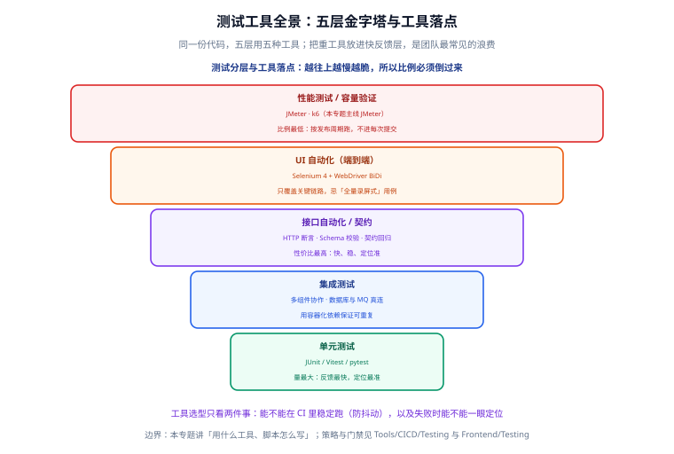

# 概述与选型

测试工具选型不是「哪个高级用哪个」，而是**「把合适的工具放到合适的层」**。本页给你一张五层金字塔与工具落点的地图、两条选型判据、一张五类工具对照表，以及一条最小可跑的 CI 门禁示例，帮你先想清楚再动手。



## 一句话定位

本页解决两个问题：**不同测试层该用什么工具**，以及**怎么判断一个工具值不值得引进**。读完你应当能为一支团队画出「单元 / 集成 / 接口 / UI / 性能」五层各自的工具选型，并说清每一层的取舍理由。

## 五层测试金字塔与工具落点

金字塔的核心规律只有一条：**越往上越慢越脆，所以数量必须倒过来**。工具选择的本质，是让每一层的「反馈速度」和它的「运行频率」相匹配。

| 层级 | 测什么 | 反馈速度 | 运行频率 | 典型工具 |
| --- | --- | --- | --- | --- |
| 单元测试 | 纯函数、类逻辑，不碰网络/磁盘 | 毫秒级 | 每次保存/提交 | JUnit 5、Vitest、pytest |
| 集成测试 | 多组件协作，真连 DB/MQ | 秒级 | 每次提交 | Testcontainers、Spring Boot Test |
| 接口自动化 | HTTP 契约、业务码、字段 Schema | 秒~分钟级 | 每次提交/合并 | JMeter 断言器、pytest + requests、Newman |
| UI 自动化 | 关键业务链路的端到端 | 分钟级 | 主干/发布前 | Selenium 4 + WebDriver BiDi |
| 性能测试 | 容量上限、响应分位、资源水位 | 分钟~小时级 | 按发布周期/夜间 | JMeter、k6 |

:::info 为什么接口层「性价比最高」
接口层比 UI 层快一个数量级、比单元层更接近真实业务。同一份接口脚本既能做**功能回归**（断言业务码与字段），又能做**性能基线**（测 p95 与 TPS），一份投入两份产出——所以本专题用一整页（[接口自动化](../APIAutomation/index.md)）专门讲它。
:::

## 工具选型的两个判据

引进任何工具前，先问两个问题。答不上来，就先别引进。

### 判据一：能不能在 CI 里稳定跑

**「稳定」优先于「功能强」**。一个能测 100 个场景但每次随机挂 3 个的工具，会让团队逐步失去对红灯的信任，最后没人看 CI 结果。

判断方法：

- 是否有**非交互（命令行）模式**？只有 GUI、必须人手点的工具，不能进 CI。
- 是否有**确定性的等待机制**？靠 `sleep` 蒙时间的工具，在 CI 的慢机器上必然抖动。
- 是否支持**固定随机种子 / 固定数据夹具**？数据每次不同，结果就不可比。
- **报告能否归档**？失败后拿不到现场（截图、日志、HTML 报告）的工具，排查成本会吞掉收益。

### 判据二：失败能不能一眼定位

工具报错后，你希望**第一眼看到的是「哪条断言、期望什么、实际什么」**，而不是先猜半天。

- 断言信息是否包含**期望值与实际值**？
- 失败时是否自动留存**截图 / 响应报文 / 堆栈**？
- 是否能区分「环境问题」和「业务缺陷」？（例如超时算错误，还是单独归类？）

:::tip 一句话判据
选型只看两件事：**能不能在 CI 里稳定跑（防抖动）**，以及**失败时能不能一眼定位**。功能清单再长，不满足这两条就不该进流水线。
:::

## 五类工具对照表

下表按「工具类型」而非「层级」整理，方便你按需求横向找工具。

| 工具类型 | 代表工具 | 适用场景 | 不适用场景 | 本专题对应页 |
| --- | --- | --- | --- | --- |
| 单元测试框架 | JUnit 5、Vitest、pytest | 纯逻辑、算法、边界值 | 需要真实网络/DB 的流程 | ——（见相邻专题） |
| 接口契约与自动化 | JMeter 断言器、pytest + requests、OpenAPI 校验 | 字段契约、业务码回归、快速定位 | 前端渲染问题、视觉问题 | [接口自动化](../APIAutomation/index.md) |
| UI 自动化 | Selenium 4 + WebDriver BiDi | 关键链路端到端、跨浏览器 | 大量重复的字段校验 | [Selenium 与 UI 自动化](../Selenium/index.md) |
| 性能/容量测试 | JMeter、k6 | 容量上限、分位延迟、资源水位 | 前端渲染/视觉性能 | [JMeter 性能测试](../JMeter/index.md) |
| 数据构造与夹具 | docker compose、种子 SQL、Faker | 可重复的前置数据 | 替代真实的业务规则 | [实战：回归与压测流水线](../Practice/index.md) |

## 如何避免「把重工具放进快反馈层」

这是团队最常见的浪费：**用最慢的工具去测最快就能发现的问题**。

- 用 Selenium 校验「金额计算对不对」——计算逻辑本该单元测试毫秒级发现；UI 用例跑 3 分钟才报错，定位还得看截图。
- 用 JMeter 断言器做全量字段比对——JMeter 是协议级工具，字段比对交给接口脚本更清晰。
- 用单元测试去连真实数据库——慢且脆，那是集成层的活。

正确做法：**能下沉到下一层的断言，绝不在上一层重复**。同一份断言只在一个层存在，改了规则只改一处，避免「三套脚本各修各的 bug」。

:::warning 一个具体的反例
某项目把「登录后能看到用户名」同时写在单元测试、接口测试和 UI 测试里。后来用户名展示规则改了，三处都要改，还漏了一处导致 CI 红了两天。正确做法是：规则在单元测试验证，接口只验数据字段，UI 只验「能登进去」这一条链路。
:::

## 一条最小可跑的 CI 门禁示例

下面这条 GitHub Actions 工作流只做一件事：跑接口回归，**有失败用例就不允许合并**。它演示了「工具如何进 CI」的最小闭环——脚本、命令、失败阻断三件套齐了，再往上加压测和 UI 才有意义。

```yaml [.github/workflows/api-regression.yml]
name: api-regression
on:
  pull_request:
    branches: [main]

jobs:
  regression:
    runs-on: ubuntu-latest
    steps:
      - uses: actions/checkout@v5

      - name: 起依赖与固定种子数据
        run: docker compose -f ci/docker-compose.yml up -d

      - name: 等待服务就绪
        run: ./ci/wait-for.sh http://localhost:8080/actuator/health

      - name: 跑接口回归（非 GUI 模式）
        run: |
          jmeter -n -t scripts/order.jmx \
                 -l result.jtl \
                 -e -o report/ \
                 -Jenv=staging

      - name: 校验门禁：错误用例数必须为 0
        run: python ci/check_errors.py report/ --max-errors 0

      - name: 归档报告
        if: always()
        uses: actions/upload-artifact@v4
        with:
          name: api-report
          path: report/
```

关键点逐条解释：

1. **`-Jenv=staging`**：环境通过命令行参数注入，脚本里不写死 URL，同一份脚本能跑多环境。
2. **`check_errors.py --max-errors 0`**：把「错误用例数 = 0」变成可执行的门禁，而不是靠人看报告。
3. **`if: always()`**：即使上一步失败也归档报告，保证失败时有现场可查。
4. **`wait-for.sh`**：服务没就绪就跑测试会得到假失败，先等健康检查通过。

## 常用清单

选型与落地时，按这份清单逐项确认：

1. **这一层要测什么**：先写清断言目标，再选工具，不要反过来。
2. **命令能否一行跑通**：非交互模式是进 CI 的入场券。
3. **环境如何注入**：URL、账号、数据集必须外部可配。
4. **失败如何定位**：报告里必须能直接看到期望值 vs 实际值。
5. **产物是否归档**：HTML 报告、截图、日志随流水线保存。
6. **门禁阈值多少**：错误数、p95 退化比例，先在本地跑出基线再定。
7. **谁来维护**：每份脚本都要有明确 owner，否则半年后无人敢动。

## 易错点与建议

:::danger 常见错误
1. **先选工具再想测什么**：为了用 Selenium 而写 Selenium 用例，结果覆盖的都是本该单元测试解决的问题。正确做法是先定断言目标，再选最轻的工具。
2. **把重工具放进快反馈层**：用分钟的 UI 用例守护毫秒级的逻辑。正确做法是把断言下沉到能最快发现它的那一层。
3. **脚本里硬编码环境 URL 与账号**：换环境就全改一遍。正确做法是环境变量 + 配置文件切换。
4. **门禁只写在文档里**：报告人工看，红灯仍能合并。正确做法是把判据写成脚本里的退出码。
5. **忽略压测机自身瓶颈**：只看被测端闲不闲，没看压测机 CPU。正确做法是压测时同时监控压测机资源。
6. **报告不归档**：失败三天后无法复现。正确做法是用 `if: always()` 上传产物。
:::

:::tip 最佳实践
1. 每一层只保留一份断言，**禁止跨层重复验证同一条规则**。
2. 脚本从第一天就按「非 GUI + 参数注入 + 报告归档」写，别等要进 CI 再改。
3. 阈值先用本地基线数据定，跑三次取稳定值，再写进门禁。
4. 把「失败重试」当诊断信息而非修复手段，偶发失败当天查根因。
5. 团队共用一份夹具（docker compose + 种子数据），保证所有人结果可比。
:::

## 实战案例：为一个新项目做选型

场景：一个 Spring Boot + Vue 的电商系统，刚建立 CI，需要一套最小可用的测试工具组合。

| 层级 | 选择 | 理由 |
| --- | --- | --- |
| 单元测试 | JUnit 5 + JaCoCo | 逻辑最先验证，覆盖率进门禁 |
| 集成测试 | Testcontainers 起 MySQL/Redis | 真连依赖，避免 Mock 失真 |
| 接口自动化 | JMeter 断言器（同一份脚本兼做压测） | 一份脚本两份产出 |
| UI 自动化 | Selenium 4，只覆盖登录 + 下单 | 关键链路即可，不做全量 |
| 性能基线 | JMeter CLI + `cmp_report.py` 对比 | 每次发布对比 p95 不退化 |

落地顺序建议：先单元测试 → 再接口回归 → 后性能基线 → 最后才上 UI。**顺序错了，前面不稳后面全是噪声**。

## 验证方式

1. 按上面的 YAML 建一个最小的接口回归工作流，故意改坏一个断言，确认 CI 变红且**无法合并**。
2. 打开归档的 `report/`，确认能直接看到「哪条用例失败、期望值、实际值」。
3. 本地 `docker compose up -d` 后连续跑两次接口回归，确认两次结果完全一致（错误数都为 0）。
4. 挑一条断言，问自己「它能不能下沉到更轻的一层」；能，就下沉。

## 相关专题

- [测试工具](../index.md)：回到本专题目录页，查看全部页面与阅读建议。
- [CI/CD 自动化测试与质量门禁](../../CICD/Testing/index.md)：本页给工具与命令，该页给**测试金字塔的比例、覆盖率口径与 SonarQube 门禁怎么卡**。
- [前端测试](../../../Frontend/Testing/index.md)：该页负责前端单元/组件测试与 Playwright E2E；本专题负责 Selenium 跨浏览器端到端，按技术栈分工。
- [接口调试工具](../../APITools/index.md)：该页是手工调试与协作；本专题把调试成果沉淀为可回归脚本。
- [项目交付 · 测试策略与门禁](../../../Others/ProjectDelivery/Testing/index.md)：该页给**职责边界与数据隔离取舍**；本页给**能照做的工具细节**。
- [前端性能优化](../../../Frontend/Others/PerformanceOptimization/index.md)：该页负责**前端渲染与加载性能**；性能测试页负责**服务端容量与响应分位**，两者互补不重叠。

## 参考资料

- 测试金字塔（Martin Fowler）：https://martinfowler.com/bliki/TestPyramid.html
- Apache JMeter 官方文档：https://jmeter.apache.org/usermanual/index.html
- Selenium 官方文档：https://www.selenium.dev/documentation/
- W3C WebDriver 规范：https://www.w3.org/TR/webdriver2/
- OpenAPI 规范：https://spec.openapis.org/oas/latest.html
- pytest 官方文档：https://docs.pytest.org/en/stable/
