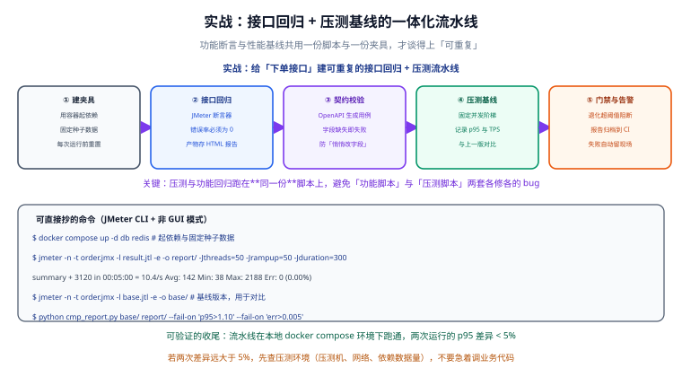

# 实战：回归与压测流水线

本页把前面几页的工具串成一条**可重复的流水线**：给「下单接口」建一套接口回归 + 性能基线，用 `docker compose` 起固定夹具，用 JMeter 跑同一份脚本，用 `cmp_report.py` 对比基线，用 CI 门禁阻断退化。核心目标只有一个词：**可重复**。



## 一句话定位

本页给出一条**照着抄就能跑**的流水线：功能断言与性能基线共用一份脚本、一份夹具，每次运行前重置数据，产出的报告既能看错误率也能对比 p95，最终由 CI 决定「能否合并」。

## 整体设计

| 环节 | 用什么 | 产出 |
| --- | --- | --- |
| ① 建夹具 | `docker compose` + 种子 SQL | 固定依赖与固定数据 |
| ② 接口回归 | JMeter 断言器（低并发） | 错误率必须为 0 |
| ③ 契约校验 | OpenAPI + Schema 校验 | 字段缺失即失败 |
| ④ 压测基线 | JMeter 固定并发阶梯 | p95 与 TPS 记录 |
| ⑤ 门禁与归档 | `cmp_report.py` + CI | 退化超阈值阻断 |

:::tip 关键设计
**压测与功能回归跑在同一份脚本上**（`order.jmx`），只是命令行参数不同：低并发 + 强断言 = 功能回归；高并发 + 弱断言 = 性能基线。避免维护「功能脚本」和「压测脚本」两套各修各的 bug。
:::

## 步骤 1：用 docker compose 起依赖与固定种子数据

```yaml [docker-compose.yml]
services:
  db:
    image: mysql:8.4
    environment:
      MYSQL_ROOT_PASSWORD: root
      MYSQL_DATABASE: shop
    ports:
      - "3306:3306"
    volumes:
      - ./ci/seed/01_schema.sql:/docker-entrypoint-initdb.d/01_schema.sql:ro
      - ./ci/seed/02_data.sql:/docker-entrypoint-initdb.d/02_data.sql:ro
    healthcheck:
      test: ["CMD", "mysqladmin", "ping", "-h", "localhost", "-proot"]
      interval: 5s
      timeout: 3s
      retries: 20

  redis:
    image: redis:7.4
    ports:
      - "6379:6379"
    healthcheck:
      test: ["CMD", "redis-cli", "ping"]
      interval: 5s
      timeout: 3s
      retries: 20

  app:
    build: .
    environment:
      SPRING_DATASOURCE_URL: jdbc:mysql://db:3306/shop
      SPRING_DATA_REDIS_HOST: redis
    ports:
      - "8080:8080"
    depends_on:
      db:
        condition: service_healthy
      redis:
        condition: service_healthy
    healthcheck:
      test: ["CMD", "curl", "-f", "http://localhost:8080/actuator/health"]
      interval: 5s
      timeout: 3s
      retries: 30
```

:::info 固定种子数据为什么重要
种子 SQL 保证了**每次运行都从同一状态出发**：同一批商品、同一批用户、同样的库存。数据每次不同，压测结果就不可比，p95 的波动你分不清是代码退化还是数据差异。
:::

```sql [ci/seed/02_data.sql]
-- 固定用户与商品，ID 明确指定，保证可复现
INSERT INTO t_user (id, username, password) VALUES (10001, 'tester', '123456');
INSERT INTO t_sku (id, name, price, stock) VALUES
  ('SKU-001', '测试商品A', 99.00, 1000000),
  ('SKU-002', '测试商品B', 199.00, 1000000);
```

```shell
# 起夹具，等待全部 healthy
docker compose up -d --wait

# 确认服务就绪
curl -f http://localhost:8080/actuator/health
```

预期输出：

```text
{"status":"UP"}
```

## 步骤 2：JMeter 脚本与命令行

沿用 [JMeter 性能测试](../JMeter/index.md) 里的 `order.jmx`（登录取 token → 下单 → 断言业务码），只通过命令行参数区分两种模式：

```shell
# ② 功能回归：低并发 + 强断言，错误率必须为 0
jmeter -n -t order.jmx -l func.jtl -e -o func-report/ \
       -Jthreads=1 -Jrampup=1 -Jloops=20 -Jstrict=true

# ④ 性能基线：固定并发阶梯，记录 p95 与 TPS
jmeter -n -t order.jmx -l base.jtl -e -o base/ \
       -Jthreads=50 -Jrampup=50 -Jduration=300 -Jstrict=false
```

### 控制台输出样例

```text
summary +   1830 in 00:01:00 =   30.5/s Avg:   118 Min:    22 Max:   1420 Err:     0 (0.00%)
summary +   3100 in 00:01:00 =   51.7/s Avg:   142 Min:    31 Max:   1810 Err:     0 (0.00%)
summary =   4930 in 00:02:00 =   41.1/s Avg:   130 Min:    22 Max:   1810 Err:     0 (0.00%)
Tidying up ...    @ 2026-09-25 10:14:03 CST
```

两份报告的结构：

```text
base/
├─ index.html          # 人看的 HTML 报告
├─ statistics.json     # 脚本读的统计数据
└─ content/
```

## 步骤 3：基线对比脚本 cmp_report.py

`cmp_report.py` 只做一件事：读两份 JMeter 的 `statistics.json`，比较关键指标，退化超阈值就**以非 0 退出码**结束——这样 CI 才能据此阻断。

```python [ci/cmp_report.py]
#!/usr/bin/env python3
"""对比两次 JMeter 报告的关键指标，退化超阈值则失败退出。

用法：
  python cmp_report.py <baseline_dir> <current_dir> \
      --fail-on 'p95>1.10' --fail-on 'err>0.005'
"""
import argparse
import json
import sys
from pathlib import Path


def load_stats(report_dir: str) -> dict:
    """从 JMeter HTML 报告目录读取 statistics.json，聚合为总指标。"""
    path = Path(report_dir) / "statistics.json"
    if not path.exists():
        raise SystemExit(f"找不到 {path}，请确认报告目录由 -e -o 生成")
    data = json.loads(path.read_text(encoding="utf-8"))
    # statistics.json 是按事务分组的，这里取总体一行
    total = next((row for row in data if row.get("transaction") == "Total"), None)
    if total is None:
        raise SystemExit("statistics.json 中没有 Total 行")
    return {
        "err": float(total["errorPct"]) / 100.0,       # 错误率，百分比转小数
        "p95": float(total["pct2ResTime"]),            # p95 响应时间(ms)
        "p99": float(total["pct3ResTime"]),            # p99 响应时间(ms)
        "avg": float(total["meanResTime"]),            # 平均响应时间(ms)
        "tps": float(total["throughput"]),             # 吞吐量
    }


def check_rule(rule: str, baseline: dict, current: dict) -> bool:
    """解析形如 'p95>1.10' 的规则：current 相对 baseline 的比值超阈值则失败。

    支持：p95、p99、avg（越大越差，比值 > 阈值即失败）；
         err（绝对错误率 > 阈值即失败）；
         tps（越小越差，比值 < 阈值即失败）。
    """
    metric, expr = rule.split(">", 1)
    threshold = float(expr)
    if metric == "err":
        value = current["err"]
        ok = value <= threshold
        print(f"  [{'OK' if ok else 'FAIL'}] err = {value:.4f} (阈值 <= {threshold})")
        return ok
    if metric == "tps":
        ratio = current["tps"] / baseline["tps"]
        ok = ratio >= threshold
        print(f"  [{'OK' if ok else 'FAIL'}] tps 比值 = {ratio:.3f} (阈值 >= {threshold})")
        return ok
    ratio = current[metric] / baseline[metric]
    ok = ratio <= threshold
    print(f"  [{'OK' if ok else 'FAIL'}] {metric} 比值 = {ratio:.3f} (阈值 <= {threshold})")
    return ok


def main() -> int:
    parser = argparse.ArgumentParser()
    parser.add_argument("baseline")
    parser.add_argument("current")
    parser.add_argument("--fail-on", action="append", default=[])
    args = parser.parse_args()

    base = load_stats(args.baseline)
    cur = load_stats(args.current)

    print(f"baseline: {base}")
    print(f"current : {cur}")
    print("门禁判据：")

    all_ok = True
    for rule in args.fail_on:
        all_ok &= check_rule(rule, base, cur)

    print("结果：", "PASS" if all_ok else "FAIL")
    return 0 if all_ok else 1


if __name__ == "__main__":
    sys.exit(main())
```

运行对比：

```shell
python ci/cmp_report.py base/ report/ \
    --fail-on 'p95>1.10' --fail-on 'p99>1.15' --fail-on 'err>0.005' --fail-on 'tps<0.90'
```

预期输出（通过）：

```text
baseline: {'err': 0.0, 'p95': 220.0, 'p99': 480.0, 'avg': 130.0, 'tps': 41.1}
current : {'err': 0.0, 'p95': 231.0, 'p99': 495.0, 'avg': 134.0, 'tps': 40.5}
门禁判据：
  [OK] p95 比值 = 1.050 (阈值 <= 1.1)
  [OK] p99 比值 = 1.031 (阈值 <= 1.15)
  [OK] err = 0.0000 (阈值 <= 0.005)
  [OK] tps 比值 = 0.985 (阈值 >= 0.9)
结果： PASS
```

退化时的输出（阻断）：

```text
baseline: {'err': 0.0, 'p95': 220.0, 'p99': 480.0, 'avg': 130.0, 'tps': 41.1}
current : {'err': 0.003, 'p95': 268.0, 'p99': 610.0, 'avg': 152.0, 'tps': 33.0}
门禁判据：
  [FAIL] p95 比值 = 1.218 (阈值 <= 1.1)
  [OK]   p99 比值 = 1.271 (阈值 <= 1.15)
  [OK]   err = 0.0030 (阈值 <= 0.005)
  [FAIL] tps 比值 = 0.803 (阈值 >= 0.9)
结果： FAIL
```

退出码非 0 → CI 判为失败 → 阻断合并。

## 步骤 4：CI 工作流

```yaml [.github/workflows/regression.yml]
name: regression-and-baseline

on:
  pull_request:
    branches: [main]

jobs:
  regression:
    runs-on: ubuntu-latest
    steps:
      - uses: actions/checkout@v5

      - name: 起依赖与固定种子数据
        run: docker compose up -d --wait

      - name: 准备 JMeter
        run: |
          wget -q https://archive.apache.org/dist/jmeter/binaries/apache-jmeter-5.6.3.tgz
          tar -xzf apache-jmeter-5.6.3.tgz
          echo "$PWD/apache-jmeter-5.6.3/bin" >> $GITHUB_PATH

      - name: ① 接口回归（错误率必须为 0）
        run: |
          jmeter -n -t order.jmx -l func.jtl -e -o func-report/ \
                 -Jthreads=1 -Jrampup=1 -Jloops=20 -Jstrict=true

      - name: ② 契约校验
        run: pytest tests/contract/ --junitxml=report/contract.xml

      - name: ③ 压测基线
        run: |
          jmeter -n -t order.jmx -l report/result.jtl -e -o report/ \
                 -Jthreads=50 -Jrampup=50 -Jduration=300

      - name: ④ 门禁：与基线对比
        run: |
          python ci/cmp_report.py baseline/ report/ \
                 --fail-on 'p95>1.10' --fail-on 'err>0.005'

      - name: ⑤ 归档报告（无论成败）
        if: always()
        uses: actions/upload-artifact@v4
        with:
          name: regression-report
          path: |
            report/
            func-report/
            build/screenshots/
```

:::info 基线从哪来
第一次运行没有 `baseline/` 时，先把当次稳定结果人工确认后提交为基线（`git add baseline/`），之后的每次 PR 与之对比。基线本身也要随版本迭代更新，但**更新基线必须走评审**，不能随手覆盖。
:::

## 步骤 5：门禁阻断与报告归档

- **阻断**：`cmp_report.py` 返回非 0，工作流在「④ 门禁」这步失败，PR 显示红色，无法合并（配合分支保护规则）。
- **归档**：`if: always()` 保证即使门禁失败，`report/`、`func-report/` 也上传为产物，排查时能直接下载。
- **留现场**：UI 用例失败的截图目录也一并归档。

## 收尾验证：环境可重复性

这是本页最重要的一步——**先证明环境可重复，再谈业务结论**。

```shell
# 连续跑两次压测
jmeter -n -t order.jmx -l run1.jtl -e -o run1/ -Jthreads=50 -Jrampup=50 -Jduration=300
jmeter -n -t order.jmx -l run2.jtl -e -o run2/ -Jthreads=50 -Jrampup=50 -Jduration=300

# 用同一套判据对比两次运行（阈值放宽到 1.05）
python ci/cmp_report.py run1/ run2/ --fail-on 'p95>1.05'
```

验收标准：**两次运行的 p95 差异 < 5%**，视为环境可重复。

```text
  [OK] p95 比值 = 1.023 (阈值 <= 1.05)
结果： PASS
```

:::danger 差异远大于 5% 时怎么办
不要急着调业务代码，先查压测环境：
1. **压测机自身是否打满**（CPU、网卡）——JMeter 自己成了瓶颈。
2. **是否用了 GUI 模式**——GUI 会显著拖慢并制造抖动。
3. **依赖数据量级是否一致**——小数据集全命中缓存，结论乐观。
4. **依赖服务是否在同时干别的**——同环境跑着别的任务会互相抢资源。
:::

## 常用清单

1. **夹具固定**：`docker compose up -d --wait` 等全部 healthy 再跑。
2. **种子固定**：数据 SQL 明确 ID，不依赖自增。
3. **一份脚本**：功能回归与压测共用 `order.jmx`，只换参数。
4. **基线受管**：`baseline/` 进仓库，更新走评审。
5. **门禁可执行**：判据写成脚本退出码，而非文档约定。
6. **报告必归档**：`if: always()` + `upload-artifact`。
7. **先证可重复**：两次 p95 差异 < 5% 再解读业务指标。

## 易错点与建议

:::danger 常见错误
1. **压测前不重置数据**：跑几次后库存变动，结果不可比。正确做法是每次运行前重置种子数据。
2. **功能与压测两套脚本**：各修各的 bug，断言不一致。正确做法是共用一份脚本。
3. **门禁只写在文档**：红灯照样合并。正确做法是把判据写进脚本退出码并配分支保护。
4. **不归档报告**：失败三天后无法复现。正确做法是 `if: always()` 上传产物。
5. **基线随手覆盖**：失去对比意义。正确做法是基线更新走评审。
6. **环境不可重复就下结论**：把抖动当退化。正确做法是先验两次差异 < 5%。
7. **压测机与被测端同机**：互相抢资源。正确做法是分离压测机与被测端。
:::

:::tip 最佳实践
1. 先在本地把整条流水线跑通，再上 CI，避免 CI 里盲调。
2. 门禁阈值用「三次稳定基线」定，不拍脑袋。
3. 把「起夹具 → 等就绪 → 跑 → 对比 → 归档」写成一个脚本，本地与 CI 共用。
4. 每次发布都更新一次性能基线快照，形成历史曲线。
5. 退化触发门禁时，先看是代码变了还是环境变了。
:::

## 验证方式

1. `docker compose up -d --wait` 后 `curl -f http://localhost:8080/actuator/health` 返回 `{"status":"UP"}`。
2. 跑功能回归，确认控制台 `Err: 0 (0.00%)`。
3. 跑两次压测并用 `--fail-on 'p95>1.05'` 对比，确认 `PASS` 且比值 < 1.05。
4. 故意把断言改坏，确认 `cmp_report.py` 返回非 0、CI 步骤失败。
5. 打开归档产物，确认 `report/index.html` 可正常查看。

## 相关专题

- [测试工具](../index.md)：回到本专题目录页，查看全部页面与阅读建议。
- [接口自动化](../APIAutomation/index.md)：本页的第 ②③ 步（回归与契约）的写法细节见该页。
- [JMeter 性能测试](../JMeter/index.md)：本页的 `order.jmx`、线程组与报告读法见该页。
- [CI/CD 自动化测试与质量门禁](../../CICD/Testing/index.md)：本页给流水线内容；该页给**流水线定位、覆盖率与质量门禁的整体设计**。
- [接口调试工具](../../APITools/index.md)：调试阶段用该页工具构造请求，稳定后再沉淀为本页脚本。
- [版本控制](../../VersionControl/index.md)：基线文件、种子 SQL 与工作流的版本管理规范见该页。

## 参考资料

- JMeter 生成 HTML 报告：https://jmeter.apache.org/usermanual/generating-dashboard.html
- JMeter 最佳实践：https://jmeter.apache.org/usermanual/best-practices.html
- GitHub Actions 工作流语法：https://docs.github.com/en/actions/writing-workflows/workflow-syntax-for-github-actions
- Docker Compose 健康检查：https://docs.docker.com/compose/compose-file/05-services/#healthcheck
- OpenAPI 规范：https://spec.openapis.org/oas/latest.html
- pytest 文档：https://docs.pytest.org/en/stable/
