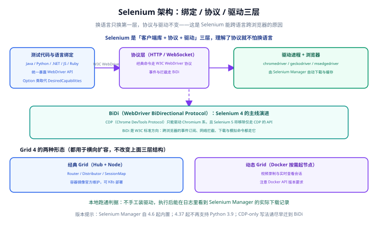
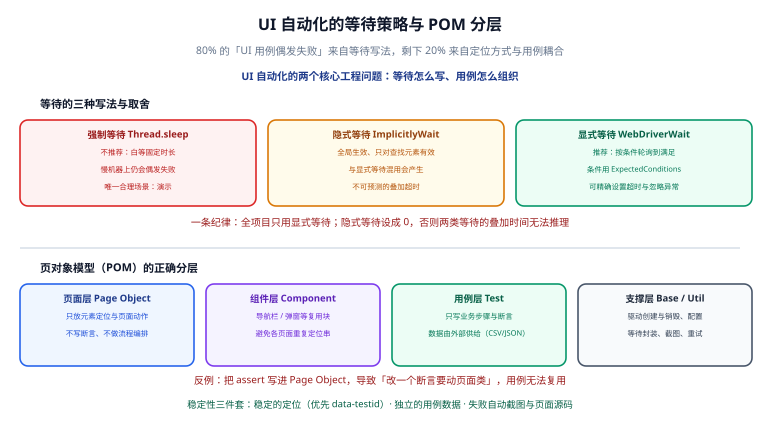

# Selenium 与 UI 自动化

Selenium 是**跨语言、跨浏览器**的 UI 自动化标准：你用 Java/Python 等任一语言写测试代码，通过统一的协议驱动真实浏览器，验证「用户点得进去、流程走得通」。本页讲清三层架构、Selenium Manager、BiDi 与 CDP 的取舍、等待纪律、定位策略、POM 分层、Grid 并行，并给一个完整的登录 + 下单用例。



## 一句话定位

Selenium 解决的是**「关键业务链路在真实浏览器里能否走通」**的问题。它只覆盖少量关键路径，不做全量字段校验——字段校验交给 [接口自动化](../APIAutomation/index.md)，容量与并发交给 [JMeter 性能测试](../JMeter/index.md)。

:::info 当前使用的版本
截至 2026-09 核对，Selenium 最新为 **4.49.0（2026-09-09）**。关键时间线：
- 4.6 起内置 **Selenium Manager**，自动下载与缓存驱动，不需要手工装 chromedriver。
- 4.37 起**不再支持 Python 3.9**。
- 4.38 起引入大量 JSpecify 注解；4.39 起 Grid 要求 Docker API ≥ 1.44。
- 4.40 起 Java 侧移除 Guava 等现代化改造；4.44~4.49 持续完善 BiDi。
- **5.0** 的 alpha 版本计划在 2026 年第三季度。
:::

## 架构三层

Selenium 能跨语言跨浏览器，靠的就是分层：**换语言只换第一层，协议与驱动不变**。

| 层 | 内容 | 说明 |
| --- | --- | --- |
| 语言绑定 | Java、Python、.NET、JS、Ruby | 统一暴露 WebDriver API；新代码用 `Options` 类取代 `DesiredCapabilities` |
| 协议层 | W3C WebDriver（HTTP）+ **BiDi**（WebSocket） | 经典命令走 WebDriver，事件与拦截走 BiDi |
| 驱动与浏览器 | chromedriver / geckodriver / msedgedriver + 浏览器 | 由 **Selenium Manager** 自动下载与缓存 |

### Selenium Manager 的工作方式与验证方法

从 4.6 起，你**不需要手工下载驱动**：当你 `new ChromeDriver()` 时，Selenium Manager 会：

1. 探测本机已安装的浏览器版本；
2. 到官方源下载匹配的驱动；
3. 缓存到本地（Windows 通常在 `%USERPROFILE%\.cache\selenium`）。

**验证方法**：把系统里的 `chromedriver` 从 PATH 移除，直接跑一个最小脚本，在日志里看到下载记录即证明生效。

```java [SmokeTest.java]
import org.openqa.selenium.WebDriver;
import org.openqa.selenium.chrome.ChromeDriver;

public class SmokeTest {
    public static void main(String[] args) {
        // 不手工指定驱动路径，交给 Selenium Manager
        WebDriver driver = new ChromeDriver();
        driver.get("https://example.com");
        System.out.println("title = " + driver.getTitle());
        driver.quit();
    }
}
```

预期在控制台/日志中看到类似记录（版本号以实际为准）：

```text
[INFO] Driver found in cache: chromedriver 141.0.x
[INFO] Or downloading chromedriver...
title = Example Domain
```

:::warning 必须设驱动路径的场景
只有在**内网离线环境**或**需要锁定驱动版本**时，才用 `System.setProperty("webdriver.chrome.driver", "...")` 手工指定。其余情况交给 Selenium Manager，避免「驱动版本与浏览器不匹配」的经典问题。
:::

## BiDi 与 CDP 的取舍

| 维度 | CDP（Chrome DevTools Protocol） | BiDi（WebDriver BiDirectional Protocol） |
| --- | --- | --- |
| 标准 | 浏览器私有 | **W3C 标准方向** |
| 浏览器支持 | 只能驱动 **Chromium 系** | 跨浏览器（目标） |
| 能力 | 事件订阅、网络拦截、模拟命令 | 事件订阅、网络拦截、下载、模拟命令 |
| 生命周期 | **Selenium 5 将移除仅走 CDP 的 API** | Selenium 4 的主线演进 |

**迁移步骤**（把 CDP-only 写法迁到 BiDi）：

1. 盘点代码里所有 `driver.executeCdpCommand(...)` 与 `devTools` 调用。
2. 用等价的 BiDi API 替换：事件订阅用 `driver.onLogEvent` 之类的高层封装，网络拦截用 BiDi Network 域。
3. 若某能力 BiDi 尚未覆盖，**先隔离到一个适配类**，不要散落在用例里。
4. 同时跑 Chrome 与 Firefox，验证不再依赖单一浏览器。

:::danger 注意
1. **新代码继续用 CDP**：会在 Selenium 5 直接编译/运行失败。正确做法是从现在起就走 BiDi。
2. **把 BiDi 能力直接写进用例**：协议细节散落各处，将来难迁移。正确做法是封装成适配类。
3. **忽略 Grid 的 Docker API 要求**：4.39 起动态 Grid 要求 Docker API ≥ 1.44，版本过低会导致节点起不来。
:::

## 等待三种写法的取舍



80% 的「UI 用例偶发失败」来自等待写法，剩下 20% 来自定位方式与用例耦合。

| 写法 | 机制 | 问题 | 建议 |
| --- | --- | --- | --- |
| 强制等待 `Thread.sleep` | 死等固定时长 | 慢机器上仍会偶发失败 | **不推荐**，唯一合理场景是演示 |
| 隐式等待 `ImplicitlyWait` | 全局生效，**只对查找元素有效** | 与显式等待混用产生**不可预测的叠加超时** | 全局设 **0** |
| 显式等待 `WebDriverWait` | 按条件轮询到满足 | 需要写好条件 | **推荐** |

```java [Waits.java]
import org.openqa.selenium.By;
import org.openqa.selenium.WebDriver;
import org.openqa.selenium.support.ui.ExpectedConditions;
import org.openqa.selenium.support.ui.WebDriverWait;
import java.time.Duration;

// ✅ 推荐：只用显式等待
WebDriverWait wait = new WebDriverWait(driver, Duration.ofSeconds(10));
wait.until(ExpectedConditions.elementToBeClickable(By.cssSelector("[data-testid='submit']"))).click();

// ❌ 反例：混用隐式与显式，实际超时时间是两者叠加，无法推理
driver.manage().timeouts().implicitlyWait(Duration.ofSeconds(5)); // 设成 0 才对
```

:::tip 一条纪律
**全项目只用显式等待；隐式等待设成 0。** 两类等待叠加后的真实超时时间无法推算，偶发失败就永远查不清。把这条纪律写进团队规范，比任何封装都管用。
:::

## 定位策略优先级

优先级从高到低：**`data-testid` > id / name > CSS > XPath**。

| 定位方式 | 稳定性 | 说明 |
| --- | --- | --- |
| `data-testid` | 最高 | 专为测试预留，不受样式重构影响 |
| id / name | 高 | 语义稳定，但业务常改 |
| CSS Selector | 中 | 依赖结构，易随布局变化 |
| XPath | 低 | 绝对路径最脆；尽量用相对且语义化的写法 |

```java
// 推荐：稳定且与样式解耦
By.cssSelector("[data-testid='login-submit']")

// 谨慎：id 可能被前端重构改掉
By.id("submit-btn")

// 避免：绝对 XPath，改一层 DOM 就失效
By.xpath("/html/body/div[2]/div/form/button[1]")
```

:::warning 让前端配合留 `data-testid`
定位稳定性不只是测试团队的事。推动前端在关键交互元素上加 `data-testid`，比测试端写更聪明的 XPath 划算得多。
:::

## POM 的正确分层

页对象模型（POM，Page Object Model）的目标是**把「页面怎么变」和「业务怎么测」解耦**。

| 层 | 只负责 | 不负责 |
| --- | --- | --- |
| 页面层 Page | 元素定位与页面动作 | 不写断言、不做流程编排 |
| 组件层 Component | 导航栏、弹窗等复用块 | 不重复各页面已封装的定位 |
| 用例层 Test | 业务步骤与断言 | 不含定位细节 |
| 支撑层 Base / Util | 驱动创建销毁、等待封装、截图、重试 | 不含业务语义 |

```java [LoginPage.java]
public class LoginPage {
    private final WebDriverWait wait;

    public LoginPage(WebDriver driver) {
        this.wait = new WebDriverWait(driver, Duration.ofSeconds(10));
    }

    // ✅ 页面层只做动作，返回下一页对象
    public HomePage loginAs(String user, String pwd) {
        wait.until(ExpectedConditions.visibilityOfElementLocated(By.cssSelector("[data-testid='user']"))).sendKeys(user);
        driver.findElement(By.cssSelector("[data-testid='pwd']")).sendKeys(pwd);
        driver.findElement(By.cssSelector("[data-testid='login-submit']")).click();
        return new HomePage(driver);
    }
}
```

```java [LoginTest.java]
@Test
void 登录成功后进入首页() {
    HomePage home = new LoginPage(driver).loginAs("tester", "123456");
    assertEquals("我的首页", home.title()); // ✅ 断言只在用例层
}
```

:::danger POM 反例
1. **把 `assert` 写进 Page Object**：改一个断言要动页面类，用例无法复用。正确做法是断言只在用例层。
2. **Page 方法里编排多个页面跳转**：页面类之间互相依赖，越写越乱。正确做法是一个动作返回下一个页面对象。
3. **定位串散落在用例里**：同一元素多处硬编码。正确做法是收敛到页面层。
4. **一个 Page 类塞十几个方法**：职责过重。正确做法是按组件拆分复用块。
:::

## Grid 与容器化并行

Grid 4 有两种形态，都用于**横向扩容**，不改变上面的三层结构：

| 形态 | 结构 | 适用 |
| --- | --- | --- |
| 经典 Grid | Router / Distributor / SessionMap | 固定节点池，可 K8s 部署 |
| 动态 Grid | Docker 按需起容器，支持视频录制与实时查看 | 弹性并发、按用例起浏览器 |

```yaml [docker-compose.grid.yml]
services:
  selenium-hub:
    image: selenium/hub:4.49.0
    ports:
      - "4442-4444:4442-4444"

  chrome:
    image: selenium/node-chrome:4.49.0
    shm_size: 2gb
    environment:
      - SE_EVENT_BUS_HOST=selenium-hub
      - SE_NODE_MAX_SESSIONS=4
    depends_on:
      - selenium-hub

  firefox:
    image: selenium/node-firefox:4.49.0
    shm_size: 2gb
    environment:
      - SE_EVENT_BUS_HOST=selenium-hub
    depends_on:
      - selenium-hub
```

```java
// 指向 Grid 运行（而非本地浏览器）
WebDriver driver = new RemoteWebDriver(
        new URL("http://localhost:4444"), new ChromeOptions());
```

并行注意点：

1. **每个线程独立 driver 实例**，用 `ThreadLocal<WebDriver>` 管理，别共享。
2. **用例数据必须隔离**，否则并行时互相踩数据（见 [FAQ](../FAQ/index.md)）。
3. **`shm_size` 给小了**：Chrome 容器会崩，建议 2GB。
4. Docker API < 1.44 时动态 Grid 起不来。

## 失败自动截图与录屏

失败现场是 UI 自动化最宝贵的东西。做一个 JUnit 扩展/监听器：用例失败时自动截图并保存页面源码。

```java [ScreenshotOnFailure.java]
public class ScreenshotOnFailure implements TestWatcher {
    private final WebDriver driver;

    public ScreenshotOnFailure(WebDriver driver) { this.driver = driver; }

    @Override
    public void testFailed(ExtensionContext ctx, Throwable cause) {
        TakesScreenshot ts = (TakesScreenshot) driver;
        File src = ts.getScreenshotAs(OutputType.FILE);
        String name = ctx.getDisplayName() + ".png";
        // 归到 build/screenshots/，随 CI 产物上传
        src.renameTo(new File("build/screenshots/" + name));
    }
}
```

动态 Grid 还支持**会话视频录制**与实时查看，排查「点了没反应」这类问题时比截图更有用。

## 实战案例：登录 + 下单完整用例（Java）

### 目录结构

```text
src/test/java/
├─ base/       BaseTest.java        # 驱动创建销毁、等待封装
├─ pages/      LoginPage.java       # 页面层
│             OrderPage.java
├─ tests/      LoginOrderTest.java  # 用例层
└─ util/       ScreenshotOnFailure.java
```

### 支撑层：驱动创建与销毁

```java [BaseTest.java]
import org.junit.jupiter.api.*;
import org.openqa.selenium.WebDriver;
import org.openqa.selenium.chrome.ChromeDriver;
import org.openqa.selenium.chrome.ChromeOptions;
import java.time.Duration;

public abstract class BaseTest {
    protected WebDriver driver;

    @BeforeEach
    void setUp() {
        ChromeOptions options = new ChromeOptions();
        if (System.getenv("CI") != null) {
            options.addArguments("--headless=new", "--no-sandbox", "--disable-dev-shm-usage");
        }
        driver = new ChromeDriver(options);
        driver.manage().timeouts().implicitlyWait(Duration.ZERO); // ✅ 隐式等待设 0
        driver.manage().window().maximize();
        driver.get(System.getenv().getOrDefault("BASE_URL", "http://localhost:8080"));
    }

    @AfterEach
    void tearDown() {
        if (driver != null) driver.quit();
    }
}
```

### 页面层

```java [OrderPage.java]
public class OrderPage {
    private final WebDriver driver;
    private final WebDriverWait wait;

    public OrderPage(WebDriver driver) {
        this.driver = driver;
        this.wait = new WebDriverWait(driver, Duration.ofSeconds(10));
    }

    public OrderPage addFirstSku() {
        wait.until(ExpectedConditions.elementToBeClickable(
                By.cssSelector("[data-testid='add-cart']"))).click();
        return this;
    }

    public OrderPage submit() {
        wait.until(ExpectedConditions.elementToBeClickable(
                By.cssSelector("[data-testid='submit-order']"))).click();
        return this;
    }

    public String resultText() {
        return wait.until(ExpectedConditions.visibilityOfElementLocated(
                By.cssSelector("[data-testid='order-result']"))).getText();
    }
}
```

### 用例层

```java [LoginOrderTest.java]
import org.junit.jupiter.api.*;
import org.junit.jupiter.api.extension.ExtendWith;
import static org.junit.jupiter.api.Assertions.*;

@ExtendWith(ScreenshotOnFailure.class)
class LoginOrderTest extends BaseTest {

    @Test
    @DisplayName("登录后下单成功并展示订单号")
    void 登录下单成功() {
        // 数据从外部注入，不写死在用例里
        String user = System.getenv().getOrDefault("TEST_USER", "tester");
        String pwd = System.getenv().getOrDefault("TEST_PWD", "123456");

        OrderPage order = new LoginPage(driver).loginAs(user, pwd);
        String result = order.addFirstSku().submit().resultText();

        assertTrue(result.contains("订单"), "应展示订单信息，实际=" + result);
    }
}
```

### 运行

```shell
# 本地：起应用后用本地浏览器跑
mvn -Dtest=LoginOrderTest test

# CI：无头 + 指向 Grid
CI=true BASE_URL=http://app:8080 \
  mvn -Dtest=LoginOrderTest test -Dwebdriver.remote.url=http://selenium-hub:4444
```

## 常用清单

1. **等待**：只用显式等待，隐式等待设 0。
2. **定位**：优先 `data-testid`，其次 id/name，再 CSS，最后 XPath。
3. **分层**：Page 不写断言，Test 不写定位，Base 只管驱动与工具。
4. **数据**：外部注入，用例间不共享。
5. **失败**：自动截图 + 页面源码，随 CI 归档。
6. **并行**：`ThreadLocal` 管理 driver，`shm_size ≥ 2GB`。
7. **无头**：CI 里加 `--headless=new --no-sandbox --disable-dev-shm-usage`。

## 易错点与建议

:::danger 常见错误
1. **混用隐式与显式等待**：叠加超时无法推理，偶发失败查不清。正确做法是隐式设 0，只用显式。
2. **用 `Thread.sleep` 蒙时间**：慢机器上照样失败。正确做法是等待具体条件。
3. **绝对 XPath 定位**：DOM 一改就失效。正确做法是用 `data-testid` 或相对 CSS。
4. **`assert` 写在 Page Object**：断言与定位耦合，改一处动全身。正确做法是断言只在用例层。
5. **并行共享 driver**：会话串台。正确做法是每个线程独立实例。
6. **失败不留现场**：只能猜。正确做法是自动截图与录屏。
7. **继续用 CDP-only API**：Selenium 5 会移除。正确做法是迁到 BiDi，并隔离未覆盖能力。
:::

:::tip 最佳实践
1. UI 用例只覆盖**关键链路**（登录、下单、支付），别做全量。
2. 把「页面 ready」的判据写进页面层的等待条件，而不是散在用例里。
3. 先用接口测试验证业务规则，UI 只验证「用户能否完成操作」。
4. 定期跑一遍本地 + 无头 + Grid 三种模式，暴露环境差异导致的抖动。
5. 把不稳定的用例当缺陷处理，而不是简单标记 `@Disabled`。
:::

## 验证方式

1. 移除 PATH 里的 `chromedriver`，跑 `SmokeTest`，确认日志出现 Selenium Manager 的下载记录。
2. 跑 `LoginOrderTest`，确认通过；再故意改坏一个定位器，确认失败并生成截图。
3. 用 `docker compose -f docker-compose.grid.yml up -d` 起 Grid，访问 `http://localhost:4444` 确认能创建会话。
4. 打开 `build/screenshots/`，确认失败用例的截图与命名符合预期。

## 相关专题

- [测试工具](../index.md)：回到本专题目录页，查看全部页面与阅读建议。
- [JMeter 性能测试](../JMeter/index.md)：JMeter 不渲染页面，前端渲染与交互体验问题由本页覆盖。
- [接口自动化](../APIAutomation/index.md)：业务规则与字段校验在该层快速完成，本页只保留关键链路。
- [前端测试](../../../Frontend/Testing/index.md)：该页用 Playwright/Vitest 做前端单元与 E2E；本页用 Selenium 做跨浏览器端到端，按技术栈分工。
- [CI/CD 自动化测试与质量门禁](../../CICD/Testing/index.md)：本页给用例与容器化 Grid；该页给**E2E 在流水线的位置与门禁口径**。
- [Java](../../../Backend/Java/index.md)：本页 Java 用例的 Maven/JUnit 组织方式，详见该页。

## 参考资料

- Selenium 官方文档：https://www.selenium.dev/documentation/
- Selenium Manager：https://www.selenium.dev/documentation/selenium_manager/
- WebDriver BiDi：https://www.selenium.dev/documentation/webdriver/bidirectional/
- W3C WebDriver 规范：https://www.w3.org/TR/webdriver2/
- Selenium Grid：https://www.selenium.dev/documentation/grid/
- Selenium 变更日志：https://github.com/SeleniumHQ/selenium/blob/trunk/CHANGELOG.md
