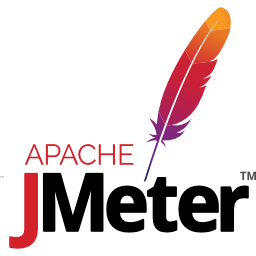

# 测试工具

测试工具专题只讲一件事：**「用什么工具、脚本怎么写」**。把性能压测（JMeter）、UI 自动化（Selenium）、接口自动化与契约校验，落成可复制、可重复、能进 CI 的脚本与流水线。

至于「哪一层该测什么、门禁阈值定多少、覆盖率怎么卡」属于**测试策略与质量门禁**，由 [CI/CD 自动化测试与质量门禁](../CICD/Testing/index.md) 负责；本专题不重复策略，只补上「把它跑起来」的那一层。

## 专题导航

- [概述与选型](Overview/index.md)
- [JMeter 性能测试](JMeter/index.md)
- [Selenium 与 UI 自动化](Selenium/index.md)
- [接口自动化](APIAutomation/index.md)
- [实战：回归与压测流水线](Practice/index.md)
- [常见问题与排错](FAQ/index.md)

## 本专题覆盖的工具

| 工具 | 本专题的版本口径 | 负责页面 |
| --- | --- | --- |
| Apache JMeter | 5.6.3（5.x 末版）/ 6.0.0（需 Java 17+），截至 2026-09 核对 | [JMeter 性能测试](JMeter/index.md) |
| Selenium | 4.49.0（2026-09-09），截至 2026-09 核对 | [Selenium 与 UI 自动化](Selenium/index.md) |
| pytest + requests | 以官方最新稳定版为准 | [接口自动化](APIAutomation/index.md) |
| docker compose | 随 Docker 版本 | [实战：回归与压测流水线](Practice/index.md) |

:::info 版本口径
本专题涉及的具体版本以各页 `:::info` 标注为准；凡文中未明确的不确定参数，均按官方文档编写，**建议本地验证**。
:::

## 阅读建议

1. 刚接触测试工具：先读「概述与选型」，建立五层金字塔与工具落点的地图，再按需选一个工具深入。
2. 要压测接口容量：重点读「JMeter 性能测试」，先把非 GUI 模式与报告读法吃透，再谈分布式。
3. 要做 UI 端到端：重点读「Selenium 与 UI 自动化」，等待写法与 POM 分层是稳定性的全部。
4. 想提升投入产出比：重点读「接口自动化」，这一层最快最稳、定位最准。
5. 要串成一条流水线：读「实战：回归与压测流水线」，把功能回归与性能基线共用一份脚本与夹具。
6. 脚本开始「不听使唤」：直接查「常见问题与排错」的决策树。

## 本专题与相邻专题的分工

- 与 [CI/CD 自动化测试与质量门禁](../CICD/Testing/index.md)：该页给**测试分层的策略、覆盖率口径与 SonarQube 门禁怎么卡**；本专题给**每层具体用什么工具、脚本怎么写、命令怎么敲**，两者组合才是一条完整流水线。
- 与 [前端测试](../../Frontend/Testing/index.md)：该页专注**前端的单元/组件测试与 Playwright E2E**、前端覆盖率门禁；本专题的 UI 自动化聚焦 **Selenium + WebDriver BiDi 的跨浏览器端到端**，两者按技术栈分工，不重复造同一批用例。
- 与 [接口调试工具](../APITools/index.md)：该页是**手工调试与协作**（构造请求、Mock、环境变量）；本专题的「接口自动化」负责把调试成果沉淀成**可回归、可进 CI 门禁**的脚本。
- 与 [项目交付 · 测试策略与门禁](../../Others/ProjectDelivery/Testing/index.md)：该页给**职责边界与数据隔离的取舍**；本专题给**能照着跑一遍的工具细节**。

:::tip 一句话记住本专题
策略告诉你「该测什么、卡多严」，本专题告诉你「用哪个工具、脚本怎么写、命令怎么敲」。
:::
