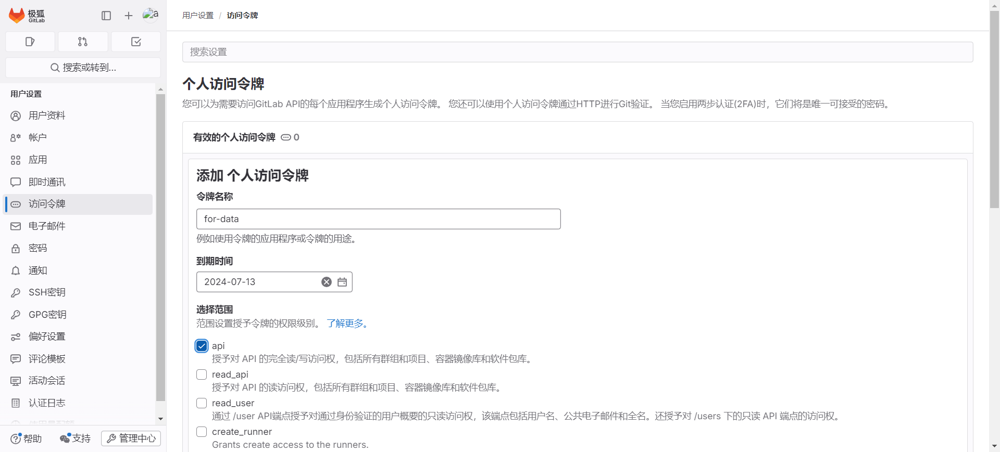

# IDEA 操作 Git

## 基本操作

在IDEA中创建一个空的项目：


编写程序：


右击文件进行Git操作：


选择.idea文件夹，忽略该文件夹：


对未添加版本的项目进行添加：


提交到仓库：


或者通过上方进行提交：


查看历史：


## 远程仓库操作

### 提交到远程仓库

点击Push：


点击 Define remote，添加URL：


输入用户名和密码：


点击PUSH即可


### 拉取远程仓库

点击New - Project from Version Control..：


## 单分支冲突

在IDEA中添加一行：


在页面中添加一行：


提交到远程仓库：


此时会出现：


点击MERGE：


点击 ACCEPT YOURS：使用当前提交的代码

点击 ACCEPT THEIRS：使用远程仓库的代码

点击MERGE：查看差异，并解决冲突


点击解决冲突：


提交即可：


文件已经更新：


## 多分支使用

在实际项目中，一般使用多分支将不同模块开发的代码提交到不同的分支来管理项目。

创建新分支：此分支会基于创建前分支的状态进行创建


修改文件并提交：


提交到远程分支：


切换会master分支：


发现master 分支并没有记录：


## 集成 GitLab

进入File-Settings-Version Control-GitLab：添加地址，点击Generate生成个人令牌


创建个人访问令牌：




输入Gitlab地址：


点击创建合并请求：


合并分支：


## 冲突提交

实际单个模块的开发往往不是单独一个人来进行操作，当多个人协同开发相同的一个项目时，就会涉及到提交冲突的问题。

### 不同人修改不同文件

在远程仓库添加gitLab.txt


在本地IDEA中添加代码，进行模块的开发

```java
public class Module {
    public static void main(String[] args) {
        System.out.println("开始进行模块的开发");
    }
}
```

提交代码到远程仓库，此时会有报错信息


Git会智能识别，采用merge合并命令，拉取远端文件到本地进行合并。

查看Git提交的全部历史记录，可以看到中间有拉取Gitee日志的部分


### 不同人修改同文件的不同区域

远程仓库修改module代码

```java
public class Module {
    public static void main(String[] args) {
        System.out.println("没完成模块的开发");
    }
}
```

本地IDEA继续添加代码

```java
//添加注释
public class Module1 {
    public static void main(String[] args) {
        System.out.println("完成模块的开发");
    }
}
```

提交代码，之后push到远程仓库


同样可以采用merge命令，git会自动合并不同的区域代码。


### 不同人修改同文件的相同区域

源文件代码：


远程仓库修改：


本地IDEA添加模块开发遇到了bug

```java
public class Module1 {
    public static void main(String[] args) {
        System.out.println("完成第一个模块的开发");
        System.out.println("继续进行第一个模块的二次开发");
        System.out.println("模块开发继续!!!");
        System.out.println("模块开发遇到了bug!");
    }
}
```


点击MERGE选择代码，点击左下角选择使用哪个版本：


无法直接采用merge命令，需要人为判断哪些作为最终的结果来保留

之后需要重新提交到远程仓库


### 同时变更文件名和文件内容

本地IDEA修改原先的文件名称为Module1plus，之后重新开发实现功能

```java
//添加注释
public class Module1plus {
    public static void main(String[] args) {
        System.out.println("没完成模块1的开发");
        System.out.println("模块1的开发遇到了bug");
        System.out.println("完成了模块1的开发");
        System.out.println("进一步完成了模块1的拓展开发");
    }
}
```

提交代码修改到远程仓库


可以直接提交成功。

### 不同人把同一文件改成不同的文件名

远程仓库把文件名称改为module1

本地IDEA修改文件名称为module3

提交到远程仓库


需要手动选择使用哪一个


push会导致报错，之后需要用户自己解决保留哪些文件。

使用命令解决最终的冲突

```shell
git status
#删除掉报红找不到的文件
git rm src/main/java/com/hjc/demo/Module1plus.java
```

最后重新选择正确的代码提交到仓库


最后NERGE即可：


