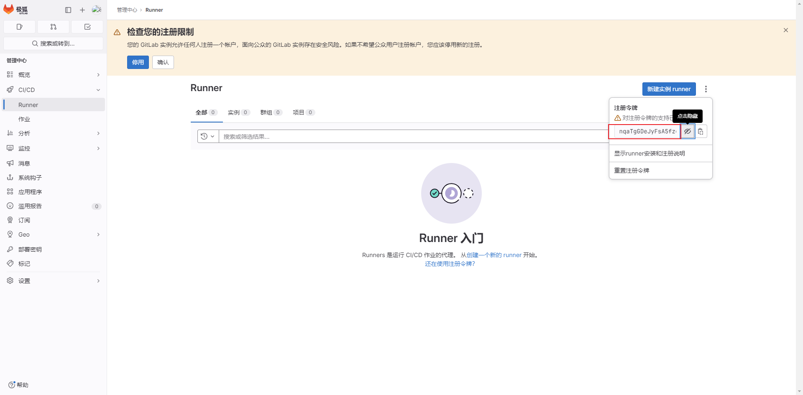
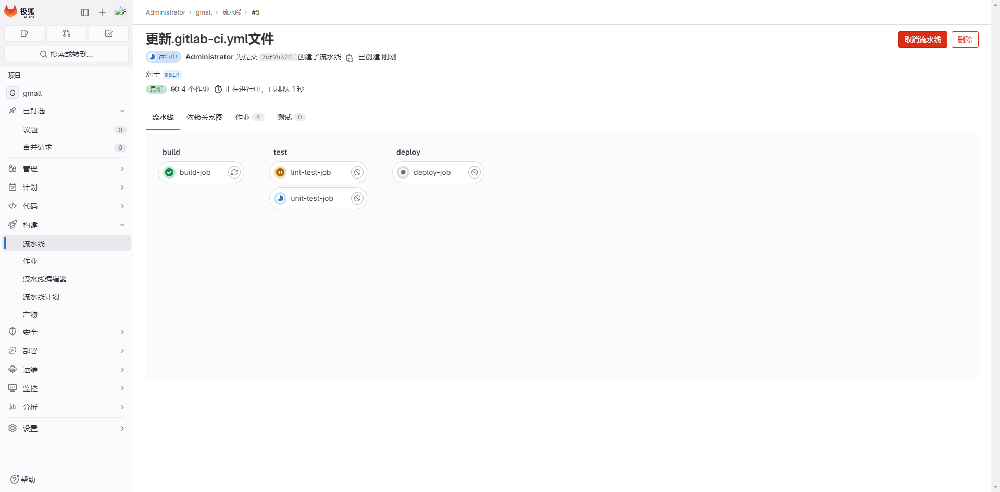

# GitLab CI/CD部署程序

使用gitLab的自动部署功能，可以快速实现自动部署，完成运行。


## 安装gitLab-runner

下载地址：<https://packages.gitlab.cn/#browse/search/>

上传安装包之后执行

```shell
sudo rpm -ivh gitlab-runner-16.6.1-1.x86_64.rpm
```

之后运行注册命令

```
sudo gitlab-runner register
#输入地址
http://192.168.84.137/
#输入token 
nqaTgGDeJyFsA5fzg8ck
#输入描述
[bogon]: ci
#输入标签
ci
#输入记录标签

WARNING: Support for registration tokens and runner parameters in the 'register' command has been deprecated in GitLab Runner 15.6 and will be replaced with support for authentication tokens. For more information, see https://docs.gitlab.com/ee/ci/runners/new_creation_workflow 
Registering runner... succeeded                     runner=nqaTgGDe
#选择运行模式 -> 使用最简单的shell
shell
```

token的位置



注册完成之后，runner就已经上线了。





