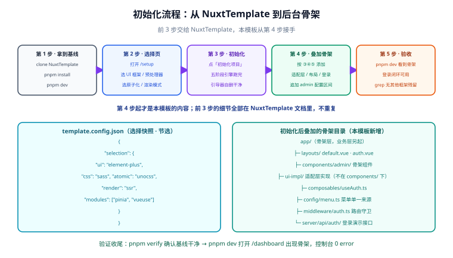

# 初始化：从 NuxtTemplate 拿到基线

本篇只做一件事：**走完 NuxtTemplate 的初始化流程，拿到一份带选择快照的基线工程**，并确认它为叠加骨架做好了准备。本篇不重复 NuxtTemplate 的任何实现细节——选择页怎么渲染、引擎怎么自删，全部见上游文档。

::: tip 一句话定位
前 3 步（clone → 选择 → 初始化）是 NuxtTemplate 的主场；本模板从第 4 步接手，接手点就是 `template.config.json` 这个文件。
:::

## 1. 五步流程总览



| 步骤 | 动作 | 主场 | 产出 |
| --- | --- | --- | --- |
| 1 | clone 模板仓库，`pnpm install && pnpm dev` | NuxtTemplate | 可运行的选择页 |
| 2 | 在选择页选技术栈 | NuxtTemplate | 一次选择（未落盘前可反复改） |
| 3 | 点「初始化项目」，五阶段引擎跑完 | NuxtTemplate | 基线工程 + `template.config.json` |
| 4 | 按本模板文档叠加适配层、布局、登录 | **本模板** | 后台骨架 |
| 5 | 启动验收 | **本模板** | 登录闭环可用的后台 |

## 2. 选择页怎么选

五种 UI 框架组合都在适配层的覆盖范围内，可以放心按团队偏好选。两个建议：

- **第一次跑通时选「UI 框架 = 无」**。纯 CSS 兜底实现是适配层的验收基线（[硬约束 3](../Requirement/index.md)），先用最简组合把骨架全流程走通，再换框架组合验证适配层。
- **模块至少勾选 Pinia**。骨架的登录态管理（[useAuth](../Login/index.md)）以 Pinia 为首选实现，未勾选时走无状态兜底写法，功能一致但少一层缓存。

其余维度（预处理器、原子化、渲染模式）与骨架无耦合，按需选择即可；组合冲突（如 Nuxt UI + 原子化框架）由选择页提交前校验拦截，规则见 [Nuxt 通用模板 · 技术栈矩阵](../../NuxtTemplate/StackMatrix/index.md)。

## 3. 初始化后的基线检查

初始化完成后**先验收基线，再叠加骨架**——基线有问题就回头找 NuxtTemplate，不要在坏基线上盖楼：

```shell
# ① 引导器已删干净（NuxtTemplate 的自检脚本）
pnpm verify
# 期望：verify: 12/12 通过，引导器残留 0

# ② 依赖与选择一致
pnpm list --prod --depth 0
# 期望：出现所选 UI 框架的包名；没选 UI 框架时只有 nuxt 与业务依赖

# ③ 基线可跑
pnpm dev
# 期望：打开的是基线首页（不再是选择页），控制台 0 error
```

三条全过，说明 `pnpm dev` 打开的就是「你的」工程了。此后每叠加一块骨架文件，都应该能随时回到「基线仍然干净」这个事实——这是 [硬约束 1](../Requirement/index.md) 的日常检查方式。

## 4. template.config.json：接手点

初始化在仓库根生成的 `template.config.json` 是本模板**唯一的**输入。它记录了完整的选择快照：

```json [template.config.json（示例：选了 Element Plus + Sass + UnoCSS + SSR + Pinia）]
{
  "selection": {
    "ui": "element-plus",
    "css": "sass",
    "atomic": "unocss",
    "render": "ssr",
    "modules": ["pinia", "vueuse"],
    "project": {
      "ts": "strict",
      "lint": true,
      "test": true,
      "pkg": "pnpm"
    }
  },
  "templateVersion": "1.x",
  "initializedAt": "2026-10-03T09:30:00.000Z"
}
```

骨架关心的只有 `selection.ui` 一个字段（适配层切换的依据），其余字段是上游的台账。三条读取纪律：

1. **只读不写**。骨架代码不允许改写这个文件——改了它，`pnpm verify` 的「配置与磁盘一致」检查就会报红。
2. **不做防御性解析**。文件由引擎生成、结构有保证，读不到 `selection.ui` 就应该直接报错退出，而不是猜一个默认值继续跑——「猜」出来的骨架在错误的框架组合下会静默渲染错样式。
3. **不抄第二份**。任何「骨架自己的配置文件」都不得复制选型信息（比如再写一个 `admin.config.json` 记录 ui 字段）。两处事实必然漂移，漂移后 grep 验证（[硬约束 2](../Requirement/index.md)）会给出假绿。

## 5. 骨架要新增什么

叠加骨架**只新增文件 + 追加配置区间**，不动基线已有文件（唯一的例外是 `nuxt.config.ts`，用 marker 区间追加，见下）。完整目录：

```text
（在基线工程内新增）
app/
├─ layouts/
│  ├─ default.vue                  # 工作台骨架：侧边栏 + 顶栏 + 内容区
│  └─ auth.vue                     # 认证外壳：居中卡片
├─ components/
│  ├─ admin/                       # 骨架组件（SideNav / TopBar / UserMenu）
│  └─ ui/                          # 适配层组件（UiButton / UiInput / ...）
├─ config/
│  └─ menu.ts                      # 菜单单一来源
├─ composables/
│  └─ useAuth.ts                   # 登录态与令牌
├─ middleware/
│  └─ auth.ts                      # 全局路由守卫
└─ pages/
   ├─ login/index.vue              # 登录页（auth 布局）
   └─ (admin)/                     # 登录后的页面（default 布局）
      ├─ index.vue                 # 重定向到首个菜单项
      └─ dashboard/index.vue       # 示例工作台页
server/
└─ api/auth/
   ├─ login.post.ts                # 演示登录接口
   ├─ logout.post.ts
   └─ me.get.ts
nuxt.config.ts                     # 追加 admin 区间（alias 指向适配实现）
```

`nuxt.config.ts` 的追加方式与 NuxtTemplate 的 marker 约定保持同构——**手写区永不覆盖**：

```typescript [nuxt.config.ts（节选：追加 admin 区间）]
export default defineNuxtConfig({
  // ...初始化引擎写好的配置（marker 区间 + 手写区），原样保留

  // ==== admin-skeleton:begin（本区间由后台骨架文档提供，可整体删除回退） ====
  alias: {
    // 构建期把适配名解析到所选框架的唯一实现，见技术栈适配层
    '#ui': './app/components/ui',
  },
  // ==== admin-skeleton:end ====
})
```

::: warning 区间必须可整体回退
`admin-skeleton:begin/end` 之间的内容是骨架对基线配置的**全部**侵入。删掉这个区间（加上骨架新增的文件与目录），工程就回到初始化刚完成的状态——「可整体回退」是叠加式模板的底线，做不到就说明有改动散落在了区间外。
:::

## 6. 验证方式

```shell
# 基线验收三连（第 3 节）全过后，叠加骨架前先留一个快照点
git add -A && git commit -m "chore: nuxt-template 初始化完成"

# 叠加骨架后，确认基线未被破坏
pnpm verify
# 期望：仍然 12/12 通过

pnpm dev
# 期望：基线首页照常打开（此时骨架文件尚未被引用，出现 404/空页面属正常，
#       按后续章节把布局与守卫接上后即为后台骨架）
```

::: info 关于 git 快照点
初始化刚完成时打一个提交，是「叠加式改造」的保险丝：骨架叠坏了（或适配层配错了），`git diff` 一眼能看出骨架动了哪些基线文件——理想情况下 diff 里只应该出现 `nuxt.config.ts` 的 marker 区间。
:::

## 相关页面

- [技术栈适配层](../StackAdapter/index.md)：`#ui` alias 背后的完整设计
- [Nuxt 通用模板 · 初始化引擎](../../NuxtTemplate/InitEngine/index.md)：五阶段流水线与 `template.config.json` 的生成时机
- [Nuxt 通用模板 · 应用基线](../../NuxtTemplate/AppBaseline/index.md)：基线工程的目录与请求层约定（骨架沿用）

## 参考资料

- Nuxt alias 配置：[nuxt.com/docs/api/nuxt-config#alias](https://nuxt.com/docs/api/nuxt-config#alias)
- Nuxt 目录结构（`app/` 约定）：[nuxt.com/docs/guide/directory-structure](https://nuxt.com/docs/guide/directory-structure/app)
