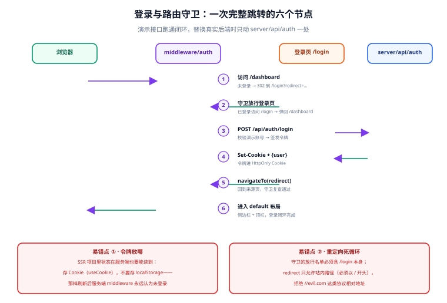

# 登录与路由守卫

登录闭环是骨架里唯一有「跨端状态」的部分：令牌要同时被浏览器路由守卫和 Nitro 服务端读到。本篇给出完整的四件套——演示接口、`useAuth`、全局守卫、登录页——并用演示账号把闭环跑通；接真实后端时只替换接口层，其余代码不动。

::: tip 一句话理解
守卫负责「没登录去登录页」，登录页负责「换回令牌」，`useAuth` 负责「令牌放哪、怎么读」。三者共享同一个事实：**HttpOnly Cookie 里有没有令牌**。
:::

## 1. 一次完整跳转的六个节点



| # | 节点 | 谁做 | 判据 |
| --- | --- | --- | --- |
| 1 | 未登录访问 `/dashboard` | `middleware/auth.ts` | Cookie 无令牌 → `navigateTo('/login?redirect=/dashboard')` |
| 2 | 已登录访问 `/login` | 同上（反向） | Cookie 有令牌 → 弹回 `/dashboard` |
| 3 | 提交登录表单 | `pages/login/index.vue` | `POST /api/auth/login`，loading 锁按钮 |
| 4 | 校验并签发令牌 | `server/api/auth/login.post.ts` | `Set-Cookie`（HttpOnly）+ 返回用户信息 |
| 5 | 回跳来源页 | 登录页 | `redirect` 参数只允许站内路径 |
| 6 | 守卫复查通过，进入 default 布局 | `middleware/auth.ts` | 骨架出现，闭环完成 |

## 2. 演示接口

三个接口都挂在 `server/api/auth/` 下，是「接真实后端时唯一要动的文件」：

```typescript [server/api/auth/login.post.ts]
import { randomUUID } from 'node:crypto'

/** 演示账号。仅用于跑通闭环，接真实后端后整文件替换 */
const DEMO_USER = { username: 'admin', password: 'admin123', nickname: '管理员' }

/** 内存令牌表：dev 可用；生产必须换成 Redis/数据库（服务重启即失效） */
const tokens = new Map<string, { username: string; expiresAt: number }>()

export default defineEventHandler(async (event) => {
  const body = await readBody(event).catch(() => null)
  const { username, password } = body ?? {}

  if (username !== DEMO_USER.username || password !== DEMO_USER.password) {
    throw createError({ statusCode: 401, statusMessage: '账号或密码错误' })
  }

  const token = randomUUID()
  tokens.set(token, { username, expiresAt: Date.now() + 7 * 24 * 3600 * 1000 })

  // HttpOnly：JS 读不到令牌本身，读「登录与否」走 /api/auth/me
  setCookie(event, 'admin_token', token, {
    httpOnly: true,
    sameSite: 'lax',
    path: '/',
    maxAge: 7 * 24 * 3600,
  })
  return { user: { username, nickname: DEMO_USER.nickname } }
})

/** 供 me.get.ts 校验令牌（同模块内共享这张表） */
export function findToken(token: string) {
  const hit = tokens.get(token)
  if (!hit || hit.expiresAt < Date.now()) return null
  return hit
}
```

```typescript [server/api/auth/me.get.ts]
import { findToken } from './login.post'

export default defineEventHandler((event) => {
  const token = getCookie(event, 'admin_token')
  const hit = token ? findToken(token) : null
  if (!hit) throw createError({ statusCode: 401, statusMessage: '未登录' })
  return { user: { username: hit.username, nickname: '管理员' } }
})
```

```typescript [server/api/auth/logout.post.ts]
export default defineEventHandler((event) => {
  deleteCookie(event, 'admin_token', { path: '/' })
  return { ok: true }
})
```

::: danger 内存令牌表只是演示品
`Map` 存在 Nitro 进程里，dev 热重载就清空、生产多实例不共享。它出现在文档里是为了让闭环**不依赖任何外部设施**就能跑通；替换顺序是：先把 `login.post.ts` 的校验逻辑换成真实后端代理（或去掉这一层直接由前端调后端），再删掉这张表——两步都做完之前，不要把演示代码带进生产部署。
:::

## 3. useAuth：登录态的唯一入口

```typescript [app/composables/useAuth.ts]
interface AuthUser { username: string; nickname: string }

export function useAuth() {
  // 用户信息存 useState：SSR 双端可读；登录与否的判据走服务端，不用前端猜
  const user = useState<AuthUser | null>('auth:user', () => null)
  const loading = useState('auth:loading', () => false)

  /** 问服务端「我登录了吗」：唯一可信的判据（HttpOnly Cookie 在服务端校验） */
  async function fetchUser() {
    try {
      const res = await $fetch<{ user: AuthUser }>('/api/auth/me')
      user.value = res.user
    } catch {
      user.value = null
    }
    return user.value
  }

  async function login(username: string, password: string) {
    loading.value = true
    try {
      const res = await $fetch<{ user: AuthUser }>('/api/auth/login', {
        method: 'POST',
        body: { username, password },
      })
      user.value = res.user
      return res.user
    } finally {
      loading.value = false
    }
  }

  async function logout() {
    await $fetch('/api/auth/logout', { method: 'POST' }).catch(() => {})
    user.value = null
  }

  return { user, loading, fetchUser, login, logout }
}
```

设计要点：

1. **`isAuthenticated` 不做前端缓存判断**。守卫调用的是 `fetchUser()`（问服务端），不是「本地有没有用户对象」——HttpOnly Cookie 让前端读不到令牌，任何本地猜测都可能与服务端事实相反。
2. **`user` 放 `useState`**，服务端渲染与客户端 hydration 共享同一份；如果选了 Pinia 模块，可以换成一个 `auth` store，接口形状保持不变，业务层无感。
3. **`login` 失败不在这里弹消息**。返回 reject 给登录页，由页面决定文案与聚焦位置——骨架层不发 UI 事件，[适配层的消息队列](../StackAdapter/index.md)由页面层调用。

## 4. 全局路由守卫

```typescript [app/middleware/auth.global.ts]
export default defineNuxtRouteMiddleware(async (to) => {
  const isLoginPage = to.path.startsWith('/login')

  // 放行名单：登录页本身。漏掉这条 = 重定向死循环
  if (isLoginPage) {
    const { fetchUser } = useAuth()
    const user = await fetchUser()
    if (user) return navigateTo('/dashboard', { replace: true })
    return
  }

  const { fetchUser } = useAuth()
  const user = await fetchUser()
  if (!user) {
    return navigateTo(`/login?redirect=${encodeURIComponent(to.fullPath)}`, { replace: true })
  }
})
```

::: info 命名即注册，文件名必须带 `.global`
中间件文件**不带 `.global` 后缀时只对同名路由生效**；要做全站守卫必须命名为 `auth.global.ts`（见上方代码块的文件名）。这是守卫最常见的一个静默失效点：配了中间件、忘了 `.global`，结果只有部分路由被守卫，其余页面白放。
:::

::: danger 守卫的三个死循环与三个注入点
1. **放行名单漏掉 `/login`**：未登录 → 跳 `/login` → 又被守卫拦 → 循环。第 6 行的 `isLoginPage` 分支就是堵这个的。
2. **`redirect` 接受外部地址**：`/login?redirect=//evil.com` 这类协议相对地址会被浏览器当成外部跳转。回跳前必须校验「以 `/` 开头且不以 `//` 开头」，见登录页代码。
3. **守卫里写重逻辑**：守卫在**每次路由跳转**都执行，`fetchUser` 的结果应交给 `useState` 缓存（服务端渲染期间自然只取一次）；在守卫里再叠一层 localStorage 判断等于给闭环开第二个事实来源。
:::

## 5. 登录页

```vue [app/pages/login/index.vue]
<script setup lang="ts">
import { useMessage } from '~/composables/useMessage'

definePageMeta({ layout: 'auth' })

const { login, loading } = useAuth()
const message = useMessage()
const route = useRoute()

const username = ref('admin')
const password = ref('')
const errMsg = ref('')

/** redirect 只允许站内路径：以 / 开头且不以 // 开头（拒绝协议相对地址） */
const target = computed(() => {
  const r = route.query.redirect
  return typeof r === 'string' && r.startsWith('/') && !r.startsWith('//') ? r : '/dashboard'
})

async function submit() {
  errMsg.value = ''
  if (!username.value || !password.value) {
    errMsg.value = '请输入账号与密码'
    return
  }
  try {
    await login(username.value, password.value)
    message.success('登录成功')
    await navigateTo(target.value, { replace: true })
  } catch {
    errMsg.value = '账号或密码错误'
    message.error(errMsg.value)
  }
}
</script>

<template>
  <div class="login-card">
    <h2>后台管理系统</h2>
    <p v-if="errMsg" class="login-card__err">{{ errMsg }}</p>
    <UiFormItem label="账号">
      <UiInput v-model="username" placeholder="admin" />
    </UiFormItem>
    <UiFormItem label="密码">
      <UiInput v-model="password" type="password" placeholder="admin123" />
    </UiFormItem>
    <UiButton kind="primary" block :loading="loading" @click="submit">登录</UiButton>
    <p class="login-card__hint">演示账号：admin / admin123（仅本地闭环）</p>
  </div>
</template>

<style scoped>
.login-card {
  width: 360px;
  padding: 32px;
  background: #fff;
  border: 1px solid #e2e8f0;
  border-radius: 12px;
  display: grid;
  gap: 14px;
}
.login-card__err { color: #dc2626; font-size: 13px; margin: 0; }
.login-card__hint { color: #64748b; font-size: 12px; text-align: center; }
</style>
```

## 6. 退出登录的中转页

```vue [app/pages/logout.vue]
<script setup lang="ts">
definePageMeta({ layout: 'auth' })

const { logout } = useAuth()
await logout()
await navigateTo('/login', { replace: true })
</script>

<template>
  <div class="auth-card">正在退出……</div>
</template>
```

顶栏用户菜单的「退出登录」（[骨架篇](../Skeleton/index.md)）指向 `/logout`，由这一页统一执行清理再跳转。做成页面而不是按钮回调，是为了让「退出」可以被直接访问（比如另一个标签页里令牌已失效时），逻辑只有一份。

## 7. 易错点

::: danger 四个高频坑

1. **令牌进 localStorage**。SSR 项目里守卫要跑在服务端（首屏跳转），localStorage 在服务端不存在——刷新任意页面都会被判成未登录。令牌走 HttpOnly Cookie（`setCookie` 由接口下发），登录与否问 `/api/auth/me`。
2. **中间件忘了 `.global` 后缀**。`middleware/auth.ts` 只对 `middleware` 命名匹配的路由生效，多数页面直接白放。骨架的文件名是 `auth.global.ts`。
3. **`fetchUser` 的 401 被全局拦截器重定向**。如果基线层给 `$fetch` 配了「401 → 跳登录」的统一处理，守卫里的 `fetchUser` 失败会变成**页面级跳转而非守卫返回**，破坏 `navigateTo` 的语义。守卫场景的 401 必须 `catch` 成 `null`（见 `useAuth` 代码），让守卫自己决定去哪。
4. **演示账号写进前端**。校验必须发生在 `server/` 里；前端只负责收集输入。任何「前端先比对一下密码」的写法都是把口令公开。
:::

## 8. 验证方式

```shell
pnpm dev
```

| # | 操作 | 期望 |
| --- | --- | --- |
| 1 | 未登录访问 `http://localhost:3000/` | 地址栏变为 `/login?redirect=%2Fdashboard`，出现居中登录卡片 |
| 2 | 输错密码提交 | 按钮短暂 loading → 表单出现「账号或密码错误」，顶部浮出错误消息 |
| 3 | `admin / admin123` 提交 | 跳回 `/dashboard`，侧边栏骨架出现，Application → Cookies 里可见 `admin_token`（HttpOnly） |
| 4 | 已登录状态访问 `/login` | 直接弹回 `/dashboard`，不出现登录卡片 |
| 5 | 顶栏「退出登录」 | 回到 `/login`；再访问 `/dashboard` 被重新拦回 |
| 6 | 手动把 Cookie 改错再刷新 | 被守卫带回 `/login`（判据来自服务端校验，不是前端缓存） |
| 7 | 全程控制台 | 0 error、0 死循环告警 |

## 相关页面

- [后台骨架](../Skeleton/index.md)：闭环完成后进入的 default 布局
- [技术栈适配层](../StackAdapter/index.md)：`UiButton` / `UiInput` / `UiFormItem` / `UiMessageHost` 的契约
- [后端通用模板 · 认证授权](../../BackendTemplate/Security/index.md)：真实后端的 JWT 签发与刷新设计，替换演示接口时的对照

## 参考资料

- Nuxt route middleware：[nuxt.com/docs/guide/directory-structure/middleware](https://nuxt.com/docs/guide/directory-structure/middleware)
- Nitro `setCookie` 工具：[h3.dev/utilities/cookie](https://h3.dev/utilities/cookie)
- HttpOnly Cookie 与 XSS 的关系：MDN [Set-Cookie](https://developer.mozilla.org/docs/Web/HTTP/Headers/Set-Cookie)
