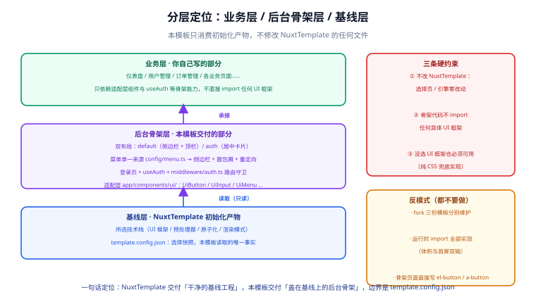

# 需求与方案定位

本篇先把**要解决的问题**和**不能用什么手段解决**定下来，后面四步才有判据。后台骨架是「每个后台项目都要写、写完又没人想再看第二遍」的那部分代码，最容易犯的错是：骨架和某个 UI 框架焊死，换一套技术栈就整个作废。

::: tip 一句话定位
这个模板交付的不是「一套配置好的后台页面」，而是「**在任何一份 NuxtTemplate 初始化产物上，都能长出同一个后台骨架**」。
:::

## 1. 需求从哪里来

三个真实痛点，决定了模板的形态：

| # | 痛点 | 现状 | 后果 |
| --- | --- | --- | --- |
| 1 | **骨架与技术栈焊死** | 网上流传的后台模板全部预装特定 UI 框架：vue-element-admin 绑 Element UI、vben 绑 Ant Design Vue | 团队技术栈与模板不一致时，删框架的代价比从零写还大 |
| 2 | **登录与骨架代码被反复重写** | 每个新项目都重写一遍登录页、侧边栏、菜单、守卫 | 每一遍质量都不一样；守卫死循环、令牌放 localStorage 这类坑反复踩 |
| 3 | **上游模板在演进** | [Nuxt 通用模板](../../NuxtTemplate/index.md) 自己在迭代选择页与引擎 | 下游骨架如果 fork 了上游，修复无法同步 |

对应的三条需求：

1. **骨架可移植**——同一套骨架代码，在「Element Plus / Ant Design Vue / Nuxt UI / Vuetify / 无框架」五种组合下都能跑。
2. **登录与骨架一次成型**——登录闭环、双布局、菜单、守卫写一遍就够，新项目只写业务页面。
3. **不 fork 上游**——NuxtTemplate 初始化出什么，本模板就消费什么；上游演进不需要本模板跟着改。

## 2. 分层定位



整份工程分三层，本模板只写中间那层：

| 层 | 谁写 | 内容 | 依赖方向 |
| --- | --- | --- | --- |
| 业务层 | 你自己 | 仪表盘、用户管理、订单管理等业务页面 | **只依赖骨架层**暴露的适配组件与 `useAuth` |
| 骨架层 | 本模板 | 双布局、菜单、登录、守卫、适配层 | **只读取**基线层的 `template.config.json` |
| 基线层 | NuxtTemplate | 所选技术栈 + 干净的基线工程 | 不感知上面两层 |

依赖方向是单向的：业务层不知道用了哪个 UI 框架，骨架层不修改基线层的任何文件。**方向一旦反转（骨架直接 import Element Plus），骨架就死了**——这是后面所有设计的出发点。

## 3. 三种实现路线对照

让骨架「不认识具体框架」，常见的三条路：

| 维度 | A. fork 三份模板 | B. 运行时 `<component :is>` 切换 | C. 构建期适配层（本模板） |
| --- | --- | --- | --- |
| 支持五种组合的代价 | 维护 5 份仓库，公共修复改 5 遍 | 五套实现**全部**打进产物 | 每个组件 5 份实现文件，产物只含 1 份 |
| 切换技术栈 | 重新 fork | 改运行时配置 | 重新初始化（改 `template.config.json`） |
| 产物体积 | 与所选框架一致 | **最差**：为没用的框架买单 | 与所选框架一致 |
| 类型推导 | 各自独立 | 动态组件丢失 props 类型 | 每份实现自带类型，接口一致 |
| 最坏情况 | 分支漂移，改不动 | 首屏加载五个框架 | 实现文件数量多（用约定压住） |

::: info 为什么不做 A
fork 的本质是「把选择复制 N 份」。NuxtTemplate 花了整整一个专题论证「选择模型只有一份」（见 [需求与方案定位 · 自删](../../NuxtTemplate/Requirement/index.md)），下游骨架再 fork 回去等于把那个结论作废。
:::

::: danger 不要用运行时动态组件当「适配层」
`<component :is="resolveUi('Button')">` 看着聪明，实际是三个坑叠加：① Vite 无法 tree-shake 没被静态引用的组件，五个框架的实现全部进产物；② 动态组件的 props 类型推导失效，业务层拿到的是 `any`；③ 首屏要等运行时解析完才知道渲染什么，SSR 下多一拍 hydration 抖动。正确做法见[技术栈适配层](../StackAdapter/index.md)：**构建期用 alias 把适配名解析到唯一实现**。
:::

## 4. 三条硬约束

这三条是后续每一页都要回看的验收红线：

| 约束 | 具体含义 | 验收方式 |
| --- | --- | --- |
| **约束 1：不改 NuxtTemplate** | 选择页、初始化引擎、引导期文件零改动；本模板只新增文件与追加配置区间 | 初始化后 `pnpm verify` 仍 12/12 通过 |
| **约束 2：骨架不认识具体框架** | `layouts/`、`pages/`、`components/admin/` 里 grep 不到 `element-plus`、`ant-design-vue`、`@nuxt/ui`、`vuetify` 的 import | 见[技术栈适配层 · 验证方式](../StackAdapter/index.md)的 grep 命令 |
| **约束 3：无框架组合可用** | 「UI 框架 = 无」的初始化组合下，骨架所有功能可用（登录、菜单、布局） | 以无框架组合跑一遍[登录验证清单](../Login/index.md) |

::: warning 约束 2 的边界
「不 import 具体框架」**不包括适配层自己的实现文件**（`components/ui/UiButton.ep.vue` 里当然要 import Element Plus）。判据写精确点：`components/ui/` 之外不允许出现任何框架的 import。
:::

## 5. 明确不做的事

| 不做 | 原因 |
| --- | --- |
| 不做**权限模型**（RBAC、按钮级权限） | 权限是独立的业务域，值得单独成章；骨架阶段只做「登录/未登录」二值判断，见 [Vue3 模板 · 权限模块](../../Vue3Template/Permission/index.md) 的思路 |
| 不做**业务页面脚手架**（CRUD 生成器） | 与「骨架」是两件事；混在一起会让适配层的接口被业务需求污染 |
| 不做**多标签页 / 主题换肤 / 国际化** | 属于「锦上添花」，且强依赖具体 UI 框架的能力，放进骨架会破坏约束 2 |
| 不做**真实鉴权后端** | 演示接口只跑通闭环；接真实后端时只动 `server/api/auth/` 一处 |
| 不做**热切换技术栈** | 与 NuxtTemplate 的口径一致：要换技术栈请重新初始化，骨架文件按文档重放一遍即可 |

## 6. 验收标准

| 维度 | 目标 | 验收方式 |
| --- | --- | --- |
| 可移植 | 五种 UI 框架组合下骨架行为一致 | 适配层映射表逐项核对 + 无框架组合全流程走通 |
| 完整 | 登录闭环 + 骨架布局开箱即用 | [登录验证清单](../Login/index.md) 全部通过 |
| 边界干净 | NuxtTemplate 零改动 | 初始化后 `pnpm verify` 仍 12/12 |
| 可验证 | 每一步有可执行命令 | 每页「验证方式」小节 |

## 7. 验证方式

本篇没有代码，验证放在「约束是否被后续步骤兑现」：

```shell
# 约束 1：初始化产物未被本模板破坏
pnpm verify
# 期望：verify: 12/12 通过（与未叠加骨架时一致）

# 约束 2：骨架代码里没有具体框架的 import（components/ui/ 之外）
grep -rn "element-plus\|ant-design-vue\|@nuxt/ui\|vuetify" app/ --include="*.vue" --include="*.ts" \
  | grep -v "components/ui/"
# 期望：无输出
```

## 相关页面

- [初始化：从 NuxtTemplate 拿到基线](../Bootstrap/index.md)：把「消费初始化产物」落成具体步骤
- [技术栈适配层](../StackAdapter/index.md)：路线 C 的完整实现
- [Nuxt 通用模板 · 需求与方案定位](../../NuxtTemplate/Requirement/index.md)：上游「选择模型只有一份」的论证
- [Vue3 模板 · 权限模块](../../Vue3Template/Permission/index.md)：骨架不做、但业务层迟早要接的权限思路

## 参考资料

- Nuxt 布局系统：[nuxt.com/docs/guide/directory-structure/layouts](https://nuxt.com/docs/guide/directory-structure/layouts)
- Nuxt 中间件：[nuxt.com/docs/guide/directory-structure/middleware](https://nuxt.com/docs/guide/directory-structure/middleware)
- vue-element-admin（路线 A 的典型，其「删框架」成本是本模板的反面教材）：[github.com/PanJiaChen/vue-element-admin](https://github.com/PanJiaChen/vue-element-admin)
